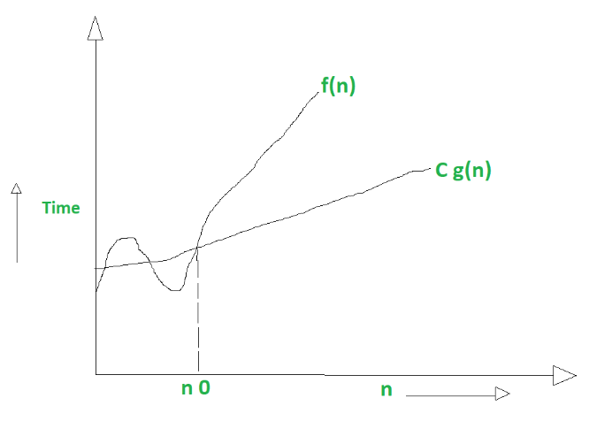

[1. 복잡도 분석](#복잡도-분석)

[2. 표준 입출력 방법](#표준-입출력)

[3. 비트 연산](#비트-연산자)

진수

실수

## 복잡도 분석

- 알고리즘 : 문제를 해결하기 위한 절차

- 알고리즘의 효율
  
  - 공간적 효울성 : 연산량 대비 얼마나 적은 메모리 공간을 요하는가
  
  - 시간적 효율성 : 연산량 대비 얼마나 적은 시간을 요하는가
  
  - 복잡도가 높을수록 효율성 저하

- 복잡도의 점근적 표기
  
  - 시간복잡도는 입력 크기에 대한 함수로 표기, 다항식
  
  - 입력 크기 n이 무한대로 커질 때의 복잡도를 간단히 표현하기 위해 사용하는 표기법
  
  - 1. Big-O(빅-오) ⇒ 상한 점근
    2. Big-Ω(빅-오메가) ⇒ 하한 점근
    3. Big-θ(빅-세타) ⇒ 그 둘의 평균

- Big-O(빅-오)
  
  - 복잡도의 점근적 상한
  
  - f(n) = 2N^2+7N+9 이라면, f(n)의 O표기는 O(n^2)
    
    - <mark>실행시간이 n^2에 비례</mark>하는 알고리즘이라고 말함
    
    - g(n)이 n0보다 큰 모든 n에 대해서 항상  f(n)보다 크다
  
  

- Big-Ω(빅-오메가)
  
  - 복잡도의 점근적 하한
  
  - f(n) = 2N^2+7N+9 이라면, f(n)의Ω표기는 Ω(n^2)
  
  - f(n) = Ω(n^2)은 n이  증가함에 따라 2N^2+7N+9가 cn^2보다 작을 수 없다는 의미 
    
    - 상수 c = 1로 놓으면 된다
  
  - <mark>최소한 이만한 시간은 걸린다</mark>
  
  - g(n)이 n0보다 큰 모든 n에 대해서 항상 f(n)보다 크다
  
  

- Big-θ(빅-세타) 표기
  
  - O - 표기와 Ω - 표기가 같은 경우에 사용
  
  - f(n) = 2n^2+8n+3 = O(n^2) = Ω(n^2)이므로 f(n) = θ(n^2)
  
  - f(n)은 n이 증가함에 따라<mark> n^2과 동일한 증가율</mark>을 가진다
  
  

- 자주 사용하는 O - 표기


            상수시간 < 로그시간 < 선형시간 < 로그 선형 시간 < 제곱 시간 < 지수시간

### 표준 입출력

- 입력
  
  - input()  :  받은 입력값을 문자열로 취급
  
  - eval(input()  :  받은 입력값을 평가된 데이터형으로 취급

- 출력
  
  - print()  :  표준 출력 함수. 출력값의 마지막에 개행 문자 포함
  
  - print('text, end = "")  :  출력 시 마지막에 개행문자 제외할 시
  
  - print('%d'%number) : formatting된 출력

- 파일의 내용을 표준 입력으로 읽어오는 방법
  
  ```python
  import sys
  sys.stdin = open("input.txt", "r")
  sys.stdout = open("output.txt", "w")
  
  text = input()
  print(text)
  ```

## 비트 연산자

| 연산자 | 연산자의 기능                                         |
|:---:|:-----------------------------------------------:|
| &   | 비트단위로 AND연산을 한다 ex) num1 & num2                 |
|     |                                                 |
| ^   | 비트단위로 XOR연산을 한다. ( 같으면 0 다르면 1) ex) num1 ^ num2 |
| ~   | 단향 연산자, 피연산자의 모든 비트를 반전시킨다 ex) ~num             |
| <<  | 피연산자의 비트 열을 왼쪽으로 이동시킨다. ex) num << 2            |
| >>  | 피연산자의 비트 열을 오른쪽으로 이동시킨다. ex) num >> 2           |

- AND 
  
  -  0 이랑 &연산하면 무조건 0이므로 0으로 만들 수 있다 
  
  - 1이랑 & 연산하면 0이면 0 나오고 1이면 1나오므로 그 비트가 1인지 검사를 할 수 있다.

- OR
  
  - 1이랑 | 연산하면 무조건 1이므로 1로 만들 수 있다
  
  - 0이랑 | 연산하면 0이면 0 나아고 1이면 1 나오므로 비트 검사 가능

- 1 << n
  
  - 2^n의 값을 갖는다.
  
  - 원소가 n개일 경우의 모든 부분집합의 수를 읨
  
  - Power set
    
    - 공집합과 자기 자신을 포함한 모든 부분 집합
    
    - 각 원소가 포함되거나 포함되지 않는 2가지 경우의 수를 계산하면 모든 부분집합의 후

- i & (1 << j)
  
  - i의  j 번째 비트가 1인지 아닌지
  
  ```python
  def Bbit_print(i):
      output = ""
      for j in range(7, -1, -1):
          output += '1' if i & (1 << j) else '0'
      print(output)
  
  for i in range(-5, 6):
      print("%3d = " % i, end='')
      Bbit_print(i)
  
  # -5 = 11111011
  # -4 = 11111100
  # -3 = 11111101
  # -2 = 11111110
  # -1 = 11111111
  #  0 = 00000000
  #  1 = 00000001
  #  2 = 00000010
  #  3 = 00000011
  #  4 = 00000100
  #  5 = 00000101
  ```

### 비트연산 예제 1

- 0과 1로 이루어진 1차 배열에서 7개 byte를 묶어서 10진수로 출력하기

| 0000001 | 0001101 |
| ------- | ------- |

- 1, 13을 출력해야 됨

```python
def Bbit_print(i):
    output = ""
    for j in range(7, -1, -1):
        output += "1" if i & (1 << j) else "0"
    print(output, end=" ")


a = 0x10
x = 0x01020304
print("%d = " % a, end="")
Bbit_print(a)
print()
print("0%X = " % x, end="")
for i in range(0, 4):
    Bbit_print((x >> i * 8) & 0xff) # 역순으로 나옴

# 16 = 00010000 
# 01020304 = 00000100 00000011 00000010 00000001 
```

#### 엔디안(Endianness)

- 컴퓨터의 메모리와 같은 1차원의 공간에 여러개의 연속된 대상을 배열하는 방법을 의미하며  HW 아키텍처마다 다르다

- 주의 : 속도 향상을 위해 바이트 단위와 워드 단위를 변환하여 연산할 때 올바로 이해하지 않으면 오류를 발생 시킬 수 있다.

- 빅엔디안(Big-endian)
  
  - 보통 큰 단위가 앞에 나옴. 네트워크

- 리틀엔디안(Little-endian)
  
  - 작은 단위가 앞에 나옴. 데스크탑 컴퓨터
  
  | 종류     | 0x1234의 표현 | 0x12345678의 표현 |
  | ------ | ---------- | -------------- |
  | 빅 엔디안  | 12 34      | 12 34 56 78    |
  | 리틀 엔디안 | 34 12      | 78 56 34 12    |
  
  ```python
  import sys
  print(sys.byteorder) # little
  ```
  
  ### 비트연산 예제 2
  
  ```python
  def ce(n):  # change endian
      p = []
      for i in range(0, 4):
          p.append((n >> (24 - i * 8)) & 0xff)
      return p
  
  
  def ce1(n):
      return (n << 24 & 0xff000000) | (n << 8 & 0xff0000) | (n >> 8 & 0xff00)
  
  
  x = 0x01020304
  p = []
  for i in range(0, 4):
      p.append((x >> (i * 8)) & 0xff)
  
  print("x = %d%d%d%d" % (p[0], p[1], p[2], p[3])) # x = 4321
  p = ce(x)
  print("x = %d%d%d%d" % (p[0], p[1], p[2], p[3])) # x = 1234
  
  print(hex(ce1(x))) # 0x4030200
  ```

### 비트연산 예제 3

- 비트 연산자 ^를 두 번 연산하면 처음 값을 반환한다.

```python
def Bbit_print(i):
    output = ""
    for j in range(7, -1, -1):
        output += "1" if i & (1<<j) else "0"
    print(output)

a = 0x86
key = 0xAA

print("a      => ", end = "")
Bbit_print(a)

print("a^=key => ", end = "")
a ^= key
Bbit_print(a)

print("a^=key => ", end = "")
a ^= key
Bbit_print(a)

# a      => 10000110
# a^=key => 00101100
# a^=key => 1000011010
```

## 진수

- 컴퓨터에서 음의 정수 표현 방법
  
  - 1의 보수 : 부호와 절대값으로 표현된 값을 부호 비트를 제외한 나머지 비트들을 0은 1로 1은 0으로 변환한다.
    
    - -6 : 1 0 0 0 0 0 0 0 0 0 0 0 0 1 1 0 : 부호와 절대값 표현
    
    - -6 : 1 1 1 1 1 1 1 1 1 1 1 1 1 1 0 0 1 : 1의 보수 표현
  
  - 2의 보수 : 1의 보수 방법으로 표현된 값의 최하위 비트에 1을 더한다.
    
    - -6 : 1 1 1 1 1 1 1 1 1 1 1 1 1 0 1 0 : 2의 보수 표현
    
    - 결국 나보다 한 자리 더 큰 2의 제곱 수에서 빼준 값
    
    - ex) 8자리로 6 표현 00000110, 한자리 더 큰 2제곱수는 100000000, 여기서 6빼면 11111010 : -6
    
    - 0의 2의 보수는 11111111 + 1 = 100000000 자리 벗어나는 맨 앞자리 빼면 00000000된다. 결국 -0이 생기지 않고 그냥 0으로 저장됨

### 진수 연습문제

- 16진수 문자로 이루어진 1차 배열이 주어질 때 앞에서 7bit씩 묶어 십진수로 변환하여 출력해보자
  
  - ex ) [ 0, F, 9, 7, A, 3] => [0000, 1111, 1001, 0111, 1010, 0011] = > 0000111 1100101 1110100 011 => 7, 101, 116, 3을 출력

## 실수

- IEEE 754

- 소수점 이하 4자리를 10진수로 나타내보면

- | 2진수    | 10진수값  |
  | ------ | ------ |
  | 0.0000 | 0      |
  | 0.0001 | 0.0625 |
  | 0.0010 | 0.125  |
  | 0.0011 | 0.1875 |
  | 0.0100 | 0.25   |

- if c == d (x)

- if |c - d| < 10e-6

- 실수의 표현
  
  - 컴퓨터는 실수를 표현하기 위해 부동 소수점(floating-point)표기법을 사용한다.
  
  - 부동 소수점 표기 방법은 소수점 위치를 고정시켜 표현하는 방식이다.
    
    - 소수점의 위치를 왼쪽의 가장 유효한 숫자 다음으로 고정시키고 밑수의 지수승으로 표현
    
    - 1001.0011 => 1.0010011 x 2^3

- 실수를 저장하기 위한 형식
  
  - 단정도 실수(32비트)
  
  | 부호 1비트 | 지수 8비트 | 가수 23비트 |
  | ------ | ------ | ------- |
  
  - 배정도 실수(64비트)
  
  | 부호 1비트 | 지수 11비트 | 가수 52비트 |
  | ------ | ------- | ------- |
  
  - 가수부(mantissa) : 실수의 유효 자릿수들을 부호화된 고정 소수점으로 표현한 것
  
  - 지수부(exponent) : 실제 소수점의 위치를 지수 승으로 표현한 것

- 단정도 실수의 지수 부분을 만드는 방법
  
  - 지수부에는 8비트가 배정(256개의 상태를 나타낼 수 있음)
  
  - 숫자로는 0-255까지 나타낼 수 있지만, 음수 값을 나타낼 수 있어야 하므로 익세스(excess)표현법을 사용
    
    - 익세스 표현법 : 지수부의 값을 반으로 나누어 그 값을 0으로 간주하여 음수지수와 양수지수를 표현하는 방법

- 컴퓨터는 실수를 근사적으로 표현한다.
  
  - 이진법으로 표현할 수 없는 형태의 실수는 정확한 값이 아니라 근사 값으로 저장되는데 이 때 생기는 작은 오차가 계산 과정에서 다른 결과를 가져온다.

- 실수 자료형의 유효자릿수
  
  - 32 비트 실수형 유효자릿수(십진수) => 6
  
  - 64 비트 실수형 유효자릿수(십진수) => 15

- 파이썬에서 실수 표현 범위
  
  - 파이썬에서는 내부적으로 더 많은 비트를 사용해서 훨씬 넓은 범위의 실수 표현 가능
  
  - 최대 : 1.8 * 10e308, 이 이상은 inf로 표현
  
  - 최소 : 5.0 * 10e-324, 
  
  
