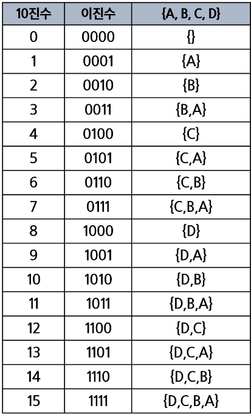

# 완전 검색 & 그리디

반복과 재귀

완전검색기법

순열

부분집합

조합

탐욕알고리즘

활동선택문제

baby-jin

## 반복과 재귀

- 반복을 이용한 선택정렬
  
  - 최소값 찾고 그 값을 맨 앞이랑 교체

```python
def SelectionSort(A):
    n = len(A)

    for i in range(0, n - 1):
        minI = i
        for j in range(i + 1, n):
            if A[j] < A[minI]:
                minI = j
        A[minI], A[i] = A[i], A[minI]

```

- 재귀적 알고리즘
  
  1. 하나 또는 그 이상의 기본 경우(basis case or rule)
     
     - 집합에 포함되어 있는 원소로 induction을 생성하기 위한 시드(seed)역할
  
  2. 하나 또는 그 이상의 유도된 경우(inductive case or rule)
     
     - 새로운 집합의 원소를 생성하기 위해 결합되어지는 방법

```python
# key가 있으면 1, 없으면 0을 리턴하는 함수
def f(i, N, key, arr):  # i 현재상태, N 목표, key 찾고자 하는 원소
    if i == N:
        return 0  # key가 없는 경우
    elif arr[i] == key:
        return 1
    else:
        return f(i + 1, N, key, arr)

N = 5
A = [1, 2, 3, 4, 5]
key = 10
print(f(0, N, key, A))
```

## 브루트포스(brute-force)

- 문제에 포함된 자료(요소, 인스턴스)의 크기가 작다면 유용하다.

- 브루트포스 탐색(Sequential search) 
  
  - 자료들의 리스트에서 키 값을 찾기 위해 첫 번째 자료부터 비교하면서 진행
  
  ```python
  def SequentialSearch( A[0,,,,n], k):
      A[n] <- k 
      i <- 0
      while A[i] != k 
          i++
      if i < n : return i 
      else : return -1
  ```

- 완전 검색
  
  - 순열, 조합, 부분집합과 같은 조합적 문제들과 연관
  
  - 완전 검색은 조합적 문제에 대한  brute-force 방법이다.
  
  
  
  ## 순열

- 다수의 알고리즘 문제들은 순서화된 요소들의 집합에서 최선의 방법을 찾는 것과 관련이 있다
  
  -  ex) TSP (Traveling Salesman Problem)

- N개의 요소들에 대해서 n!개의 순열들이 존재한다.
  
  - 12! = 479,001,600
  
  - n > 12인 경우, 시간 복잡도 폭발적으로 증가

- 사전적 순서(Lexicographic-Order)
  
  - {1, 2, 3} n = 3인 경우 [1 2 3] [1 3 2] [2 1 3] [2 3 1] [3 1 2] [3 2 1]

- 최소 변경을 통한 방법(Minimum-exchange requirement)
  
  - [1 2 3] => [3 2 1] : 이전 상태에서 두개의 요소들 교환을 통해 생성

```python
p[] : 데이터가 저장된 배열
k : 원소의 개수, n : 선택된 원소의 수
perm(i, k)
    if i == k:
        print array # 원하는 작업 수행
    else:
        for j : i -> k-1
                p[i] <-> p[j]
                perm(i + 1, k)
                p[i] <-> p[j]
```

```python
p[] : 순열을 저장하는 배열
arr[] : 순열을 만드는데 사용할 숫자 배열
n : 원소의 개수
i : 선택된 원소의 수
used[] : 사용여부
p : 결과 저장 배열

perm(i, k)
    if (i == k):
        print_arr()
    else:
        for j : 0 -> k - 1 # 모든 원소에 대해
            if not used[i] # 사용된 적 없으면
                p[i] = arr[j] # 순열에 사용
                used[j] = True # 사용됨으로 표시
                perm(i+1, k)
                used[j] = False # 다른 자리에서 사용 가능
```

- babygin

```python
def f(i, N, K): # i 이전에 고른 개수, N개에서 K개를 고르는 순열
    global cnt
    if i == K: # 순열 완성 : K개를 모두 고른 경우
        cnt += 1
        print(cnt, p)
        return
    else: # p[i]에 들어갈 숫자를 결정
        for j in range(N):
            if used[j] == 0: # 아직 사용되기 전이면
                p[i] = card[j]
                used[j] = 1
                f(i+1, N, K)
                used[j] = 0

card = [1, 2, 3, 4, 5]
N = 5 # N개의 숫자에서
K = 3 # K개를 골라 만드는 순열
used = [0] * N # 이미 사용한 카드인지 표시
p = [0] * K
cnt = 0
f(0, N, K)

# 1 [1, 2, 3]
# 2 [1, 2, 4]
# 3 [1, 2, 5]
# .
# .
# 58 [5, 4, 1]
# 59 [5, 4, 2]
# 60 [5, 4, 3]
```

## 부분 집합

- 집합에 포함된 원소들을 선택하는 것

- N개의 원소를 포함한 집합
  
  - 자기 자신과 공집합 포함한 모든 부분집합(power set)의 개수는 2^n개
  
  - 원소의 수가 증가하면 부분집합의 개수는 지수적으로 증가

- 바이너리 카운팅을 통한 사전적 순서(Lexicographic Order)
  
  -  원소 수에 해당하는 N개의 비트열을 이용한다.
  
  - n번 비트값이 1이면 n번 원소가 포함되었음을 의미한다.
  
  - 7번까지만 구하면 나머지는 전체에서 그거 뺀걸로 구할 수 있음



```python
a = [1, 2, 3, 4]
N = 4

for i in range(1 << N - 1):
    subset1 = []
    subset2 = []
    for j in range(N):
        if i & (1 << j): # j번 비트가 0이 아니면
            subset1.append(a[j])
        else:
            subset2.append(a[j])
    print(subset1, subset2)

# [] [1, 2, 3, 4]
# [1] [2, 3, 4]
# [2] [1, 3, 4]
# [1, 2] [3, 4]
# [3] [1, 2, 4]
# [1, 3] [2, 4]
# [2, 3] [1, 4]
# [1, 2, 3] [4]
```


