# Tree

[1. 트리의 개념](#트리의-개념)

[2. 트리의 정의](#정의)

[3. 용어 정리](#용어-정리)

[4. 이진트리](#이진트리)

- [4-1 이진트리특성](#이진트리-특성)

- [4-2 이진트리종류](#이진-트리-종류)

[5. 트리 순회](#순회traversal)

- [5-1 전위순회](#전위-순회preorder-traversal)

- [5-2 중위순회](#중위-순회inorder-traversal)

- [5-1 후위순회](#후위-순회postorder-traversal)

[6. 이진트리의 저장](#이진-트리의-저장)

[7. 연습문제](#연습문제)

[8.수식 트리](#수식-트리)

[9.이진 탐색 트리](#이진-탐색-트리)

[10. 힙](#힙heap)

- [10-1 힙 연산 - 삭제](#힙-연산---삭제)

[11. 힙을 이용한 우선순위 큐](#힙을-이용한-우선순위-큐)

## 트리의 개념

- 비선형 구조

- 원소들 간에 1:n 관계를 가지는 자료구조

- 원소들 간에 계층관계를 가지는 계층형 자료구조

- 상위원소에서 하위 원소르 내려가면서 확장되는 트리모양의 구조

## 정의

- 한 개 이상의 노드로 이루어진 유한 집합이며 다음 조건을 만족한다
  
  - 노드 중 최상위 노드를 루트라 한다.
  
  - 나머지 노드들은  n(>=0)개의 분리 집합(T1, T2, ..., TN) 으로 분리될 수 있다

- 이들 (T1, T2, ..., TN)은 각각 하나의 트리가 되며(재귀적 정의) 루트의 부 트리(subtree)라 한다.


## 용어 정리

- 노드(node) - 트리의 원소

- 간선(edge) - 노드를 연결하는 선

- 루트 노드(root node) -  트리의 시작 노드

- 형제노드(sibling node) - 같은 부모 노드의 자식 노드들

- 조상 노드 - 간선을 따라 루트 노드까지 이르는 경로에 있는 모든 노드들

- 서브트리(subtree) - 부모 노드와 연결된 간선을 끊었을 때 생성되는 트리

- 자손 노드 - 서브 트리에 있는 하위 레벨의 노드들

- 차수(degree)
  
  - 노드의 차수 : 노드에 연결된 자식 노드의 수
  
  - 트리의 차수 : 트리에 있는 노드의 차수 중에 가장 큰 값
  
  - 단말 노드 : 차수가 0인 노드. 자식 노드가 없는 노드

- 높이
  
  - 노드의 높이 : 루트에서 노드에 이르는 간선의 수. 노드의 레벨
    
    - B의 높이 = 1, F의 높이 = 2
  
  - 트리의 높이 : 트리에 있는 노드의 높이 중에서 가장 큰 값. 최대 레벨
    
    - 트리 T의 높이 = 3

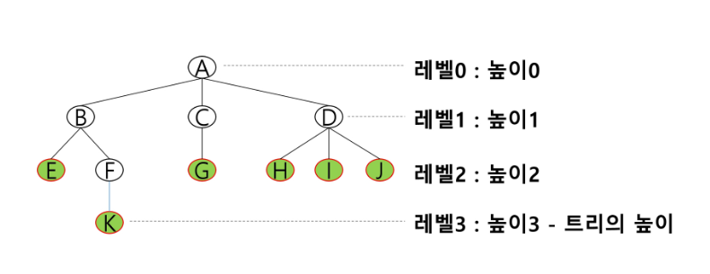

## 이진트리

- 모든 노드들이 2개의 서브트리를 갖는 특별한 형태의 트리

- 각 노드가 자식 노드를 최대한 2개 까지만 가질 수 있는 트리
  
  - 왼쪽 자식 노드(left child node)
  
  - 오른쪽 자식 노드(right child node)

## 이진트리 특성

- 레벨 i에서의 노드의 최대 개수는 2^i개

- 높이가 h인 이진 트리가 가질 수 있는 노드의 최소 개수는 (h+1)개가 되며, 최대 개수는 (2^(h+1) - 1) 개가 된다

## 이진 트리 종류

1. 포화 이진 트리(Full Binary Tree)
- 모든 레벨에 노드가 포화상태로 차 있는 이진 트리

- 높이가 h일 때, 최대의 노드 개수인 (2^(h+1) - 1)의 노드를 가진 이진 트리
  
  - 높이 3일 때 2^(3+1) - 1 = 15개의 노드

- 루트를 1번으로 하여 (2^(h+1) - 1)개까지 정해진 위치에 대한 노드 번호를 가짐

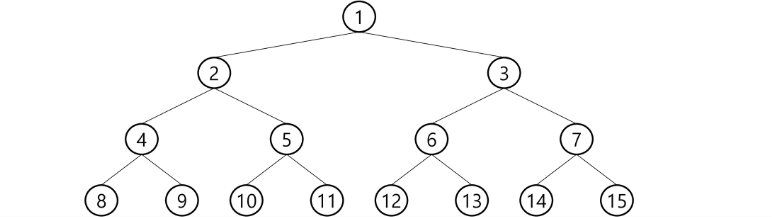

2. 편향 이진 트리(Skewed Binary Tree)
- 높이 h에 대한 최소 개수의 노드를 가지면서 한쪽 방향의 자식 노드
  
  - 왼쪽 편향 이진 트리
  
  - 오른쪽 편향 이진 트리

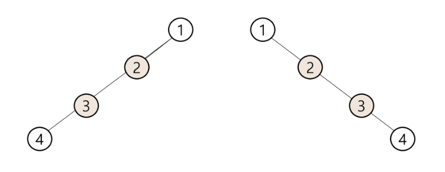

## 순회(traversal)

- 순회란 트리의 각 노드를 중복되지 않게 전부 방문(visit)하는 것을 말하는데 트리는 비 선형 구조이기 때문ㅇ에 선형구조에서와 같이 선후 연결 관계를 알 수 없다.
1. 전위 순회(preorder traversal) : VLR
   
   - 부모 노드 방문 후, 자식 노드를 좌, 우 순서로 방문한다.

2. 중위 순회(inorder traversal) : LVR
   
   - 왼쪽 자식노드, 부모노드, 오른쪽 자식 노드 순으로 방문한다.

3. 후위 순회(postorder traversal) : LRV
   
   - 자식노드를 좌우 순서로 방문한 후, 부모노드로 방문한다.

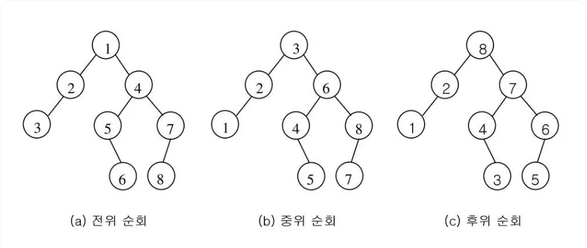

### 전위 순회(preorder traversal)

- 수행 방법
  
  1. 현재 노드 n을 방문하여 처리한다. - V
  
  2. 현재 노드 n의 왼쪽 서브트리로 이동한다. - L
  
  3. 현재 노드 n의 오른쪽 서브트리로 이동한다. - R

```python
def preorder_traverse(T):  # 전위순회
    if T:  # T is not None
        visit(T)  # print(T.item)
        preorder_traverse(T.left)
        preorder_traverse(T.right)
```

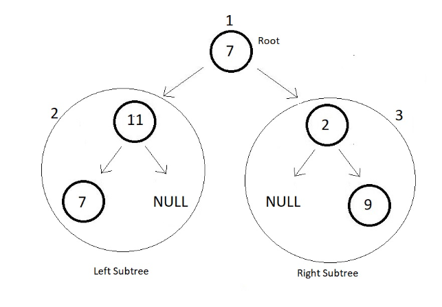

### 중위 순회(inorder traversal)

- 수행 방법
  
  1. 현재 노드 n의 왼쪽 서브트리로 이동한다. - L
  
  2. 현재 노드 n을 방문하여 처리한다. - V
  
  3. 현재 노드 n의 오른쪽 서브트리로 이동한다. - R

```python
def inorder_traverse(T):  # 중위순회
    if T:  # T is not None
        inorder_traverse(T.left)
        visit(T)  # print(T.item)
        inorder_traverse(T.right)
```

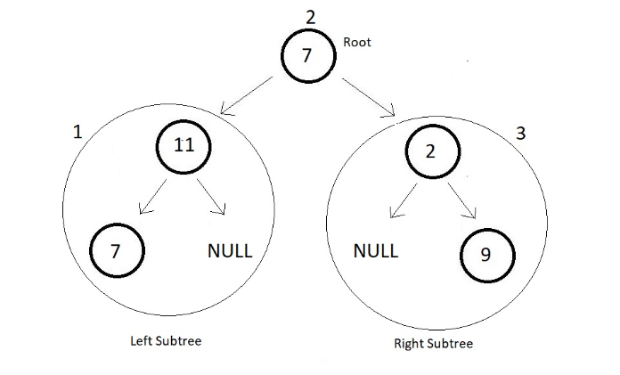

### 후위 순회(postorder traversal)

- 수행 방법
  
  1. 현재 노드 n의 왼쪽 서브트리로 이동한다. - L
  
  2. 현재 노드 n의 오른쪽 서브트리로 이동한다. - R
  
  3. 현재 노드 n을 방문하여 처리한다. - V

```python
def postorder_traverse(T):  # 후위순회
    if T:  # T is not None
        postorder_traverse(T.left)
        postorder_traverse(T.right)
        visit(T)  # print(T.item)
```

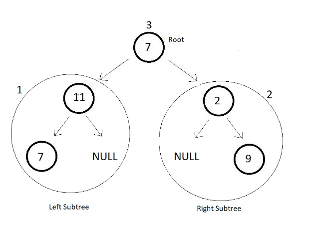

## 이진 트리의 저장

- 부모 번호를 인덱스로 자식 번호를 저장
  
  >  4 <- 간선의 개수 N
  > 
  > 1 2 1 3 3 4 3 5 <- 부모 자식 순
  
  ```python
  for i : i -> N
      read p, c
      if (c1[p] == 0)
          c1[p] = c
      else
          c2[p] = c
  ```

| 부모 : p   | 0   | 1   | 2   | 3   | 4   | 5   |
| -------- | --- | --- | --- | --- | --- | --- |
| 자식1 : c1 | 0   | 2   | 0   | 0   | 0   | 0   |
| 자식2 : c2 | 0   | 0   | 0   | 0   | 0   | 0   |

| 부모 : p   | 0   | 1              | 2   | 3   | 4   | 5   |
| -------- | --- | -------------- | --- | --- | --- | --- |
| 자식1 : c1 | 0   | 2              | 0   | 0   | 0   | 0   |
| 자식2 : c2 | 0   | <mark>3</mark> | 0   | 0   | 0   | 0   |

- 자식 번호를 인덱스로 부모 번호를 저장

| 자식 : c | 0   | 1   | 2   | 3   | 4   | 5   |
| ------ | --- | --- | --- | --- | --- | --- |
| 부모     | 0   | 0   | 1   | 0   | 0   | 0   |

 par[c] <- p

| 자식 : c | 0   | 1   | 2   | 3   | 4   | 5   |
| ------ | --- | --- | --- | --- | --- | --- |
| 부모     | 0   | 0   | 1   | 1   | 0   | 0   |

 par[c] <- p

```python
for i : i -> N
    read p, c
    par[c] = p
```

- 루트 찾기, 조상 찾기

| 자식 : c | 0   | 1   | 2   | 3   | 4   | 5   |
| ------ | --- | --- | --- | --- | --- | --- |
| 부모     | 0   | 0   | 1   | 1   | 3   | 3   |

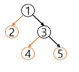

ex. 5번 노드의 조상 찾기

```python
c = 5
while (a[c] != 0) # 루트인지 확인
    c = a[c]
    anc.append(c)
root = c
```

___________

### 연습문제

```python
'''
V
13
부모 자식 부모 자식
1 2 1 3 2 4 3 5 3 6 4 7 5 8 5 9 6 10 6 11 7 12 11 13
'''
def preorder(n):
    if n: # 존재하는 정점이면
        print(n, end = " ") # visit(n)
        preorder(ch1[n]) # 왼쪽 서브트리로 이동
        preorder(ch2[n]) # 오른쪽 서브트리로 이동

V = int(input())  # 정점수 = 마지막 정점 번호
E = V - 1  # tree의 간선 수 = 정점 수 - 1
arr = list(map(int, input().split()))
# 부모를 인덱스로 자식을 저장
ch1 = [0] * (V + 1)
ch2 = [0] * (V + 1)
for i in range(E):
    p, c = arr[i * 2], arr[i * 2 + 1]
    if ch1[p] == 0:  # 자식1이 아직 없으면
        ch1[p] = c
    else:
        ch2[p] = c
print(ch1) # [0, 2, 4, 5, 7, 8, 10, 12, 0, 0, 0, 13, 0, 0]
print(ch2) # [0, 3, 0, 6, 0, 9, 11, 0, 0, 0, 0, 0, 0, 0]
preorder(1) # 1 2 4 7 12 3 5 8 9 6 10 11 13
```

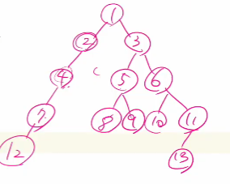

```python
'''
5
3 1 3 2 2 5 2 4
'''

def preorder(n):
    if n: # 존재하는 정점이면
        print(n, end = " ") # visit(n)
        preorder(ch1[n]) # 왼쪽 서브트리로 이동
        preorder(ch2[n])

V = int(input())  # 정점수 = 마지막 정점 번호
E = V - 1  # tree의 간선 수 = 정점 수 - 1
arr = list(map(int, input().split()))
# 부모를 인덱스로 자식을 저장
ch1 = [0] * (V + 1)
ch2 = [0] * (V + 1)
par = [0] * (V + 1)
for i in range(E):
    p, c = arr[i * 2], arr[i * 2 + 1]
    if ch1[p] == 0:
        ch1[p] = c 
    else:
        ch2[p] = c
    par[c] = c # 자식을 인덱스로 부모 저장장

root = 1
while par[root] != 0:
    root += 1
preorder(root) # 3 1 2 5 4
```

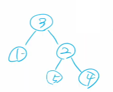

- 배열을 이용한 이진 트리 표현의 단점
  
  - 편향 이진 트리의 경우에 사용하지 않는 배열 원소에 대한 메모리 공간 낭비 발생
  
  - 트리 중간에 새로운 노드를 삽입하거나 기존의 노드를 삭제할 경우 배열의 크기 변경 어려워 비효율적

- [S/W 문제해결 기본] 9일차 - 중위순회

```python
# in-order 형식으로 순회해 각 노드 읽기
def inorder(p, N):  # N 완전 이진트리의 마지막 정점
    if p <= N:
        inorder(p * 2, N)  # 왼쪽 자식으로 이동
        print(tree[p], end="")  # 중위 순회에서 할 일
        inorder(p * 2 + 1, N)  # 오른쪽 자식으로 이동

T = 10
for tc in range(1, T + 1):
    N = int(input())
    tree = [0] * (N + 1)  # N번 노드까지 있는 완전이진트리
    for _ in range(N):
        arr = list(input().split())
        tree[int(arr[0])] = arr[1]
    print(f'#{tc}', end = " ")
    # 중위순회
    inorder(1, N)  # root = 1
    print()
```

### 수식 트리

- 수식을 표현하는 이진 트리

- 수식 이진 트리(Expression Binary Tree)라고 부르기도 함.

- 연산자는 루트이거나 가지 노드

- 피 연산자는 모두 잎 노드

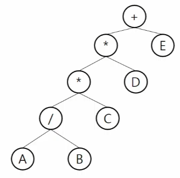

- 중위 순회 : A / B * C * D + E

- 후위 순회 : A B / C * D *  E +

- 전위 순회 : + * * / A B C D E

### 이진 탐색 트리

- 탐색작업을 효율적으로 하기 위한 자료구조

- 모든 원소는 서로 다른 유일한 키를 갖는다.

- key(왼쪽 서브 트리) < key(루트노드) < key(오른쪽 서브트리)

- 왼쪽 서브트리와 오른쪽 서브트리도 이진 탐색 트리다.

- 중위 순회하면 오름차순으로 정렬된 값을 얻을 수 있다.

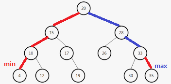

- 탐색 연산
  
  - 루트에서 시작한다.
  
  - 탐색할 키 값 x를 루트 노드의 키 값과 비교한다.
    
    - (키 값 x = 루트노드의 키 값) : 원하는 원소를 찾았으므로 탐색 연산 성공
    
    - (키 값 x < 루트노드의 키 값) : 루트노드의 왼쪽 서브트리에 대해서 탐색연산 수행
    
    - (키 값 x > 루트노드의 키 값) : 루트노드의 오른쪽 서브트리에 대해서 탐색연산 수행
  
  - 서브트리에 대해서 순환적으로 탐색 연산을 반복한다.

- 삽입 연산
  
  1. 먼저 탐색 연산을 수행
     
     - 삽입할 원소와 같은 원소가 트리에 있으면 삽입할 수 없으므로, 같은 원소가 트리에 있는지 탐색하여 확인
     
     - 탐색에서 탐색 실패가 결정되는 위치가 삽입 위치가 됨
  
  2. 탐색 실패한 위치에 원소를 삽입

- 삭제 연산
  
  - 13, 12, 9를 차례로 삭제할 경우
    
    - 13 - 그냥 삭제하면됨
    
    - 12 - 9가 12를 가리키던걸 15를 가리키도록 하면 됨
    
    - 9 - 왼쪽 트리에서 가장 큰 값을 위로 땡겨옴
  
  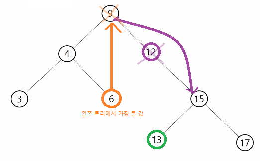

#### 이진 탐색 트리의 성능

- 탐색(searching), 삽입(insertion), 삭제(deletion) 시간은 트리의 높이만큼 시간이 걸린다
  
  - O(h), h : BST의 깊이(height)

- 평균의 경우
  
  - 이진 트리가 균형적으로 생성되어 있는 경우
  
  - O(log n)

- 최악의 경우
  
  - 한쪽으로 치우친 경사 이진트리의 경우
  
  - O(n)
  
  - 순차탐색과 시간복잡도가 같다.

- 검색 알고리즘 비교
  
  - 배열에서의 순차 검색 : O(N)
  
  - 정렬된 배열에서의 순차 검색 : O(N)
  
  - 정렬된 배열에서의 이진탐색 : O(log N)
    
    - 고정 배열 크기와 삽입, 삭제 시 추가 연산 필요
  
  - 이진 탐색 트리에서의 평균 : O(log N)
    
    - 최악의 경우 : O(N)
    
    - 완전 이진 트리 또는 균형 트리로 바꿀 수 있다면 최악의 경우를 없앨 수 있다.
      
      - 새로운 원소를 삽입할 때 삽입 시간을 줄인다.
      
      - 평균과 최악의 시간이 같다. O(log n)
  
  - 해쉬 검색 :O(1)
    
    - 추가 저장 공간이 필요

### 힙(heap)

- 완전 이진 트리에 있는 노드 중에서 키 값이 가장 큰 노드나 키 값이 가장 작은 노드를 찾기 위해서 만든 자료구조

- 최대 힙(max heap)
  
  - 키 값이 가장 큰 노드를 찾기 위한 <mark>완전이진트리</mark>  
  
  - (부모노드의 키 값 > 자식노드의 키 값)
  
  - 루트노드 : 키 값이 가장 큰 노드

- 최소 힙(min heap)
  
  - 키 값이 가장 작은 노드를 찾기 위한 <mark>완전이진트리</mark>
  
  - (부모노드의 키 값 < 자식노드의 키 값)
  
  - 루트노드 : 키 값이 가장 작은 노드

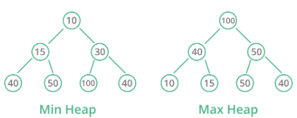

#### heap 연습 문제

- swea 5177. [파이썬 S/W 문제해결 기본] 8일차 - 이진 힙
  
  - 이진 최소 힙
    
    - 항상 완전 이진 트리를 유지하기 위해 마지막 노드 뒤에 새 노드를 추가한다.
    
    - 부모 노드의 값 < 자식 노드의 값을 유지한다. 새로 추가된 노드의 값이 조건에 맞지 않는 경우, 조건을 만족할 때까지 부모노드와 같을 바꾼다.
    
    - 노드 번호는 루트가 1번, 왼쪽에서 오른쪽으로, 더 이상 오른쪽이 없는 경우 다음줄로 1씩 증가한다.
      
      ```python
      # N + 1 배열 생성
      last = 0
      enq(7)
      ...
      enq(n)
      # 완전 이진 트리 유지
      last += 1
      h[last] = n
      p = last // 2
      
      while p > 0 and h[p] > h[c] # 최소힙에 의해
          h[p] <-> h[c]
          c <- p
          p <- c // 2
      ```

#### 힙 연산 - 삭제

- 힙에서는 루트 노드의 원소만을 삭제할 수 있다.

- 루트 노드의 원소를 삭제하여 반환한다

- 힙의 종류에 따라 최대값 또는 최소값을 구할 수 있다.

```python
# 완전이진트리 유지
# 1. 루트 노드의 원소 삭제
# 2. 마지막 노드 삭제
tmp = h[1]
h[1] = h[last]
last -= 1

# 3. 최대힙 유지 (부모 > 자식)
# 4. 자식이 없거나 부모가 크면 비교 중지
```

### 힙을 이용한 우선순위 큐

- 완전 이진 트리에 있는 노드 중에서 키 값이 가장 큰 노드나 키 값이 가장 작은 노드를 찾기 위해서 만든 자료구조

- 힙의 키를 우선 순위로 활용하여 우선순위 큐를 구현할 수 있다.

```python
def deq():
    global last
    tmp = heap[1]  # 루트 백업
    heap[1] = heap[last]  # 삭제할 노드의 키를 루트에 복사
    last -= 1  # 마지막 노드 삭제
    p = 1  # 루트에 옮긴 값을 자식과 비교
    c = p * 2  # 왼쪽 자식 (비교할 자식 노드 번호)
    while c <= last:  # 자식이 하나라도 있으면..(왼쪽 자식)
        if c + 1 <= last and heap[c] < heap[c + 1]:  # 오른쪽 자식도 있고, 오른쪽 자식이 더 크면
            c += 1  # 비교 대상이 오른쪽 자식 노드
        if heap[p] < heap[c]:  # 자식이 더 크면 최대힙 규칙에 어긋나므로
            heap[p], heap[c] = heap[c], heap[p]
            p = c  # 자식을 새로운 부모로
            c = p * 2  # 왼쪽 자식 번호를 계산
        else:  # 부모가 더 크면
            break  # 비교 중단
    
    return tmp

heap = [0] * 100
last = 0
```
