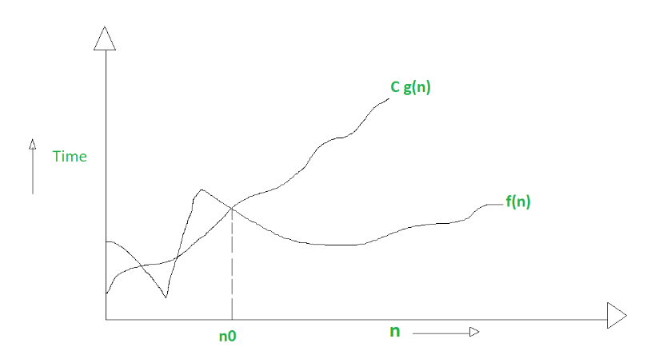

복잡도 분석

표준 입출력 방법

비트 연산

진수

실수

## 복잡도 분석

- 알고리즘 : 문제를 해결하기 위한 절차

- 알고리즘의 효율
  
  - 공간적 효울성 : 연산량 대비 얼마나 적은 메모리 공간을 요하는가
  
  - 시간적 효율성 : 연산량 대비 얼마나 적은 시간을 요하는가
  
  - 복잡도가 높을수록 효율성 저하

- 복잡도의 점근적 표기
  
  - 시간복잡도는 입력 크기에 대한 함수로 표기, 다항식
  
  - 입력 크기 n이 무한대로 커질 때의 복잡도를 간단히 표현하기 위해 사용하는 표기법
  
  - 1. Big-O(빅-오) ⇒ 상한 점근
    2. Big-Ω(빅-오메가) ⇒ 하한 점근
    3. Big-θ(빅-세타) ⇒ 그 둘의 평균

- Big-O(빅-오)
  
  - 복잡도의 점근적 상한
  
  - f(n) = 2N^2+7N+9 이라면, f(n)의 O표기는 O(n^2)
    
    - <mark>실행시간이 n^2에 비례</mark>하는 알고리즘이라고 말함
    
    - g(n)이 n0보다 큰 모든 n에 대해서 항상  f(n)보다 크다
  
  

- Big-Ω(빅-오메가)
  
  - 복잡도의 점근적 하한
  
  - f(n) = 2N^2+7N+9 이라면, f(n)의Ω표기는 Ω(n^2)
  
  - f(n) = Ω(n^2)은 n이  증가함에 따라 2N^2+7N+9가 cn^2보다 작을 수 없다는 의미 
    
    - 상수 c = 1로 놓으면 된다
  
  - <mark>최소한 이만한 시간은 걸린다</mark>
  
  - g(n)이 n0보다 큰 모든 n에 대해서 항상 f(n)보다 크다
  
  

- Big-θ(빅-세타) 표기
  
  - O - 표기와 Ω - 표기가 같은 경우에 사용
  
  - f(n) = 2n^2+8n+3 = O(n^2) = Ω(n^2)이므로 f(n) = θ(n^2)
  
  - f(n)은 n이 증가함에 따라<mark> n^2과 동일한 증가율</mark>을 가진다
  
  

- 자주 사용하는 O - 표기


            상수시간 < 로그시간 < 선형시간 < 로그 선형 시간 < 제곱 시간 < 지수시간

### 표준 입출력

- 입력
  
  - input()  :  받은 입력값을 문자열로 취급
  
  - eval(input()  :  받은 입력값을 평가된 데이터형으로 취급

- 출력
  
  - print()  :  표준 출력 함수. 출력값의 마지막에 개행 문자 포함
  
  - print('text, end = "")  :  출력 시 마지막에 개행문자 제외할 시
  
  - print('%d'%number) : formatting된 출력

- 파일의 내용을 표준 입력으로 읽어오는 방법
  
  ```python
  import sys
  sys.stdin = open("input.txt", "r")
  sys.stdout = open("output.txt", "w")
  
  text = input()
  print(text)
  ```

## 비트 연산자

| 연산자 | 연산자의 기능                                         |     |
|:---:|:-----------------------------------------------:| --- |
| &   | 비트단위로 AND연산을 한다 ex) num1 & num2                 |     |
| |   | 비트단위로 OR연산을 한다 ex) num1 \| num2                 |     |
| ^   | 비트단위로 XOR연산을 한다. ( 같으면 0 다르면 1) ex) num1 ^ num2 |     |
| ~   | 단향 연산자, 피연산자의 모든 비트를 반전시킨다 ex) ~num             |     |
| <<  | 피연산자의 비트 열을 왼쪽으로 이동시킨다. ex) num << 2            |     |
| >>  | 피연산자의 비트 열을 오른쪽으로 이동시킨다. ex) num >> 2           |     |

- AND 
  
  -  0 이랑 &연산하면 무조건 0이므로 0으로 만들 수 있다 
  
  -   1이랑 & 연산하면 0이면 0 나오고 1이면 1나오므로 그 비트가 1인지 검사를 할 수 있다.

- OR
  
  - 1이랑 | 연산하면 무조건 1이므로 1로 만들 수 있다
  
  - 0이랑 | 연산하면 0이면 0 나아고 1이면 1 나오므로 비트 검사 가능

- 1 << n
  
  - 2^n의 값을 갖는다.
  
  - 원소가 n개일 경우의 모든 부분집합의 수를 읨
  
  - Power set
    
    - 공집합과 자기 자신을 포함한 모든 부분 집합
    
    - 각 원소가 포함되거나 포함되지 않는 2가지 경우의 수를 계산하면 모든 부분집합의 후

- i & (1 << j)
  
  - i의  j 번째 비트가 1인지 아닌지
  
  ```python
  def Bbit_print(i):
      output = ""
      for j in range(7, -1, -1):
          output += '1' if i & (1 << j) else '0'
      print(output)
  
  for i in range(-5, 6):
      print("%3d = " % i, end='')
      Bbit_print(i)
  
  # -5 = 11111011
  # -4 = 11111100
  # -3 = 11111101
  # -2 = 11111110
  # -1 = 11111111
  #  0 = 00000000
  #  1 = 00000001
  #  2 = 00000010
  #  3 = 00000011
  #  4 = 00000100
  #  5 = 00000101
  ```

### 비트연산 연습문제 1

- 0과 1로 이루어진 1차 배열에서 7개 byte를 묶어서 10진수로 출력하기

| 0000001 | 0001101 |
| ------- | ------- |

- 1, 13을 출력해야 됨

- 


