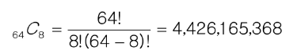
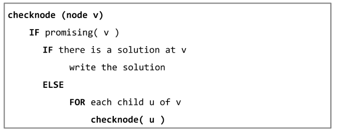
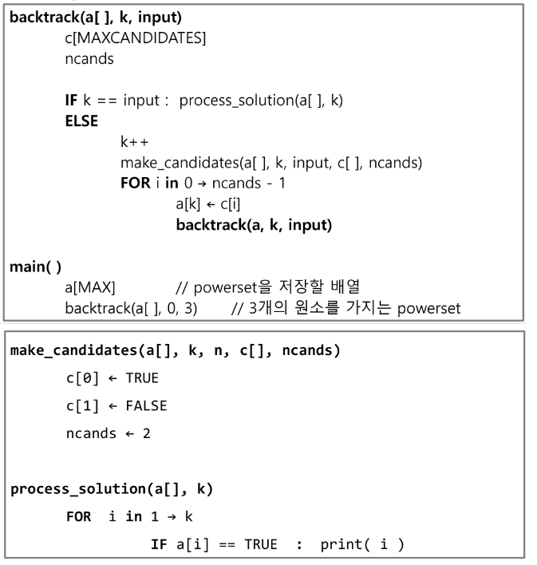

# 백트래킹

- N-Queen 문제

- 백트래킹(Backtracking) 개념
  
  - 여러 가지 선택지(옵션)들이 존재하는 상황에서 한가지를 선택한다.
  
  - 선택이 이루어지면 새로운 선택지의 집합이 생성된다.
  
  - 이런 선택을 반복하면서 최종 상태에 도달한다.
    
    - 올바른 선택을 계속하면 목표 상태(goal state)에 도달한다
  
  - 당첨 리프 노드 찾기
    
    - 루트에서 갈 수 있는 노드르 선택한다.
    
    - 꽝 노드까지 도달하면 최근의 선택으로 되돌아와서 다시 시작한다.
    
    - 더 이상의 선택지가 없다면 이전의 선택지로 돌아가서 다른 선택을 한다.
    
    - 루트까지 돌아갔을 경우 더 이상 선택지가 없다면 찾는 답이 없다.

- 백트래킹과 깊이 우선 탐색과의 차이
  
  - 어떤 노드에서 출발하는 경로가 해결책으로 이어질 것 같지 않으면 더 이상 그 경로를 따라가지 않음으로써 시도의 횟수를 줄임  - <mark>Prunning 가지치기</mark>
  
  - 깊이 우선 탐색이 모든 경로를 추적하는데 비해 백트래킹은 불필요한 경로를 조기에 차단
  
  - 길이 우선 탐색을 가하기에는 경우의 수가 너무나 많음.
    
    - <mark>N!</mark> 가지 경우의 수를 가진 문제에 대해 깊이 우선 탐색을 가하면 당연히 처리 불가능한 문제
  
  - <u>백트래킹 알고리즘을 적용하면 일반적으로 경우의 수가 줄어들지만 이 역시 최악의 경우에는 여전히 지수함수 시간(Exponential Time)을 요하므로 처리 불가능</u>
  
  - **많은 경우의 수를 제거할 수 있는가?**

- 8-Queens 문제
  
  - 퀸 8개를 8x8 크기의 체스판 안에 서로를 공격할 수 없도록 배치하는 모든 경우를 구하는 문제
  
  - 후보 해의 수 : 
    
    
  
  - 실제 해의 수 : 이 중에서 실제 해는 92개뿐
  
  - 즉, 44억개가 넘는 후보 해의 수 속에서 92개를 최대한 효율적으로 찾아내는 것이 관건

- 백트래킹 기법
  
  - 어떤 노드의 유망성을 점검한 후에 유망(promising)하지 않다고 결정되면 그 노드의 부모로 되돌아가(backtracking) 다음 자식 노드로 감.
  
  - 어떤 노드를 방문하였을 때 그 노드를 포함한 경로가 해답이 될 수 없으면 그 노드는 유망하지 않다고 하며, 반대로 해답의 가능성이 있으면 유망하다고 한다. 
  
  - 가지치기(prunning) : 유망하지 않는 노드가 포함되는 경로는 더 이상 고려하지 않는다.

- 백트래킹 절차
  
  1. 상태 공간 트리의 깊이 우선 검색을 실시한다.
  
  2. 각 노드가 유망한지를 점검한다. 
  
  3. 만일 그 노드가 유망하지 않으면, 그 노드의 부모 노드로 돌아가서 검색을 계속한다.




- 깊이 우선 검색 vs. 백트래킹
  
  - 순수한 깊이 우선 검색 = 155 노드
  
  - 백트래킹 = 27노드


- {1, 2, 3}의 powerset을 구하는 백트래킹 알고리즘



```python
def func():
    # 재귀를 끝내는 기저 조건

    # 가지치키

    # 반복문
        # 가지치기
        # 재귀 함수 호출
        # 돌아와서 초기화


# {1, 2, 3} 집합에서 3개의 숫자를 선택하는 기본적인 예제
# ex) 이미 사용한 숫자는 사용하지 않도록
arr = [i for i in range(1, 4)]
path = [0] * 3 # 경로를 저장하기 위함

def backtracking(cnt):
    # 기저 조건
    # 숫자 3개 골랐을 때 종료
    if cnt == 3:
        print(*path)
        return

    for num in arr:
        # 가지 치기
        # 조건을 작성하는 것이 핵
        if num in path:
            continue
        # 들어가기 전 로직 - 경로 저장
        path[cnt] = num
        # 다음 재귀 함수 호출
        backtracking(cnt + 1)
        # 돌아와서 할 로직 - 초기화
        path[cnt] = 0

backtracking(0)
```
