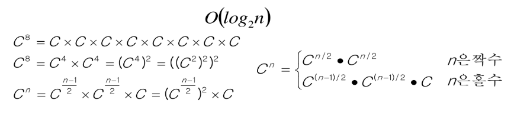
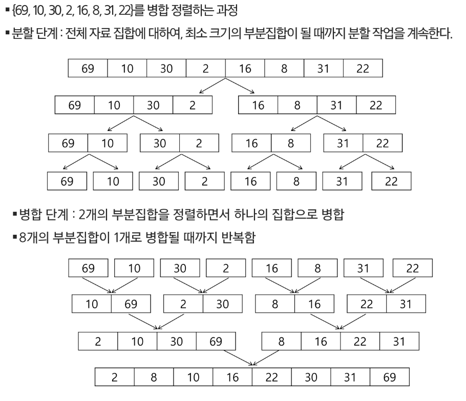
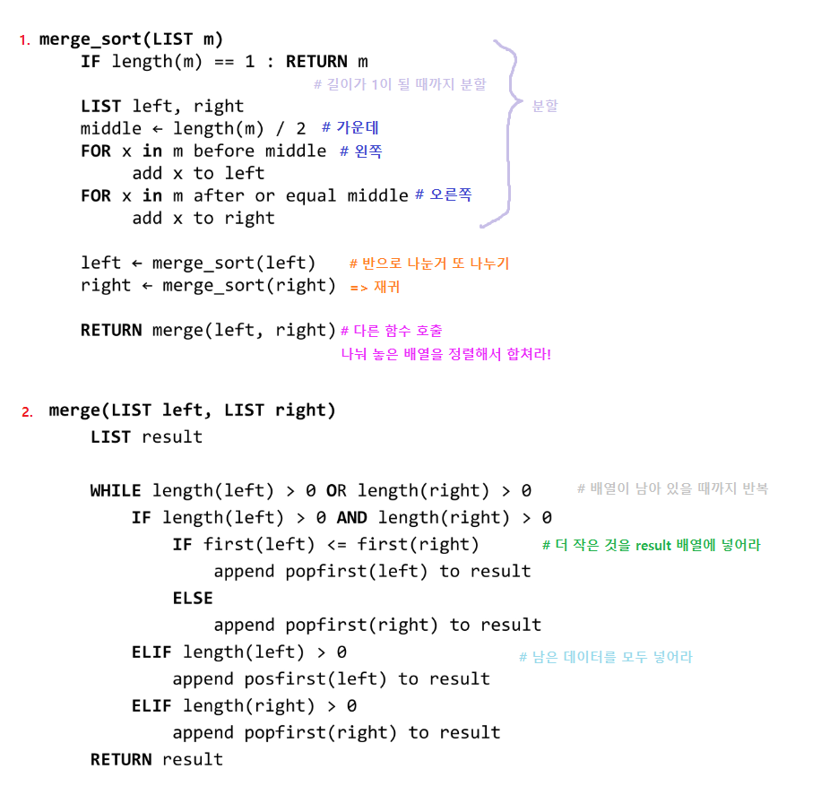
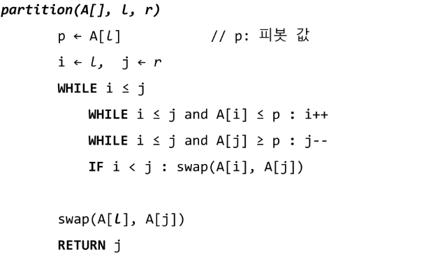
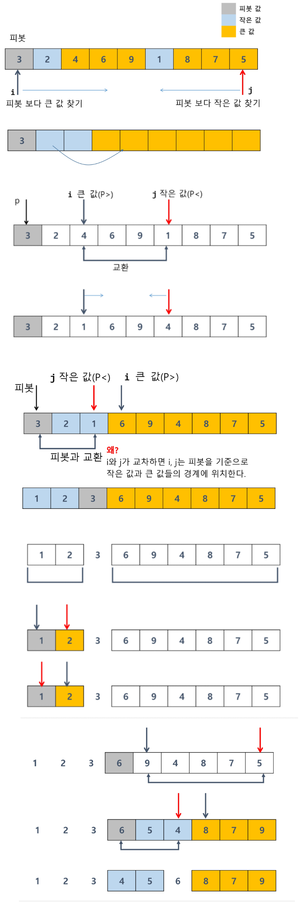
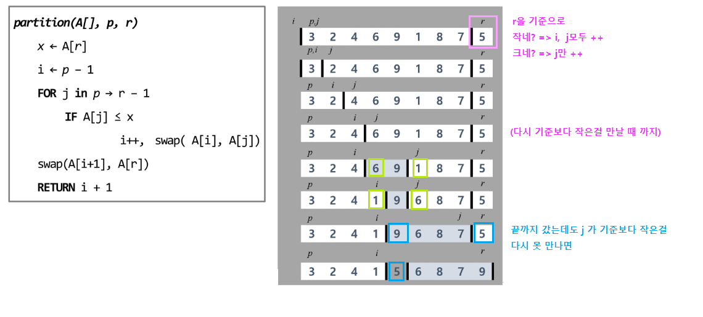

# 분할정복, 백트래킹

1. 분할정복
   
   - 병합 정렬
   
   - 퀵 정렬
   
   - 이진 탐색

> - 알고리즘 설계 기법의 종류
> 1. 전체를 다 보자 (Brute Force - 완전 탐색)
>    
>    - 배열 : 반복문을 다 돌리기
>    
>    - 그래프 : DFS, BFS
> 
> 2. 상황마다 좋은 걸 고르자 (Greedy - 탐욕)
>    
>    - 규칙을 찾는 것
>    
>    - 주의사항 : 항상 좋은 것을 뽑아도, 최종 결과가 제일 좋다 = 보장되지 ㅏㄶ는다
> 
> 3. 하나의 큰 문제를 작은 문제로 나누어 부분적으로 해결하자(Dynamic Programming)
>    
>    - Memoization 기법
>    
>    - 점화식(bottom-up). 재귀(top-down)
> 
> 4. 큰 문제를 작은 문제로 쪼개서 해결하자(Divide and Conquer - 분할정복)
> 
> 5. 전체(Backtracking - 백트래킹)
>    
>    - 가지치기


> sort(), sorted() = 내장 라이브러리가 굉장히 강력!
> 
> 병합 정렬
> 
> - 직접 구현할 일은 적다
>   
>   - 멀티쓰레드
> 
> 퀵 정렬
> 
> - 직접 구현할 일은 적다.
>   
>   - 평균적으로 굉장히 좋음O(NlogN)
>   
>   - 특히, 큰 데이터를 다룰 때 좋다.
>   
>   - 단점 : 역순 정렬 등 최악의 경우 O(N^2) 
>   
>   - => 미리 한번 랜덤으로 섞고 하기도 한다. 
> 
> 이진 검색
> 
> - 코딩 테스트의 메인 알고리즘 중 하나
> 
> - 목적 : 원하는 값을 빨리 찾는 것
> 
> - 시간 : O(logN)
> 
> - Parametric Search - 특정 범위 검색
>   
>   - lower bound
>   
>   - upper bound
>     
>     - 여러개의 데이터 중 2가 처음 나온 시점
>     
>     - 2~9 사이의 데이터는 몇 개 인가?

## 1. 분할 정복 기법

- 유래
  
  - 1805년 12월 2일 아우스터리츠 전투에서 나폴레옹이 사용한 전략
  
  - 전겨이 우세한 연합군을 공격하기 위해 나폴레옹은 연합군의 중앙부로 쳐들어가 연합군을 둘로 나눔
  
  - 둘로 나눈 연합군을 한 부분씩 격파함

- 설계 전략
  
  - 분할(Divide) : 해결할 문제를 여러 개의 작은 부분으로 나눈다.
  
  - 정복(Conquer) : 나눈 문제를 각각 해결한다.
  
  - 통합(Combine) : (필요하다면) 해결된 해답을 모은다.



```python
def recursive_power(x, n)
    if n == 1: return x
    if n is even:
        y <- recursive_power(x, n/2)
        return y * y
    else:
        y <- recursive_power(x, (n-1)/2)
        return y * y * x
```

## 병합 정렬(Merge Sort)

- 여러 개의 정렬된 자료의 집합을 병합하여 한 개의 정렬된 집합으로 만드는 방식

- 활용
  
  - 자료를 최소 단위의 문제까지 나눈 후에 차례대로 정렬하여 최종 결과를 얻어냄.
  
  - top-down 방식

- 시간 복잡도 : O(nlogn)



- 구조가 변하지 않는다 => 재귀   

# 퀵 정렬

- 주어진 배열을 두 개로 분할하고, 각각을 정렬한다

- 다른점1 : 병합 정렬은 그냥 두 부분으로 나누는 반면에, 퀵 정렬은 분할할 때, 기준 아이템(pivot item) 중심으로, 이보다 작은 것은 왼쪽, 큰 것은 오른쪽에 위치시킨다.

- 다른점2 : 각 부분 정렬이 끝난 후, 병합 정렬은 '병합'이라는 후처리 작업이 필요하나, 퀵 정렬은 필요로 하지 않는다.

- sudo code

```python
quickSort(A[], L, r):
    if L < r:
        s <- partition(a, L, r)
        quickSort(A[], L, s - 1)
        quickSort(A[], s + 1, r)
```

1. 호어 파티션(Hoare Partition)
   
   - 아이디어
     
     - 왼쪽끝/오른쪽끝/중간에 있는 3개 중에 중간값을 피봇으로 선택
     
     - i는 처음에, j는 끝에 위치
     
     - i는 pivot보다 큰 값 찾기, j는 pivot보다 작은 값 찾기
       
       - i, j 교차되는 시점까지가 한 사이클
   
   
   
   

2. Lumuto partiton 알고리즘
- 일반적으로 Hoare에 비해 안 좋다.



> Hoare vs Lomuto
> 
> - Lomuto : 같은 숫자가 많으면 불필요한 swap

# <mark>이진 검색</mark>

- 자료의 가운데에 있는 항목의 키 값과 비교하여 다음 검색의 위치를 결정하고 검색을 계속 진행하는 방법
  
  - 목적 키를 찾을 때까지 이진 검색을 순환적으로 반복 수행함으로써 검색 범위를 반으로 줄여가면서 보다 빠르게 검색을 수행함

- 이진 검색을 하기 위해서는 자료가 <mark>정렬</mark>된 상태여야 한다.
1. 자료 중앙에 있는 원소를 고른다.

2. 중앙 원소의 값과 찾고자 하는 목표 값을 비교한다.

3. 목표 값이 중앙 원소의 값보다 작으면 자료의 왼쪽 반에 대해서 새로 검색을 수행하고, 크다면 자료의 오른쪽 반에 대해서 새로 검색을 수행한다.

4. 찾고자 하는 값을 찾을 때까지 1~3 과정을 반복한다.


- 반복 구조 이진 탐색


- 재귀 구조 이진 탐색


- 이진 검색 - 반복문 활용

```python
arr = [2, 4, 7, 9, 11, 19, 23]
# 문제에서 데이터가 정렬되어 있다 라는 조건이 없다면
# 반드시 정렬을 먼저 수행해야 한다.
arr.sort()

def binarySearch(target):
    low = 0
    high = len(arr) - 1

    # low > high 라면 데이터를 데이터를 못 찾은 경우
    while low <= high:
        mid = (low + high) // 2

        # 1. 가운데 값이 정답인 경우
        if arr[mid] == target:
            return mid
        # 2. 가운데 값이 정답보다 작은 경우
        elif arr[mid] < target:
            low = mid + 1
        # 3. 가운데 값이 정답보다 큰 경우
        else:
            high = mid - 1
    
    return "해당 데이터는 없습니다"

print(f'9 = {binarySearch(9)}')
print(f'10 = {binarySearch(10)}')
```

- 이진 검색 - 재귀호출 활용
  
  ```python
  arr = [2, 4, 7, 9, 11, 19, 23]
  # 문제에서 데이터가 정렬되어 있다 라는 조건이 없다면
  # 반드시 정렬을 먼저 수행해야 한다.
  arr.sort()
  
  def binarySearch(low, high, target):
      # 기저 조건 : 언제까지 재귀호출을 반복할 것인가?
      # low > high 라면 데이터를 못 찾음
      if low > high:
          return "타겟 찾을 수 없음"
  
      mid = (low + high) // 2
      # 1. 가운데 값이 정답인 경우
      if target == arr[mid]:
          return mid
      # 2. 가운데 값이 정답보다 작은 경우
      elif arr[mid] < target:
          return binarySearch(mid + 1, high, target)
      # 3. 가운데 값이 정답보다 큰 경우
      else:
          return binarySearch(low, mid - 1, target)
      
  low = 0
  high = len(arr) - 1
  print(f'9 = {binarySearch(low, high, 9)}')
  print(f'10 = {binarySearch(low, high, 10)}')
  ```

## 분할 정복의 활용

- 병합 정렬은 외부 정렬의 기본이 되는 정렬 알고리즘이다. 또한 멀티코어(Multi-Core) CPU나 다수의 프로세서에서 정렬 알고리즘을 병렬화하기 위해 병합 정렬 알고리즘이 활용된다.

- 퀵 정렬은 매우 큰 입력 데이터에 대해서 좋은 성능을 보이는 알고리즘이다. 
