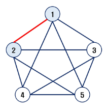
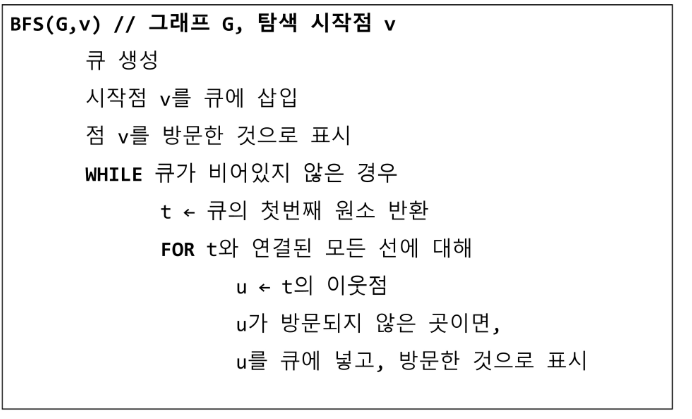
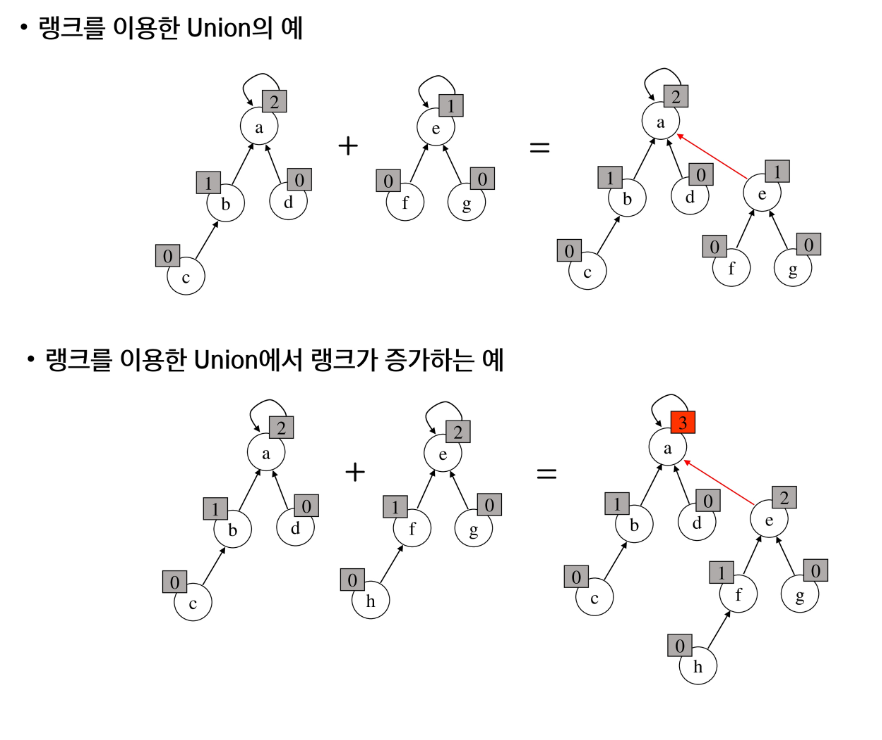

# Graph

1. 그래프 기본
   
   - 정의
   
   - 유형
   
   - 그래프 경로
   
   - 그래프 표현
     
     - 인접행렬
     
     - 인접리스트

2. 그래프 순회
   
   - BFS
   
   - DFS

3. 서로소 집합들

## 1. 그래프

> 데이터 간 관계를 표현한 자료구조
> 
> 관계 ? 데이터 사이의 연관성

- 그래프는 아이템(사물 또는 추상적 개념)드로가 이들 사이의 연결 관계를 표현한다. 

- 그래프는 정점(Vertex)들의 집합과 이들을 연결하는 간선(Edge)들의 집합으로 구성된 자료 구조
  
  - \|V\| : 정점의 개수, \|E\| : 그래프에 포함된 간선의 개수
  
  - \|V\| 개의 정점을 가지는 그래프는 최대 \|V\|(\|V\| - 1) 간선이 가능
  
  - 예 ) 5개의 정점이 있는 그래프의 최대 간선 수는 10(=5*4/2) 개이다.

- 선형 자료구조나 트리 자료구조로 표현하기 어려운 N:N 관계를 가지는 원소들을 표현하기에 용이하다.
  
  #### 그래프 유형
  
  - 무향 그래프(Undirected Graph)
  
  - 유향 그래프(Directed Graph)
  
  - 
  
  - 사이클 없는 방향 그래프 (DAG, Directed Acyclic Graph)
  
  - 완전 그래프
    
    - 정점들에 대해 가능한 모든 간선들을 가진 그래프
  
  - 부분 그래프
    
    - 원래 그래프에서 일부의 정점이나 간선을 제외한 그래프

- 인접 (Adjacency)
  
  - 두 개의 정점에 간선이 존재(연결됨)하면 서로 인접해 있다고 한다. 
  
  - 완전 그래프에 속한 임의의 두 정점들은 모두 인접해있다.
  
  

#### 그래프 경로


- 경로란 간선들을 순서대로 나열한 것
  
  간선들 : (0,2), (2, 4), (4, 6)
  
  - 정점들 : 0 - 2 - 4 - 6

- 경로 중 한 정점을 최대한  한번만 지나는 경로를 <mark>단순경로</mark>라 한다.
  
  - 0 - 2 - 4 - 6,   0 - 1 - 6

- 시작한 정점에서 끝나는 경로를 <mark>사이클(Cycle)</mark>이라고 한다
  
  - 1 - 3 - 5 - 1

#### 그래프 표현

- 간선의 정보를 저장하는 방식, 메모리나 성능을 고려해서 결정

- 인접 행렬(Adjacent matrix)
  
  - \|V\| X \|V\|크기의 2차원 배열을 이용해서 간선 정보를 저장
  
  - 배열의 배열(포인터 배열)

- 인접 리스트 (Adjacent List)
  
  - 각 정점마다 해당 정점으로 나가는 간선의 정보를 저장

- 간선 배열
  
  - 간선(시작 정점, 끝 정점)을 배열에 연속적으로 저장

##### 인접 행렬

- 두 정점을 연결하는 간선의 유무를 행렬로 표현
  
  - \|V\| X \|V\| 정방 행렬
  
  - 행 번호와 열 번호는 그래프의 정점에 대응
  
  - 두 정점이 인접되어 있으면 1, 그렇지 않으면 0으로 표현
  
  - 무향 그래프
    
    - i 번째 행의 합 = i번째 열의 합 = Vi 의 차수
  
  - 유향 그래프
    
    - 행 i의 합 = Vi의 진출차수
    
    - 열 i의 합 = Vi의 진입차수
  
  - 인접 행렬의 단점은?
  
  - ?????


##### 인접 리스트

- 각 정점에 대한 인접 정점들을 순차적으로 표현

- 하나의 정점에 대한 인접 정점들을 각각 노드로 하는 연결 리스트로 저장


## 2. 그래프 순회(탐색)

- 그래프 순회는 비선형구조인 그래프로 표현된 모든 자료(정점)를 빠짐없이 탐색하는 것을 의미한다.

- 방법
  
  - 깊이 우선 탐색(Depth First Search, DFS)
  
  - 너비 우선 탐색(Breadth First Search, BFS)

### DFS(깊이 우선 탐색)

- 시작 정점의 한 방향으로 갈 수 있는 경로가 있는 곳까지 깊이 탐색해 가다가 더 이상 갈 곳이 없게 되면, 가장 마지막에 만났던 갈림길 간선이 있는 정점으로 되돌아와서 다른 방향의 정점으로 탐색을 계속 반복하여 결국 모든 정점을 방문하는 순회방법

- 가장 마지막에 만났던 갈림길의 정점으로 되돌아가서 다시 깊이 우선탐색을 반복해야 하므로 후입선출 구조의 스택 사용

- DFS - 재귀


- DFS - 반복


### BFS(Breadth First Search)

- 너비우선탐색은 탐색 시작점의 인접한 정점들을 먼저 모두 차례로 방문한 후에, 방문했던 정점을 시작점으로 하여 다시 인접한 정점들을 차례로 방문하는 방식

- 인접한 정점들에 대해 탐색을 한 후, 차례로 다시 너비우선탐색을 진행해야 하므로, 선입선출형태의 자료구조인 큐를 활용함

- BFS - 입력 파라미터 : 그래프 G와 탐색 시작점 v



```python
# 인접 행렬
# 장점 : 구현이 쉽다
# 단점 : 메모리 낭비, 0도 표시를 하기 때문에

graph = [
    [0, 1, 0, 1, 0],
    [1, 0, 1, 1, 1],
    [0, 1, 0, 0, 0],
    [1, 1, 0, 0, 1],
    [0, 1, 0, 1, 0],
]

if graph[0][1] == 1:
    pass # 갈 수 있다.

# DFS
# stack 버전
def dfs_stack(start):
    visited = []
    stack = [start]

    while stack:
        now = stack.pop()
        # 이미 방문한 지점이라면 continue
        if now in visited:
            continue
        # 방문하지 않은 지점이라면, 방문 표시
        visited.append(now)

        #갈 수 있는 곳들을 stack에 추가
        # for next in range(5):
        # 작은 번호부터 조회
        for next in range(4, -1, -1):
            # 연결이 안되어 있다면 continue
            if graph[now][next] == 0:
                continue
            # 방문한 지점이라면 stack에 추가하지 않음
            if next in visited:
                continue

            stack.append(next)
    # 출력을 위한 반환
    return visited
print("dfs stack = ", end = "")  # dfs stack = 0 3 4 1 2
print(*dfs_stack(0))

# 재귀
# MAP 크기(길이)를 알 때 append 형식 말고 아래와 같이 사용하면 훨씬 빠르다
visited = [0] * 5
path = [] # 방문 순서 기록

def dfs(now):
    visited[now] = 1 # 현재 지점 방문 표시
    print(now, end = " ")

    # 인접한 노드들을 방문
    for next in range(5):
        if graph[now][next] == 0:
            continue

        if visited[next]:
            continue

        dfs(next)

print('dfs 재귀 = ', end = "")
dfs(0)

# BFS
def bfs(start):
    visited = [0] * 5

    # 먼저 방문했던 것을 먼저 처리해야 한다  = queue
    queue = [start]
    visited[start] = 1

    while queue:
        # queue 의 맨 앞 요소를 꺼냄
        now = queue.pop(0)
        print(now, end = " ")

        # 인접한 노드들을 queue에 추가
        for next in range(5):
            # 연결이 안되어 있다면 continue
            if graph[now][next] == 0:
                continue
            # 방문한 지점이라면 stack에 추가하지 않음
            if visited[next]:
                continue

            queue.append(next)
            # bfs 이므로 여기서 방문 체크를 해도 상관 없다. 
            visited[next] = 1
print()
print('bfs = ', end = "")
bfs(0)
```

```python
# 인접 리스트
# 갈 수 있는 지점만 저장하자
# 주의사항
# - 각 노드마다 갈 수 있는 지점의 개수가 다름
# - range 쓸 때 index 조심
# 장점 : 인접 행렬에 비해 메모리가 훨씬 효율적이다
# 추가
# 파이썬은 dictionary로도 구현 가능하다

graph = [
    [1, 3],
    [0, 2, 3, 4],
    [1],
    [0, 1, 4],
    [1, 3],
]

if graph[0][1] == 1:
    pass # 갈 수 있다.

# DFS
# stack 버전
def dfs_stack(start):
    visited = []
    stack = [start]

    while stack:
        now = stack.pop()
        # 이미 방문한 지점이라면 continue
        if now in visited:
            continue
        # 방문하지 않은 지점이라면, 방문 표시
        visited.append(now)

        #갈 수 있는 곳들을 stack에 추가
        for to in range(len(graph[now]) - 1, -1, -1):
            # 연결이 안되어 있는건 애초에 저장하지 않았으므로 
            # 체크할 필요 없음
            # if graph[now][next] == 0:
                # continue
            next = graph[now][to]
            # 방문한 지점이라면 stack에 추가하지 않음
            if next in visited:
                continue

            stack.append(next)
    # 출력을 위한 반환
    return visited

print("dfs stack = ", end = "")  # dfs stack = 0 3 4 1 2
print(*dfs_stack(0))

# 재귀
# MAP 크기(길이)를 알 때 append 형식 말고 아래와 같이 사용하면 훨씬 빠르다
visited = [0] * 5
path = [] # 방문 순서 기록

def dfs(now):
    visited[now] = 1 # 현재 지점 방문 표시
    print(now, end = " ")

    # 인접한 노드들을 방문
    for to in range(len(graph[now])):
        next = graph[now][to]
        if visited[next]:
            continue

        dfs(next)

print('dfs 재귀 = ', end = "")
dfs(0)


# 큐 bfs
def bfs(start):
    # 노드의 방문 여부를 저장하는 리스트
    visited = [0] * 5

    # 시작 노드를 큐에 추가하고 방문 표시
    queue = [start]
    visited[start] = 1

    while queue:
        # 큐에서 노드를 하나 꺼내고 출력
        now = queue.pop(0)
        print(now, end=' ')

        # 인접한 노드 중에서 방문하지 않은 노드를 큐에 추가하고 방문 표시
        for i in range(len(graph[now])):
            to = graph[now][i]
            if not visited[to]:
                queue.append(to)
                visited[to] = 1


# 0부터 시작하는 BFS를 호출
print("bfs queue = ", end=' ')
bfs(0)
```

## 3. 서로소 집합(Disjoint-sets)

- 서로소 또는 상호배타 집합들은 서로 중복 포함된 원소가 없는 집합들이다. 다시 말해 교집합이 없다.

- 집합에 속한 하나의 특정 멤버를 통해 각 집합들을 구분한다. 이를 대표자(representative)라 한다.

- 상호배타 집합을 표현하는 방법
  
  - 연결 리스트
  
  - 트리

- 상호배타 집합 연산
  
  - Make-Set(x)
  
  - Find-Set(x)
  
  - Union(x, y)
  
  

### 상호 배타 집합 표현 - 연결리스트

- 같은 집합의 원소들은 하나의 연결리스트로 관리한다.

- 연결리스트의 맨 앞의 원소를 집합의 대표 원소르 삼는다

- 각 원소는 집합의 대표원소를 가리키는 링크를 갖는다.


- 단점 : 데이터가 추가되거나 변경되면 수정하기 어려움

### 상호 배타 집합 표현 - 트리

- 하나의 집합(a disjoint set)을 하나의 트리로 표현한다.

- 자식 노드가 부모 노드를 가리키며 루트 노드가 대표자가 된다


### 상호배타 집합에 대한 연산

- Make_Set(x) : 유일한 멤버 x를 포함하는 새로운 집합을 생성하는 연산
  
  ```python
  def Make_Set(x):
      p[x] = x
  ```

- Find_Set(x) : x를 포함하는 집합을 찾는 연산
  
  - 재귀
  
  ```python
  def Find_Set(x):
      if x == p[x]: return x
      else: return Find_Set(p[x))
  ```
  
  - 반복
  
  ```python
  def Find_Set(x):
      while x != p[x]:
          x = p[x]
      return x
  ```

- Union(x, y) : x와 y를 포함하는 두 집합을 통합하는 연산
  
  ```python
  def Union(x, y):
      p[Find_Set(y)] = Find_Set(x)
  ```
  
  ```python
  # 0 ~ 9
  # make set - 집합을 만들어 주는 과정
  # 각 요소가 가리키는 값이 부모
  parent = [i for i in range(10)]
  
  # find-set
  def find_set(x):
      if parent[x] == x:
          return x
  
      # return find_set(parent[x])
  
      # 경로 압축
      parent[x] = find_set(parent[x])
      return parent[x]
  
  # union
  def union(x, y):
      # 1. 이미 같은 집합인 지 체크
      x = find_set(x)
      y = find_set(y)
  
      # 대표자가 같으니, 같은 집합이다.
      if x == y:
          print("싸이클 발생")
          return
  
      # 2. 다른 집합이라면, 같은 대표자로 수정
      if x < y:
          parent[y] = x
      else:
          parent[x] = y
  
  union(0, 1)
  
  union(2, 3)
  
  union(1, 3)
  
  # 이미 같은 집합에 속해 있는 원소를 한 번 더 union
  # 싸이클이 발생
  union(0, 2)
  
  # 대표자 검색
  print(find_set(2))
  print(find_set(3))
  
  # 같은 그룹인 지 판별
  t_x = 0
  t_y = 2
  
  if find_set(t_x) == find_set(t_y):
      print(f"{t_x} 와 {t_y} 는 같은 집합에 속해 있습니다.")
  else:
      print(f"{t_x} 와 {t_y} 는 다른 집합에 속해 있습니다.")
  ```

- <mark>문제점</mark>

- 연산의 효율을 높이는 방법
  
  - Rank를 이용한 Union
    
    - 각 노드는 자신을 루트로 하는 subtree의 높이를 랭크 Rank라는 이름으로 저장한다
    
    - 두 집합을 합칠 때 rank가 낮은 집합을 rank가 높은 집합에 붙인다
    
    
  
  - Path compression
    
    - Find-Set을 행하는 과정에서 만나는 모든 노드들이 직접 root를 가리키도록 포인터를 바꾸어 준다.
    
    
    
    ```python
    
    ```
