# CSS Layout

[1. CSS Box Model](#1-css-box-model)

- [1-2 Box-sizing 속성](#1-2-box-sizing-속성)
- [1-3 기타 display 속성](#1-3-기타-display-속성)

[2. CSS Position](#2-css-position)

[3. CSS Layout Flexbox](#3-css-layout-flexbox)

- [3-1 구성요소](#3-1-구성요소)
- [3-2 레이아웃 구성](#3-2-레이아웃-구성)
- [3-3 Flexbox 속성](#3-3-flexbox-속성)
- [3-4 flex-wrap 응용](#3-4-flex-wrap-응용)
- [3-5 정리](#3-5-정리)

## 1. CSS Box Model

- 모든 HTML 요소를 사각형 박스로 표현하는 개념

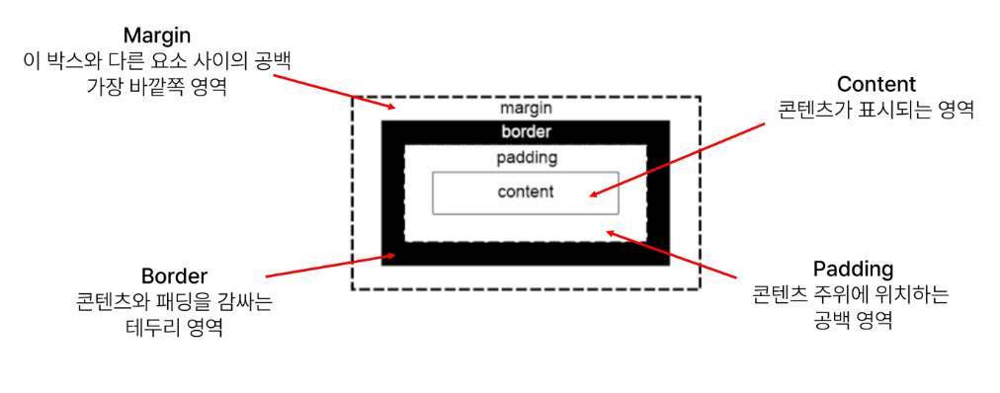

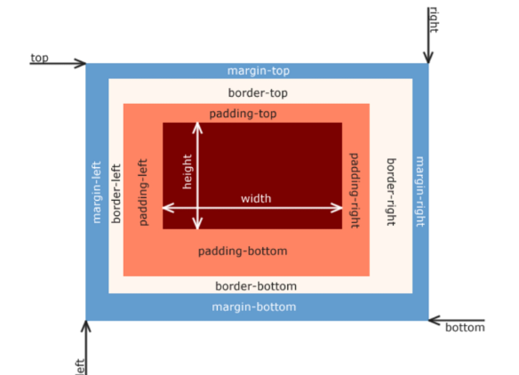

## 1-2 Box-sizing 속성

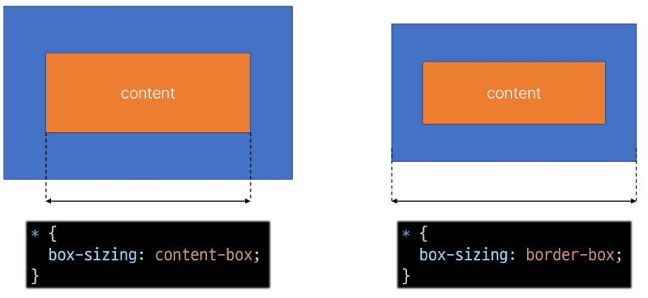

```html
<!DOCTYPE html>
<html lang="en">

<head>
  <meta charset="UTF-8">
  <meta http-equiv="X-UA-Compatible" content="IE=edge">
  <meta name="viewport" content="width=device-width, initial-scale=1.0">
  <title>Document</title>
  <style>
    /* CSS 초기화라고도 한다 */
    * {
      box-sizing: border-box;
    }

    .box {
      width: 100px;
      border: 2px solid black;
      padding: 10px;
      margin: 20px;
      background-color: yellow;
    }

    .content-box {
      box-sizing: content-box; /* 기본값 */
    }

    .border-box {
      box-sizing: border-box;
    }
  </style>
</head>
```

* Normal flow
  
  * CSS를 적용하지 않았을 경우 웹페이지 요소가 기본적으로 배치되는 방향
  
  ```html
  <head>
    <meta charset="UTF-8">
    <meta http-equiv="X-UA-Compatible" content="IE=edge">
    <meta name="viewport" content="width=device-width, initial-scale=1.0">
    <title>Document</title>
    <style>
      a,
      span,
      img {
        border: 3px solid red;
      }
  
      h1,
      p,
      div {
        border: 1px solid blue;
      }
    </style>
  </head>
  ```


* Block 타입 특징
  
  * h1, .., h6, p, div
  
  * 항상 새로운 행으로 나뉨
  
  * width와 height 속성을 사용하여 너비와 높이를 지정할 수 있음
  
  * 기본적으로 width 속성을 지정하지 않으면 박스는 inline 방향으로<mark> 사용 가능한 공간을 모두 차지</mark>함 (너비를 사용가능한 공간의 100%로 채우는 것)

* Inline 타입 특징
  
  * a, img, span
  
  * 새로운 행으로 나뉘지 않음
  
  * <mark>width와 height 속성을 사용할 수 없음</mark>
  
  * 수직 방향
    
    * padding, margins, borders가 적용되지만 다른 요소를 밀어낼 수는 <mark>없음</mark>
  
  * 수평 방향
    
    * padding, margins, borders가 적용되어 다른 요소를 밀어낼 수 있음
- 속성에 따른 수평 정렬

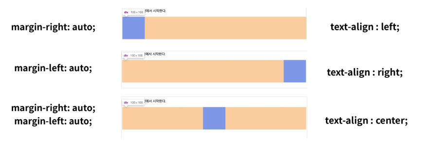

## 1-3 기타 display 속성

1. Inline - block
   
   - inline과 block 요소 사이의 중간 지점을 제공하는 display 값
   
   - block 요소의 특징을 가짐
     
     - width 및 height 속성 사용 가능
     
     - padding, margin 및 border로 인해 다른 요소가 밀려남
   
   - 요소가 줄 바꿈 되는것을 원하지 않으면서(<mark> inline</mark>), 너비와 높이를 적용하고 싶은 경우( <mark>block</mark>)


```html
<head>
  <meta charset="UTF-8">
  <meta http-equiv="X-UA-Compatible" content="IE=edge">
  <meta name="viewport" content="width=device-width, initial-scale=1.0">
  <title>Document</title>
  <style>
    span {
      margin: 20px;
      padding: 20px;
      width: 80px;
      height: 50px;
      background-color: lightblue;
      border: 2px solid blue;
      display: inline-block; /*추가*/
    }

    ul>li {
      background-color: crimson;
      padding: 10px 20px;
      display: inline-block; /*추가*/
    }

    .container {
      text-align: center;
    }

    .box {
      display: inline-block; /*추가*/
      width: 100px;
      height: 100px;
      background-color: #4CAF50;
      margin: 10px;
    }
  </style>
</head>
```


2. none
   
   - 요소를 화면에 표시하지 않고, 공간조차 부여되지 않음

```html
<head>
  <meta charset="UTF-8">
  <meta name="viewport" content="width=device-width, initial-scale=1.0">
  <title>Document</title>
  <style>
    .box {
      width: 100px;
      height: 100px;
      background-color: red;
      border: 2px solid black;
    }

    .none {
      display: none;
    }
  </style>
</head>

<body>
  <div class="box"></div>
  <div class="box none"></div>
  <div class="box"></div>
</body>
```

## 2. CSS Position

- 요소를 Normal Flow에서 제거하여 다른 위치로 배치하는 것
  
  - 다른 요소 위에 올리기, 화면의 특정 위치에 고정시키기 등


1. static

2. relative

3. absolute

4. fixed

5. sticky
- static
  
  - 기본값
  
  - 요소를 Normal Flow에 따라 배치


- relative
  
  - 이동하고도 과거 위치를 버리지 않는다.
  
  - 자기 자신을 기준으로 이동
  
  - <mark>요소가 차지하는 공간은 static일 때와 같음</mark>

```html
    .relative {
      position: relative; /* 2. 상대 위치 (본인의 static 위치를 기준으로 )*/
      background-color: lightblue;
      top: 100px; 
      left: 100px;
    }
```

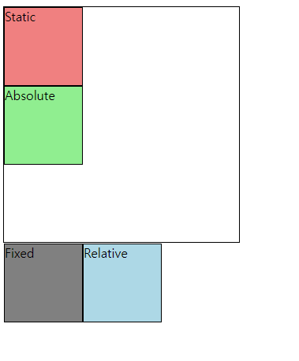

- absolute
  
  - 집 나간애. 자기 원래 공간을 버리고 떠난다.
  
  - 그래서 빈 공간이 생기면 그 공간이 다른걸로 채워질 수 있다.
  
  - 문서에서 요소가 차지하는 공간 <mark>없어짐</mark>
  
  ```html
    <style>
      .container {
        /* position: relative; */
        height: 300px;
        width: 300px;
        border: 1px solid black;
      }
  
      .absolute {
        /* 부모인 container를 찾음 -> container는 relative가 아님 -> body로 올라감 */
        position: absolute; /* 3. 절대 위치 (기준 : static이 아닌 부모를 찾아 올라감) */
        background-color: lightgreen;
        top: 100px; 
        left: 100px;
      }
  
      }
  ```

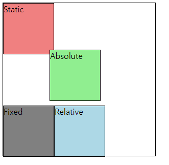

```html
<style>
    .container {
      position: relative;   /*주석 해제*/
      height: 300px;
      width: 300px;
      border: 1px solid black;
    }

    .absolute {
      /* 부모인 container를 찾음 -> container는 relative -> 기준이 container가 됨 */
      position: absolute; /* 3. 절대 위치 (기준 : static이 아닌 부모를 찾아 올라감) */
      background-color: lightgreen;
      top: 100px; 
      left: 100px;
    }

    }
```

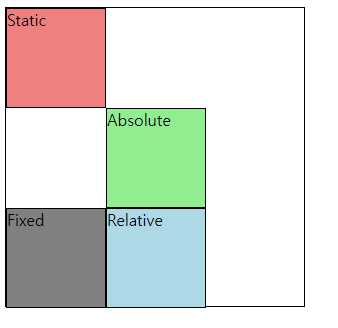

- fixed
  
  - 요소를 Normal Flow에서 <mark>제거</mark>
  
  - 현재 화면 영역(viewport)를 기준으로 이동
  
  - 문서에서 요소가 차지하는 공간이<mark> 없어짐</mark>

```html
    .fixed {
      position: fixed;
      background-color: gray;
      top: 0;
      right: 0;
    }
```

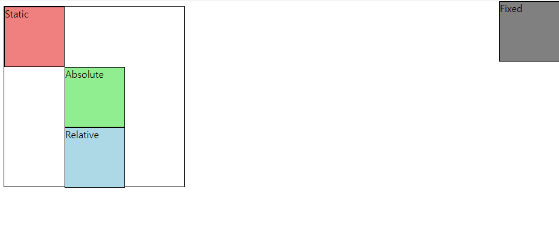

- sticky
  
  - 요소를 Norml Flow에서 배치
  
  - 요소가 일반적인 문서 흐름에 따라 배치되다가 스크롤이 특정 임계점에 도달하면 그 위치에서 고정됨(fixed)
  
  - 만약 다음 sticky 요소가 나오면 다음 sticy 요소가 이전 sticky 요소의 자리를 대체
    
    - 이전 sticky 요소가 고정되어 있던 위치가 다음 sticky 요소가 고정되어야할 위치가 겹치게 되기 때문이다

```html
<head>
  <meta charset="UTF-8">
  <title>Document</title>
  <style>
    body {
      height: 1500px;
    }

    .sticky {
      position: sticky;
      top: 0;
      background-color: lightblue;
      padding: 20px;
      border: 2px solid black;
    }
  </style>
</head>

<body>
  <h1>Sticky positioning</h1>
  <div>
    <div class="sticky">첫 번째 Sticky</div>
    <div>
      <p>내용1</p>
      <p>내용2</p>
      <p>내용3</p>
    </div>
    <div class="sticky">두 번째 Sticky</div>
    <div>
      <p>내용4</p>
      <p>내용5</p>
      <p>내용6</p>
    </div>
    <div class="sticky">세 번째 Sticky</div>
    <div>
      <p>내용7</p>
      <p>내용8</p>
      <p>내용9</p>
    </div>
  </div>
</body>
```

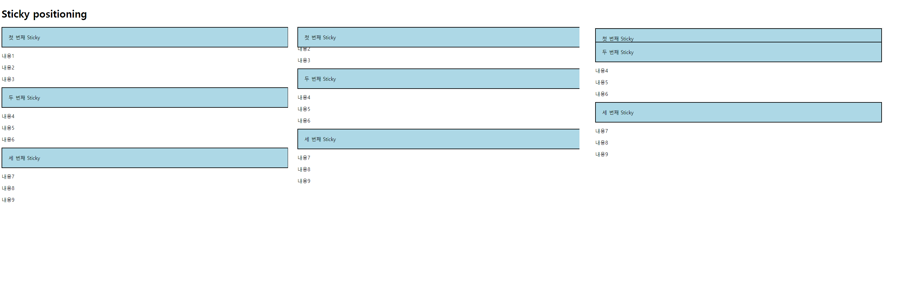

- Z - index
  
  - 요소가 겹쳤을 때 어떤 요소 순으로 위에 나타낼지 결정
  
  - 정수 값을 사용해 Z축 순서를 지정
  
  - 더 큰 값을 가진 요소가 작은 값의 요소를 덮음

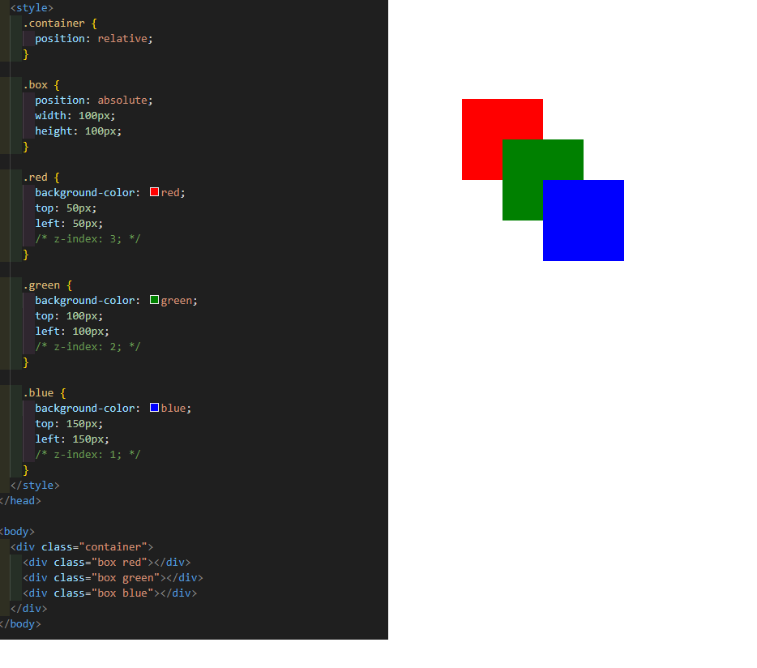

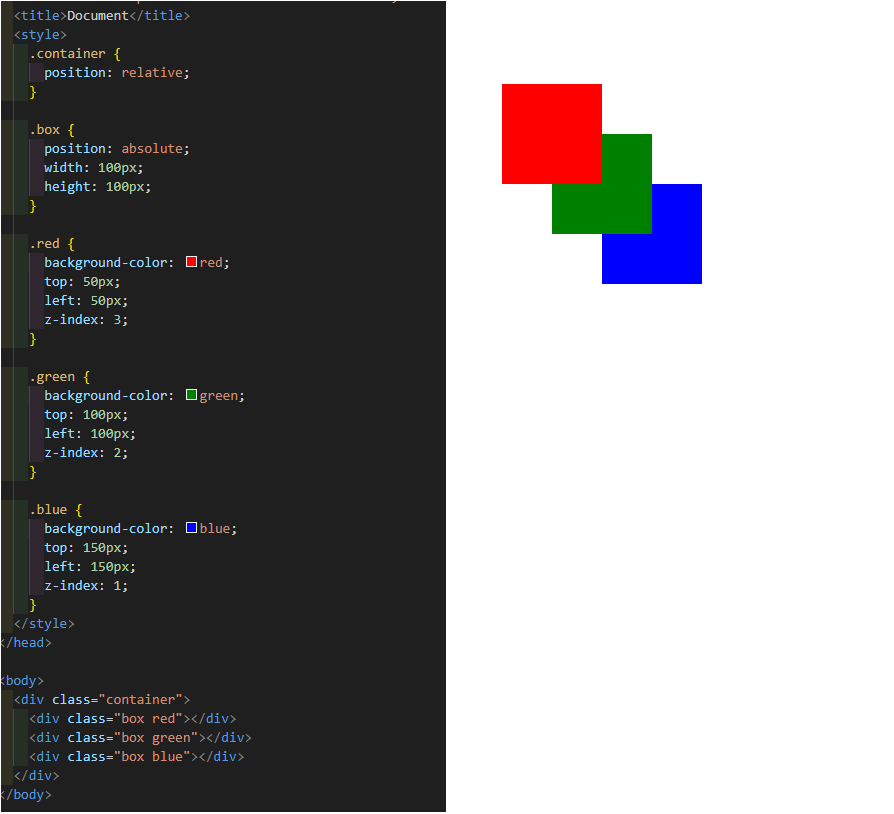

## 3. CSS Layout Flexbox

- 요소를 행과 열 형태로 배치하는<mark> 1차원 </mark>레이아웃 방식
  
  - 공간 배열 & 정렬
  
  

## 3-1 구성요소

- <mark>**flexbox는 부모가 조정한다!!!!**</mark>
  
  - 한 단계 아래에 있는 애들에 대해서 부모가 주도권 가진다

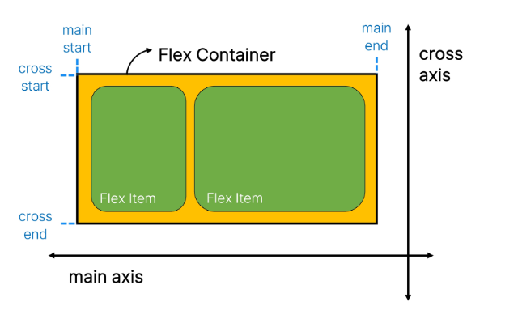

- **main axis(주 축)**
  
  - flex item들이 배치되는 기본 축
  
  - main start에서 시작하여 main end 방향으로 배치

- cross axis(교차 축)
  
  - main axis에 수직인 축
  
  - cross start에서 시작하여 cross end 방향으로 배치

- Flex Container
  
  - display : flex; 혹운 display : inline-flex; 가 설정된 부모 요소
  
  - 이 컨테이너의 1차 자식 요소들이 flex item이 됨
  
  - flexbox 속성값들을 사용하여 자식 요소 flex item들을 배치

- Flex Item
  
  - Flex Container 내부에 레이앙수 되는 항목

## 3-2 레이아웃 구성

1. Flex Container 지정
   
   - flex item은 기본적으로 <mark>행</mark>으로 나열
   
   - flex item은 주축의 시작 선에서 시작
   
   - flex item은 교차축의 크기를 채우기 위해 늘어남


2. flex-direction 지정
   
   - flex item이 나열되는 방향을 지정
   
   - column으로 지정할 경우 주 축이 변경됨
   
   - -reverse로 지정하면 시작 선과 끝 선이 서로 바뀜

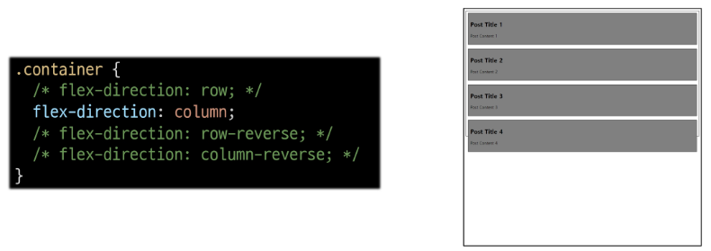

3. flex-wrap
   
   - flex item 목록이 flex container의 하나의 행에 들어가지 않을 경우 다른 행에 배치할지 여부 설정

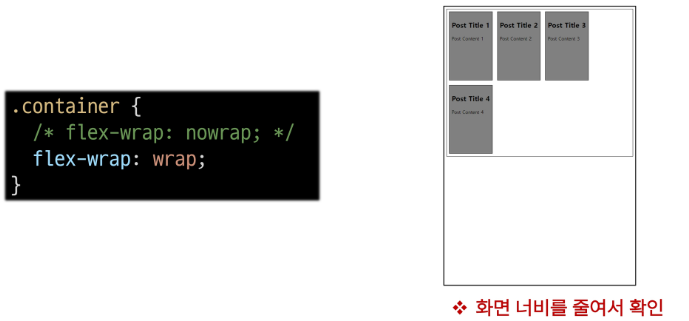

4. justify-content
   
   - 주 축에 따라 flex item과 주위에 공간을 분배
   
   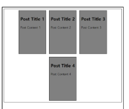

5. align-content
   
   content : <mark>여러행</mark>
   
   - 교차 축을 따라 flex item과 주위에 공간을 분배
   
   - flex-wrap이 wrap 또는 wrap-reverse로 설정된 여러 행에만 적용됨
   
   - 한 줄 짜리 행에는 (flex-wrap이 nowrap으로 설정된 경우) 효과 없음
   
   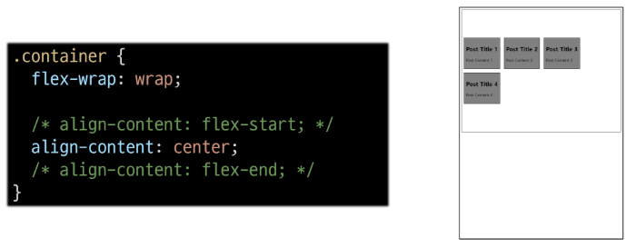

6. align-items
   
   - 교차 축을 따라 flex item 행을 정렬
   
   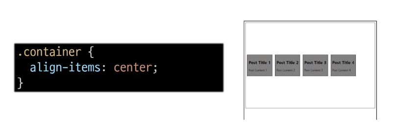

7. align-self
   
   - 교차 축을 따라 개별  flex item을 정렬

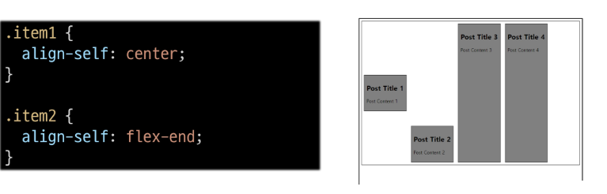

8. flex-grow
   
   - 남는 행 여백을 비율에 따라 각 flex item에 분배
     
     - 아이템이 컨테이너 내에서 확장하는 비율을 지정
   
   - flex-grow의 반대는 flex-shrink

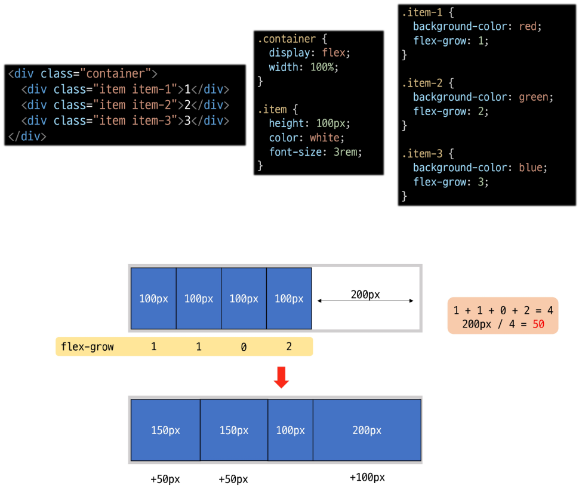

9. flex-basis
   
   - flex item의 초기 크기 값을 지정
   
   - flex-basis와 width값을 동시에 적용한 경우 flex-basis가 우선

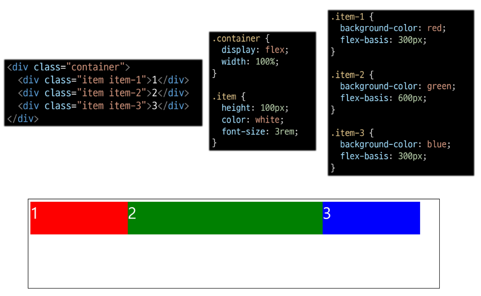

## 3-3 Flexbox 속성

- Flex Container 관련 속성
  
  - display, flex-direction, flex-wrap, justify-content, align-items, align-content

- Flex Item 관련 속성
  
  - align-self, flex-grow, flex-basis, order

- 목적에 따른 분류
  
  1. 배치 : flex-direction, flex-wrap
  
  2. 공간 분배 : justify-content, align-content
  
  3. 정렬 : align-items, align-self

- 속성명
  
  - justify : 주축
  
  - align : 교차축

## 3-4 flex-wrap 응용

- 반응형 레이아웃
  
  - 다양한 디바이스와 화면 크기에 자동으로 적응하여 콘텐츠를 최적으로 표시하는 웹 레이아웃 방식

## 3-5 정리

- flex-direction

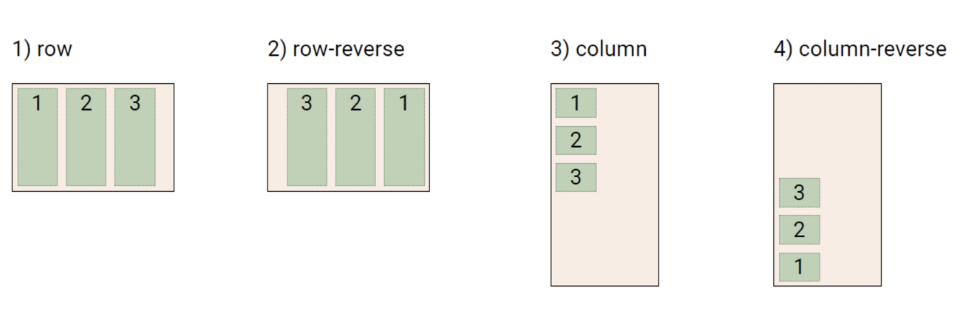

- flex-wrap

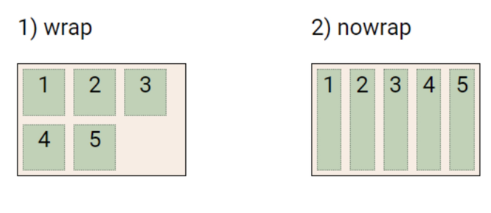

- justify-content

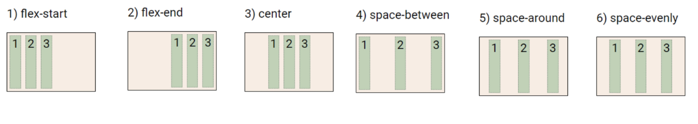

- align-content

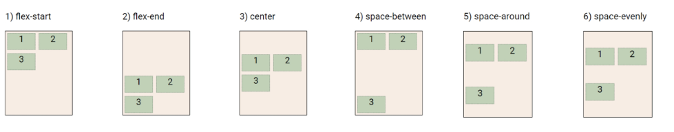

- align-items

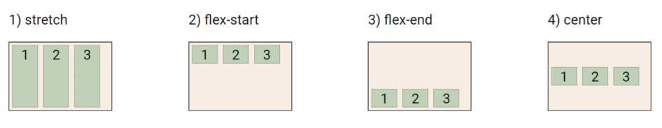

- align-self

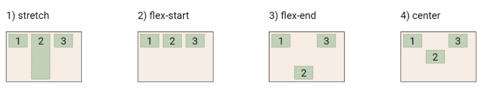

- justify content에서 헷갈리는 부분


