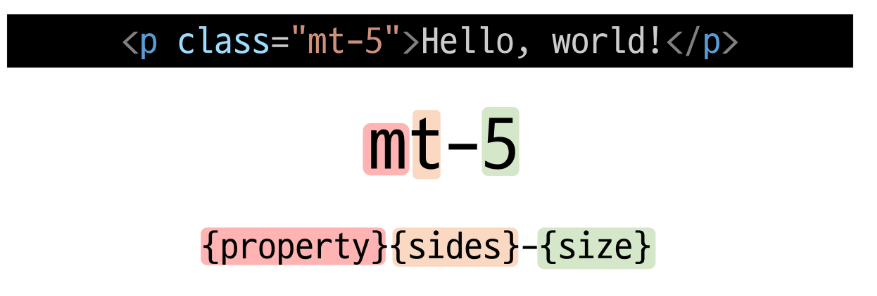
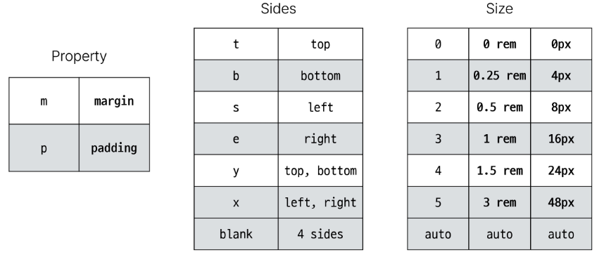
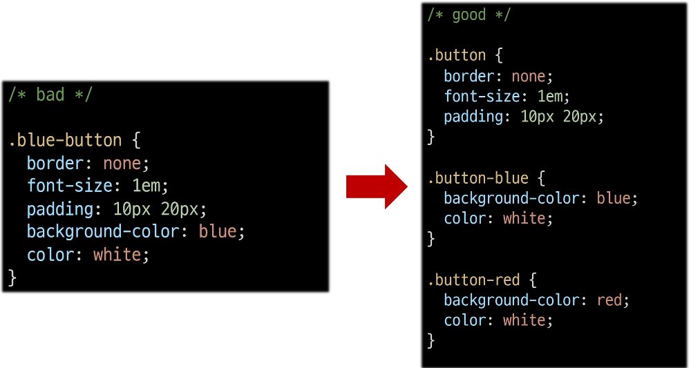
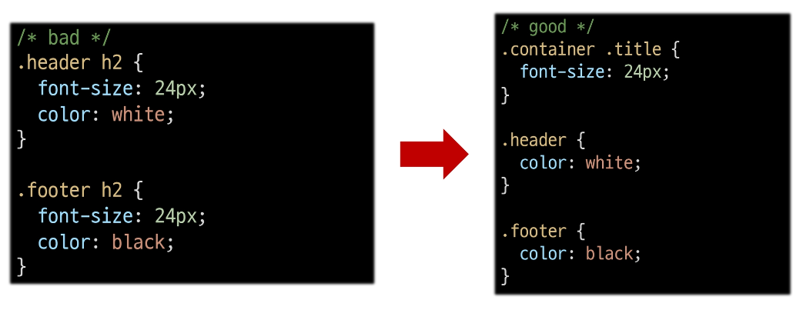

# Bootstrap

1. Bootstrap
   
   - 1-1 개요
   
   - 1-2 Typography
   
   - 1-3 Colors
   
   - 1-4 Component

2. Semantic Web
   
   - 2-1 개요
   
   - 2-2 Semantic in HTML
   
   - 2-3 Semantic in CSS

3. CDN

## 1. Bootstrap

### 1-1 개요

- CSS 프론트엔드 프레임워크(Toolkit)
  
  - 미리 만들어진 다양한 디자인 요소들을 제공하여 웹 사이트를 빠르고 쉼게 개발할 수 있도록 함
  
  [Get started with Bootstrap · Bootstrap v5.3](https://getbootstrap.com/docs/5.3/getting-started/introduction/)
  
      <link href="https://cdn.jsdelivr.net/npm/bootstrap@5.3.1/dist/css/bootstrap.min.css" rel="stylesheet" integrity="sha384-4bw+/aepP/YC94hEpVNVgiZdgIC5+VKNBQNGCHeKRQN+PtmoHDEXuppvnDJzQIu9" crossorigin="anonymous">
  
      <script src="https://cdn.jsdelivr.net/npm/bootstrap@5.3.1/dist/js/bootstrap.bundle.min.js" integrity="sha384-HwwvtgBNo3bZJJLYd8oVXjrBZt8cqVSpeBNS5n7C8IVInixGAoxmnlMuBnhbgrkm" crossorigin="anonymous"></script>
  
  ```html
  <!doctype html>
  <html lang="en">
    <head>
      <meta charset="utf-8">
      <meta name="viewport" content="width=device-width, initial-scale=1">
      <title>Bootstrap demo</title>
      <link href="https://cdn.jsdelivr.net/npm/bootstrap@5.3.1/dist/css/bootstrap.min.css" rel="stylesheet" integrity="sha384-4bw+/aepP/YC94hEpVNVgiZdgIC5+VKNBQNGCHeKRQN+PtmoHDEXuppvnDJzQIu9" crossorigin="anonymous">
    </head>
    <body>
      <script src="https://cdn.jsdelivr.net/npm/bootstrap@5.3.1/dist/js/bootstrap.bundle.min.js" integrity="sha384-HwwvtgBNo3bZJJLYd8oVXjrBZt8cqVSpeBNS5n7C8IVInixGAoxmnlMuBnhbgrkm" crossorigin="anonymous"></script>
    </body>
  </html>
  ```





- Bootstrap에는 특정한 규칙이 있는 클래스 이름으로 이미 스타일 및 레이아웃이 작성되어 있음

### 1-2 Typography

- 제목, 본문 텍스트, 목록 등

- Display headings
  
  - 기존 Heading보다 더 눈에 띄는 제목이 필요할 경우 ( 더 크고 약간 다른 스타일)

```html
 <!-- display -->
    <h1 class="display-1">Display 1</h1>
    <h1 class="display-2">Display 2</h1>
    <h1 class="display-3">Display 3</h1>
    <h1 class="display-4">Display 4</h1>
    <h1 class="display-5">Display 5</h1>
    <h1 class="display-6">Display 6</h1>
```

- Inline text elements
  
  - HTML inline 요소에 대한 스타일

```html
<!-- inline text elements -->
    <p>You can use the mark tag to <mark>highlight</mark> text.</p>
    <p><del>This line of text is meant to be treated as deleted text.</del></p>
    <p><s>This line of text is meant to be treated as no longer accurate.</s></p>
    <p><ins>This line of text is meant to be treated as an addition to the document.</ins></p>
    <p><u>This line of text will render as underlined.</u></p>
    <p><small>This line of text is meant to be treated as fine print.</small></p>
    <p><strong>This line rendered as bold text.</strong></p>
    <p><em>This line rendered as italicized text.</em></p>
```

- list

```html
    <!-- lists -->
    <ul class="">
      <li>This is a list.</li>
      <li>It appears completely unstyled.</li>
      <li>Structurally, it's still a list.</li>
      <li>However, this style only applies to immediate child elements.</li>
      <li>Nested lists:
        <ul>
          <li>are unaffected by this style</li>
          <li>will still show a bullet</li>
          <li>and have appropriate left margin</li>
        </ul>
      </li>
      <li>This may still come in handy in some situations.</li>
    </ul>
```

### 1-3 Colors

- Bootstrap Color system
  
  - Bootstrap이 지정하고 제공하는 색상 시스템

```html
    <!-- text color -->
    <p class="text-primary">.text-primary</p>
    <p class="text-primary-emphasis">.text-primary-emphasis</p>
    <p class="text-secondary">.text-secondary</p>
    <p class="text-secondary-emphasis">.text-secondary-emphasis</p>
    <p class="text-success">.text-success</p>
    <p class="text-success-emphasis">.text-success-emphasis</p>
    <p class="text-danger">.text-danger</p>
    <p class="text-danger-emphasis">.text-dang
```

- Background colors

```html
    <div class="p-3 mb-2 bg-primary text-white">.bg-primary</div>
    <div class="p-3 mb-2 bg-primary-subtle text-emphasis-primary">.bg-primary-subtle</div>
    <div class="p-3 mb-2 bg-secondary text-white">.bg-secondary</div>
    <div class="p-3 mb-2 bg-secondary-subtle text-emphasis-secondary">.bg-secondary-subtle</div>
    <div class="p-3 mb-2 bg-success text-white">.bg-success</div>
    <div class="p-3 mb-2 bg-success-subtle text-emphasis-success">.bg-success-subtle</div>
    <div class="p-3 mb-2 bg-danger text-white">.bg-danger</div>
    <div class="p-3 mb-2 bg-danger-subtle text-emphasis-danger">.bg-danger-subtle</div>
    <div class="p-3 mb-2 bg-warning text-dark">.bg-warning</div>
```

### 1-4 Component

- Bootstrap에서 제공하는 UI 관련 요소
  
  - 버튼, 네비게이션 바, 카드, 폼, 드롭다운 등

- 대표 Component
  
  1. Alerts
  
  2. Badges
  
  3. Buttons
  
  4. Cards
  
  5. Navbar

- Component 이점
  
  - 일관된 디자인을 제공하여 웹 사이트의 구성 요소를 구축하는데 유용하게 활용

## 2. Semantic Web

- 웹 데이터를 의미론적으로 구조화된 형태로 표현하는 방식

- 예시
  
  - 문서의 최상위 제목
    
    - 1번 : 단순히 제목 처럼 보이게 출력
    
    - 2번 : 페이지 최상위 제목 의미를 제공하는 semantic 요소 h1
  
  ```html
  <span style="font-size: 30px;">Heading</span>
  <h1>Heading</h1>
  ```

### 2-2 Semantic in HTML

- 기본적인 모양과 기능 이외에 의미를 가지는 HTML 요소
  
  - 검색엔진 및 개발자가 웹 페이지 콘텐츠를 이해하기 쉽도록

- == div
  
  - Header
  
  - nav
  
  - main
  
  - article
  
  - section
  
  - aside
  
  - footer


### 2-3 Semantic in CSS

- OOCSS (Object Oriented CSS)
  
  - 객체 지향적 접근법을 적용하여  CSS를 구성하는 방법론
  
  - CSS를 효율적이고 유지 보수가 용이하게 작성하기 위한 일련의 가이드라인

- OOCSS 기본원칙
  
  1. 구조와 스킨을 분리
  
  2. 컨테이너와 콘텐츠를 분리
  - 구조와 스킨 분리
    
    - 모든 버튼의 <mark>공통</mark> 구조를 정의, <mark>각각</mark>의 스킨을 정의
  
  
  
  - 컨테이터와 콘텐츠 분리
    
    - 객체에 직접 적용하는 대신 객체를 둘러싸는 컨테이너에 스타일을 적용
    
    - 스타일을 정의할 때 위치에 의존적인 스타일을 사용하지 않도록 함
    
    - 콘텐츠를 다른 컨테이너로 이동시키거나 재배치할 때 스타일이 깨지는 것을 방지
    
    - .header와 .footer 클래스가 폰트 크기와 색 둘 다 영향을 준다.
      
      - container .title : 폰트 크기 담당
      
      - .header .footer : 폰트 색 담당



## 3. CDN

- Content Delivery Network

- <mark>분산 컨텐츠 네트워크</mark>
  
  - 지리적 제약 없이 빠르고 안전하게 콘텐츠를 전송할 수 있는 전송 기술
  
  - 서버와 사용자 사이의 물리적인 거리를 줄여 콘텐츠 로딩에 소요되는 시간을 최소화(웹 페이지 로드 속도를 높임)
  
  - 지리적으로 사용자와 가까운 CDN 서버에 콘텐츠를 저장해서 사용자에게 전달

- 쓰는 이유
  
  1. 직접 다운받지 않고도 인터넷만 연결되어 있으면 사용 가능
  
  2. 물리적인 속도 문제를 해결해준다(ex. 유튜브는 각 국에 CDN을 가지고 있다)

- Bootstrap CDN
  
  1. Bootstrap 홈페이지 - Download - "Compiled CSS and JS"
  
  2. CDN을 통해 가져오는 bootstrap css와 js파일을 확인
  
  3. bootstrap.css파일을 참고하여, 현재까지 작성한 클래스에 적용한 스타일을 직접 확인

- Bootstrap 사용하는 이유
  
  1. 가장 인기 있고 잘 정립된 CSS 프레임워크
  
  2. 사전에 디자인된 다양한 컴포넌트 및 기능
     
     - 빠른 개발과 유지보수
  
  3. 손쉬운 반응형 웹 디자인 구현
  
  4. 커스터마이징 용이
  
  5. 크로스 브라우징(Cross browsing) 지원
     
     - 모든 주요 브라우저에서 작동하도록 설계되어 있음

- 의미론적인 마크업의 이점
  
  - 검색엔진 최적화(SEO)
    
    - 검색 엔진이 해당 웹 사이트를 분석하기 쉽게 만들어 검색 순위에 영향을 줌
  
  - 웹 접근성(Web Accessibility)
    
    - 시각 장애 사용자가 스크린 리더기로 웹 페이지를 사용할 때 추가적으로 도움
