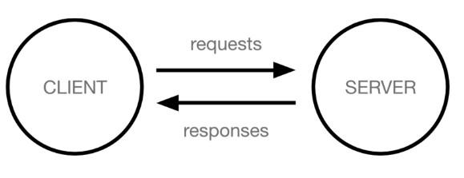
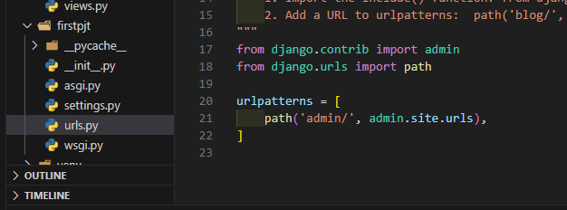
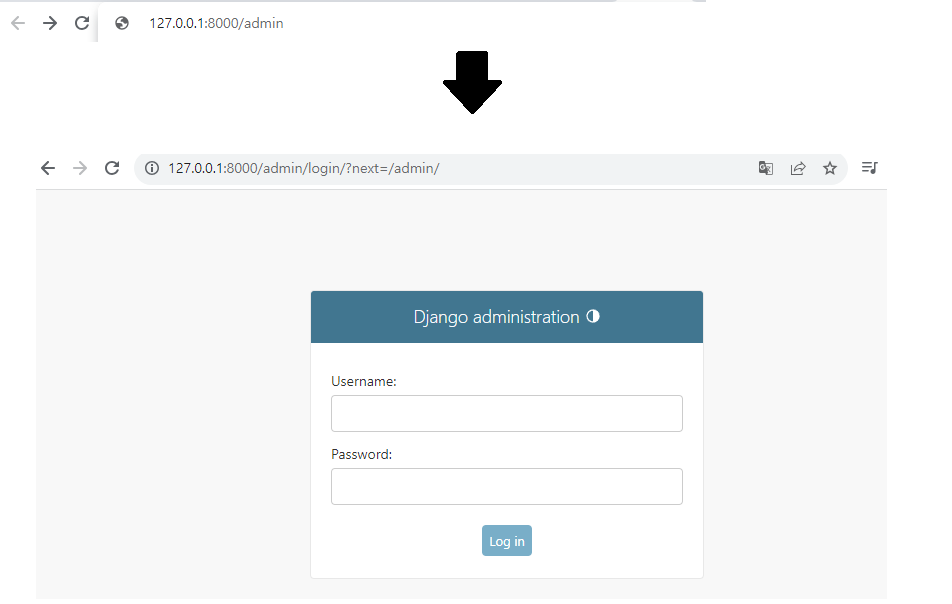
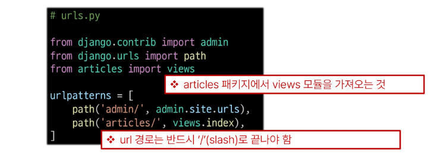
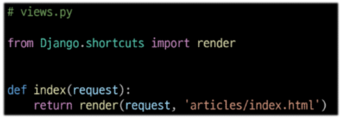
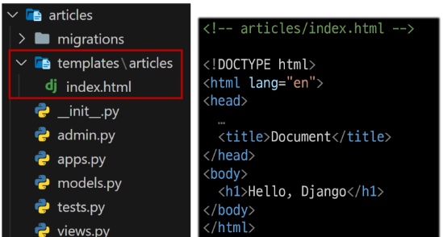
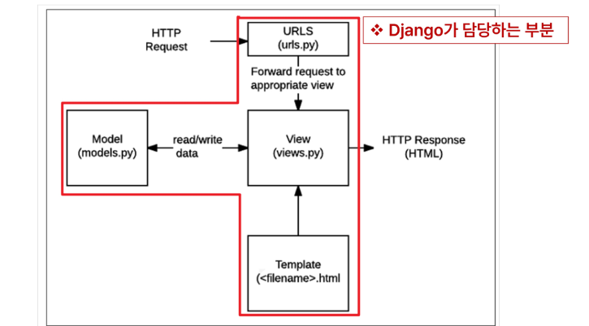

# Intro & Design Pattern

[1. Django and Framework](#1-django-and-framework)

- [1-1 Framework](#1-1-framework)

- [1-2 Django framework](#1-2-django-framework)

- [1-3 클라이언트와 서버](#1-3-클라이언트와-서버)

- [1-4 Django 프로젝트 및 가상환경](#1-4-django-프로젝트-및-가상환경)

- [1-5 Django 프로젝트 생성 전 루틴](#django-프로젝트-생성-전-루틴)

[2. Django Design Pattern](#2-django-design-pattern)

- [2-1 Django 프로젝트와 앱](#2-1-django-프로젝트와-앱)

- [2-2 Django 디자인 패턴](#2-2-django-%EB%94%94%EC%9E%90%EC%9D%B8-%ED%8C%A8%ED%84%B4)

- [2-3 요청과 응답](#2-3-%EC%9A%94%EC%B2%AD%EA%B3%BC-%EC%9D%91%EB%8B%B5)

------

[참고]

[3. MTV 디자인 패턴 정리](#3-mtv-디자인-패턴-정리)

[4. render 함수](#4-render-함수)

## 1. Django and Framework

## 1-1 Framework

- 웹 어플리케이션을 빠르게 개발할 수 있도록 도와주는 도구
  
  - 개발에 필요한 기본 구조, 규칙, 라이브러리 등을 제공

- Framework 사용 이유
  
  - 기본적인 구조, 도구, 규칙 등을 제공하기 때문에 개발자는 필수적인 해야하는 핵심 갭라에만 집중할 수 있음
  
  - 여러 라이브러리를 제공해 개발 속도를 빠르게 할 수 있음(생산성)
  
  - 유지보수와 확장에 용이해 소프트웨어의 품질을 높임

## 1-2 Django framework

- python 기반의 대표적인 웹 프레임워크

## 1-3 클라이언트와 서버



- Client 
  
  - 서비스를 요청하는 주체(웹 사용자의 인터넷이 연결된 장치, 웹 브라우저)

- Server
  
  - 클라이언트의 요청에 응답하는 주체 (웹 페이지, 앱을 저장하는 컴퓨터)

- 우리가 웹 페이지를 보게 되는 과정
  
  > 1. 웹 브라우저(클라이언트)에서 'google.com'을 입력
  > 
  > 2. 브라우저는 인터넷에 연결된 전세계 어딘가에 있는 구글 컴퓨터(서버)에게 'google 홈페이지.html' 파일을 달라고 요청
  > 
  > 3. 요청을 받은 구글 컴퓨터는 데이터베이스에서 'google 홈페이지.html'파일을 찾아 응답
  > 
  > 4. 전달받은 google 홈페이지.html 파일을 웹 브라우저가 사람이 볼 수 있도록 해석해주면서 사용자는 구글의 메인 페이지를 보게 됨

## 1-4 Django 프로젝트 및 가상환경

- 가상 환경
  
  - python 애플리케이션과 그에 따른 패키지들을 격리하여 관리할 수 있는 <mark>독립적인</mark> 실행 환경
  
  - ex) 가상환경이 필요한 시나리오 
    
    > 1. 한 개발자가 2개의 프로젝트(A와 B)를 진행해야 한다.
    > 
    > 2. 프로젝트 A는 requests 패키지 버전 1을 사용해야 한다.
    > 
    > 3. 프로젝트 B는 requests 패키지 버전 2를 사용해야 한다.
    > 
    > 4. 하지만 파이썬 환경에서 패키지는 1개의 버전만 존재할 수 있다.
    > 
    > 5. A와 B 프로젝트 다른 패키지 버전 사용을 위한 <mark>독립적인</mark> 개발 환경이 필요하다
1. 가상 환경 venv 생성

```bash
# python -m venv 가상환경이름

python -m venv venv
```

2. 가상 환경 활성화

**가상 환경은 이동하는 것이 아니라 특정 위치에 있는 것을  <mark>activate / on</mark> 하는 개념이다**

```bash
# window 환경에서
source venv/Scripts/activate
```

- **off**해서 다시 global  환경
  
  ```bash
  deactivate
  ```

- 환경에 설치된 패키지 목록 확인
  
  ```bash
  pip list
  ```
3. 의존성 패키지 목록 생성

```bash
pip freeze > requirements.txt
```

의존성 패키지 관리의 중요성

- 개발 환경에서는 각각의 프로젝트가 사용하는 패키지와 그 버전을 정확히 관리하는 것이 중요

- 가상 환경 & 의존성 패키지 관리

```bash
pip install -r requirements.txt
```

- 암묵적인 약속
  
  - 가상환경 이름 : venv
  
  - 의존성 패키지 : requirements.txt

- [[gitignore.io](https://www.toptal.com/developers/gitignore/)]

- 의존성 패키지
  
  - 한 소프트웨어 패키지가 다른 패키지의 기능이나 코드를 사용하기 때문에 그 패키지가 존재해야만 제대로 작동하는 관계
  
  - 사용하려는 패키지가 설치되지 않았거나, 호환되는 버전이 아니면 오류가 발생하거나 예상치 못한 동작을 보일 수 있음


### Django 프로젝트 생성 전 루틴


- Django 프로젝트 생성
  
  - 현재 디렉토리( .)에 firstpjt라는 프로젝트를 생성

```bash
$ django-admin startproject fisrtpjt .
```

- Django 서버 실행 (manage.py와 동일한 경로에서 명령어 진행)

```bash
$ python manage.py runserver
```

## Django 프로젝트 생성 전 루틴!

> 1. 가상환경 생성
> 
> 2. 가상환경 활성화
> 
> 3. Django 설치
> 
> 4. 의존성 파일 생성 (패키지 설치마다 진행)
> 
> 5. <mark>.gitignore 파일 생성 (첫 add 전)</mark>
> 
> 6. <mark>git 저장소 생성</mark>
> 
> 7. Django 프로젝트 생성

- 참고

- LTS (Long-Term Support)
  
  - 프레임워크나 라이브러리 등의 소프트웨어에서 장기간 지원되는 안정적인 버전을 의미할 때 사용
  
  - 기업이나 대규모 프로젝트에서는 소프트웨어 업그레이드에 많은 비용과 시간이 필요하기 때문에 안정적이고 장기간 지원되는 버전이 필요

## 2. Django Design Pattern

## 2-1  Django 프로젝트와 앱

- Django project
  
  - 애플리케이션의 집합
  
  - DB설정, URL 연결, 전체 앱 설정 등을 처리

- Django application
  
  - 독립적으로 작동하는 기능 단위 모듈
  
  - 각자 특정한 기능을 담당하며 다른 앱들과 함꼐 하나의 프로젝트를 구성

- 앱 사용 과정
  
  1. 앱 생성 
     
     - 앱의 이름은 '<mark>복수형</mark>'으로 지정하는 것을 권장
  
  ```bash
  $ python manage.py startapp articles
  ```
  
  2. 앱 등록
     
     - 반드시 앱을 생성한 후에 등록해야 함
     
     - 등록 후 생성은 불가능
  
  

## 2-2 Django 디자인 패턴

- 디자인 패턴
  
  - 소프트웨어 설계에서 발생하는 문제를 해결하기 위한 일반적인 해결책
  
  - 공통적인 문제를 해결하는데 쓰이는 형식화 된 관행

- MVC 디자인 패턴
  
  - Model(DB), View(화면), Controller(내부 조정)
  
  - 애플리케이션을 구조화하는 대표적인 패턴
  
  - 데이터, 사용자 인터페이스, 비지니스 로직을 분리
  
  - **시각적 요소와 뒤에서 실행되는 로직을 서로 영향 없이, 독립적이고 쉽게 유지 보수할 수 있는 애플리케이션을 만들기 위해**

- MTV 디자인 패턴
  
  - Model, Template, View
  
  - Django에서 애플리케이션을 구조화하는 패턴
  
  - 기존 MVC 패턴과 동일하나 명칭을 다르게 정의한 것
  
  > - pythonic
  > 
  > ex) 파이썬 [] : 리스트,
  > 
  > ex) 다른 언어 : 배열(array)


  [출처 : django FAQ](https://docs.djangoproject.com/ko/4.2/faq/general/#django-appears-to-be-a-mvc-framework-but-you-call-the-controller-the-view-and-the-view-the-template-how-come-you-don-t-use-the-standard-names)

- 프로젝트 구조


- Application 구조


### 2-3 요청과 응답


- urls.py







"http://127.0.0.1:800/<mark>**articles**</mark>/ 로 요청이 왔을 때 views 모듈의 index 뷰 함수를 호출

- view



특정 경로에 있는 template과 request 객체를 결합해 응답 객체를 반환하는 index view 함수 정의

<mark>모든 view 함수는 첫번째 인자로 request(요청) 객체를 필수적으로 받음</mark>

- template



1. articles 앱 폴더 안에 templates 폴더 생성
   
   - <mark>폴더명은 반드시 templates여야 하며 개발자가 직접 생성해야 함</mark>

   2. templates 폴더 안에 articles 폴더 생성

3. articles 폴더 안에 템플릿 파일 생성
   
   - Django에서 template을 인식하는 경로 규칙
   
   

## 데이터 흐름에 따른 코드 작성

urls -> view -> template


## 3. MTV 디자인 패턴 정리

- Model
  
  - 데이터와 관련된 로직을 관리
  
  - 응용프로그램의 데이터 구조를 정의하고 데이터베이스의 기록을 관리

- Template
  
  - 레이아웃과 화면을 처리
  
  - 화면상의 사용자 인터페이스 구조와 레이아웃을 정의

- View
  
  - Model & Template과 관련한 로직을 처리해서 응답을 반환
  
  - 클라이언트의 요청에 대해 처리를 분기하는 역할
  
  - 예시
    
    - 데이터가 필요하다면 model에 접근해서 데이터를 가져오고
    
    - 가져온 데이터를 template로 보내 화면을 구성하고
    
    - 구성된 화면을 응답으로 만들어 클라이언트에게 반환



## 4. render 함수

- 주어진 템플릿을 주어진 컨텍스트 데이터와 결합하고 렌더링 된 텍스트와 함께 HttpResponse(응답) 객체를 반환하는 함수
1. request
   
   - 응답을 생성하는데 사용되는 요청 객체

2. template_name
   
   - 템플릿 이름의 경로

3. context
   
   - 템플릿에서 사용할 데이터(딕셔너리 타입으로 작성)


