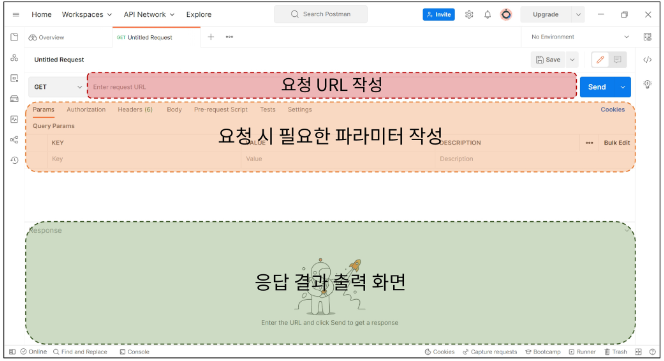

# Django REST framework 1

1. REST API
   
   - 1-1 REST API
   
   - 1-2 자원의 식별
     
     - 1-2-1 URL 구조
   
   - 1-3 자원의 행위
   
   - 1-4 자원의 표현

2. DRF
   
   - 2-1 Serialization

3. DRF with Single Model
   
   - 3-1 GET
     
     - GET - List
     
     - GET - Detail
   
   - 3-2 POST
   
   - 3-3 Delete
   
   - 3-4 PUT
   
   - 3-5 최종

4. 참고
   
   - raise_exception

---

# 1. REST API

- API (Application Programming Interface)
  
  - 애플리케이션과 프로그래밍으로 소통하는 방법
  
  - 클라이언트-서버처럼 서로 다른 프로그램에서 요청과 응답을 받을 수 있도록 만든 체계

- Web API
  
  - 웹 서버 또는 웹 브라우저를 위한 API
  
  - 현대 웹 개발은 하나부터 열까지 직접 개발하기보다 여러 Open API 들을 활용하는 추세
  
  - 대표적인 Third Party Open API 목록
    
    - ex) Youtube API, Google Map API, Naver Papago API, Kakao Map API

- REST (Representational **State** Transfer)
  
  - API Server를 개발하기 위한 일종의 소프트웨어 설계 방법론
  
  - 약속! ( 규칙 X)

- RESTful API
  
  - REST 원리를 따르는 시스템을 RESTful 하다고 부름
  
  - **자원을 정의**하고 **자원에 대한 주소를 지정**하는 전반적인 방법을 서술
    
    - 각각 API 구조를 작성하는 모습이 너무 다르니 약속을 만들어서 다같이 통일해서 쓰자

## 1-1 REST API

- : REST라는 설계 디자인 약속을 지켜 구현한 API

- REST에서 자원을 정의하고 주소를 지정하는 방법
  
  1. 자원의 식별
     
     - URI
  
  2. 자원의 행위
     
     - HTTP Methods
  
  3. 자원의 표현
     
     - JSON 데이터
     
     - 궁극적으로 표현되는 데이터 결과물

### 1-2 자원의 식별

- URI (Uniform Resource Identifier) 통합 자원 식별자
  
  - URL 보다 쫌 더 큰 개념
  
  - 인터넷에서 리소스(자원)을 식별하는 문자열
    
    - 가장 일반적인 URI 는 웹 주소로 알려진 URL

- URL (Uniform Resource Locator) 통합 자원 위치
  
  - 웹에서 주어진 리소스 주소
    
    - 네트워크 상에 리소스가 어디 있는지를 알려주기 위한 약속
  
  

#### 1-2-1 URL 구조

1. Schema (or Protocol)

2. Domain Name

3. Port
   
   - 웹 서버의 리소스에 접근하는데 사용되는 기술적인 문(Gate)
   
   - HTTP 프로토콜의 표준 포트
     
     - HTTP - 80
     
     - HTTPS - 443
   
   - 표준 포트만 생략 가능

4. Path
   
   - 웹 서버의 리소스 경로
   
   - 초기에는 실제 파일이 위한 물리적 위치를 나타냈지만, 오늘날은 실제 위치가 아닌 추상화된 형태의 구조를 표현
   
   - 예를 들어 /articles/create/가 실제 articles 폴더 안에  create 폴더 안을 아타내는 것을 아님

5. Parameters
   
   - 웹 서버에 제공하는 추가적인 데이터
   
   - '&' 기호로 구분되는 key-value 쌍 목록
   
   - 서버는 리소스를 응답하기 전에 이러한 파라미터를 사용하여 추가 작업을 수행할 수 있음
     
     - 우리 수업에서 GET 으로 검색할 때 배움!

6. Anchor
   
   - 일종의 '북마크'를 나타내며 브라우저에 해당 지점에 있는 콘텐츠를 표시
   
   - fragment identifier(부분 식별자)라고 부르는 '#' 이후 부분은 서버에 전송되지 않음
   
   - https://docs.djangoproject.com/en/4.2/intro/install/#quick-install-guide 요청에서 #quick-install-guide 는 서버에 전달되지 않고 브라우저에게 해당 지점으로 이동할 수 있도록 함

### 1-3 자원의 행위

- HTTP Request Methods
  
  - 리소스에 대한 행위(수행하고자 하는 동작)를 정의
  
  - HTTP verbs 라고도 함

- 대표 HTTP Request Methods
  
  1. GET
     
     - 서버에 리소스의 표현을 요청
     
     - GET을 사용하는 요청은 데이터만 검색해야 함
     
     - read
  
  2. POST
     
     - 데이터를 지정된 리소스에 제출
     
     - 서버의 상태를 변경 
     
     - create
  
  3. PUT
     
     - 요청한 주소의 리소스를 수정
     
     - update
  
  4. DELETE
     
     - 지정된 리소스를 삭제
     
     - delete

- HTTP response status codes
  
  - 특정 HTTP 요청이 성공적으로 완료 되었는지 여부를 나타냄
  
  - 5개의 응답 그룹
  1. Informational responses (100 - 199)
  
  2. Successful responses (200 - 299)
  
  3. Redirection messages (300 -399)
  
  4. Client error responses (400 -499)
  
  5. Server error responses (500 -599)

### 1-4 자원의 표현

- 그동안 서버가 응답(자원을 표현)했던 것
  
  - 지금까지 Django 서버는 사용자에게 페이지(html)만 응답하고 있었음
  
  - 하지만 서버가 응답할 수 있는 것은 페이지 뿐만 아니라 다양한 데이터 타입을 응답할 수 있음
  
  - REST API는 이 중에서도 <mark> **JSON** </mark>타입으로 응답하는 것을 권장

- 응답 데이터 타입의 변화
  
  - 페이지(html)만을 응답하는 서버
  
  
  
  - 이제 JSON 데이터를 응답하는 REST API 서버로의 변환
  
  
  
  - DJango는 더 이상 Template 부분에 대한 역할을 담당하지 않게 되며, Front-end와 Back-end가 분리되어 구성 됨
  
  
  
  - 이제부터 Django를 사용해 RESTful API 서버를 구축할 것
  
  

### 1-5 실습

- 사전준비
  
  - 99-json-response-practice 기반 시작
  
  - 가상 환경 생성, 활성화 및 패키지 설치
  
  - migrate
  
  - 준비된 fixtures 파일을 load하여 실습용 초기 데이터 입력
  
  ```bash
  $ python manage.py loaddata articles.json
  ```
  
  - http://127.0.0.1:8000/api/v1/articles/ 요청테스트
  - python으로 json 응답받기
  
  ```python
  import requests
  from pprint import pprint
  
  
  response = requests.get('http://127.0.0.1:8000/api/v1/articles/')
  
  # json을 python 타입으로 변환
  result = response.json()
  
  print(type(result))
  # pprint(result)
  # pprint(result[0])
  # pprint(result[0].get('title'))
  ```
  
  ```bash
  $ python python-request-sample.py
  <class 'list'>
  ```

- 왜 `<class 'list'>` 인가??
  
  - json이 하나의 큰 list에 담겨잇음!


# 2. DRF

- Django REST framework
  
  - Django에서 Restful API 서버를 쉽게 구축할 수 있도록 도와주는 오픈소스 라이브러리

## 2-1 Serialization

- 직렬화

- 여러 시스템에서 활용하기 위해 데이터 구조나 객체 상태를 나중에 재구성할 수 있는 포맷으로 변환하는 과정
  
  - 어떠한 언어나 환경에서도 나중에 다시 쉽게 사용할 수 있는 포맷으로 변환하는 과정

- 예시


 

# 3. DRF with Single Model

- 프로젝트 준비
  
  - postman 다운로드 
    
    - API 구축하고 사용하기 위한 플랫폼
    
    - API를 빠르게 만들 수 있는 여러 도구 및 기능을 제공
      
      - Workspaces - My workspace
    
    
  
  - 가상 환경 생성, 활성화 및 패키지 설치
  
  - migrate 진행
  
  - 준비된 fixtures 파일을 load 하여 실습용 초기 데이터 입력
  
  ```bash
  $ python manage.py loaddata articles.json
  ```

- URL과 HTTP requests methods 설계


### 3-1 GET

##### GET - List

- 게시글 데이터 목록 조회하기

- 게시글 데이터 목록을 제공하는 ArticleListSerializer 정의
  
  - **serializers.py 위치나 파일명은 자유롭게 작성 가능!! 규칙 아님!!**

```python
# articles/serializers.py

from rest_framework import serializers
from .models import Article

# 모델 폼 만드는 과정과 유사
class ArticleListSerializer(serializers.ModelSerializer):
    class Meta:
        model = Article
        fields = ('id', 'title','content')
```

- ModelSerializer : Django 모델과 연결된 Serializer 클래스

- url 및 view함수 작성

```python
# articles/urls.py

from django.urls import path
from articles import views


urlpatterns = [
    path("articles/", views.article_list),
]
```

```python
# articles/views.py

from rest_framework.response import Response
from rest_framework.decorators import api_view

from .models import Article
from .serializers import ArticleListSerializer, ArticleSerializer

@api_view(['GET'])
def article_list(request):
    articles = Article.objects.all()
    # many=False가 기본값
    # 근데 단일데이터 아니라 다중데이터일 때는 many=True 해줘야함
    serializer = ArticleListSerializer(articles, many=True)
    # serializer 자체는 객체라서 .data로 해서 보내줘야 함
    return Response(serializer.data)
```

- GET http://127.0.0.1:8000/api/v1/articles 응답 확인


- 이전 view 함수와의 비교
  
  - 똑같은 데이터를 HTML에 출력되도록 페이지와 함께 응답했던 과거의 view 함수
  
  - JSON 데이터로  serialization 하여 페이지 없이 응답하는 현재의 view 함수

- 'api_view' decorator
  
  - DRF view 함수에서는 필수로 작성되며 view 함수를 식행하기 전 HTTP 메서드를 확인
  
  - 기본적으로 GET 메서드만 허용되며 다른 메서드 요청에 대해서는 405 MEthod Not Allowed로 응답
  
  - DRF view 함수가 응답해야 하는 HTTP 메서드 목록을 작성

##### GET - Detail

- 단일 게시글 데이터 조회하기

- 각 게시글의 상세 정보를 제공하는 ArticleSerializer 정의

```python
# articles/serializers.py

from rest_framework import serializers
from .models import Article

class ArticleSerializer(serializers.ModelSerializer):
    class Meta:
        model = Article
        fields = '__all__'


```

- url 및 view 함수 작성

```python
# articles/urls.py

from django.urls import path
from articles import views


urlpatterns = [
    path("articles/", views.article_list),
    path("articles/<int:article_pk>", views.article_detail),
]

```

```python
# articles/views.py

from rest_framework.response import Response
from rest_framework.decorators import api_view
from rest_framework import status
from .models import Article
from .serializers import ArticleListSerializer, ArticleSerializer

@api_view(['GET'])
def article_detail(request, article_pk):
    article = Article.objects.get(pk=article_pk)
    # many=False가 기본값, 근데 단일데이터 아니라 다중데이커일 때는 many=True해줘야댐
    serializer = ArticleSerializer(article)
    # serializer 자체는 객체라서 .data로 해서 보내줘야댐
    return Response(serializer.data)
```

- GET http://127.0.0.1:8000/api/v1/articles 응답 확인


### 3-2 POST

- 게시글 데이터 생성하기

- 데이터 생성이 성공했을 경우 `201 Created`를 응답

- 데이터 생성이 실패했을 경우 `400 Bad request`를 응답

- 원래 200은 그냥 성공인데 201은 생성 성공! - 더 자세함


- article_list view 함수 구조 변경(method에 따른 분기 처리)

```python
# articles/views.py

from rest_framework.response import Response
from rest_framework.decorators import api_view
from rest_framework import status
from .models import Article
from .serializers import ArticleListSerializer, ArticleSerializer

@api_view(['GET', 'POST'])
def article_list(request):
    if request.method == 'GET':
        articles = Article.objects.all()
        # many=False가 기본값, 근데 단일데이터 아니라 다중데이커일 때는 many=True해줘야댐
        serializer = ArticleListSerializer(articles, many=True)
        # serializer 자체는 객체라서 .data로 해서 보내줘야댐
        return Response(serializer.data)
    
    elif request.method == 'POST':
        serializer = ArticleSerializer(data=request.data)
        if serializer.is_valid(): # 참고 :form 에서 쓴거랑 다른거임! 이름만 똑같은거임!
            serializer.save() # 얘도 이름만 똑같은거
            return Response(serializer.data, status=status.HTTP_201_CREATED)
        return Response(serializer.errors, status=status.HTTP_400_BAD_REQUEST)

```

- POST http://127.0.0.1:8000/api/v1/articles 응답 확인


- 새로 생성된 데이터 확인
  
  - GET http://127.0.0.1:8000/api/v1/articles/22


> rest는 url을 식별(위치)하는 용도로만 쓴다.
> 
> path('article/create/')는 주소에 행위가 담겨 있으므로 restful에 위반된다
> 
> rest에서는 주소로 행위를 표헌하지 않고 Method로 표현하기를 원한다.
> 
> ====> Method를 Post로 보내!

### 3-3 Delete

- 게시글 데이터 삭제하기

- 요청에 대한 데이터  삭제가 성공했을 경우는 `204 No Content 응답`

```python
# articles/views.py

@api_view(['GET', 'DELETE'])
def article_detail(request, article_pk):
    article = Article.objects.get(pk=article_pk)
    
    if request.method == 'GET':
        # many=False가 기본값, 근데 단일데이터 아니라 다중데이터일 때는 many=True해줘야댐
        serializer = ArticleSerializer(article)
        # serializer 자체는 객체라서 .data로 해서 보내줘야댐
        return Response(serializer.data)
    
    elif request.method == 'DELETE':
        article.delete()
                # 성공임 당신의 요청으로 인해서 컨텐츠가 없어졌다
        return Response(status=status.HTTP_204_NO_CONTENT)
```

- DELETE http://127.0.0.1:8000/api/v1/articles/21 응답 확인


### 3-4 PUT

- 게시글 데이터 수정하기

- 요청에 대한 데이터 수정이 성공했을 경우는 200 OK 응답

```python
# articles/views.py

@api_view(['GET', 'DELETE','PUT'])
def article_detail(request, article_pk):
    article = Article.objects.get(pk=article_pk)
    
    if request.method == 'GET':
        # many=False가 기본값, 근데 단일데이터 아니라 다중데이터일 때는 many=True해줘야댐
        serializer = ArticleSerializer(article)
        # serializer 자체는 객체라서 .data로 해서 보내줘야댐
        return Response(serializer.data)
    
    elif request.method == 'DELETE':
        article.delete()
                # 성공임 당신의 요청으로 인해서 컨텐츠가 없어졌다
        return Response(status=status.HTTP_204_NO_CONTENT)
    
    elif request.method == 'PUT':
        serializer = ArticleSerializer(article, data=request.data)
        if serializer.is_valid():
            serializer.save()
            return Response(serializer.data) # 수정성공은 보통 200, 그래서 생략가능
        return Response(serializer.errors, status=status.HTTP_400_BAD_REQUEST)
```

- PUT  http://127.0.0.1:8000/api/v1/articles/21 응답 확인
  
  

# 4. 참고

https://www.django-rest-framework.org/

### raise_exception

- `is_valid()` 는 유효성 검사 오류가 있는 경우 ValidationError 예외를 발생시키는 선택정 raise_exception 인자를 사용할 수 있음

- DRF 에서 제공하는 기본 예외 처리기에 의해 자동으로 처리되며 기본적으로 `HTTP 400` 응답을 반환


