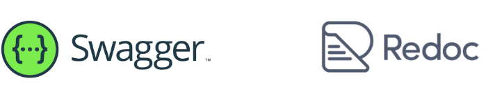

# Django REST framework 2

1. DRF with N:1 Relation
   
   - 1-1-1 GET - List
   
   - 1-1-2 GET - Detail
   
   - 1-2 POST
   
   - 1-3 DELETE & PUT
   
   - 1-4 응답 데이터 재구성

2. 역참조 데이터 구성

3. API 문서화

4. 참고
   
   - Django shortcuts functions

---

- 수정된 PUT 부분
  
  - serializer는 기본적으로 모든 필드에 대해서  validation을 진행한다. 하지만 updatd의 경우에는 변경된 필드에 대해서만  validation을 하면 된다.
  
  - `partial=True` 를 하면 일부 데이터만 갱신이 가능하다
  
  - [Serializers - Django REST framework](https://www.django-rest-framework.org/api-guide/serializers/#partial-updates)

```python
@api_view(['GET', 'DELETE', 'PUT'])
def article_detail(request, article_pk):
    article = Article.objects.get(pk=article_pk)

    if request.method == 'GET':
        serializer = ArticleSerializer(article)
        return Response(serializer.data)

    elif request.method == 'DELETE':
        article.delete()
        return Response(status=status.HTTP_204_NO_CONTENT)

    elif request.method == 'PUT':
        serializer = ArticleSerializer(article, data=request.data, partial='True')
        if serializer.is_valid(raise_exception=True):
            serializer.save()
            return Response(serializer.data)
```

# 1. Django REST framework 2

- 사전준비

- Comment 클래스 정의 및 데이터베이스 초기화

```python
# articles/models.py

class Comment(models.Model):
    article = models.ForeignKey(Article, on_delete=models.CASCADE)
    content = models.TextField()
    created_at = models.DateTimeField(auto_now_add=True)
    updated_at = models.DateTimeField(auto_now=True)
```

- Migration 및 Fixtures 데이터 로드

```bash
$ python manage.py makemigrations
$ python manage.py migrate
$ python manage.py loaddata articles.json comments.json
```


### 1-1-1 GET - List

- 댓글 목록 조회를 위한 CommentSerializer 정의

```python
# articles/serializers.py

from rest_framework import serializers
from .models import Article, Comment

class CommentSerializer(serializers.ModelSerializer):
    class Meta:
        model = Comment
        fields = '__all__'
```

- url 작성

```python
urlpatterns = [
    #...
    path('comments/', views.comment_list),
]
```

- view 함수 작성

```python
# articles/views.py

from .models import Article, Comment
from .serializers import ArticleListSerializer, ArticleSerializer, CommentSerializer

@api_view(['GET'])
def comment_list(request):
    comments = Comment.objects.all()
    serializer = CommentSerializer(comments, many=True)
    return Response(serializer.data)
```

- GET http://127.0.0.1:8000/api/v1/comments 응답 확인


### 1-1-2 GET - Detail

- 단일 댓글 조회를 위한 url 및 view 함수 작성

```python
# articles/urls.py

urlpatterns = [
    #...
    path('comments/<int:comment_pk>', views.comment_detail),
]
```

```python
# articles/views.py

@api_view(['GET'])
def comment_detail(request, comment_pk):
    comment = Comment.objects.get(pk=comment_pk)
    serializer = CommentSerializer(comment)
    return Response(serializer.data)
```

- GET http://127.0.0.1:8000/api/v1/comments/1 응답 확인


### 1-2 POST

- 단일 댓글 생성을 위한 url 및 view 함수 작성

```python
# articles/urls.py

urlpatterns = [
    # ...
    path('articles/<int:article_pk>/comments', views.comment_create),
]
```

```python
# articles/views.py

@api_view(['POST'])
def comment_create(request, article_pk):
    article = Article.objects.get(pk=article_pk)
    serializer = CommentSerializer(data=request.data)
    if serializer.is_valid(raise_exception=True):
        serializer.save()
        return Response(serializer.data, status=status.HTTP_201_CREATED)
```

- serializer 인스턴스의 <mark>save()</mark> 메서드는 특정 Serializer 인스턴스를 저장하는 과정에서 추가 데이터를 받을 수 있음

```python
# articles/views.py

@api_view(['POST'])
def comment_create(request, article_pk):
    article = Article.objects.get(pk=article_pk)
    serializer = CommentSerializer(data=request.data)
    if serializer.is_valid(raise_exception=True):
        serializer.save(article=article)
        return Response(serializer.data, status=status.HTTP_201_CR
```

- POST http://127.0.0.1:8000/api/v1/articles/1/comments/ 응답 확인
  
  - 상태 코드 400 응답 확인
  
  - CommentSerializer 에서 외래 키에 해당하는 article field 또한 사용자로부터 입력받도록 설정되어 있기 때문에 서버 측에서 누락되었다고 판단한 것

```python
# articles/serializers.py

# 전체, 상세 데이터 조작 시 사용되는 필드가 동일하기 때문에
# 댓글 serializer 는 하나로 생성한다.
class CommentSerializer(serializers.ModelSerializer):
    class Meta:
        model = Comment
        fields = '__all__'
        # 조회는 괜찮은데, 생성할 때 해당 필드는 빼고 생각해라
        read_only_fields = ('article',)
```


- **읽기 전용 필드**
  
  - 데이터를 전송하는 시점에
  
  - **유효성 검사에서 제외**시키고,** 데이터 조회 시에는 출력**
  
  - 하는 필드

- POST http://127.0.0.1:8000/api/v1/articles/1/comments/ 재요청

### 1-3 DELETE & PUT

- 단일 댓글 삭제 및 수정을 위한 view 함수 작성

```python
# articles/views.py

@api_view(['GET', 'DELETE', 'PUT'])
def comment_detail(request, comment_pk):
    comment = Comment.objects.get(pk=comment_pk)
    if request.method == 'GET':
        serializer = CommentSerializer(comment)
        return Response(serializer.data)

    elif request.method == 'DELETE':
        comment.delete()
        return Response(status=status.HTTP_204_NO_CONTENT)

    elif request.method =='PUT':
        serializer = CommentSerializer(comment, data=request.data)
        if serializer.is_valid(raise_exception=True):
            serializer.save()
            return Response(serializer.data)
```

## 1-4 응답 데이터 재구성

- 댓글 조회 시 게시글 출력 내역 변경
  
  - 댓글 조회 시 게시글 번호만 제공해주는 것이 아닌 '게시글의 제목' 까지 제공하기
  
  - 필요한 데이터를 만들기 위한 Serializer는 내부에서 추가 선언 가능
  
  ```python
  class CommentSerializer(serializers.ModelSerializer):
      class ArticleTitleSerializer(serializers.ModelSerializer):
          class Meta:
              model = Article
              fields = ('title',)
  
      article = ArticleTitleSerializer(read_only=True)
  
      class Meta:
          model = Comment
          fields = '__all__'
  ```

# 2. 역참조 데이터 구성

- Article -> Comment 간 역참조 관계를 활용한  JSON 데이터 재구성
  
  1. 단일 게시글 조회시 **해당 게시글에 작성된 댓글 목록 데이터**도 함께 붙여서 응답
  
  2. 단일 게시글 조회시 **해당 게시글에 작성된 댓글 개수 데이터**도 함께 붙여서 응답
1. 단일 게시글 + 댓글 목록
   
   - Nested relationships
     
     - 모델 관계 상으로 참조하는 대상은 참조되는 대상의 표현에 포함되거나 중첩될 수 있음
     
     - 이러한 중첩된 관계는 serializers를 필드로 사용하여 표현 가능
     
     ```python
     class CommentSerializer(serializers.ModelSerializer):
         class Meta:
             model = Comment
             fields = '__all__'
             read_only_fields = ('article',)
     ```

     class ArticleSerializer(serializers.ModelSerializer):
         comment_set = CommentSerializer(many=True, read_only=True)
    
         class Meta:
             model = Article
             fields = '__all__'
     ```

2. 단일 게시글 + 댓글 개수
   
   - 댓글 개수에 해당하는 새로운 필드 생성
   
   ```python
   class CommentSerializer(serializers.ModelSerializer):
       class Meta:
           model = Comment
           fields = '__all__'
           read_only_fields = ('article',)
   ```

   class ArticleSerializer(serializers.ModelSerializer):
       comment_set = CommentSerializer(many=True, read_only=True)
       comment_count = serializers.IntegerField(source='comment_set.count', read_only=True)

       class Meta:
           model = Article
           fields = '__all__'

```
- `source`

  - 필드를 채우는데 사용할 속성의 이름

  - 점 표기법(dotted notation)을 사용하여 속성을 탐색할 수 있음

- [주의] 읽기 전용 필드 지정 이슈

  - 특정 필드를 override 혹은 추가한 경우 read_only_fields는 동작하지 않음

  - 해당 필드의 read_only 키워드 인자로 작성해야 함

```python
class ArticleSerializer(serializers.ModelSerializer):
    comment_set = CommentSerializer(many=True)
    comment_count = serializers.IntegerField(source='comment_set.count')

    class Meta:
        model = Article
        fields = '__all__'
        # 안됨!!!!!!!!!!!!!!!!!!
        read_only_fields = ('comment_set', 'comment_count')
```

# 3. API 문서화

- OpenAPI Specification (OAS)
  
  - RESTful API를 설명하고 시각화하는 표준화된 방법
    
    - API에 대한 세부사항을 기술할 수 있는 공식 표준

- OAS 기반 API에 대한 문서를 생성하는데 도움을 주는 오픈소스 프레임워크



- drf-spectacular 라이브러리
  
  - DRF 위한 OpenAPI 3.0 구조 생성을 도와주는 라이브러리

- 설치 및 등록

```bash
$ pip install drf-spectacular
```

```python
# settings.py

INSTALLED_APPS = [
    'drf_spectacular',
]
```

- 관련 설정 코드 입력(OpenAPI 스키마 자동 생성 코드)

```python
# settings.py

REST_FRAMEWORK = {
    #YOUR SETTINGS
    'DEFAULT_SCHEMA_CLASS' : 'drf_spectacular.openapi.AutoSchema',
}
```

- swagger, redoc 페이지 제공을 위한 url 작성

```python
# drf/urls.py

from drf_spectacular.views import SpectacularAPIView, SpectacularRedocView, SpectacularSwaggerView

urlpatterns = [
    #...
    path('api/schema/', SpectacularAPIView.as_view(), name='schema'),
    path('api/schema/swagger-ui/', SpectacularSwaggerView.as_view(url_name='schema'), name='swagger-ui'),
    path('api/schema/redoc/', SpectacularRedocView.as_view(url_name='schema'), name='redoc'),
]
```

- http://127.0.0.1:8000/api/schema/swagger-ui/ 페이지 확인

- http://127.0.0.1:8000/api/schema/redoc 페이지 확인

- OAS의 핵심 이점 - '설계 우선' 접근법
  
  - API를 먼저 설계하고 명세를 작성한 후, 이를 기반으로 코드를 구현하는 방식
  
  - API의 일관성을 유지하고, API 사용자는 더 쉽게 API를 이해하고 사용할 수 있음
  
  - 또한, OAS를 사용하면 API가 어떻게 동작하는지 시각적으로 보여주는 문서를 생성할 수 있으며, 이는 API를 이해하고 테스트하는데 매우 유용
  
  - 이런 목적으로 사용되는 도구가 Swagger-UI 또는 ReDoc

# 4. 참고

## Django shortcuts functions

> - render()
> 
> - redirect()
> 
> - get_object_or_404()
> 
> - get_list_or_404()

- `get_object_or_404()`
  
  - 모델 manager objects 에서 `get()`을 호출하지만, 해당 객체가 없을 땐 기존 DoesNotExist 예외 대신<mark> Http404를 raise</mark>함

```python
# articles/views.py

from django.shortcuts import get_object_or_404

article = Article.objects.get(pk=article_pk)
comment = Comment.objects.get(pk=comment_pk)

# 위 코드를 모두 다음과 같이 변경
article = get_object_or_404(Article, pk=article_pk)
comment = get_object_or_404(Comment, pk=comment_pk)
```

- `get_list_or_404()`
  
  - 모델 manager objects에서 `filter()`의 결과를 반환하고, 해당 객체 목록이 없을 땐 <mark>HTTP404를 raise</mark> 함

```python
# articles/views.py

from django.shortcuts import get_object_or_404, get_list_or_404

article = Article.objects.all()
comment = Comment.objects.all()

# 위 코드를 모두 다음과 같이 변경
article = get_list_or_404(Article)
comment = get_list_or_404(Comment)
```

- 전/후 비교
  
  - 존재하지 않는 게시글 조회 시
  
  - 이전에는 상태코드 500을 응답했지만 현재는 404를 응답

- 사용 이유
  
  - 클라이언트에게 '서버에 오류가 발생하여 요청을 수행할 수 없다(500)' 라는 원인이 정확하지 않은 에러를 제공하기 보다는, 적절한 예외처리를 통해 클라이언트에게 보다 정확한 에러 현황을 전달하는 것도 매우 중요한 개발 요소 중 하나이기 때문
