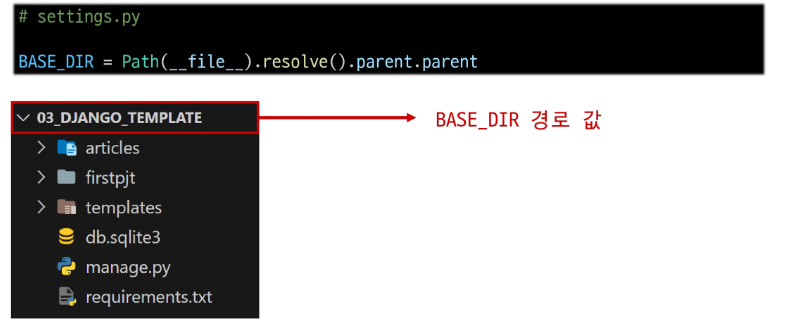

# Django Template & URLs

1. Django Template
   
   - 1-1 Template System
   
   - 1-2 템플릿 상속
   
   - 1-3 HTML form(요청과 응답)
     
     - form 활용
   
   - 참고
     
     - 추가 템플릿 경로 지정
     
     - BASE_DIR
     
     - DTL 주의사항

2. Django URLs
   
   - 2-1 Django URLs
   
   - 2-2 변수과 URL - variable routing
   
   - 2-3 APP과 URL - App URL mapping
   
   - 2-4 URL 이름 지정 - Naiming URL patterns
   
   - 2-5 URL 이름 공간
   
   - 참고
     
     - Trailing Slashes

## 1. Django Template

### 1-1 Template System

- 데이터 <mark>표현</mark>을 제어하면서 <mark>표현</mark>과 관련한 부분을 담당
  
  - ex) HTML의 콘텐츠를 변수값에 따라 바꾸고 싶다면?

- Django Template Language(DTL)
  
  - Template에서 조건, 반복, 변수 등의 프로그래밍적 기능을 제공하는 시스템
  
  - DTL Syntax
    
    > 1. Variable
    > 
    > 2. Filters
    > 
    > 3. Tags
    > 
    > 4. Comments
1. Variable
   
   - render  함수의 세번째 인자로 딕셔너리 데이터를 사용
   
   - 딕셔너리 key에 해당하는 문자열이 template에서 사용 가능한 변수명이 됨
   
   - dot(.)를 사용하여 변수 속성에 접근할 수 있음
     
     ```Django
     {{ variable }}
     ```

2. Filters
   
   - 표시할 변수를 수정할 때 사용
   
   - chained가 가능하며 일부 필터는 인자를 받기도 함
   
   - 약 60개의 built-in template filters를 제공
   
   ```django
   {{ variable | filter }}
   {{ name | truncatewords:30 }}
   ```

3. Tags
   
   - 반복 또는 논리를 수행하여 제어 흐름을 만듦
   
   - 일부 태그는 시작과 종료 태그가 필요
   
   - 약 24개의 built-in template tags를 제공
   
   ```django
   
   
   
   ```

4. Comments
   
   ```django
   <h1>Hello, {# name #}</h1>
   
   
       
       
   
   ```

### 1-2 템플릿 상속

- 기본 템플릿 구조의 한계
  
  -  만약 모든 템플릿에 bootstrap을 적용하려면?
  
  - 모든 템플릿에 bootstrap CDN을 작성해야 할까?

- Template inheritance
  
  - 페이지의 <mark>공통요소를 포함</mark>하고, <mark>하위 템플릿이 재정의 할 수 있는 공간</mark>을 정의하는 기본 'skeleton' 템플릿을 작성하여 상속 구조를 구축

- extends tag
  
  ```django
  
  ```
  
  - 자식(하위)템플릿이 부모 템플릿을 확장한다는 것을 알림
    
    - <mark>반드시 템플릿 최상단에 작성되어야 함(2개 이상 사용 불가)</mark>

- block tag
  
  ```django
  
  
  ```
  
  - 하위 템플릿에서 재정의할 수 있는 블록을 정의
    
    - 하위 템플릿이 작성할 수 있는 공간을 지정


### 1-3 HTML form(요청과 응답)

- 데이터를 보내고 가져오기(Sending and Retrieving form data)
  
  - HTML form element를 통해 사용자와 애플리케이션 간의 상호작용 이해하기


- form element
  
  - 사용자로부터 할당된 데이터를 <mark>**서버**</mark>로 전송
    
    - 웹에서 사용자 정보를 입력하는 여러 방식(text, password, checkbox 등)을 제공
* fake naver실습
  
  1. urls.py
     
     
     
     
     
     
     
     
     
     
     
     
     
     
  
  2. view.py
     
     
     
     
     
     
     
     
     
     
     
     
     
  
  3. search.html
     
     
     
     
     
     
- Get 방식 특징
  
  - url이 노출된다
  
  > - action & method : form의 핵심 속성 2가지
  >   
  >   - 데이터를 어디(**action**)로 어떤 방식(**method**)로 요청할지
  > 
  > - action
  >   
  >   - 입력 데이터가 전송될 URL을 지정(목적지)
  >   
  >   - 만약 이 속성을 지정하지 않으면 데이터는 현재 form이 있는 페이지의 URL로 보내짐
  > 
  > - method
  >   
  >   - 데이터를 어떤 방식으로 보낼 것인지 정의
  >   
  >   - 데이터의 HTTP request methods(GET, POST)를 지정

- input
  
  - 사용자의 데이터를 입력 받을 수 있는 요소
  
  - type 속성 값에 따라 다양한 유형의 입력데이터를 받음
  
  > - name : input의 핵심 속성
  >   
  >   - 입력한 데이터에 붙이는 이름(key)
  >   
  >   - 데이터를 제출했을 때 name 속성에 설정된 값을 통해서만 사용자가 입력한 데이터에 접근할 수 있음
  >   
  >   - **서버로 보내는 key**

- Query String Parameters
  
  - 사용자의 입력데이터를 URL주소에 따라 파라미터로 통해 서버로 보내는 방법
  
  - 문자열은 앰퍼샌드(&)로 연결된 key=value 쌍으로 구성되며, 기본 URL과 물음표(?)로 구분됨


### Form 활용

- HTTP request 객체
  
  - form으로 전송한 데이터 뿐만 아니라 모든 요청 관련 데이터가 담겨있음
  
  - view 함수의 첫번째 인자


### 참고

- 템플릿 기본 경로 외 커스텀 경로 추가하기


- BASE_DIR
  
  - settings에서 경로 지정을 편하기 하기 위해 최상단 지점을 지정 해놓은 변수
  
  

- DTL 주의사항
  
  - python처럼 일부 프로그래밍 구조(if, for 등)을 사용할 수 있지만 명칭을 그렇게 설계했을 뿐이지 python 코드로 실행되는 것이 아니며 python과는 관련 없음
  
  - 프로그래밍적 로직이 아니라 프레젠테이션을 위한 것임을 명심할 것
  
  - 프로그래밍적 로직은 되도록 view함수에서 작성 및 처리

## 2. Django URLs

### 2-1 Django URLs

- 요청과 응답에서 Django  URLs의 역할


- URL dispatcher(운항 관리자, 분배기)
  
  - URL 패턴을 정의하고 해당 패턴이 일치하는 요청을 처리할 view 함수를 연결(매핑)

### 2-2 변수와 URL

- Variable Routing
  
  - URL 일부에 변수를 포함시키는 것(변수는 view 함수의 인자로 전달할 수 있음)


### 2-3 APP과 URL

- App URL mapping
  
  - 각 앱에 URL을 정의하는 것
  
  - 프로젝트와 각 앱이 URL을 나누어 관리를 편하게 하기 위함
    
    - view 함수 이름이 같거나 같은 패턴의 url 주소를 사용하는 경우
      
      - 아래 코드보다 더 좋은 방법 필요
      
      - **<mark>URL을 각자 app에서 관리하자</mark>**
      
      ```django
      urlpatterns = [
          ...,
          path('pages', pages_views.index),
      ]
      ```


- include()
  
  - 프로젝트 내부 앱들의  URL을 참조할 수 있도록 매핑하는 함수
    
    - URL의 일치하는 부분까지 잘라내고, 남은 문자열 부분은 후속처리를 위해 include된 URL로 전달

### 2-4 URL 이름 지정

- url 구조 변경에 따른 문제점
  
  - 기존 'articles/' 주소가 'articles/index/'로 변경됨에 따라 해당 주소를 사용하는 모든 위치를 찾아가 변경해야 함
    
    - <mark>URL에 이름을 지어주면 이름만 기억하면 되지 않을까?</mark>

- Naiming URL patterns
  
  - URL에 이름을 지정하는 것
  
  - path 함수의 name인자를 정의해서 사용


- herf 속성 값 뿐만 아니라 form의 action 속성처럼 url을 작성하는 모든 위치에서 변경


- 'url' tag
  
  - 주어진 URL 패턴의 이름과 일치하는 절대 경로 주소를 반환
  
  ```django
  
  ```

### 2-5 URL 이름 공간

-  URL 이름 지정 후 남은 문제
  
  - articles 앱의 url 이름과 pages 앱의 url이름이 같은 상황
  
  - 단순히 이름만으로는 완벽하게 분리할 수 없음
    
    - <mark>이름에 성(키,  key)을 붙이자</mark>

- app_name 속성 지정
  
  - app_name 변수 값 설정


- URL tag의 최종 변화
  
  - 마지막으로 url 태그가 사용하는 모든 곳의 표기 변경하기


### 참고

- Trailing Slashes
  
  - Django는 URL 끝에 '/' 가 없다면 자동으로 붙임(Django의 url 설계 철학)
  
  - 기술적인 측면에서 foo.com/bar와 foo.com/bar/는 서로 다른  URL
    
    - 검색 엔진 로봇이나 웹 트래픽 분석 도구에서는 이 두 주소를 서로 다른 페이지로 봄
  
  - 그래서 Django는 검색 엔진이 혼동하지 않게 하기 위해 붙이는 것을 선택한 것
  
  - 그러나 모든 프레임워크가 이렇게 동작하는 것은 아니니 주의
