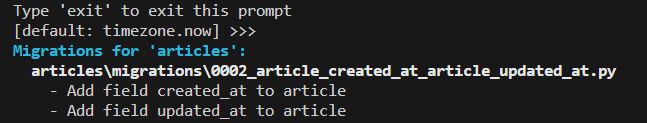

# Django Model

- [Django Model](#django-model)
  - [1. Model](#1-model)
  - [2. Migrations](#2-migrations)
    - [2-2 추가 Migrations](#2-2-추가-migrations)
    - [2-3 모델 필드](#2-3-모델-필드)
  - [3. Admin site](#3-admin-site)
  - [참고](#참고)
    - [데이터베이스 초기화](#데이터베이스-초기화)
    - [Migrations 기타 명령어](#migrations-기타-명령어)
    - [첫 migrate 시 출력 내용이 많은 이유는?](#첫-migrate-시-출력-내용이-많은-이유는)
    - [SQLite](#sqlite)
    - [CRUD](#crud)
    - [안전한 패스워드 저장](#안전한-패스워드-저장)

## 1. Model

- Django Model
  
  - DB의 테이블을 정의하고 데이터를 조작(생성, 수정, 삭제)할 수 있는 기능들을 제공
    
    - 테이블 구조를 설계하는 '청사진(blueprint)'

- model 클래스 작성

```python
# articles/models.py

class Article(models.Model): # 상속 (models모듈.Model클래스)
    title = models.CharField(max_length=10)
    content = models.TextField()
```

-  작성한 모델 클래스는 최종적으로 DB에 다음과 같은 테이블 구조를 만듦


- model 클래스
  
  - django.db.models 모듈의 Model이라는 부모 클래스를 상속받음
  
  - Model은 model에 관련된 모든 코드가 이미 작성 되어있는 클래스
    
    [Django github](https://github.com/django/django/blob/main/django/db/models/base.py)
    
    - 개발자는 가장 중요한 테이블 구조를 어떻게 설계할지에 대한 코드만 작성하도록 하기 위한 것(프레임워크의 이점)

- 클래스 변수명
  
  - 테이블의 각 "**필드(열) 이름**"
  
  - 행은 레코드라고 부른다

- model Field 클래스
  
  - 테이블 필드의 "**데이터 타입**"   [Model field reference](https://docs.djangoproject.com/en/4.2/ref/models/fields/)

- model Field 클래스의 키워드 인자(필드 옵션)
  
  - 테이블 필드의 "**제약조건**" 관련 설정   [Model field reference](https://docs.djangoproject.com/en/4.2/ref/models/fields/#field-options)

---

- 제약조건
  
  - 데이터가 올바르게 저장되고 관리되도록 하기 위한 규칙
    
    - ex) 숫자만 저장되도록, 문자가 100자 까지만 저장되도록 하는 등

## 2. Migrations

- Migrations
  
  - model 클래스의 변경사항(필드 생성, 수정, 삭제 등)을 DB에 최종 반영하는 방법

- **<mark>순서, 명령어 중요!!</mark>**


- <mark>model class를 기반으로 최종 설계도(migration) 작성</mark>

```bash
$ python manage.py makemigrations
```


- <mark>최종 설계도를 DB에 전달하여 반영</mark>

```bash
$ python manage.py migrate
```


### 2-2 추가 Migrations

- 이미 생성된 테이블에 필드를 추가해야 한다면?

```python
class Article(models.Model):
    title = models.CharField(max_length=10)
    content = models.TextField()
    created_at = models.DateTimeField(auto_now_add=True)
    updated_at = models.DateTimeField(auto_now=True)
```


- 추가 모델 필드 작성
  
  - 이미 기존 테이블이 존재하기 때문에 필드를 추가할 때 필드의 기본값 설정이 필요
  
  - **1번은 현재 대화를 유지하면서 직접 기본값을 입력하는 방법**
  
  - 2번은 현재 대화에서 나간 후 models.py에 기본값 관련 설정을 하는 방법
  
  - 추가하는 필드의 기본값을 입력해야 하는 상황
  
  - 날짜 데이터이기 때문에 직접 입력하기보다 DJango가 제안하는 기본 값을 사용하는 것을 권장
  
  - 아무것도 입력하지 않고 enter를 누르면 Django가 제안하는 기본 값으로 설정됨
  
  - 
  
  - migration과정 종료 후 2번째 migration 파일이 생성됨을 확인
    
    이처럼 Django는 설계도를 쌓아가면서 추후 문제가 생겼을 시 복구하거나 되돌릴 수 있도록 함(마치 'git commit')
  
  - 
  
  - migrate 후 테이블 필드 변화확인
  
  - 
  1. model class에 변경사항이 생겼다면
  
  2. 반드시 새로운 설계도를 생성하고
  
  3. 이를 DB에 반영해야 한다
     
     > 1. model class 변경
     > 
     > 2. makemigrations
     > 
     > 3. migrate

### 2-3 모델 필드

- Model Field
  
  - DB 테이블의 필드(열)을 정의하며, 해당 필드에 저장되는 데이터 타입과 제약조건을 정의

- CharField()
  
  - 길이의 제한이 있는 문자열
  
  - 필드의 최대 길이를 결정하는 max_length는 필수 인자

- TextField()
  
  - 글자 수가 많을 때 사용

- DateTimeField()
  
  - 날짜와 시간을 넣을 때 사용
  1. auto_now : 데이터가 <mark>저장될 때마다</mark> 자동으로 현재 날짜시간을 저장
  
  2. auto_now_add : 데이터가 <mark>처음 생성될 때만</mark> 자동으로 현재 날짜시간을 저장

## 3. Admin site

- Automatic admin interface
  
  - Django는 추가 설치 및 설정 없이 자동으로 관리자 인터페이스를 제공
    
    - 데이터 확인 및 테스트 등을 진행하는데 매우 유용

- admin 계정 생성
  
  - email은 선택사항이기 때문에 입력하지 않고 진행 가능
  
  - 비밂번호 입력 시 보안상 터미널에 출력되지 않으니 무시하고 입력 이어가기

```bash
$ python manage.py createsuperuser
```


- admin에 모델 클래스 등록
  
  - admin.py에 작성한 모델 클래스를 등록해야만 admin site에서 확인 가능

```python
# 
from django.contrib import admin
# 명시적 상대경로
from .models import Article

# Register your models here.

# Article  모델 클래스를 admin site에 등록
# admin site에 등록(register)한다
admin.site.register(Article)
```

- 주의사항
  
  - migration migrate하기 전에 admin 만드려고 하면 안된다
  
  ---

## 참고

#### 데이터베이스 초기화

1. migration 파일 삭제

2. db.sqlite3 파일 삭제
   
   - 아래 폴더를 지우지 않도록 주의
   
   - <mark>\__init\_\_.py</mark>
   
   - <mark>migration 폴더</mark>


#### Migrations 기타 명령어

- python manage.py showmigrations
  
  - migrations 파일들이 migrate 되었는지 안됐는지 여부를 확인하는 명령어
  
  - \[X\] 표시 있으면 migrate 완료되었음을 의미

```bash
$ python manage.py showmigrations
```


- python manage.py sqlmigrate articles 0001
  
  - 해당 migrations파일이 SQL 언어(DB에서 사용하는 언어)로 어떻게 번역되어  DB에 전달되는지 확인하는 명령어

```bash
$ python manage.py sqlmigrate articles 0001
```


#### 첫 migrate 시 출력 내용이 많은 이유는?

- Django 프로젝트가 동작하기 위해 미리 작성되어 있는 기본 내장 app들에 대한  migration 파일들이 함께 migrate되기 때문


#### SQLite

- 데이터베이스 관리 시스템 중 하나이며  Django 기본 데이터베이스로 사용됨(파일로 존재하며 가볍고 호환성이 좋음)

#### CRUD

- 소프트웨어가 가지는 기본적인 데이터 처리 기능
  
  - Create(저장)
  
  - Read(조회)
  
  - Update(갱신)
  
  - Delete(삭제)

#### 안전한 패스워드 저장

[네이버 개발자 블로그- 안전한 패스워드 저장](https://d2.naver.com/helloworld/318732)
