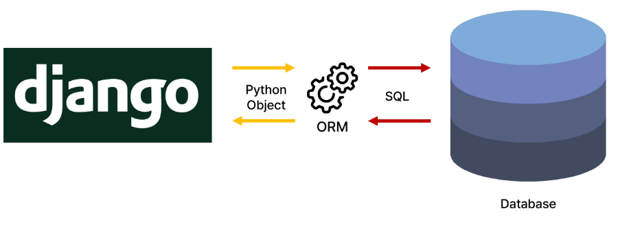
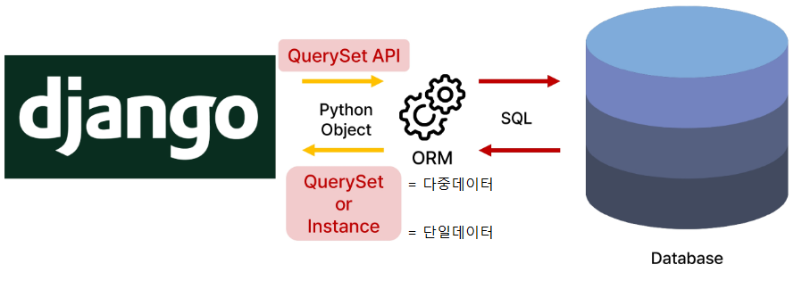
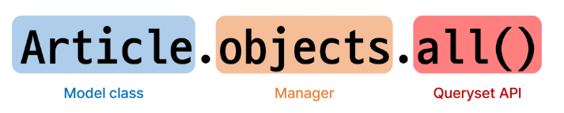
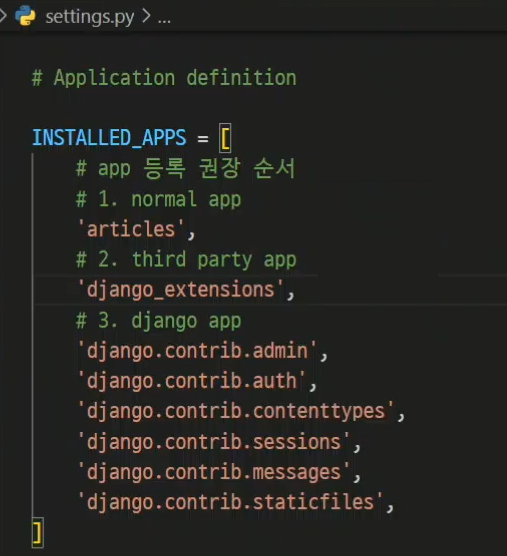

# Django ORM

[1. ORM](#1-orm)

[2. QuerySet API](#2-queryset-api)

[3. QuerySet API 실습](#3-queryset-api-실습)

- [3-1 Create](#3-1-create--데이터-객체를-만드는생성하는-3가지-방법)

- [3-2 Read](#read)

- [3-3 Update](#update)

- [3-4 Delete](#delete)

[4. 참고](#참고)

- [Field lookups](#field-lookups)

- [ORM, QuerySet API를 사용하는 이유](#orm-queryset-api를-사용하는-이유)

## 1. ORM

- Object-Relational-Mapping
  
  - 객체 지향 프로그래밍 언어를 사용하여 호환하지 않는 유형의 시스템 간에 데이터를 변환하는 기술
  
  

## 2. QuerySet API

- ORM에서 데이터를 검색, 필터링, 정렬 및 그룹화하는데 사용하는 도구
  
  - API를 사용하여 SQL이 아닌 Python  코드로 데이터를 처리
  
  

- Query
  
  - 데이터베이스에 특정한 데이터를 보여달라는 요청
  
  - 쿼리문을 작성한다 
    
    - =>원하는 데이터를 얻기 위해 데이터베이스에 요청을 보낼 코드를 작성한다.
  
  - 파이썬으로 작성한 코드가 ORM에 의해 SQL로 변환되어 데이터베이스에 전달되며, 데이터베이스의 응답 데이터를 ORM이 QuerySet이라는 자료 형태로 변환하여 우리에게 전달

- QuerySet
  
  - 데이터베이스에게서 전달 받은 객체 목록(데이터 모음)
    
    - <mark>**순회**</mark>가 가능한 데이터로써 1개 이상의 데이터를 불러와 사용할 수 있음
    
    - = for문으로 처리가 가능하다
  
  - Django ORM을 통해 만들어진 자료형
  
  - 단, 데이터가 단일한 객체를 반환할 때는 QuerySet이 아닌 모델(Class)의 인스턴스로 반환됨

**Python의 모델 클래스와 인스턴스를 활용해 DB에 데이터를 저장, 조회, 수정, 삭제하는 것**



## 3. QuerySet API 실습

- 사전 준비 : 외부 라이브러리 설치 및 설정
  
  ```bash
  $ pip install ipython
  $ pip install django-extentions
  ```

 

```bash
$ pip freeze > requirements.txt
```

- Django shell  
  
  - Django 환경 안에서 실행되는 python shell
  
  - 입력하는 QuerySet API 구문이  Django 프로제그에 영향을 미침

```bash
$ python manage.py shell_plus
```

### 3-1 Create : 데이터 객체를 만드는(생성하는) 3가지 방법

1. 첫번째

```shell
# 특정 테이블에 새로운 행을 추가하여 데이터 추가
In [1]: article = Article() # Article(class)로부터 article(instance)생

In [2]: article
Out[2]: <Article: Article object (None)>

In [3]: article.title = 'first' # 인스턴스 변수(title)에 값을 할당

In [4]: article.content ='django!' # 인스턴스 변수(content)에 값을 할당

# save를 하지 않으면 아직 DB에 값이 저장되지 않음
In [5]: article
Out[5]: <Article: Article object (None)>

In [6]: Article.objects.all()
Out[6]: <QuerySet []>

# save를 호출하고 확인하면 저장된 것을 확인할 수 있다.
In [7]: article.save()

In [8]: article
Out[8]: <Article: Article object (1)>

In [9]: article.id
Out[9]: 1

# primary key
In [10]: article.pk
Out[10]: 1

In [11]: Article.objects.all()
Out[11]: <QuerySet [<Article: Article object (1)>]>t (1)>

In [12]: article.title
Out[12]: 'first'

In [13]: article.content
Out[13]: 'django!'

In [14]: article.created_at
Out[14]: datetime.datetime(2023,9,15,11,42, 323326, tzinfo=datetime.timezone.utc)
```

-  QuerySet인 경우
  
  - index에러를 조심해야 한다
  
  - <mark>밑에서 1은 인덱스가 아니라 id</mark>
  
  ```shell
  >>> articles = Article.objects.all()
  
  >>> articles
   <QuerySet [<Article: Article object (1)>]>
  
  >>> articles[0]
   <Article: Article object (1)>
  ```
2. 두번째 방법
   
   - save 메서드를 호출해야 비로호 DB에 데이터가 저장됨
   - 테이블에 한 줄(행, 레코드)이 쓰인 것
   
   ```shell
   >>> article = Article(title='first',content='django!')
   
   # 아직 저장되어 있지 않음
   >>> article
    <Article: Article object (None)>
   
   # save를 호출해야 저장됨
   >>>: article.save()
   
   >>> article
    <Article: Article object (1)>
   
   >>> article = Article(title='second',content='django!')
   
   >>> article.save()
   
   >>> article
    <Article: Article object (2)>
   
   >>> Article.objects.all()
    <QuerySet [<Article: Article object (1)>, <Article: Article object (2)>]>
   ```

3. 세번째 방법
   
   - QuerySet API 중 create() 메서드 활용
     
     ```bash
     # 위 2가지 방법과 달리 바로 저장 이후 바로 생성된 데이터가 반환된다
     >>> Article.objects.create(title='second',content='django!')
     <Article: Article object (3)>
     
     >> article.pk
      2
     ```
- save()
  
  - 객체를 데이터베이스에 저장하는 메서드

### Read

- all()
  
  - 전체 데이터 조회
  
  - 만약에 아무것도 없으면 빈 쿼리셋 반환
  
  - 하나만 있어도 하나만 있는 쿼리셋 반환
  
  ```bash
  >>> articles = Article.objects.all()
  
  >>> for article in articles:
     ...:     print(article.title)
     ...:     
  first
  second
  ```

- get()
  
  - <mark>단일</mark> 데이터 조회, id, pk에 적합한 메서드
  
  - 객체가 없으면 DoesNotExist 예외를 발생시키고, 둘 이상의 객체를 찾으면  MultipleObjectsReturned 예외를 발생시킴
  
  - 따라서 <mark>primary key와 같이 고유성(uniqueness)</mark>을 보장하는 조회에서 사용해야 함

```bash
>>> Article.objects.get(pk=1)
 <Article: Article object (1)>

# ERROR 발생
>>> Article.objects.get(content='django!')
MultipleObjectsReturned 
```

- filter()
  
  - 특정 조건 데이터 조회
  
  - all() 이랑 비슷하게
  
  ```shell
  >>> Article.objects.create(title='thrid',content='django!')
   <Article: Article object (3)>
  
  >>> Article.objects.filter(content='django!')
   <QuerySet [<Article: Article object (1)>, <Article: Article object (2)>, <Article: Article object (3)>]>
  
  # 조회된게 없으면 빈 쿼리셋 반환
  >>> Article.objects.filter(content='hello')
   <QuerySet []>
  
  # 하나만 있으면 하나만 담긴 쿼리셋 반환
  >>> Article.objects.filter(title='first')
    <QuerySet [<Article: Article object (2)>]>
  ```

### Update

- 조회를 먼저 한 다음에 수정
  
  ```shell
  # 수정할 인스턴스 조회
  >> article = Article.objects.get(pk = 1)
  
  # 인스턴스 변수를 변경
  >> article.title = 'byebye'
  
  # 저장
  >> article.save()
  
  # 정상적으로 변경된 것을 확인
  >> article.title
   'byebye'
  ```

### Delete

- 삭제하려는 데이터 조회 후 delete 메서드 호출

```shell
# 삭제할 인스턴스 조회
>> article = Article.objects.get(pk=1)

# delete 메서드 호출(삭제된 객체가 반환)
>> article.delete()
(1, {'articles.Article' : 1})

# 삭제한 데이터는 더이상 조회할 수 없음
>> Article.objects.get(pk=1)
DoesNotExist: Article matching query does not exist.
```

## 참고

### Field lookups

- 특정 레코드에 대한 조건을 설정하는 방법

- QuerySet 메서드 filter(), exclude() 및 get()에 대한 키워드 인자로 지정됨

```shell
# Field lookups 예시

# "content 칼럼에 'dja'가 포함된 모든 데이터 조회"
>> Article.objects.filter(content__contains='dja')
```

### ORM, QuerySet API를 사용하는 이유

- 데이터베이스 쿼리를 추상화하여 Django 개발자가 데이터베이스와 직접 상호작용하지 않아도 되도록 함

- 데이터베이스와의 결합도를 낮추고 개발자가 더욱 직관적이고 생산적으로 개발할 수 있도록 도움
