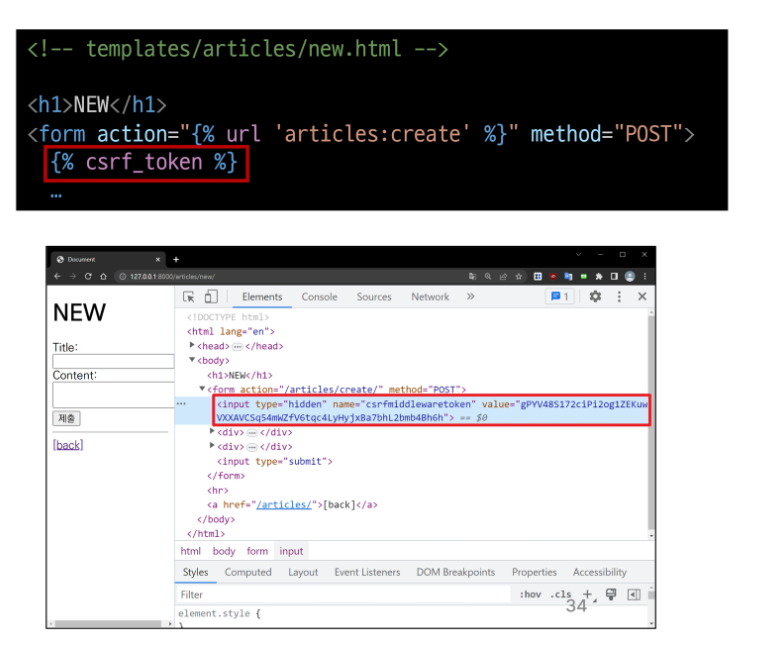
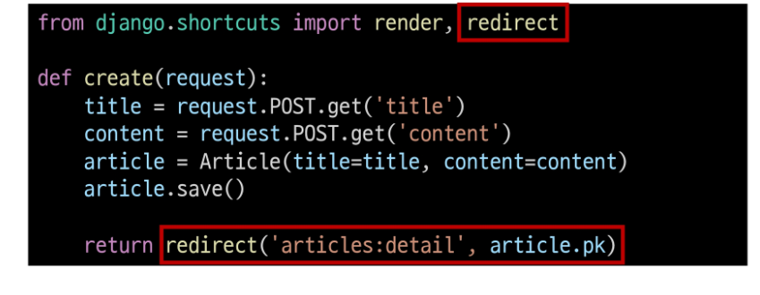
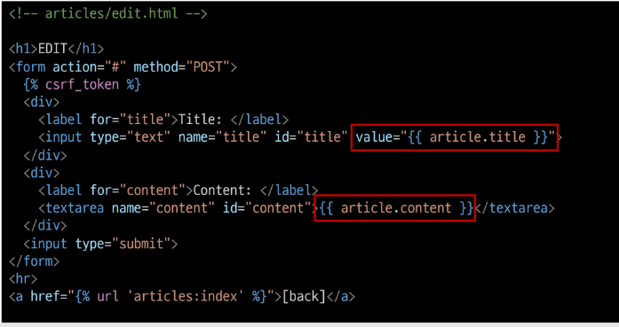
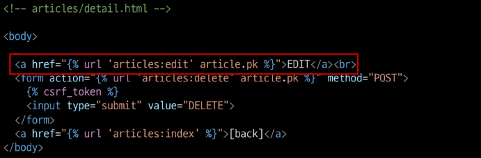
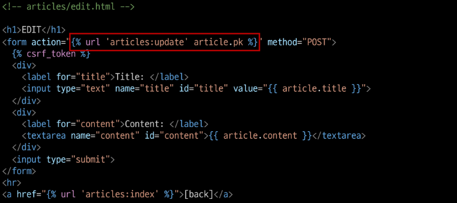

# Django ORM with view

[1. Read](#read)

[2. Create](#create)

[3. HTTP](#http-request-methods)

  [3-1 HTTP response status code](#http-response-status-code)

  [3-2 CSRF(Cross-Site-Request-Forgery)](#csrfcross-site-request-forgery)

[4. Delete](#delete)

[6. Update](#update)

[7. Redirect](#redirect)

[참고. HTTP request methods 사용 예시](#참고)

### Django shell에서 연습했던 QuerySet API를 직접 view 함수에서 사용하기

## Read

1. 전체 게시글 조회
   
   - articles/views.py

```python
# articles/views.py
from .models import Article

# Create your views here.
def index(request):
    articles = Article.objects.all()
    context = {
        'articles' : articles,
    }
    return render(request, 'articles/index.html', context)
```

- articles/index.html

```html
<!-- articles/index.html -->
<body>
  <h1> INDEX</h1>
  
    <p>글 번호 : {{ article.pk }}</p>
    <a href="">
    <p>글 제목 : {{ article.title }}</p>
    </a>
    <p>글 내용 : {{ article.content }}</p>
    <hr>
  
```

2. 단일 게시글 조회
   
   - articles/urls.py

```python
# articles/urls.py
from django.urls import path
from . import views

app_name = 'articles'
urlpatterns = [
    path('', views.index, name = 'index'),
    path('<int:pk>/', views.detail, name = 'detail'),
    ]
```

- articles/views.py

```python
# articles/views.py
def detail(request, pk):
    article = Article.objects.get(pk=pk)
    # Article.objects.get(id=pk)
    context = {
        'article' : article,
    }
    return render(request, 'articles/detail.html', context)
```

- templates/articles/detail.html

```html
< !-- templates/articles/detail.html -->
<body>
    <h2>DETAIL</h2>
    <h3>{{ article.pk}} 번째 글</h3>
    <hr>
    <p>{{ article.title }}</p>
    <p>{{ article.content }}</p>
    <p>{{ article.created_at }}</p>
    <p>{{ article.updated_at }}</p>
    <hr>
    <a href="">[back]</a>
</body>
```

```
- 단일 게시글 페이지 링크 작성

```html
  <h1> INDEX</h1>
  
    <p>글 번호 : {{ article.pk }}</p>
    <a href="">
    <p>글 제목 : {{ article.title }}</p>
    </a>
    <p>글 내용 : {{ article.content }}</p>
    <hr>
  
```

## Create

- Create 로직을 구현하기 위해 필요한 view 함수의  개수는?
  
  - new : 사용자 입력 데이터를 받을 페이지를 렌더링
  
  - create : 사용자가 입력한 데이터를 받아 DB에 저장

- new
  
  - articles/urls.py

```python
from django.urls import path
from . import views

app_name = 'articles'
urlpatterns = [
    path('', views.index, name = 'index'),
    path('<int:pk>/', views.detail, name = 'detail'),
    path('new/', views.new, name='new'),    
    path('create/', views.create, name='create'),    
]
```

- articles/views.py

```python
def  new(request):
    return render(request, 'articles/new.html')
```

- templates/articles/new.html

```html
<body>
  <h1>NEW</h1>
  <form action="" method="GET">
    <div>
      <label for="title">제목 : </label>
      <input type="text" id="title" name="title">
    </div>
    <div>
      <label for="content">내용 : </label>
      <textarea name="content" id="content" cols="30" rows="10"></textarea>
    </div>
    <input type="submit">
  </form>
</body>
```

- new 페이지로 이동할 수 있는 하이퍼링크 작성
  
  - templates/articles/index.html
  
  ```html
  <h1>Articles</h1>
  <a href="">NEW</a>
  ```

- create 기능 구현
  
  - articles/urls.py
    
    ```python
    from django.urls import path
    from . import views
    
    app_name = 'articles'
    urlpatterns = [
        path('', views.index, name='index'),
        path('<int:pk>/', views.detail, name='detail'),
        path('new/', views.new, name='new'),
        path('create/', views.create, name='create'),
    ]
    ```
  
  - articles/views.py
  
  ```python
  def create(request):
      title = request.GET.get('title')
      content = request.GET.get('content')
  
      # 1
      # article = Article()
      # article.title = title
      # article.content = content
      # article.save()
  
      # 2
      article = Article(title=title, content=content)
      article.save()
  
      # 3
      # Article.objects.create(title=title, content=content)
  
      return render(request, 'articles/create.html')
  ```
  
  - templates/articles/create/html
    
    ```html
    <body>
      <h1>NEW</h1>
      <form action="" method="GET">
        <div>
          <label for="title">제목 : </label>
          <input type="text" id="title" name="title">
        </div>
        <div>
          <label for="content">내용 : </label>
          <textarea name="content" id="content" cols="30" rows="10"></textarea>
        </div>
        <input type="submit">
      </form>
    </body>
    ```

## HTTP request methods

- HTTP
  
  - 네트워크 상에서 데이터를 주고 받기위한 약속

- HTTP request methods
  
  - 데이터(리소스)에 어떤 요청(행동)을 원하는지를 나타내는 것
  
  - <mark>**GET**</mark> & <mark>**POST**</mark>

### GET

- 'GET' Method

- 특정 리소스를 **<mark>조회</mark>**하는 요청

- GET으로 데이터를 전달하면 Query String 형식으로 보내짐

- \http:/'GET' Method

- 특정 리소스를 **조회**하는 요청

- GET으로 데이터를 전달하면 Query String 형식으로 보내짐

- \http://127.0.0.1:8000/articles/create/?<mark>**title=제목&content=내용**</mark>

### POST

- 특정 리소스에 <mark>**변경(생성, 수정, 삭제)을 요구**</mark>하는 요청

- POST로 데이터를 전달하면 HTTP Body에 담겨 보내짐

- Post method 적용
  
  - templates/articles/new.html
  
  ```html
  <body>
    <h1>NEW</h1>
    <form action="" method="POST">
      
      <div>
        <label for="title">제목 : </label>
        <input type="text" id="title" name="title">
      </div>
      <div>
        <label for="content">내용 : </label>
        <textarea name="content" id="content" cols="30" rows="10"></textarea>
      </div>
      <input type="submit">
    </form>
  </body>
  ```
  
  - articles/views.py
  
  ```python
  def create(request):
      title = request.POST.get('title')
      content = request.POST.get('content')
  ```


### HTTP response status code

- 특정 HTTP 요청이 성공적으로 완료되었는지를 3자리 숫자로 표현하기로 약속한 것

- [HTTP response status codes - HTTP | MDN](https://developer.mozilla.org/en-US/docs/Web/HTTP/Status)

- 403 Forbidden
  
  - 서버에 요청이 전달되었지만, <mark>**권한**</mark> 때문에 거절되었다는 것을 의미
  
  - 거절된 이유 : CSRF token이 누락되었다

### CSRF(Cross-Site-Request-Forgery)

- 사이트 간 요청 위조
  
  - 사용자가 자신의 의지와 무관하게 공격자가 의도한 행동을 하여 특정 웹 페이지를 보안에 취약하게 하거나 수정, 삭제 등의 작업을 하게 만드는 공격 방법

- CSRF Token 적용
  
  - DTL의 csrf_token 태그를 사용해 사용자에게 토큰 값을 부여
  
  - 요청 시 토근 값도 함께 서버로 전송될 수 있도록 함
  
  - templates/articles/new.html
  
  ```html
  <h1>NEW</h1>
    <form action="" method="POST">
      
  ...
  ```



- 요청 시  CSRF Token을 함께 보내야 하는 이유
  
  - Django 서버는 해당 요청이 DB에 데이터를 하나 생성하는(DB에 영향을 주는)요청에 대해 "<mark>**Django가 직접 제공한 페이지에서 데이터를 작성하고 있는 것인지**</mark>"에 대한 확인 수단이 필요한 것
  
  - 겉모습이 똑같은 위조 사이트나 정상적이지 않은 요청에 대한 방어 수단
  
  - 기존
    
    - 요청데이터 -> 게시글 작성
  
  - 변경
    
    - 요청 데이터 + <mark>**인증 토큰**</mark> -> 게시글 작성

- 그런데 왜 POST일 때만 Token을 확인할까?
  
  - POST는 단순 조회를 위한 GET과 달리 특정 리소스에 변경(생성, 수정, 삭제)을 요구하는 의미와 기술적인 부분을 가지고 있기 때문
  
  - DB에 조작을 가하는 요청은 반드시 인증 수단이 필요
  
  - 데이터베이스에 대한 변경사항을 만드는 요청이기 때문에 토큰을 사용해 최소한의 신원 확인을 하는 것

- 게시글 작성 결과
  
  - 게시글 생성 후 개발자 도구를 사용해 Form Data가 전송되는 것 확인
  
  - 더 이상 URL에 데이터가 표기되지 않음
  
  

## Redirect

- 게시글 작성 후 완료를 알리는 페이지를 응답하는 것
  
  - 게시글을 "조회해줘"라는 요청이 아닌 "작성해줘" 라는 요청이기 때문에 게시글 저장 후 페이지를 응답하는 것은 POST 요청에 대한 적절한 응답이 아님

- 데이터 저장 후 페이지를 주는 것이 아닌 다른 페이지로 사용자를 보내야 한다
  
  - <mark>**사용자를 보낸다 == 사용자가 GET 요청을 한 번 더 보내도록 해야 한다.**</mark>

- redirect()
  
  - 클라이언트가 인자에 작성된 주소로 다시 요청을 보내도록 하는 함수
  
  - create view 함수 개선
  
  ```python
  def create(request):
      title = request.POST.get('title')
      content = request.POST.get('content')
      article = Article(title=title, content=content)
      article.save()
  
      return redirect('articles:detail', article.pk)
  ```



- redirect 특징
  
  - 해당 redirect에서 클라이언트는  detail url로 요청을 다시 보내게 됨
  
  - 결과적으로 detail view 함수가 호출되어 detail view 함수의 반혼 결과인 detail 페이지를 응답 받음
  
  - 결국 사용자는 게시글 작성 후 작성된 게시글의 detail 페이지로 이동하는 것으로 느끼게 되는 것

- 게시글 작성 결과
  
  - 게시글 작성 후 생성된 게시글의 detail 페이지로 redirect 되었는지 확인
  
  - create 요청 이후에 detail로 다시 요청을 보냈다는 것을 알 수 있음


## Delete

- articles/urls.py

```python
from django.urls import path
from . import views

app_name = 'articles'
urlpatterns = [
    path('', views.index, name='index'),
    path('<int:pk>/', views.detail, name='detail'),
    path('new/', views.new, name='new'),
    path('create/', views.create, name='create'),
    path('<int:pk>/delete/', views.delete, name='delete'),
]
```

- articles/views.py

```python
def delete(request, pk):
    # 몇 번 게시글을 삭제할 것인지 조회
    article = Article.objects.get(pk=pk)
    # 조회한 게시글을 삭제
    article.delete()
    return redirect('articles:index')
```

- articles/detail.html

```html
<body>
  <h2>DETAIL</h2>
  <h3>{{ article.pk }} 번째 글</h3>
  <hr>
  <p>{{ article.title }}</p>
  <p>{{ article.content }}</p>
  <p>{{ article.created_at }}</p>
  <p>{{ article.updated_at }}</p>
  <hr>
  <a href="">EDIT</a>
  <form action="" method="POST">
    
    <input type="submit" value="삭제">
  </form>
  <a href="">[back]</a>
</body>
```

## Update

- Update 로직을 구현하기 위해 필요한 view 함수의 개수는?
  
  - edit : 사용자 입력 데이터를 받을 페이지를 렌더링
  
  - update : 사용자가 입력한 데이터를 받아 DB에 저장

- EDIT

- articles/urls.py

```python
from django.urls import path
from . import views

app_name = 'articles'
urlpatterns = [
    path('', views.index, name='index'),
    path('<int:pk>/', views.detail, name='detail'),
    path('new/', views.new, name='new'),
    path('create/', views.create, name='create'),
    path('<int:pk>/delete/', views.delete, name='delete'),
    path('<int:pk>/edit/', views.edit, name='edit'),
    path('<int:pk>/update/', views.update, name='update'),
]
```

- articles/views.py

```python
def edit(request, pk):
    article = Article.objects.get(pk=pk)
    context = {
        'article': article,
    }
    return render(request, 'articles/edit.html', context)
```

- articles/edit.html
  
  - 수정 시 이전 데이터가 출력될 수 있도록 작성하기
  
  ```python
  <body>
    <h1>Edit</h1>
    <form action="" method="POST">
      
      <div>
        <label for="title">제목 : </label>
        <input type="text" id="title" name="title" value="{{ article.title }}">
      </div>
      <div>
        <label for="content">내용 : </label>
        <textarea name="content" id="content" cols="30" rows="10">{{ article.content }}</textarea>
      </div>
      <input type="submit">
    </form>
  </body>
  ```



- edit 페이지로 이동하기 위한 하이퍼링크 작성
  
  - articles/detail.html

```python
  <a href="">EDIT</a>
  <form action="" method="POST">
    
    <input type="submit" value="삭제">
  </form>
  <a href="">[back]</a>
```



- UPDATE
  
  - articles/views.py
  
  ```python
  def update(request, pk):
      article = Article.objets.get(pk=pk)
      article.title = request.POST.get('title')
      article.content = request.POST.get('content')
      article.save()
      return redirect('articles:detail', article.pk)
  ```
  
  - 작성 후 게시글 수정 테스트
  
  - articles/edit.html
  
  ```python
  <body>
    <h1>Edit</h1>
    <form action="" method="POST">
      
      <div>
        <label for="title">제목 : </label>
        <input type="text" id="title" name="title" value="{{ article.title }}">
      </div>
      <div>
        <label for="content">내용 : </label>
        <textarea name="content" id="content" cols="30" rows="10">{{ article.content }}</textarea>
      </div>
      <input type="submit">
    </form>
  </body>
  ```



# 참고

- NoReverseMatch : url관련된 것만 찾아보면 된다

- HTTP request methods 사용 예시


- HTTP request methods를 활용한 효율적인 URL  구성
  
  - 동일한 URL이지만 method에 따라 서버에 요구하는 행동을 다르게 요구
    
    - Django 후반기 REST API 시간에 다룰 예정
  
  - (GET) articles/1/ :1번 게시글 조회 요청!
  
  - (POST) articles/1/ : 1번 게시글 조작 요청!
