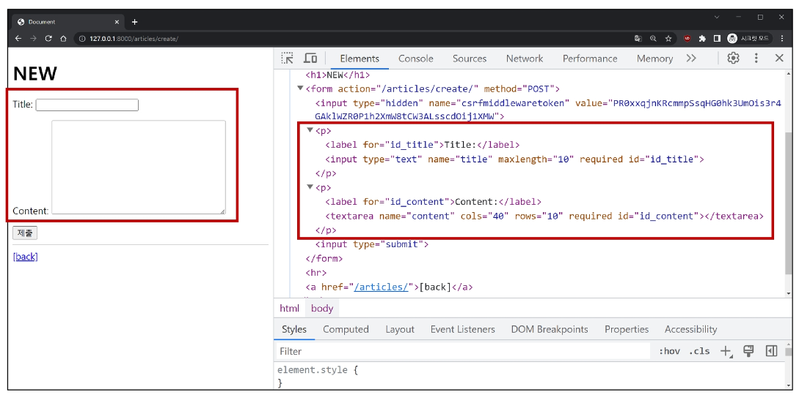

# Django Form

1. 개요

2. Django Form
   
   - Form rendering option
   
   - Widgets

3. Django ModelForm
   
   - Meta class
   
   - create - is_valid
   
   - edit
   
   - update - save()

4. Handling HTTP requests
   
   - new & create
   
   - edit, update

5. 완성

## 1. 개요

- HTML 'form'
  
  - 지금까지 사용자로부터 데이터를 받기 위해 활용한 방법
  
  - 그러나 비정상적 혹은 악의적 요청을 필터링 할 수 없음
    
    - 유효한 데이터인지에 대한 확인이 필요

- 유효성 검사
  
  - 수집한 데이터가 정확하고 유효한지 확인하는 과정

- 유효성 검사 구현
  
  - 유효성 검사를 구현하기 위해서는 입력값, 형식, 중복, 범위, 보안 등 많은 것들을 고려해야 함
  
  - 이런 과정과 기능을 직접 개발하는 것이 아닌 Django가 제공하는 Form을 사용

## 2. Django Form

- 사용자 입력 데이터를 수집하고, 처리 및 유효성 검사를 수행하기 위한 도구
  
  - 유효성 검사를 단순화하고 자동화 할 수 있는 기능을 제공

- Form class 정의
  
  - articles/forms.py
  
  ```python
   # articles/forms.py
   from django import forms
  
   class ArticleForm(forms.Form):
       title = forms.CharField(max_length=10)
       content = forms.CharField() # forms의 Charfield에서는 max_length가 필수 요소가 아
  ```

- Form class를 적용한 new 로직
  
  - articles/views.py
  
  ```python
  def new(request):
      form = ArticleForm()
      context = {
          'form': form,
      }
      return render(request, 'articles/new.html', context)
  ```
  
  - articles/new.html
  
  ```django
  h1>NEW</h1>
    <form action="" method="POST">
      
      {{ form }}
      <input type="submit">
    </form>
  ```
  
  

- ### Form rendering option
  
  - label, input 쌍을 특정 HTML 태그로 감싸는 옵션
  
  - [Working with forms | Django documentation | Django](https://docs.djangoproject.com/en/4.2/topics/forms/#form-rendering-options)
  
  ```django
    <h1>NEW</h1>
    <form action="" method="POST">
      
      {{ form.as_p }}
      <input type="submit">
    </form>
  ```


- ### Widgets
  
  - HTML 'input' element의 표현을 담당
  
  - 단순히 input 요소의 속성 및 출력되는 부분을 변경하는 것
  
  - [Widgets | Django documentation | Django](https://docs.djangoproject.com/en/4.2/ref/forms/widgets/#build-in-widget)
  
  - articles/forms.py
    
    ```python
    class ArticleForm(forms.Form):
        title = forms.CharField(max_length=10)
        content = forms.CharField(widget=forms.Textarea)
    ```


## 3. Django ModelForm

- Form : 사용자 입력 데이터를 DB에 저장하지 않을 때 (ex. 로그인)

- ModelForm : 사용자 입력 데이터를 DB에 저장해야 할 때 (ex. 게시글, 회원가입)

- ModelForm
  
  - Model과 연결된 Form을 자동으로 생성해주는 기능을 제공
    
    - Form + Model
  
  - articles/form.py
  
  ```python
  # articles/form.py
  
  from django import forms
  from .models import Article
  
  class ArticleForm(forms.ModelForm):
      # model 등록
      class Meta:
          model = Article
          fields = '__all__'
  ```



- #### Meta class
  
  - ModelForm의 정보를 작성하는 곳
  
  - fields 및 exclude
    
    - exclude 속성을 사용하여 모델에서 사용하지 않을 필드를 지정할 수 있다


- #### ModelForm을 적용한 create 로직
  
  - articles/views.py
  
  ```python
  # articles/views.py
  
  from .forms import ArticleForm
  
  def create(request):
      form = ArticleForm(request.POST)
      # 유효성 검사 진행
      # 유효성 검사가 통과된 경우
      if form.is_valid():
          form.save()
          return redirect('articles:index')
      # 유효성 검사가 실패한 경우
      context = {
          'form': form,
      }
      return render(request, 'articles/new.html', context)
  ```


- `is_valid()`
  
  - 여러 유효성 검사를 실행하고, 데이터가 유효한지 여부를 Boolean으로 반환

- 공백 데이터가 유효하지 않은 이유와 에러메시지가 출력되는 과정
  
  - 별도로 명시하지 않았지만 모델 필드에는 기본적으로 빈 값은 허용하지 않는 제약조건이 설정되어 있음
  
  - 빈 값은 `is.valid()`에 의해 False로 평가되고 form 객체에는 그에 맞는 에러 메시지가 포함되어 다음 코드로 진행됨

- #### ModelForm을 적용한 edit로직
  
  - articles/views.py
  
  ```python
  def edit(request, pk):
      article = Article.objects.get(pk=pk)
      form = ArticleForm(instance=article)
      context = {
          'article': article,
          'form' : form,
      }
      return render(request, 'articles/edit.html', context)
  ```
  
  - articles/edit.html
  
  ```django
  <h1>Edit</h1>
    <form action="" method="POST">
      
      {{ form.as_p }
      <input type="submit">
    </form>
  ```

- #### ModelForm을 적용한 update로직
  
  - articles/views.py
  
  ```python
  def update(request, pk):
      article = ArticleForm(request.POST)
      form = ArticleForm(request.POST, instance=article)
      if form.is_valid():
          form.save()
          return redirect('articles:detail', article.pk)
      context = {
          'form': form,
      }
      return render(request, 'articles/edit.html', context)
  ```
  
  - `save()`
    
    - 데이터베이스 객체를 만들고 저장

- `save()` 메서드가 생성과 수정을 구분하는 법
  
  - 키워드 인자 <mark>**instance**</mark> 여부를 통해 생성할지, 수정할 지를 결정


- Django Form 정리
  
  - 사용자로부터 데이터를 수집하고 처리하기 위한 강력하고 유연한 도구
  
  - HTML form의 생성, 데이터 유효성 검사 및 처리를 쉽게 할 수 있도록 도움

## 참고

- #### ModelForm 키워드 인자 data와 instance 살펴보기

https://github.com/django/django/blob/main/django/forms/models.py#L341


- #### Widget 응용
  
  - articles/forms.py

```python
class ArticleForm(forms.ModelForm):
    title = forms.CharField(
        label = '제목',
        widget = forms.TextInput(
            attrs = {
                'class' : 'my-title',
                'placeholder' : 'Enter the title',
                'maxlength' : 10,
            }
        ),
    )
    content = forms.CharField(
        label = '내용',
        widget=forms.Textarea(
            attrs={
                'class': 'my-content',
                'placeholder' : 'Enter the content',
                'rows' : 5,
                'cols' : 50,
            }
        ),
        error_messages={'required' : '내용을 입력해주세요.'}
    )
    class Meta:
        model = Article
        fields = '__all__'
```

## Handling HTTP requests

- view 함수 구조 변화

- new & create view함수간 공통점과 차이점
  
  - 공통점 : "데이터 생성을 구현하기 위함"
  
  - 차이점 : new는 GET method요청만, create는 POST method 요청만을 처리

- HTTP request method 차이점을 활용해 view 함수 구조 변경

- #### new & create
  
  
  
  - new와 create view함수의 공통점과 차이점을 기반으로 하나의 함수로 결합
  
  - 두 함수의 유일한 차이점이었던 request method에 따른 분기
  
  - POST일 때는 과거 create 함수 구조였던 객체 생성 및 저장 로직 처리
  
  - POST가 아닐 때는 과거 단순히 form 인스턴스 생성
  
  - context에 담기는 form
    
    1. is_valid를 통과하지 못해 에러메시지를 담은 form이거나
    
    2. else 문을 통한 form 인스턴스


- new url제거하고 new url을 create url로 변경

- new 템플릿을 create 템플릿으로 변경
  
  

- Request method에 따른 요청의 변화
  
  - (GET) articles/create/  : 게시글 생성 문서를 줘!
  
  - (POST) articles/create/  : 게시글을 생성해 줘!

- #### update
  
  - 기존 edit과 update view함수 결합
  
  
  
  -  사용하지 않는  edit url 제거
  
  - edit 템플릿을 update 템플릿으로 변경
  
  

---

# 완성

```python
# articles/urls.py

from django.urls import path
from . import views

app_name = 'articles'
urlpatterns = [
    path('', views.index, name='index'),
    path('<int:pk>/', views.detail, name='detail'),
    # path('new/', views.new, name='new'),
    path('create/', views.create, name='create'),
    path('<int:pk>/delete/', views.delete, name='delete'),
    # path('<int:pk>/edit/', views.edit, name='edit'),
    path('<int:pk>/update/', views.update, name='update'),
]
```

```python
# articles/models.py

from django.db import models

# Create your models here.
class Article(models.Model):
    title = models.CharField(max_length=10)
    content = models.TextField()
    created_at = models.DateTimeField(auto_now_add=True)
    updated_at = models.DateTimeField(auto_now=True)
```

```python
# articles/forms.py

from django import forms
from .models import Article


# class ArticleForm(forms.Form):
#     title = forms.CharField(max_length=10)
#     content = forms.CharField(widget=forms.Textarea)

class ArticleForm(forms.ModelForm):
    class Meta:
        model = Article
        fields = '__all__'


# formfield 및 widget 활용
# https://docs.djangoproject.com/en/4.2/ref/forms/fields/
# https://docs.djangoproject.com/en/4.2/topics/forms/
# https://docs.djangoproject.com/en/4.2/ref/forms/widgets/

class ArticleForm(forms.ModelForm):
    title = forms.CharField(
        label='제목',
        widget=forms.TextInput(
            attrs={
                'class': 'my-title',
                'placeholder': 'Enter the title',
                'maxlength': 10,
            }
        )
    )
    content = forms.CharField(
        label='내용',
        widget=forms.Textarea(
            attrs={
                'class': 'my-content',
                'placeholder': 'Enter the content',
                'rows': 5,
                'cols': 50,
            }
        ),
        error_messages={
            'required': '내용을 입력해주세요.'
        }
    )

    # model 등록
    class Meta:
        model = Article
        fields = '__all__'
        # fields = ('title',)
        # exclude = ('title',)
```

```python
# articles/admin.py

from django.contrib import admin
from .models import Article

admin.site.register(Article)
```

```python
# articles/views.py

from django.shortcuts import render, redirect
from .models import Article
from .forms import ArticleForm


# Create your views here.
def index(request):
    articles = Article.objects.all()
    context = {
        'articles': articles,
    }
    return render(request, 'articles/index.html', context)


def detail(request, pk):
    article = Article.objects.get(pk=pk)
    context = {
        'article': article,
    }
    return render(request, 'articles/detail.html', context)


# def new(request):
#     form = ArticleForm()
#     context = {
#         'form': form,
#     }
#     return render(request, 'articles/new.html', context)


def create(request):
    # 요청의 메서드가 POST라면 (create)
    if request.method == 'POST':
        form = ArticleForm(request.POST)
        # 유효성 검사 진행
        # 유효성 검사가 통과된 경우
        if form.is_valid():
            article = form.save()
            return redirect('articles:detail', article.pk)
    # 요청의 메서드가 POST가 아니라면 (new)
    else:
        form = ArticleForm()
    context = {
        'form': form,
    }
    return render(request, 'articles/create.html', context)

    # title = request.POST.get('title')
    # content = request.POST.get('content')
    # article = Article(title=title, content=content)
    # article.save()
    # return redirect('articles:index')


def delete(request, pk):
    article = Article.objects.get(pk=pk)
    article.delete()
    return redirect('articles:index')


# def edit(request, pk):
#     article = Article.objects.get(pk=pk)
#     form = ArticleForm(instance=article)
#     context = {
#         'article': article,
#         'form': form,
#     }
#     return render(request, 'articles/edit.html', context)


def update(request, pk):
    article = Article.objects.get(pk=pk)
    # 요청의 메서드가 POST라면 (update)
    if request.method == 'POST':
        form = ArticleForm(request.POST, instance=article)
        if form.is_valid:
            form.save()
            return redirect('articles:detail', article.pk)
    # 요청의 메서드가 POST가 아니라면 (edit)
    else:
        form = ArticleForm(instance=article)
    context = {
        'article': article,
        'form': form,
    }
    return render(request, 'articles/update.html', context)


    # article.title = request.POST.get('title')
    # article.content = request.POST.get('content')
    # article.save()
    # return redirect('articles:detail', article.pk)
```

```django
    <h1>CREATE</h1>
  <form action="" method="POST">
    
    <!--
      form 인스턴스를 쪼개고 싶다면
      - https://docs.djangoproject.com/en/4.2/topics/forms/#rendering-fields-manually
    -->
    {{ form.as_p }}
     
    <div>
      <label for="title">제목 : </label>
      <input type="text" id="title" name="title">
    </div>
    <div>
      <label for="content">내용 : </label>
      <textarea name="content" id="content" cols="30" rows="10"></textarea>
    </div> 
    
    <input type="submit">
  </form>
  <hr>
  <a href="">[back]</a>
```
