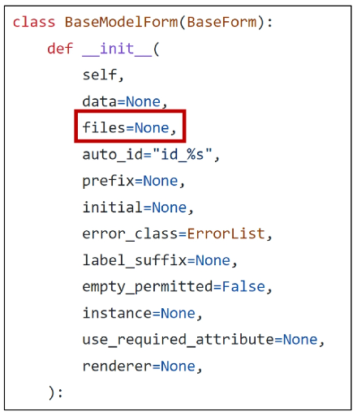

# Static files

[1. Static files](#static-files)
   
   - [Static files 제공하기](#static-files-제공하기)

[2. Media files](#media-files)
   
   - [이미지 업로드](#이미지-업로드)
   
   - [업로드 이미지 제공](#업로드-이미지-제공)
  
   - [업로드 이미지 수정](#업로드-이미지-수정)

[3. 참고](#참고)
- upload_to
- request.FILES가 두번째 위치 인자인 이유

## Static Files(정적 파일)

- 서버 측에서 변경되지 않고 고정적으로 제공되는 파일(이미지, JS, CSS 파일 등)

- 웹 서버와 정적 파일
  
  - 웹 서버의 기본동작은 <mark>특정 위치(URL)에 있는 자원</mark>을 요청(HTTP request) 받아서 응답(HTTP response)을 처리하고 제공(serving)하는 것
  
  - 이는 '자원에 접근 가능한 주소가 있다' 라는 의미
  
  - 웹 서버는 요청 받은 URL로 서버에 존재하는 정적 자원을 제공함
  
  - <mark>정적 파일을 제공하기 위한 경로(URL)</mark>가 있어야 함

### Static files 제공하기

1. 기본 경로에서 제공하기
   
   - Static files 기본 경로
     
     > app폴더/static
   
   - articles/static/articles 경로에 이미지 파일 배치
   
   - static tag 사용해 이미지 파일에 대한 url 제공
   
   - articles/index.html
   
   ```django
   
   
   
   ```
   
   - STATIC_URL 확인 : http:127.0.0.1:8000/static/articles/sample-1.png
   
   - **STATIC_URL**
     
     - 기본 경로 및 추가 경로에 위치한 정적 파일을 참조하기 위한 URL 실제 파일이나 디렉토리가 아니며, URL로만 존재
   
   ```python
   # settings.py
   
   STATIC_URL = 'static/'
   ```
   
   

2. 추가 경로에서 제공하기
   
   - Static files 추가 경로
     
     - STATICFILES_DIRS에 문자열 값으로 추가 경로 설정
   
   - **STATICFILES_DIRS**
     
     - 정적 파일의 기본 경로 외에 추가적인 경로 목록을 정의하는 리스트
   
   - 임의로 추가 경로 설정
   
   ```python
   # settings.py
   
   STATICFILES_DIRS = [
       BASE_DIR / 'static',
   ]
   ```
   
   - 추가 경로에 이미지 파일 배치
   
   - static tag를 사용해 이미지 파일에 대한 url 제공
   
   ```django
   <!-- articles/index.html -->
   
   
   ```
- **정적 파일을 제공하려면 요청에 응답하기 위한 URL이 필요**

## Media files

- 사용자가 웹에서 업로드 하는 정적 파일(user-uploaded)

- ImageField()
  
  - 이미지 업로드에 사용하는 모델 필드
  
  - 이미지 객체가 직접 저장되는 것이 아닌 '**<mark>이미지 파일의 경로</mark>**'가 문자열로 DB에 저장

- 미디어 파일을 제공하기 전 준비
  
  1. settings.py 에 **<mark>MEDIA_ROOT, MEDIA_URL</mark>** 설정
  
  2. 작성한 <mark>**MEDIA_ROOT와 MEDIA_URL**</mark>에 대한 url 지정

- MEDIA_ROOT
  
  - 미디어 파일들이 위치하는 디렉토리의 절대 경로
  
  ```python
  # settings.py
  
  MEDIA_ROOT = BASE_DIR / 'media'
  ```

- MEDIA_URL
  
  - MEDIA_ROOT에서 제공되는 미디어 파일에 대한 주소를 생성(STATIC_URL과 동일한 역할)
  
  ```python
  # settings.py
  
  MEDIA_URL = 'media/'
  ```

- MEDIA_ROOT와 MEDIA_URL에 대한 url 지정
  
  - 업로드 된 파일의 URL == settings.MEDIA_URL
  
  - 위 URL을 통해 참조하는 파일의 실제 위치 == settings.MEDIA_ROOT
  
  ```python
  # crud/uls.py
  
  from django.conf import settings
  from django.conf.urls.static import static
  
  urlpatterns = [
      path('admin/', admin.site.urls),
      path('articles/', include('articles.urls')),
  ] + static(settings.MEDIA_URL, document_root=settings.ㅡ)
  ```
  
  ### 이미지 업로드
  
  1. blank=True 속성을 작성해 빈 문자열이 저장될 수 있도록 제약 조건 설정
     
     - 기존 필드 사이에 작성해도 실제 테이블 생성 시에는 가장 우측(뒤)에 추가됨
  
  ```python
  # articles/models.py
  
  class Article(models.Model):
      title = models.CharField(max_length=10)
      content = models.TextField()
      image = models.ImageField(blank=True)
      created_at = models.DateTimeField(auto_now_add=True)
      updated_at = models.DateTimeField(auto_now=True)
  ```
  
  2. migration 진행
     
     - ImageField를 사용하려면 반드시 Pillow 라이브러리가 필요
     
     ```bash
     $ pip install pillow
     
     $ python manage.py makemigrations
     $ python manage.py migrate
     
     $ pip freeze > requirements.txt
     ```
  
  3. form 요소의 enctype 속성 추가
     
     - enctype="multipart/form-data"
       
       ```django
       <!-- articles/create.html -->
         <h1>CREATE</h1>
         <form action="" method="POST" enctype="multipart/form-data">
           
           {{ form.as_p }}
           <input type="submit">
         </form>
       ```
  
  4. view  함수에서 업로드 파일에 대한 추가 코드 작성
     
     - request.FILES 추가
     
     ```python
     # articles/view.py
     
     def create(request):
         if request.method == 'POST':
             form = ArticleForm(request.POST, request.FILES)
             if form.is_valid():
                 article = form.save()
                 return redirect('articles:detail', article.pk)
     ....
     ```
  
  5. 이미지 업로드 입력 양식 확인
     
     
  
  6. 이미지 업로드 결과 확인
     
     - DB에는 파일 자체가 아닌 '파일 경로'가 저장
     
     

### 업로드 이미지 제공

1. '<mark>**url**</mark>'속성을 통해 업로드 파일의 경로값을 얻을 수 있음
   
   - article.image.url
     
     - 업로드 파일의 경로
   
   - article.image
     
     - 업로드 파일의 파일이름
   
   ```django
   <!-- articles/detail.html -->
   
   
   ```

2. 업로드 이미지 출력 확인 및 MEDIA_URL 확인
   
   

3. 이미지를 업로드 하지 않은 게시물은 detial 템플릿을 렌더링 할 수 없음
   
   - 이미지 데이터가 있는 경우만 이미지를 출력할 수 있도록 처리
   
   ```django
   <!-- articles/detail.html -->
   
     
       
     
   ```

### 업로드 이미지 수정

1. 수정 페이지 form 요소에 enctype 속성 추가
   
   - enctype="multipart/form-data"
   
   ```django
     <!-- articles/update.html -->
     
     <h1>Update</h1>
     <form action="" method="POST" enctype="multipart/form-data">
       
       {{ form.as_p }}
       <input type="submit">
     </form>
   ```

2. update view 함수에서 업로드 파일에 대한 추가 코드 작성
   
   - request.FILES
   
   ```python
   # articles/views.py
   
   def update(request, pk):
       article = Article.objects.get(pk=pk)
       if request.method == 'POST':
           form = ArticleForm(request.POST, request.FILES, instance=article)
           if form.is_valid:
               form.save()
               return redirect('articles:detail', article.pk)
   ```

## 참고

- 'upload_to' argument
  
  - ImageField()의 upload_to 인자를 사용해 미디어 파일 추가 경로 설정
    
    ```python
    # articles/models.py
    
    from django.db import models
    
    # Create your models here.
    class Article(models.Model):
        # 1
        image = models.ImageField(blank=True, upload_to='images/')
        # 2
        image = models.ImageField(blank=True, upload_to='%Y/%m/%d/')
      
    # 3
    def articles_image_path(instance, filename):
        return f'images/{instance.user.username}/{filename}'
    
    image = models.ImageField(blank=True, upload_to=articles_image_path)
    ```

- request.FILES가 두번째 위치 인자인 이유
  
  - ModelForm 상위 클래스 BaseModelForm의 생성자 함수 키워드 인자
    
    
  
  
