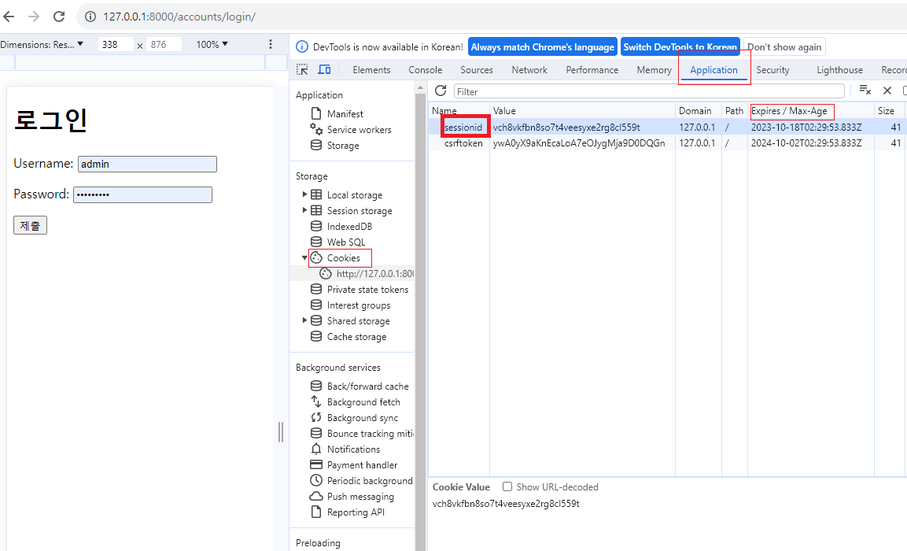

# Django Authentication System 1

[1. Cookie & Session](#1-cookie--session)

- [HTTP](#http)

- [Cookie](#쿠키cookie)

- [Session](#세션session)

[2. Authentication System](#2-authentication-system)

[3. Custom User model](#3-custom-user-model)

[4. Login](#4-login)

[5. Logout](#5-logout)

[6. Template with Authentication data](#6-template-with-authentication-data)

## 1. Cookie & Session

- 개요
  
  - 우리가 서버로부터 받은 페이지를 둘러볼 때 우리는 서버와 서로 연결되어 있는 상태가 아니다.

### HTTP

- HTML 문서와 같은 리소스들을 가져올 수 있도록 해주는 규약

- 웹(WWW)에서 이루어지는 모든 데이터 교환의 기초

- 특징
  
  1. 비연결지향(connectionless)
     
     - 서버는 요청에 대한 응답을 보낸 후 연결을 끊음
  
  2. 무상태(stateless)
     
     - 연결을 끊는 순간 클라이언트와 서버 간의 통신이 끝나며 상태 정보가 유지되지 않음

### 쿠키(Cookie)

- 서버가 사용자의 웹 브라우저에 전송하는 작은 데이터 조각
  
  - 클라이언트 측에서 저장되는 작은 데이터 파일이며, 사용자 인증, 추적, 상태 유지 등에 사용되는 데이터 저장 방식


- 사용 원리
  
  1. 브라우저(클라이언트)는 쿠키를 key-value의 데이터 형식으로 저장
  
  2. 이렇게 쿠키를 저장해놓았다가, 동일한 서버에 재요청 시 저장된 쿠키를 함께 전송
     
     - 쿠키는 두 요청이 동일한 브라우저에서 들어왔는지 아닌지를 판단할 때 주로 사용됨
       
       - 이를 이용해 사용자의 로그인 상태를 유지할 수 있음
       
       - 상태가 없는(stateless) HTTP 프로토콜에서 상태 정보를 기억 시켜 주기 때문

- 사용 목적
  
  1. 세션 관리(Session management)
     
     - 로그인, 아이디 자동완성, 공지 하루 안 보기, 팝업 체크, 장바구니 등의 정보 관리
  
  2. 개인화(Personalization)
     
     - 사용자 선호, 테마 등의 설정
  
  3. 트래킹(Tracking)
     
     - 사용자 행동을 기록 및 분석

> 쿠키
> 
> - 클라이언트(브라우저)에 저장하는 작은 데이터 조각
> 
> - 요청을 보낼 때 쿠키도 함께 전송
> 
> - 장점
>   
>   - 서버에 부담이 적음
> 
> - 단점
>   
>   - 요청을 보낼 때 항상 같이 보낸다 => 보안에 비교적 취약

### 세션(Session)

- 서버 측에서 생성되어 클라이언트와 서버 간의 상태를 유지

- 상태 정보를 저장하는 데이터 저장 방식
  
  - <mark>**쿠키에 세션 데이터를 저장**</mark>하여 매 요청시마다 세션 데이터를 함께 보냄

- 작동원리
  
  1. 클라이언트가 로그인을 하면 서버가 session 데이터를 생성 후 저장
  
  2. 생성된 session 데이터에 인증할 수 있는 session id를 발급
  
  3. 발급한 session id를 클라이언트에게 응답
  
  4. 클라이언트는 응답 받은 session id를 쿠키에 저장
  
  5. 클라이언트가 다시 동일한 서버에 접속하면 요청과 함꼐 쿠키(session id가 저장된)를 서버에 저달
  
  6. 쿠키는 요청 때마다 서버에 함께 전송되므로 서버에서 session id를 확인해 로그인 되어 있다는 것을 알도록 함

- 서버 측에서는 세션 데이터를 생성 후 저장하고 세션 ID를 생성

- 이 ID를 클라이언트 측으로 전달하여, 클라이언트는 쿠키에 이 ID를 저장

- 서버로부터 쿠키를 받아 브라우저에 저장하고, 클라이엍느가 같은 서버에 재요청 시마다 저장해두었던 쿠키도 요청과 함께 전송
  
  - 예를 들어 로그인 유지를 위해 로그인 되어있다는 사실을 입증하는 데이터를 매 요청마다 계속해서 보내는 것

> 세션
> 
> - 데이터 저장을 서버에 하고, 해당 데이터를 찾을 수 있는 key를 클라이언트가 가짐
> 
> - 요청 시마다 세션id를 전달 -> 서버는 해당 세션 id를 이용하여 사용자 데이터를 조회
> 
> - 장점
>   
>   - 비교적 보안이 좋다
> 
> - 단점
>   
>   - 서버의 부담이 더 된다.
>   
>   - 세션 ID를 통해 저장된 데이터를 서버가 열어보아야 한다.
>   
>   - 데이터를 서버에 저장 -> 리소스를 더 많이 먹는다.

#### 쿠키와 세션의 목적 : 서버와 클라이언트 간의 상태를 유지

### 참고

- JWT(Json Web Token)
  
  - 현업에서는 보통 이 방식을 쓴다.
  
  - 사용자 인증 구현 방식

- 쿠키 종류별 Lifetime(수명)
  
  1. Session cookie
     
     - 현재 세션(current session)이 종료되면 삭제됨
     
     - 브라우저 종료와 함꼐 삭제됨
  
  2. Persistent cookies
     
     - Expires 속성에 지정된 날짜 혹은 Max-Age 속성에 지정된 기간이 지나면 삭제됨

- 세션 in Django
  
  - Django는 'database-backed sessions' 저장 방식을 기본 값으로 사용
  
  - session 정보는 DB의 django_session 테이블에 저장
  
  - Django는 특정 session id를 포함하는 쿠키를 사용해서 각각의 브라우저와 사이트가 연결된 session을 알아냄
  
  - Django는 우리가 session 메커니즘(복잡한 동작원리)에 대부분 생각하지 않게끔 많은 도움을 줌

## 2. Authentication System

- Django Authentication System(인증 시스템)
  
  - 사용자 인증과 관련된 기능을 모아 놓은 시스템

- Authentication(인증)
  
  - 사용자가 자신이 누구인지 확인하는 것(신원 확인)

- 사전 준비
  
  - 두번째 app "accounts" 생성 및 등록
  
  - auth와 관련된 경로나 키워드들을 django 내부적으로 accounts라는 이름으로 사용하고 있기 때문에 되도록<mark> 'accounts'로 지정하는 것을 권장</mark>


## 3. Custom User model

- Custom User model로 '<mark>**대체**</mark>'하기
  
  - django가 기본적으로 제공하는 User model은 내장된 auth 앱의 User 클래스를 사용

- 내장된 auth 앱
  
  

- User 클래스를 대체하는 이유
  
  - 우리는 지금까지 별도의 User클래스 정의 없이 내장된 User 클래스를 사용했음
  
  - 별도의 설정 없이 사용할 수 있어 간편하지만, 개발자가 직접 수정할 수 없는 문제가 존재
  
  - https://github.com/django/django/blob/main/django/contrib/auth/models.py#L405
  
  ```python
  # settings.py
  
  # 기본값
  AUTH_USER_MODEL = 'auth.User'
  
  # 우리가 설정
  AUTH_USER_MODEL = 'accounts.User'
  ```

- 대체하기
1. AbstractUser를 상속받는 커스텀 User 클래스 작성
   
   - 기존 User 클래스도 AbstractUser를 상속받기 때문에 <mark>커스텀 User 클래스도 기존 User클래스와 완전히 같은 모습을 가지게 됨</mark>
   
   - accounts/models.py

```python
# accounts/models.py

from django.db import models
from django.contrib.auth.models import AbstractUser

# Create your models here.
class User(AbstractUser):
    pass
```

2. django 프로젝트가 사용하는 기본 User 모델을 우리가 작성한 User 모델로 지정
   
   - 수정 전 기본값은 AUTH_USER_MODEL = 'accounts.User'
   
   - settings.py

```python
# settins.py

AUTH_USER_MODEL = 'accounts.User'
```

3. 대체하기
   
   - 기본 User 모델이 아니기 때문에 등록하지 않으면 admin site에 출력되지 않음
   
   - accounts/admin.py

```python
# accounts/admin.py

from django.contrib import admin
from django.contrib.auth.admin import UserAdmin
from .models import User

# Register your models here.
admin.site.register(User, UserAdmin)
```

## 주의 : 프로젝트 중간에 AUTH_USER_MODEL을 변경할 수 없음

- 이미 프로젝트가 진행되고 있을 경우 데이터베이스 초기화 후 진행

- User 테이블의 변화


- 프로젝트를 시작하며 반드시 User 모델을 대체해야 한다.
  
  - Django는 새 프로젝트를 시작하는 경우 비록 기본 User 모델이 충분하더라도 커스텀 User 모델을 설정하는 것을 강력하게 권장하고 있음
  
  - [Customizing authentication in Django | Django documentation | Django](https://docs.djangoproject.com/en/4.2/topics/auth/customizing/)
  
  - 커스템 User 모델은 기본 User 모델과 동일하게 작동하면서도 <mark>**필요한 경우 나중에 맞춤 설정할 수 있기 때문**</mark>
  
  - 단 User 모델 대체 작업은 프로젝트의 모든 migrations 혹은 첫 migrate를 실행하기 전에 이 작업을 마쳐야 함

## 4. Login

- **Session**을 **Create**하는 과정

- AuthenticationForm()
  
  - 로그인 인증에 사용할 데이터를 입력 받는 built-in form

- 로그인 페이지 작성
  
  - accounts/urls.py
    
    ```python
    # accounts/urls.py
    
    from django.urls import path
    from . import views
    
    app_name = 'accounts'
    urlpatterns = [
        path('login/', views.login, name='login'),
    ]
    ```
  
  - accounts/views.py
    
    - from django.contrib.auth.forms import AuthenticationForm 중요
    
    ```python
    # accounts/views.py
    from django.shortcuts import render
    from django.contrib.auth.forms import AuthenticationForm
    
    # Create your views here.
    def login(request):
        if request.method == 'POST':
            pass
        else:
            form = AuthenticationForm()
        context = {
            'form' : form,
        }
        return render(request, 'accounts/login.html', context)
    ```
  
  - accounts/login.html
    
    ```django
    <h1>로그인</h1>
     <form action="" method="POST">
         
         {{ form.as_p }}
         <input type="submit">
     </form>
    ```

- 로그인 로직 작성
  
  - accounts.views.py
    
    - AuthenticationForm(request, request.POST) : 인자가 그냥 ModelForm이랑 다름!
    
    - from django.contrib.auth import login as auth_login 까먹지 않기
      
      - as auth_login하는 이유 : 우리가 만드는 함수 이름이 login이라서 import하는것도 똑같으면 작동 안하니까
      
      - 첫번째 인자 request, 두번째 인자 userdata
      
      - get_user는 메서드로 userdata를 가져와준다
  
  ```python
  from django.shortcuts import render, redirect
  from django.contrib.auth.forms import AuthenticationForm
  from django.contrib.auth import login as auth_login
  
  # Create your views here.
  def login(request):
      if request.method == 'POST':
          form = AuthenticationForm(request, request.POST)
          # form = AuthenticationForm(request, data = request.POST)
          if form.is_valid():
              auth_login(request, form.get_user())
              return redirect('articles:index')
  
      else:
          form = AuthenticationForm()
      context = {
          'form' : form,
      }
      return render(request, 'accounts/login.html', context)
  ```

- login(request, user)
  
  - AuthenticationForm을 통해 인증된 사용자를 로그인 하는 함수

- get_user()
  
  - AuthenticationForm 인스턴스 메서드
  - 유효성 검사를 통과했을 경우 로그인 한 사용자 객체를 반환

- 로그인 후 발급받은 세션 확인
  
  - python manage.py createsuperuser
  
  - 만약 sessionid라는 쿠키가 있으면 로그인에 성공한 것!
  
  - django는 session 최대 2주
  
  


- 로그인 링크 작성

```django
  <h1>INDEX</h1>
  <a href="">LOGIN</a>
  <a href="">CREATE</a>
  <hr>
```

## 5. Logout

- **Session**을 **Delete**하는 과정

- logout(request)
  
  - 현재 요청에 대한 Session Data를 DB에서 삭제
  
  - 클라이언트의 쿠키에서도 Session Id를 삭제

- 로그아웃 로직 작성
  
  - accounts/urls.py
  
  ```python
  # accounts/urls.py
  
  from django.urls import path
  from . import views
  
  app_name = 'accounts'
  urlpatterns = [
      path('login/', views.login, name='login'),
      path('logout/', views.logout, name = 'logout'),
  ]
  ```
  
  - accounts/views.py
  
  ```python
  # accounts/views.py
  
  from django.shortcuts import render, redirect
  from django.contrib.auth.forms import AuthenticationForm
  from django.contrib.auth import login as auth_login
  from django.contrib.auth import logout as auth_logout
  
  def logout(request):
      auth_logout(request)
      return redirect('articles:index')
  ```
  
  - articles/index.html
  
  ```django
    <h1>INDEX</h1>
    <a href="">LOGIN</a>
    <form action="" method="POST">
      
      <input type="submit" value='Logout'>
    </form>
  ```

## 6. Template with Authentication data

- 템플릿에서 인증 관련 데이터를 출력하는 방법

- 현재 로그인 되어 있는 유저 정보 출력하기
  
  - 로그인 후
    
    ```django
    <h3>Hello, {{ user.username}}</h3>
    ```

- context processors
  
  - 템플릿이 렌더링 될 때 호출 가능한 컨텍스트 데이터 목록
  
  - 작성된 컨텍스트 데이터는 기본적으로 템플릿에서 사용 가능한 변수로 포함됨
  
  - 즉, django에서 자주 사용하는 데이터 목록을 미리 템플릿에 로드해 둔 것
  
  

## 참고

- AuthenticationForm()
  
  - https://github.com/django/django/blob/main/django/contrib/auth/forms.py#L199
  
  - 

- AuthenticationForm의 get_user 인스턴스 메서트
  
  - https://github.com/django/django/blob/main/django/contrib/auth/forms.py#L269
  
  - 

- User 모델 상속 관계


- 'AbstractUser' class
  
  - 관리자 권한과 함께 완전한 기능을 가지고 있는 User model을 구현하는 추상 기본클래스
  
  - 몇 가지 공통 정보를 여러 다른 모델에 넣을 때 사용하는 클래스
  
  - 데이터베이스 테이블을 만드는데 사용되지 않으며, 대신 다른 모델의 기본 클래스로 사용되는 경우 해당 필드가 하위 클래스의 필드에 추가됨
  
  - [abc — Abstract Base Classes &#8212; Python 3.11.6 documentation](https://docs.python.org/3/library/abc.html)

- 유저 모델 대체하기 Tip
  
  - 공식문서
  
  - [Customizing authentication in Django | Django documentation | Django](https://docs.djangoproject.com/en/4.2/topics/auth/customizing/#substituting-a-custom-user-model)
