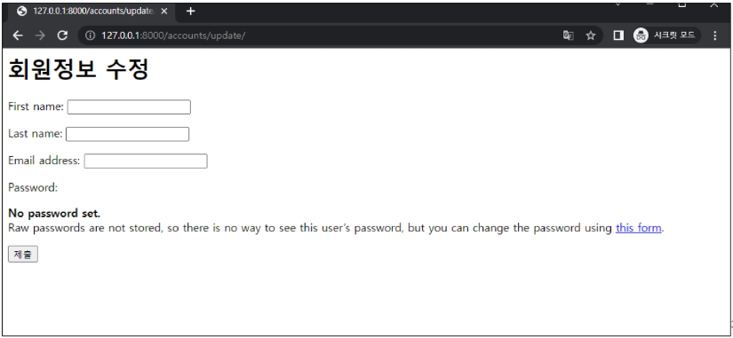

# Django Authentication System 2

[1. 회원 가입](#1-회원-가입)

[2. 회원 탈퇴](#2-회원-탈퇴)

[3. 회원정보 수정](#3-회원정보-수정)

[4. 비밀번호 변경](#4-비밀번호-변경)

- [세션 무효화 방지하기](#세션-무효화-방지하기)

[5. 로그인 사용자에 대한 접근 제한](#5-인증된-사용자에-대한-접근-제한)

[6. 참고](#참고)

[7. 완성본](#완성)

---

## 1. 회원 가입

- <mark>**User 객체**를 Create하는 과정</mark>

- `UserCreationForm()`
  
  - 회원 가입시 사용자 입력 데이터를 입력 받을 built-in **ModelForm**
  
  - Form 이랑 ModelForm은 인자 순서 다름!!
    
    - Form : request, data,  ... ,instance
    
    - ModelForm : data
1. 회원 가입 페이지 작성

```python
# accounts/urls.py
app_name = 'accounts'
urlpatterns = [
    ...,
    path('signup/', views.signup, name='signup'),
]
```

```python
# accounts/views.py
from django.contrib.auth.forms import UserCreationForm

def signup(request):
    if request.method == 'POST':
        form = UserCreationForm(request.POST)
        if form.is_valid():
            form.save()
            return redirect('articles:index')
    else:
        form = UserCreationForm()
    context = {
        'form' : form,
    }
    return render(request, 'accounts/signup.html', context)
```

```django
<!-- accounts/signup.html -->
  <h1>회원가입</h1>
  <form action="" method="POST">
    
    {{ form.as_p }}
    <input type="submit">
  </form>
```

- 회원 가입 로직 에러 발생
  
  - Manager isn't available; 'auth.User' has been swapped for 'accounts.User'
    
    
  
  - 회원 가입에 사용하는 `UserCreationForm`이 우리가 대체한 커스텀 유저 모델이 아닌 기존 유저 모델로 인해 작성된 클래스이기 때문
    
    - https://github.com/django/django/blob/main/django/contrib/auth/forms.py#L84
    
    
  
  - 커스텀 유저 모델을 사용하려면 다시 작성해야 하는 Form
    
    - `UserCreationForm`
    
    - `UserChangeForm`
      
      - 두  Form 모두 class Meta: model = User가 작성된 Form 이기 때문

- 회원 가입 로직 작성

```python
# accounts/form.py

from django.contrib.auth.forms import UserCreationForm, UserChangeForm
from django.contrib.auth import get_user_model


class CustomUserCreationForm(UserCreationForm):
    class Meta(UserCreationForm.Meta):
        model = get_user_model()


class CustomUserChangeForm(UserChangeForm):
    class Meta(UserChangeForm.Meta):
        model = get_user_model() 
```

- `get_user_model()` 
  
  - 현재 프로젝트에서 활성화된 사용자 모델(active user model)을 반환하는 함수

- User 모델을 직접 참조하지 않는 이유
  
  - `get_user_model()`을 사용해 User모델을 참조하면 커스텀 User 모델을 자동으로 반환해주기 때문
  
  - Django는 User클래스를 직접 참조하는 대신 `get_user_model()`을 사용해 참조해야 한다고 필수적으로 강조하고 있음

## 

## 2. 회원 탈퇴

- <mark>**User 객체**를 Delete 하는 과정</mark>

- 회원 탈퇴 로직 작성

```python
# accounts/urls.py
app_name = 'accounts'
urlpatterns = [
    ...,
    path('delete/', views.delete, name='delete'),
]
```

```python
# accounts/views.py

def delete(request):
    request.user.delete()
    return redirect('articles:index')
```

```django
<!-- articles/index.html -->

    <form action="" method="POST">
      
      <input type="submit" value="회원탈퇴">
    </form>
```

## 

## 3. 회원정보 수정

- <mark>**User 객체**를 Update 하는 과정</mark>

- `UserChangeForm()`
  
  - 회원정보 수정 시 사용자 입력 데이터를 받을 built-in **ModelForm**

```python
# accounts/urls.py
app_name = 'accounts'
urlpatterns = [
    ...,
    path('update/', views.update, name='update'),
]
```

```python
# accounts/views.py

from .forms import CustomUserCreationForm, CustomUserChangeForm


def update(request):
    if request.method == 'POST':
        pass
    else:
        form = CustomUserChangeForm(instance=request.user)
    context = {
        'form': form,
    }
    return render(request, 'accounts/update.html', context)
```

```django
 <!-- articles/index.html -->

 <a href="">회원정보수정</a>
```


- `UserChangeForm`사용시 문제점
  
  - User 모델의 모든 정보들(fields)까지 모두 출력되어 수정이 가능하기 때문에 일반 사용자들이 접근해서는 안되는 정보는 출력하지 않도록 해야 함
    
    - `CustomUserChangeForm`에서 접근 가능한 필드를 조정

- CustomUserChangeForm 출력 필드 재정의
  
  - User Model의 필드 목록 확인
  
  - [django.contrib.auth | Django documentation | Django](https://docs.djangoproject.com/en/4.2/ref/contrib/auth/)
  
  ```python
  # accounts/forms.py
  
  class CustomUserChangeForm(UserChangeForm):
      class Meta(UserChangeForm.Meta):
          model = get_user_model()
          fields = ('first_name', 'last_name', 'email')
  ```
  
  

- 회원정보 수정 로직 작성

```python
# accounts/views.py

def update(request):
    if request.method == 'POST':
        form = CustomUserChangeForm(request.POST, instance=request.use
        # form = CustomUserChangeForm(data=request.POST, instance=request.user)
        if form.is_valid():
            form.save()
            return redirect('articles:index')
    else:
        form = CustomUserChangeForm(instance=request.user)
    context = {
        'form': form,
    }
    return render(request, 'accounts/update.html', context)
```

## 4. 비밀번호 변경

- <mark>인증된 사용자의 **Session 데이터**를 Update 하는 과정</mark>

- `PasswordChangeForm()`
  
  - 비밀번호 변경 시 사용자 입력 데이터를 받을 built-in **Form**
  
  - 왜 Form??
    
    - 기존 session을 갱신하는 과정이라서

- 비밀번호 변경 페이지 작성
  
  - django는 비밀번호 변경 페이지를 회원정보 수정 form에서 별도 주소로 안내
  
  - `/user_pk/password/`
  
  
  
  ```python
  # crud/urls.py
  
  from accounts import views
  
  urlpatterns = [
      ...
      path('<int:user_pk>/password/', views.change_password, name='change_password'),
  ]
  ```

```
```python
# accounts/views.py

from django.contrib.auth.forms import PasswordChangeForm

def change_password(request, user_pk):
    if request.method == 'POST':
        pass
    else:
        form = PasswordChangeForm(request.user)
    context = {
        'form': form,
    }
    return render(request, 'accounts/change_password.html', context)
```


- 비밀번호 변경 로직 작성

### 세션 무효화 방지하기

- 왜  비밀번호만 바꿨는데 자동으로 로그아웃되지?
  
  - 비밀변호 변경되면서 세션데이터가 달라져서 => 브라우저 입장에서 기존에 있던 키가 안 먹히니까 자연스럽게 로그아웃 된 것

- 암호 변경시 세션 무효화
  
  - 비밀번호가 변경되면 기존 세션과의 회원 인증 정보가 일치하지 않게 되어 버려 로그인 상태가 유지되지 못하고 로그아웃 처리됨
  
  - 비밀번호가 변경되면서 기존 세션과의 회원 인증 정보가 일치하지 않기 때문

- `update_session_auth_hash(request, user)`
  
  - 암호 변경 시 세션 무효화를 막아주는 함수
    
    - 암호가 변경되면 새로운 password의 Session Data로 기존 session을 자동 갱신

```python
# accounts/views.py

from django.contrib.auth.forms import PasswordChangeForm
from django.contrib.auth import update_session_auth_hash

def change_password(request, user_pk):
    if request.method == 'POST':
        form = PasswordChangeForm(request.user, request.POST)
        if form.is_valid():
            user = form.save()
            update_session_auth_hash(request, user)
            return redirect('articles:index')
    else:
        form = PasswordChangeForm(request.user)
    context = {
        'form': form,
    }
    return render(request, 'accounts/change_password.html', context)
```

## 

## 5. 인증된 사용자에 대한 접근 제한

- 로그인 사용자에 대해 접근을 제한하는 2가지 방법
  
  1. `is_authenticated` 속성
  
  2. `login_required`  데코레이터

- `is_authenticated`
  
  - 사용자가 인증되었는지 여부를 알 수 있는 User model의 속성
    
    - 모든 User인스턴스에 대해 항상 True인 읽기 전용 속성이며, 비인증 사용자에 대해서는 항상 False
  
  - 로그인과 비로그인 상태에서 화면에 출력되는 링크를 다르게 설정하기
  
  ```django
  <!-- articles/index.html -->
  
    <h1>INDEX</h1>
    
      <h3>{{ user.username }}님 안녕하세요!</h3>
      <form action="" method="POST">
        
        <input type="submit" value="LOGOUT">
      </form>
      <form action="" method="POST">
        
        <input type="submit" value="회원탈퇴">
      </form>
      <a href="">회원정보수정</a>
    
      <a href="">LOGIN</a>
      <a href="">SIGNUP</a>
    
  ```
  
  - 인증된 사용자라면 로그인/회원가입 로직을 수행할 수 없도록 하기
  
  ```python
  # accounts/views.py
  
  def login(request):
      if request.user.is_authenticated:
          return redirect('articles:index')
      ...
  ```
  
  def signup(request):
  
      if request.user.is_authenticated:
          return redirect('articles:index')        
  
      ...

```
- `login_required`

- 인증된 사용자에 대해서만 view 함수를 실행시키는 데코레이터

  - 비인증 사용자의 경우 `/accounts/login/`주소로 `redirect`시킴

- 인증된 사용자만 게시글을 작성/수정/삭제 할 수 있도록 수정

```python
# articles/views.py

from django.contrib.auth.decorators import login_required

@login_required
def create(request):
    pass

@login_required
def delete(request, article_pk):
    pass

@login_required
def update(request, article_pk):
    pass
```

- 인증된 사용자만 로그아웃/탈퇴/수정/비밀번호 변경 할 수 있도록 수정
  
  ```python
  # accounts/views.py
  
  from django.contrib.auth.decorators import login_required
  
  @login_required
  def logout(request):
    pass
  
  @login_required
  def delete(request):
    pass
  
  @login_required
  def update(request):
    pass
  
  @login_required
  def change_password(request):
    pass
  ```

## 참고

- `is_authenticated` 속성 코드
  
  - https://github.com/django/django/blob/main/django/contrib/auth/base_user.py#L82
  
  

- 회원가입 후 로그인까지 이어서 진행하려면?

```python
# accounts/views.py

from django.contrib.auth.forms import UserCreationForm

def signup(request):
    if request.method == 'POST':
        form = UserCreationForm(request.POST)
        if form.is_valid():
            user = form.save()
            auth_login(request, user)
            return redirect('articles:index')
    else:
        form = UserCreationForm()
    context = {
        'form' : form,
    }
    return render(request, 'accounts/signup.html', context)
```


- 탈퇴와 함께 기존 사용자의 Session Data 삭제 방법
  
  - 사용자 객체 삭제 이후 로그아웃 함수 호출
  
  - <mark>(1)탈퇴 (2)로그아웃</mark> 순서가 바뀌면 안됨
  
  - 먼저 로그아웃이 진행되면 해당 요청 객체 정보가 없어지기 대문에 탈퇴에 필요한 유저 정보 또한 없어지기 때문

```python
# accounts/views.py

def delete(request):
    request.user.delete()
    return redirect('articles:index')
```

-----

# 완성

```python
# settings.py
AUTH_USER_MODEL = 'accounts.User'
```

```python
# crud/urls.py
from django.contrib import admin
from django.urls import path, include
from accounts import views


urlpatterns = [
    path('admin/', admin.site.urls),
    path('articles/', include('articles.urls')),
    path('accounts/', include('accounts.urls')),
    path('<int:user_pk>/password/', views.change_password, name='change_password'),
]
```

```python
# articles/views.py

from django.shortcuts import render, redirect
from django.contrib.auth.decorators import login_required
from .models import Article
from .forms import ArticleForm


# Create your views here.
def index(request):
    articles = Article.objects.all()
    context = {
        'articles': articles,
    }
    return render(request, 'articles/index.html', context)


def detail(request, pk):
    article = Article.objects.get(pk=pk)
    context = {
        'article': article,
    }
    return render(request, 'articles/detail.html', context)


@login_required
def create(request):
    if request.method == 'POST':
        form = ArticleForm(request.POST)
        if form.is_valid():
            article = form.save()
            return redirect('articles:detail', article.pk)
    else:
        form = ArticleForm()
    context = {
        'form': form,
    }
    return render(request, 'articles/create.html', context)


@login_required
def delete(request, pk):
    article = Article.objects.get(pk=pk)
    article.delete()
    return redirect('articles:index')


@login_required
def update(request, pk):
    article = Article.objects.get(pk=pk)
    if request.method == 'POST':
        form = ArticleForm(request.POST, instance=article)
        if form.is_valid:
            form.save()
            return redirect('articles:detail', article.pk)
    else:
        form = ArticleForm(instance=article)
    context = {
        'article': article,
        'form': form,
    }
    return render(request, 'articles/update.html', context)
```

```python
# accounts/urls.py

from django.urls import path
from . import views


app_name = 'accounts'
urlpatterns = [
    path('login/', views.login, name='login'),
    path('logout/', views.logout, name='logout'),
    path('signup/', views.signup, name='signup'),
    path('delete/', views.delete, name='delete'),
    path('update/', views.update, name='update'),
]
```

```python
# accounts/models.py

from django.db import models
from django.contrib.auth.models import AbstractUser

# Create your models here.
class User(AbstractUser):
    pass
```

```python
# accounts/forms.py

from django.contrib.auth.forms import UserCreationForm, UserChangeForm
from django.contrib.auth import get_user_model


class CustomUserCreationForm(UserCreationForm):
    class Meta(UserCreationForm.Meta):
        model = get_user_model()


class CustomUserChangeForm(UserChangeForm):
    class Meta(UserChangeForm.Meta):
        model = get_user_model()
        fields = ('first_name', 'last_name', 'email')
```

```python
# accounts/admin.py

from django.contrib import admin
from django.contrib.auth.admin import UserAdmin
from .models import User

# Register your models here.
admin.site.register(User, UserAdmin)
```

```python
# accounts/views.py
from django.shortcuts import render, redirect
from django.contrib.auth.forms import AuthenticationForm, PasswordChangeForm
from django.contrib.auth import login as auth_login
from django.contrib.auth import logout as auth_logout
from django.contrib.auth import update_session_auth_hash
from django.contrib.auth.decorators import login_required
from .forms import CustomUserCreationForm, CustomUserChangeForm


# Create your views here.
def login(request):
    if request.user.is_authenticated:
        return redirect('articles:index')

    if request.method == 'POST':
        form = AuthenticationForm(request, request.POST)
        if form.is_valid():
            auth_login(request, form.get_user())
            return redirect('articles:index')
    else:
        form = AuthenticationForm()
    context = {
        'form': form,
    }
    return render(request, 'accounts/login.html', context)


@login_required
def logout(request):
    auth_logout(request)
    return redirect('articles:index')


def signup(request):
    if request.user.is_authenticated:
        return redirect('articles:index')

    if request.method == 'POST':
        form = CustomUserCreationForm(request.POST)
        if form.is_valid():
            form.save()
            return redirect('articles:index')
    else:
        form = CustomUserCreationForm()
    context = {
        'form': form,
    }
    return render(request, 'accounts/signup.html', context)


@login_required
def delete(request):
    request.user.delete()
    return redirect('articles:index')


@login_required
def update(request):
    if request.method == 'POST':
        form = CustomUserChangeForm(request.POST, instance=request.user)
        if form.is_valid():
            form.save()
            return redirect('articles:index')
    else:
        form = CustomUserChangeForm(instance=request.user)
    context = {
        'form': form,
    }
    return render(request, 'accounts/update.html', context)


@login_required
def change_password(request, user_pk):
    if request.method == 'POST':
        form = PasswordChangeForm(request.user, request.POST)
        if form.is_valid():
            user = form.save()
            update_session_auth_hash(request, user)
            return redirect('articles:index')
    else:
        form = PasswordChangeForm(request.user)
    context = {
        'form': form,
    }
    return render(request, 'accounts/change_password.html', context)
```

```django
<!-- accounts/templates/accounts/signup.html -->

  <form action="" method="POST">
    
    {{ form.as_p }}
    <input type="submit">
  </form>
```

```django
<!-- accounts/templates/accounts/login.html -->

  <h1>로그인</h1>
  <form action="" method="POST">
    
    {{ form.as_p }}
    <input type="submit">
  </form>
```

```django
<!-- accounts/templates/accounts/update.html -->

  <h1>회원정보수정</h1>
  <form action="" method="POST">
    
    {{ form.as_p }}
    <input type="submit">
  </form>
```

```django
<!-- accounts/templates/accounts/change_passsword.html -->

  <h1>비밀번호 변경</h1>
  <form action="" method="POST">
    
    {{ form.as_p }}
    <input type="submit">
  </form>
```

```django
<!-- articles/templates/articles/index.html -->

   <h1>INDEX</h1>
  
    <h3>{{ user.username }}님 안녕하세요!</h3>
    <form action="" method="POST">
      
      <input type="submit" value="LOGOUT">
    </form>
    <form action="" method="POST">
      
      <input type="submit" value="회원탈퇴">
    </form>
    <a href="">회원정보수정</a>
  
    <a href="">LOGIN</a>
    <a href="">SIGNUP</a>
  

  <hr>

  <a href="">CREATE</a>
  <hr>
  
    <p>글 번호 : {{ article.pk }}</p>
    <a href="">
      <p>글 제목 : {{ article.title }}</p>
    </a>
    <p>글 내용 : {{ article.content }}</p>
    <hr>
  
```

---

- settings.py 는 변경되면 서버끄고 다시 실행해야 적용됨

- ```python
  LANGUAGE_CODE = 'ko-kr'
  
  TIME_ZONE = 'Asia/Seoul'
  ```
