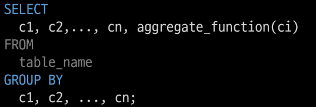

# SQL 1

1. Database

2. Relational Database

3. SQL

4. Single Table Queries
   
   - Querying data
   
   - Sorting data
   
   - Filtering data
     
     - Operators
   
   - Grouping data

## 1. 데이터베이스

- 체계적인 데이터 모음

## 1-1 데이터

- 저장이나 처리에 효율적인 형태로 변환된 정보

#### 증가하는 데이터 사용량 -> 데이터 센터의 성장 -> 데이터를 저장하고 잘 관리하여 활용할 수 있는 기술이 중요해짐

## 기존의 데이터 저장 방식

1. 파일(File) 이용
   
   - 어디서나 쉽게 사용 가능
   
   - 데이터를 구조적으로 관리하기 어려움

2. 스프레드 시트(Spreadsheet) 이용
   
   - 테이블의 열과 행을 사용해 데이터를 구조적으로 관리 가능
   
   - 크기 : 일반적으로 약 100만 행까지만 저장 가능
   
   - 보안 : 단순히 파일이나 링크 소유 여부에 따른 단순한 접근 권한 기능 제공
   
   - 정확성 : 만약 공식적으로 '강원'의 지명이 '강언'으로 바뀌었다고 가정한다면? => 이 변경으로 인해 테입르의 모든 위치에서 해당 값을 업데이트 해야함, 찾기, 바꾸기 기능을 사용해 바꿀 수 있지만 만약 데이터가 여러 시트에 분산되어 있다며 변경에 누락이 생기거나 추가 문제가 발생할 수 있음

## 1-2 데이터 베이스 역할

- 데이터를 **저장(구조적 저장**)하고 조작(CRUD)


# 2. 관계형 데이터베이스

- 데이터 간에 <mark>관계</mark>가 있는 데이터 항목들의 모음

- 테이블, 행, 열의 정보를 구조화하는 방식

- <mark>서로 관련된 데이터 포인터</mark>를 저장하고 이에 대한 <mark>액세스</mark>를 제공

- 관계로 인해 두 테이블을 사용하여 데이터를 다양한 형식으로 조회할 수 있음
  
  - 특정 날짜에 구매한 모든 고객 조회
  
  - 지난 달에 배송이 지연된 고객 조회

## 2-1 관계

여러 테이블 간의 (**논리적**) 연결


## 2-2 관계형 데이터베이스 예시

1. 다음과 같이 고객 데이터가 테이블에 저장되어 있다고 가정
   
   - 고객 데이터 간 비교를 위해서는 어떤 값을 활용해야 할까?
     
     - 이름? 주소? 만약 동명이인이나 같은 주소가 있다면?

2. 고객 데이터 간 비교를 위해서는 어떤 값을 활용해야 할까?
   
   - 각 데이터에 고유한 식별값을 부여하기 **<mark>(기본 키, Pirmary Key)</mark>**

3. 각 고객이 주문한 주문데이터가 테이블에 저장되어 있다고 가정
   
   - 누가 어떤 주문을 했는지 어떻게 식별할 수 있을까?
   
   - 고객의 고유한 식별 값을 저장하자 **<mark> (외래 키, Foreign Key)</mark>**


## 2-3 관계형 데이터베이스 관련  키워드

1. Table (*aka* Relation)
   
   - 데이터를 기록하는 곳

2. Field (*aka* Column, Attribute)
   
   - 각 필드에는 고유한 데이터 형식(타입)이 지정됨

3. Record (*aka* Row, Tuple)
   
   - 각 레코드에는 구체적인 데이터 값이 저장됨

4. Database (*aka* Schema)
   
   - 테이블의 집합

5. Primary Key(기본 키)
   
   - 각 레코드의 고유한 값
   
   - 관계형 데이터베이스에서 <mark>**레코드의 식별자**</mark>로 활용

6. Foreign Key(외래 키)
   
   - 테이블의 필드 중 다른 테이블의 레코드를 식별할 수 있는 키
   
   - 다른 테이블에서 기본 키를 참조
   
   - 각 레코드에서 서로 다른 테이블 간의 <mark>**관계를 만드는데**</mark> 사용


## 2-4 RDBMS (Relational Database Management System)

- 관계형 데이터베이스를 관리하는 소프트웨어 프로그램

- 종류
  
  - SQLite : 경량의 오픈 소스 데이터베이스 관리 시스템, 컴퓨터나 모바일 기기에 내장되어 간단하고 효율적인 데이터 저장 및 관리를 제공
  
  - MySQL
  
  - PostgreSQL
  
  - Oracle Database

## 2-5 DBMS

- 데이터 저장 및 관리를 용이하게 하는 시스템

- 데이터베이스와 사용자 간의 인터페이스 역할

- 사용자가 데이터 구성, 업데이트, 모니터링, 백업, 복구 등을 할 수 있도록 도움

> ### 데이터베이스 정리
> 
> - Table은 데이터가 기록되는 곳
> 
> - Table에는 행에서 고유하게 식별 가능한 기본 키라는 속성이 있으며, 외래 키를 사용하여 각 행에서 서로 다른 테이블 간의 관계를 만들 수 있음
> 
> - 데이터는 기본키 또는 외래키를 통해 결합(join)이 될 수 있는 여러 테이블에 걸쳐 구조화 됨


# 3. SQL (Structure Query Language)


- 데이터베이스에 정보를 저장하고 처리하기 위한 프로그래밍 언어

- 테이블의 형태로 **구조화**된 관계형 데이터베이스에서 요청을 **질의(요청)**

- 관계형 데이터베이스와의 대화를 위해 사용하는 프로그래밍 언어

### 3-1 SQL Syntax

- SQL 키워드는 대소문자를 구분하지 않음
  
  - 하지만 대문자로 작성하는 것을 권장(명시적 구분)

- 각  SQL Statements의 끝에는 세미콜론(;) 이 필요ㅕ
  
  - 세미콜론은 각 SQL Staements를 구분하는 방법(명령어의 마침표)

### 3-2 SQL Statements

- SQL을 구성하는 가장 기본적인 코드 블록

```sql
SELECT column_name FROM table_name;
```

- 해당 예시 코드는 `SELECT Statement`라 부름

- 이 Statement는 `SELECT`, `FROM` 2개의 keyword로 구성됨

- 유형


### 3-3 Query

- 데이터베이스로부터 정보를 요청하는 것

- 일반적으로 SQL로 작성하는 코드를 쿼리문(SQL문)이라 함

### 3-4 SQL 표준

- SQL은 미국 국립 표준 협회(ANSI)와 국제 표준화 기구(ISO)에 의해 표준이 채택됨

- 모든 RDBMS에서 SQL 표준을 지원

- 다만, 각 RDBMS마다 독자적인 기능에 따라 표준을 벗어나는 문법이 존재하지 주의


## 4. Single Table Queries

### 4-1 Querying data

- `SELECT` : 테이블에서 데이터를 조회
  
  - SELECT 키워드 이후 데이터를 선택하려는 필드를 하나 이상 지정
  
  - FROM 키워드 이후 데이터를 선택하려는 테이블의 이름을 지정

```sql
SELECT 
  LastName, FirstName
FROM
  employees;
```

- 테이블 employees에서 모든 필드 데이터를 조회

```sql
SELECT 
  *
FROM
  employees;
```

- 테이블 employees에서 FirstName 필드의 데이터를 조회 (단, 조회시 FirstName이 아닌 '이름'으로 출력될 수 있도록 변경)

```sql
SELECT 
  FirstName AS '이름'
FROM
  employees;
```

- 테이블 tracks에서 Name, Milliseconds필드의 모든 데이터 조회(단, Milliseconds필드는 60000으로 나눠 분 단위 값으로 출력)

```sql
SELECT
  Name, 
  Milliseconds / 60000 AS '재생 시간(분)'
FROM
  tracks;
```

> - SELECT 문을 사용하여 테이블의 데이터를 조회 및 반환
> 
> - '\*' (asterisk)를 사용하여 모든 필드 선택

### 4-2 Sorting data

- `ORDER BY` : 조회 결과의 레코드를 정렬
  
  - `FROM` 뒤에 위치
  
  - 하나 이상의 컬럼을 기준으로 결과를 오름차순(ASC, 기본값), 내림차순(DESC)으로 정렬

- 테이블 employees에서 FirstName 필드의 모든 데이터를 오름차순, 내림차순으로 조회

```sql
SELECT 
  FirstName
FROM
  employees
ORDER BY
  FirstName ASC;

SELECT 
  FirstName
FROM
  employees
ORDER BY
  FirstName DESC;
```

- 테이블 customer에서 Country  필드를 기준으로 내림차순으로 정렬한 다음 City 필드 기준으로 오름차순 정렬하여 조회

```sql
SELECT
  Country, City
FROM
  customers
ORDER BY
  Country DESC,
  City ASC;
```

- 테이블 tracks에서 Milliseconds 필드를 기준으로 내림차순으로 정렬한 다음 Name, Milliseconds필드의 모든 데이터를 조회(단, Milliseconds 필드는 60000으로 나눠 분 단위 값으로 출력)

```sql
SELECT
  Name, Milliseconds / 60000 AS '재생 시간(분)'
FROM
  tracks
ORDER BY
  Milliseconds DESC;
```

- 정렬에서의 NULL : NULL값이 존재할 경우 오름차순 정렬 시 결과에 NULL이 먼저 출력

- SELECT statement 실행 순서
  
  1. 테이블에서 (FROM)
  
  2. 조회하여 (SELECT)
  
  3. 정렬 (ORDER BY)

### 4-3 Filtering data

- Filtering data 관련 keywords

> - Clause
>   
>   - DISTINCT
>   
>   - WHERE
>   
>   - LIMIT
> 
> - Operator
>   
>   - BETWEEN
>   
>   - IN
>   
>   - LIKE
>   
>   - Comparison
>   
>   - Logical

- `DISTICNT` statement: 조회 결과에서 중복된 레코드를 제거
  
  - SELECT 키워드 바로 뒤에 작성해야 함
  
  - SELECT DISTICNT 키워드 다음에 고유한 값을 선택하려는 하나 이상의 필드를 지정

- 테이블 customers에서 Country 필드의 모든 데이터를 중복없이 오름차순 조회

```sql
SELECT DISTINCT
  Country
FROM
  customers
ORDER BY
  Country;
```

- `WHERE` statement: 조회 시 특정 검색 조건을 지정
  
  - FROM clause 뒤에 위치
  
  - search_condition은 비교연산자 및 논리연산자(AND, OR, NOT 등)를 사용하는 구문이 사용됨  

- 테이블 customers에서 City 필드 값이 'Prague'인 데이터의 LastName, FirstNAme, City 조회

```sql
SELECT
  LastName, FirstName, City
FROM
  customers
WHERE
  City = 'Prague';
```

- 테이블 customers에서 City 필드 값이 'Prague'가 아닌 데이터의 LastName, FirstNAme, City 조회

```sql
SELECT
  LastName, FirstName, City
FROM
  customers
WHERE
  City != 'Prague';
```

- 테이블 customers에서 Company 필드 값이 NULL이고 Country 필드 값이 'USA'인 데이터의 LastName, FirstName, Company, Country 조회

```sql
SELECT
  LastName, FirstName, Company, Country
FROM
  customers
WHERE
  Company IS NULL 
  AND Country = 'USA';
```

- 테이블 tracks에서 Bytes 필드 값이 10000 이상 500000 이하인 데이터의 Name, Bytes 조회

```sql
SELECT
  Name, Bytes
FROM
  tracks
WHERE
  -- 100000 <= Bytes <= 500000; (안됨)
  Bytes BETWEEN 100000 AND 500000;
  -- Bytes >= 10000
  -- AND Bytes <= 50000;
```

- 테이블 tracks에서 Bytes 필드 값이 10000 이상 500000 이하인 데이터의 Name, Bytes를 Bytes를 기준으로 오름차순 조회

```sql
SELECT
  Name, Bytes
FROM
  tracks
WHERE
  Bytes BETWEEN 100000 AND 500000
ORDER BY
  Bytes;
```

- 테이블 customers에서 Country  필드 값이 'Canada' 또는 'Germany' 또는 'France'인 데이터의 LastName, FirstName, Country 조회

```sql
SELECT
  LastName, FirstName, Country
FROM 
  customers
WHERE
  Country IN ('Canada', 'Germany', 'France');
```

- 테이블 customers에서 LastName 필드 값이 son으로 끝나는 데이터의 LastName, FirstName 조회

```sql
SELECT
  LastName, FirstName
FROM
  customers
WHERE
  LastName LIKE '%son';
```

- 테이블 customers에서 FirstName 필드값이 4자리면서 'a'로 끝나는 데이터의 LastNAme, FirstName 조회

```sql
SELECT
  LastName, FirstName
FROM
  customers
WHERE
  FirstName LIKE '___a';
```

----

### 4-3-1 Operators

- Comparison Operators : 비교연산자
  
  > =, >=, <=, !=, IS, LIKE, IN, BETWEEN,, AND

- Logical Operators : 논리연산자
  
  >  AND(&&), OR(||), NOT(!)

- `IN` Operator : 값이 특정 목록 안에 있는지 확인

- `LIKE` Operator: 값이 특정 패턴에 일치하는지 확인(Wildcards와 함꼐 사용)
  
  - Wildcard Characters
    
    - % : <mark>0개 이상의 문자열</mark>과 일치하는지 확인
    
    - \_ : <mark>단일 문자</mark>와 일치하는지 확인

---

- `LIMIT` clause : 조회하는 레코드 수를 제한 
  
  - 하나 또는 두 개의 인자를 사용(0 또는 양의 정수)
  
  - row_count는 조회하려는 최대 레코드 수를 지정


- 테이블 tracks에서 TrackId, Name, Bytes필드 데이터를 Bytes기준 내림차순으로 4번째부터 7번째 데이터만 조회

```sql
SELECT
  TrackId, Name, Bytes
FROM
  tracks
ORDER BY
  Bytes DESC
LIMIT 3, 4;
-- LIMIT 4 OFFSET 3;
```

### 4-4 Grouping data

- `GROUP BY` clause : 레코드를 그룹화하여 요약본 생성('**집계 함수**'와 함꼐 사용)

- `Aggregation Fucntions` 집계 함수 : 값에 대한 계산을 수행하고 단일한 값을 반환하는 함수
  
  - SUM, AVG, MAX, MIN, COUNT

- `GROUP BY` syntax
  
  - FROM 및 WHERE 절 뒤에 배치
  
  - GROUP BY 절 뒤에 그룹화 할 필드 목록을 작성



- Country  필드를 그룹화 후 COUNT 함수가 각 그룹에 대한 집계된 값을 계산

```sql
SELECT
  Country, COUNT(*)
FROM
  customers
GROUP BY
  Country;
```

- 테이블 tracks에서 Composer 필드를 그룹화하여 각 그룹에 대한 Bytes의 평균 값을 내림차순 조회

```sql
SELECT
  Composer, AVG(Bytes)
FROM
  tracks
GROUP BY
  Composer
ORDER BY
  AVG(Bytes) DESC;

SELECT
  Composer,
  AVG(Bytes) AS avgOfBytes
FROM
  tracks
GROUP BY
  Composer
ORDER BY
  avgOfBytes DESC;
```

- 테이블 track에서 Composer 필드를 그룹화하여 각 그룹에 대한 Milliseconds의 평균 값이 10 미만인 데이터 조회 ( 단, Milliseconds 필드는 60000으로 나눠 분 단위 값의 평균으로 계산)

```sql
-- 에러
SELECT
  Composer,
  AVG(Milliseconds / 60000) AS avgOfMinute
FROM
  tracks
WHERE
  avgOfMinute < 10
GROUP BY
  Composer;


-- 에러 해결
SELECT
  Composer,
  AVG(Milliseconds / 60000) AS avgOfMinute
FROM
  tracks
GROUP BY
  Composer
HAVING
  avgOfMinute < 10;

```

- `HAVING` clause 
  
  - 집계 항목에 대한 세부 조건을 지정
  
  - 주로 GROUP BY 와 함꼐 사용되면 GROUP BY가 없다면  WHERE 처럼 동작

- SELECT statement 실행 순서
  
  1. 테이블에서 (FROM)
  
  2. 특정 조건에 맞추어 (WHERE)
  
  3. 그룹화 하고 (GROUP BY)
  
  4. 만약 그룹 중에서 조건이 있다면 맞추고 (HAVING)
  
  5. 조회하여 (SELECT)
  
  6. 정렬하고 (ORDER BY)
  
  7. 특정 위치의 값을 가져옴 (LIMIT)


