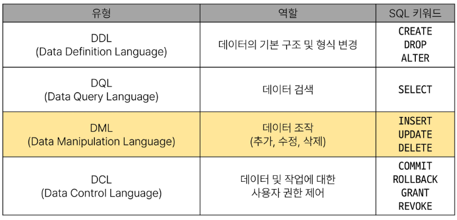

# SQL 2

[1. Managing Tables](#1-managing-tables)
   
   - [Create a table](#1-1-create-a-table)
   
   - [Modifying table fields](#1-2-modifying-table-fields)
   
   - [Delete a table](#1-3-delete-a-table)
   
   - 참고
     
     - [타입 선호도(Type Affinity)](#타입-선호도type-affinity)
     
     - [반드시 NOT NULL 제약을 사용해야 할까?](#반드시-not-null-제약을-사용해야-할까)

[2. Modifying Data](#2-modifying-data)
   
   - [Insert data](#2-1-insert-data)
   
   - [Update data](#2-2-update-data)
   
   - [Delete data](#2-3-delete-data)
   
   - 참고
     
     - [SQLite의 날짜와 시간](#sqlite의-날짜와-시간)

[3. Multi table queries](#3-multi-table-queries)
   
   - [Join](#3-1-join)
   
   - [Joining tables](#3-2-joining-tables)
     
     - [inner join](#3-2-1-inner-join)
     
     - [left join](#3-2-2-left-join)

## 1. Managing Tables


## 1-1 Create a table

- `CREATE TABLE` statement : 테이블 생성
  
  - 각 필드에 적용할 데이터 타입 작성
  
  - 테이블 및 필드에 대한 제약조건(constraints) 작성

```sql
CREATE TABLE table_name(
    column_1 data_type constraints,
    column_2 data_type constraints,
    ...,
);
```

- 활용
  
  1. examples 테이블 생성 및 확인
     
     ```sql
     CREATE TABLE examples (
         ExamId INTEGER PRIMARY KEY AUTOINCREMENT,
         LastName VARCHAR(50) NOT NULL,
         FirstName VARCHAR(50) NOT NULL,
     );
     ```
     
     
  
  2. 테이블 스키마(구조) 확인
  
  ```sql
  PRAGMA table_info('examples');
  ```

       


#### SQLite 데이터 타입

1. NULL
   
   - 아무런 값도 포함하지 않음을 나타냄

2. INTEGER
   
   - 정수

3. REAL
   
   - 부동 소수점

4. TEXT
   
   - 문자열

5. BLOB
   
   - 이미지, 동영상, 문서 등의 바이너리 데이터

#### Constraints : 제약 조건

- 테이블의 필드에 적용되는 규칙 또는 제한 사항
  
  - 데이터의 무결성을 유지하고 데이터베이스의 일관성을 보장

- 대표적인 제약 조건
  
  - PRIMARY KEY
    
    - 해당 필드를 기본 키로 지정
    
    - **INTEGER 타입에만 적용되며, INT, BIGINT 등과 같은 정수 유형은 적용되지 않음**
  
  - NOT NULL
    
    - 해당 필드에  NULL 값을 허용하지 않도록 지정
  
  - FOREIGN KEY
    
    - 다른 테이블과의 외래 키 관계를 정의

#### AUTOINCEREMENT 키워드

- `AUTOINCEREMENT` keyword : 자동으로 고유한 정수 값을 생성하고 할당하는 필드 속성
  
  - 필드의 자동 증가를 나타내는 특수한 키워드
  
  - 주로 primary key 필드에 적용
  
  - `INTEGER PRIMARY KEY AUTOINCREMENT`가 작성된 필드는 항상 새로운 레코드에 대해 이전 최대 값보다 큰 값을 할당
  
  - 삭제된 값은 무시되며 재사용할 수 없게 됨

## 1-2 Modifying table fields

- `ALTER TABLE` statement : 테이블 및 필드 조작


- ALTER TABLE ADD COLUMN syntax
  
  - ADD COLUMN 키워드 이후 추가하고자 하는 새 필드 이름과 데이터 타입 및 제약 조건 작성

```sql
ALTER TABLE
    table_name
ADD COLUMN
    column_definition;
```

- example 테이블에 다음 조건에 맞는 Age, Address 필드 추가
  
  - **SQLite는 단일 문을 사용하여 한번에 여러 필드를 추가할 수 없음**

```sql
ALTER TABLE examples
ADD COLUMN Age INTEGER NOT NULL;

ALTER TABLE examples
ADD COLUMN Address VARCHAR(100) NOT NULL;
```

- ALTER TABLE RENAME COLUMN syntax
  
  - RENAME COLUMN 키워드 뒤에 이름을 바꾸려는 필드의 이름을 지정하고 TO 키워드 뒤에 새 이름을 지정

```sql
ALTER TABLE
    table_name
RENAME COLUMN
    current_name TO new_name;
```

- example 테이블 Address필드의 이름을 PostCode로 변경

```sql
ALTER TABLE examples
RENAME COLUMN Address TO PostCode;
```

- ALTER TABLE DROP COLUMN syntax
  
  - DROP COLUMN 키워드 뒤에 삭제하려는 필드의 이름을 지정
  
  - **삭제하려는 필드가 다른 부분에서 참조되지 않고 PRIMARY KEY가 아니며 UNIQUE 제약 조건이 없는 경우에만 작동**
  
  - https://www.sqlite.org/lang_altertable.html

```sql
ALTER TABLE
    table_name
DROP COLUMN
    current_name;
```

- example 테이블의 PostCode 필드를 삭제

```sql
ALTER TABLE examples
DROP COLUMN PostCode;
```

- ALTER TABLE RENAME TO syntax
  
  - RENAME TO 키워드 뒤에 새로운 테이블 이름 지정

```sql
ALTER TABLE
    table_name
RENAME TO
    new_table_name;
```

- examples 테이블 이름을 new_examples로 변경

```sql
ALTER TABLE examples
RENAME TO new_examples;
```

## 1-3 Delete a table

- `DROP TABLE` statement : 테이블 삭제

- DROP TABLE syntaxx
  
  - DROP TABLE statement 이후 삭제할 테이블 이름 작성

```sql
DROP TABLE table_name;
```

- examples 테이블 삭제

```sql
DROP TABLE examples;
```

## 타입 선호도(Type Affinity)

- 칼럼에 데이터 타입이 명시적으로 지정되지 않았거나 지원하지 않을 때 SQLite가 자동으로 데이터 타입을 추론하는 것

- https://www.sqlite.org/datatype3.html

- 타입 선호도 목적
  
  1. 유연한 데이터 타입 지원
     
     - 데이터 타입을 명시적으로 지정하지 않고도 데이터를 저장하고 조회할 수 있음
     
     - 칼럼에 저장되는 값의 특성을 기반으로 데이터 타입을 유추
  
  2. 간편한 데이터 처리
     
     - INTEGER Type Affinity를 가진 열에 문자열 데이터를 저장해도 SQLite는 자동으로 숫자로 변환하여 처리
  
  3. SQL 호환성
     
     - 다른 데이터베이스 시스템과 호환성을 유지

## 반드시 NOT NULL 제약을 사용해야 할까?

- NO

- 하지만 데이터베이스를 사용하는 프로그램에 따라 NULL을 저장할 필요가 없는 경우가 많으므로 대부분 NOT NULL을 정의

- '값이 없다' 라는 표현을 테이블에 기록하는 것은 '0'이나 '빈 문자열'등을 사용하는 것으로 대체하는 것을 권장

---

## 2. Modifying Data



### 2-1 Insert data

- `INSERT` statement : 테이블 레코드 삽입
  
  - INSERT INTO 절 다음에 테이블 이름과 괄호 안에 필드 목촉 작성
  
  - VALUES  키워드 다음 괄호 안에 해당 필드에 삽입할 값 목록 작성

```sql
INSERT INTO table_name ( c1, c2, ...)
VALUES (v1, v2, ...);
```

- 실습 테이블 생성

```sql
CREATE TABLE articles (
    id INTEGER PRIMARY KEY AUTOINCREMENT,
    title VARCHAR(100) NOT NULL,
    content VARCHAR(200) NOT NULL,
    createdAt DATE NOT NULL
);
```

- INSERT 활용
  
  - https://www.sqlite.org/lang_datefunc.html

```sql
-- 1)
INSERT INTO
    articles (title, content, createdAt)
VALUES
    ('hello', 'world', '2023-10-10');

-- 2)
INSERT INTO
    articles (title, content, createdAt)
VALUES
    ('title1', 'content1', '1900-01-01'),
    ('title2', 'content2', '1800-01-01'),
    ('title3', 'content3', '1700-01-01');

-- 3)
INSERT INTO
    articles (title, content, createdAt)
VALUES
    ('mytitle', 'mycontent', DATE());

```

### 2-2 Update data

- `UPDATE` statement : 테이블 레코드 수정
  
  - SET 절 다음에 수정할 필드와 새 값을 지정
  
  - WHERE 절에서 수정할 레코드를 지정하는 조건 작성
  
  - WHERE 절을 작성하지 않으면 모든 레코드를 수정

```sql
UPDATE table_name
SET column_name = expression,
[WHERE
    condition];
```

- articles 테이블 1번 레코드의 title 필드 값을 'update Title'로 변경

```sql
UPDATE
    articles
SET
    title = 'update Title'
WHERE
    id = 1;
```

- articles 테이블 2번 레코드의 title, content 필드 값을 각각 'update Title', 'update Content'로 변경

```sql
UPDATE
    articles
SET
    title = 'update Title'
    content = 'update Content'
WHERE
    id = 2;
```

### 2-3 Delete data

- `DELETE` statement : 테이블 레코드 삭제
  
  - DELETE FROM 절 다음에 테이블 이름 작성
  
  - WHERE 절에서 삭제할 레코드를 지정하는 조건 작성
  
  - WHERE 절을 작성하지 않으면 모든 레코드 삭제

```sql
DELETE FROM table_name
[WHERE
    condition];
```

- articles 테이블의 1번 레코드 삭제

```sql
DELETE FROM
    articles
WHERE
    id = 1;
```

- articles 테이블에서 작성일이 오래된 순으로 레코드 2개 삭제

```sql
DELETE FROM
    articles
WHERE id IN (
    SELECT id FROM articles
    ORDER BY createdAt
    LIMIT 2
);
```

## SQLite의 날짜와 시간

- SQLite에는 날짜 및/또는 시간을 저장하기 위한 별도 데이터 타입이 없음

- 대신 날짜 및 시간에 대한 함수를 사용해 표기 형식에 따라 TEXT, REAL, INTEGER 값으로 저장

- https://www.sqlite.org/datatype3.html

---

## 3. Multi table queries

### 3-1 Join

- 관계
  
  - <mark>**여러**</mark> 테이블 간의 (논리적) 연결

- 관계의 필요성
  
  - 하석주가 작성한 모든 게시글을 조회
  
  - 동명이인이 있다면? 특정 데이터가 수정된다면?
  
  - 테이블을 나누어서 분류하자
  
  - articles와 users 테이블에 각각 userID, roldID 외래 키 필드 작성
    
    - 관리자인 사람만 보고 싶다면 : roldID가 1인 데이터 조회
    
    - 하석주가 권미숙으로 개명한다면 : users에서 한번만 변경하면 자동으로 모두 변경

- `JOIN`이 필요한 순간
  
  - 테이블을 분리하면 데이터 관리는 용이해질 수 있으나 출력 시에는 문제가 있음
  
  - 테이블을 한 개 만을 출력할 수 밖에 없어 다른 테이블과 결합하여 출력하는 것이 필요해짐
    
    - `JOIN`

### 3-2 Joining tables

- `JOIN` clause : 둘 이상의 테이블에서 데이터를 검색하는 방법

- 종류
  
  1. INNER JOIN
  
  2. LEFT JOIN

- 사전 준비
  
  1.  users 및 articles 테이블 생성
  
  ```sql
  CREATE TABLE users(
      id INTEGER PRIMARY KEY AUTOINCREMENT,
      name VARCHAR(50) NOT NULL
  );
  
  CREATE TABLE articles(
      id INTEGER PRIMARY KEY AUTOINCREMENT,
      title VARCHAR(50) NOT NULL,
      content VARCHAR(100) NOT NULL,
      userId INTEGER NOT NULL,
      FOREIGN KEY(userId)
          REFERENCES users(id)
  );
  ```
  
  2. 각 테이블에 실습 데이터 입력
  
  ```sql
  INSERT INTO
      users(name)
  VALUES
      ('하석주'),
      ('송윤미'),
      ('유하선');
  
  INSERT INTO
      articles (title, content, userId)
  VALUES
      ('제목1', '내용1', 1),
      ('제목2', '내용2', 2),
      ('제목3', '내용3', 1),
      ('제목4', '내용4', 4),
      ('제목5', '내용5', 1),
  
  ```

#### 3-2-1 INNER JOIN

- `INNER JOIN` : 두 테이블에서 값이 일치하는 레코드에 대해서만 결과를 반환
  
  - FROM 절 이후 메인 테이블 지정(table_a)
  
  - INNER JOIN 절 이후 메인 테이블과 조인할 테이블 지정(table_b)
  
  - ON 키워드 이후 조인 조건을 작성
  
  - 조인 조건은 table_a와 table_b간의 레코드를 일치시키는 규칙을 지정


```sql
SELECT
    select_list
FROM
    table_a
INNER JOIN table_b
    ON table_b.fk = table_a.pk;
```

- 예시

```sql
SELECT * FROM articles
INNER JOIN users
    ON users.id = articles.userId;
```

- 1 번 회원(하석주)가 작성한 모든 게시글의 제목과 작성자명을 조회

```sql
SELECT articles.title, users.name
FROM articles
INNER JOIN users
    ON users.id = articles.userId
WHERE users.id = 1;
```

#### 3-2-2 LEFT JOIN

- `LEFT JOIN` clause : 오른쪽 테이블의 일치하는 레코드와 함꼐 왼쪽 테이블의 모든 레코드 반환
  
  - FROM 절 이후 왼쪽 테이블 지정(table_a)
  
  - LEFT JOIN 절 이후 오른쪽 테이블 지정(table_b)
  
  - ON 키워드 이후 조인 조건을 작성
    
    - 왼쪽 테이블의 각 레코드를 오른쪽 테이블의 모든 레코드와 일치시킴


```sql
SELECT
    select_list
FROM
    table_a
LEFT JOIN table_b
    ON table_b.fk = table_a.pk
```

- 예시

```sql
SELECT * FROM articles
LEFT JOIN users
    ON users.id = articles.userId;
```

- `LEFT JOIN` 특징
  
  - 왼쪽은 테이블의 모든 레코드를 표기
  
  - 오른쪽 테이블과 매칭되는 레코드가 없으면 NULL을 표시

- 게시글을 작성한 이력이 없는 회원 정보 조회

```sql
SELECT *
FROM users
LEFT JOIN articles
    ON articles.userId = users.INDEX
WHERE articles.userId IS NULL;
```
