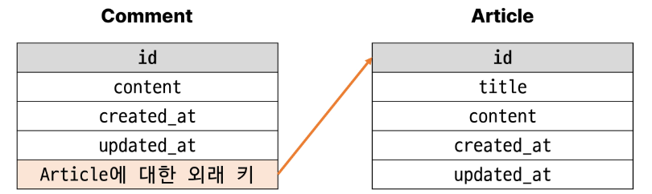
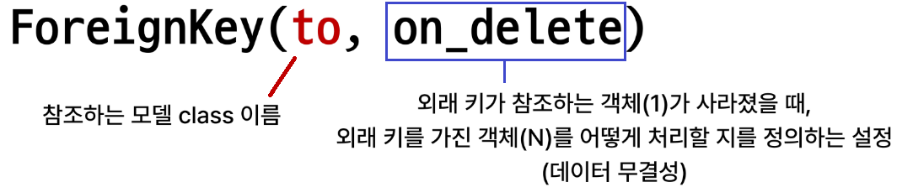
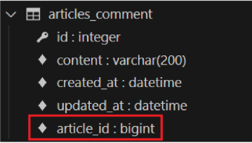
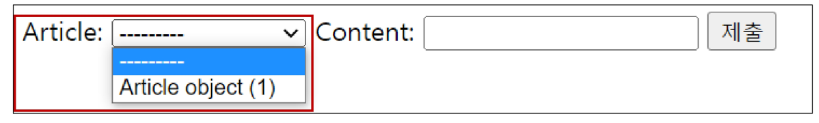
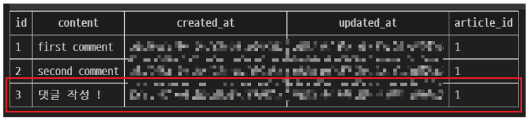
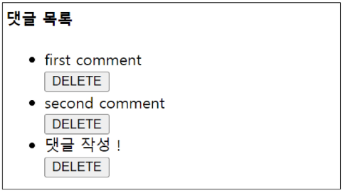

# N : 1

[1. 개요](#1-개요)

[2. 댓글 모델 구현](#2-댓글-모델-구현)

- [댓글 생성 연습](#댓글-생성-연습)

[3. 관계 모델 참조](#3-관계-모델-참조)

[4. 댓글 구현](#4-댓글-구현)

1. 참고
   
   - [admin site 등록](#admin-site-등록)
   
   - [댓글이 없는 경우 대체 콘텐츠 출력](#댓글이-없는-경우-대체-콘텐츠-출력)
   
   - [댓글 개수 출력하기](#댓글-개수-출력하기)

## 1. 개요

- Many to one relationship
  
  - N : 1 or 1 : N
  
  - 한 테이블의 0개 이상의 레코드가 다른 테이블의 레코드 한 개와 관련된 관계

- Comment(N) - Article(1)
  
  - 0개 이상의 댓글은 1개의 게시글이 작성될 수 있다
  
  

- `ForeignKey()` : N:1 관계 설정 모델 필드

## 2. 댓글 모델 구현

- 댓글 모델 정의
  
  - `ForeignKey()`  클래스의 인스턴스 이름은 참조하는 **모델 클래스의 이름의 <mark>단수형</mark>으로 작성**하는 것을 권장
  
  - `ForeignKey`클래스를 작성하는 위치와 관계없이 외래 키는 테이블 필드 마지막에 생성됨
  
  ```python
  # articles/models.py
  
  from django.db import models
  
  class Comment(models.Model):
      article = models.ForeignKey(Article, on_delete=models.CASCADE)
      content = models.CharField(max_length=200)
      created_at = models.DateTimeField(auto_now_add=True)
      updated_at = models.DateTimeField(auto_now=True)
  ```

- 

- on_delete의 'CASCADE'
  
  - 부모 객체(참조 된 객체)가 삭제되었을 때 이를 참조하는 객체도 삭제
  
  - [Model field reference | Django documentation | Django](https://docs.djangoproject.com/en/4.2/ref/models/fields/#arguments)

- Migration
  
  - 댓글 테이블의 article_id 필드 확인

- 참조하는 클래스 이름의 소문자(단수형)로 작성하는 것이 권장되었던 이유
  
  - 참조 대상 클래스 이름 + '-' + 클래스 이름

        
    
    
    #### 댓글 생성 연습

- shell_plus 실행 및 게시글 작성
  
  - 

    ```shell
    $ python manage.py shell_plus
    ```
    
    
    
    
    # 게시글 생성
    
    Article.objects.create(title='title', content='content')

- 댓글 생성 - 에러
  
  ```shell
  # Comment 클래스의 인스턴스 comment 생성
  comment = Comment()
  
  # 인스턴스 변수 저장
  comment.content = 'first comment'
  
  # DB에 댓글 저장
  comment.save()
  
  # 에러 발생
  django.dj.utils.IntegerityError : NOT NULL constraint failed:
  articles_comment.article_id
  # articles_comment 테이블의 ForeignKeyField, article_id 값이 저장 시 누락되었기 때문
  ```

- 댓글 생성- 에러 해결
  
  ```shell
  # Comment 클래스의 인스턴스 comment 생성
  comment = Comment()
  
  # 인스턴스 변수 저장
  comment.content = 'first comment'
  
  # DB에 댓글 저장
  comment.save()
  
  # 게시글 조회
  article = Article.objects.get(pk=1)
  
  # 외래 키 데이터 입력
  comment.article = article
  # 또는 comment.article_id = article.pk 처럼 pk값을 직접 외래키 칼럼에
  # 넣어줄 수도 있지만 권장하지 않음
  
  # 댓글 저장 및 확인
  comment.save()
  ```

- comment 인스턴스를 통한 article 값 참조하기
  
  ```shell
  comment.pk
  => 1
  
  comment.content
  => 'first comment'
  
  # 클래스 변수명인 article로 조회 시 해당 참조하는 게시물 객체를 조회할 수 있음
  comment.article
  => <Article: Article object (1)>
  
  # article_pk는 존재하지 않는 필드이기 때문에 사용 불가
  comment.article_id
  => 1
  
  # 1번 댓글이 작성된 게시물의 pk조회
  comment.article.pk
  => 1
  
  # 1번 댓글이 작성된 게시물의 content 조회
  comment.article.content
  => 'content'
  ```

- 두번째 댓글 생성
  
  ```shell
  comment = Comment(content='second comment', article=article)
  comment.save()
  
  comment.pk
  => 2
  
  comment
  =><Comment: Comment object (2)>
  
  comment.article.pk
  =>1
  ```

- 작성된 댓글 데이터 확인
  
  
  
  > ex) 1번 댓글이 달린 게시글의 내용은 무엇인가?
  > 
  > - 쌩 sql에서는 join을 해야했다
  > 
  > - 근데 Django에서는???
  >   
  >   ```shell
  >     comment.pk
  >     >1
  >   
  >     comment.article
  >     >Article 객체
  >   ```
  >   
  >     comment.article.content
  >   
  >   > 'contentttt'
  > 
  > ```
  > - 주의사항
  > 
  >   - 1번 댓글이 달린 게시물의 번호를 알아내는 방법
  > 
  >     - 방법 1 : 물리적은로 존재하는 테이블 값 article_id를 쓰는 것
  > 
  >       comment.article_id
  > 
  >     - 방법 2 : 좀 더 객체지향적인 방법
  > 
  >       comment.article.pk
  > ```

## 3. 관계 모델 참조

- 역참조
  
  - N:1 관계에서 1에서 N을 참조하거나 조회하는 것
    
    - N -> 1 (참조) : 댓글이 어떤 게시글에 작성되었는지를 조회 가능
    
    - 1 -> N (역참조) : 해당 게시글에 작성된 모든 댓글을 조회
  
  - **N은 외래 키를 가지고 있어 물리적으로 참조가 가능하지만 1은 N에 대한 참조 방법이 존재하지 않아 별도의 역참조 이름이 필요**

- 역참조 사용 예시
  
  comment인 이유는? => 게시글 입장에서 역참조 하고자 하는 대상의 이름이 comment라서
  
  

- related manager
  
  - N:1 혹은 M:N 관계에서 역참조 시에 사용하는 매니저
  
  - 'objects' 매니저를 통해 queryset api를 사용했던 것처럼 related manager를 통해 queryset api를 사용할 수 있게 됨

- related manager 이름 규칙
  
  - N : 1 관계에서 생성되는 Related manager의 이름은 참조하는 "**모델명_set**" 이름 규칙으로 만들어짐
  
  - 해당 댓글의 게시글 (Comment -> Article)
    
    - ```shell
      comment.article
      ```
  
  - 게시글의 댓글 목록(Article -> Comment)
    
    - ```shell
      article.comment_set.all()
      ```

- Related manager 연습
  
  - shell_plus 실행 및 1번 게시물 조회
  
  ```shell
  $ python manage.py shell_plus
  
  article = Article.objects.get(pk=1)
  ```
  
  - 1번 게시글에 작성된 모든 댓글 조회하기(역참조)
  
  ```shell
  >>> article.comment_set.all()
  <QuerySet [<Comment: Comment object (1)>,
  <Comment: Comment object (2)>]>
  ```
  
  - 1번 게시글에 작성된 모든 댓글 내용 출력
  
  ```shell
  comments = article.comment_set.all()
  
  for comment in comments:
       print(comment.content)
  ```

## 4. 댓글 구현

#### 4-1 댓글 CREATE

- 사용자로부터 댓글 데이터를 입력 받기 위한 CommentForm  정의

```python
# articles/forms.py

from django import forms
from .models import Article, Comment

class CommentForm(forms.ModelForm):
    class Meta:
        model = Comment
        fields = '__all__'
```

- detail view 함수에서 CommentForm을 사용하여 detail 페이지에 렌더링

```python
# articles/views.py

from .forms import ArticleForm, CommentForm

def detail(request, pk):
    article = Article.objects.get(pk=pk)
    comment_form = CommentForm()
    # 특정 게시글의 모든 댓글을 조회(역참조)
    comments = article.comment_set.all()
    context = {
        'article': article,
        'comment_form': comment_form,
        'comments': comments,
    }
    return render(request, 'articles/detail.html', context)
```

```django
<!-- articles/detail.html -->

<form action="" method="POST">
    
    {{ comment_form }}
    <input type="submit">
</form>
```

- Comment 클래스 외래 키 필드 article 또한 데이터 입력이 필요한 필드이기 때문에 출력이 되고 있는것

- 하지만, 외래키 필드는 <mark>**사용자 입력값으로 받는 것이 아닌 view 함수 내에서 다른 방법으로 전달 받아 저장**</mark>되어야 함



- CommentForm의 출력 필드 조정
  
  ```python
  from django import forms
  from .models import Article, Comment
  
  class CommentForm(forms.ModelForm):
      class Meta:
          model = Comment
          fields = ('content',)
  ```
  
  - 출력에서 제외된 외래 키 데이터는 어디서 받아와야 할까?
  
  - detail 페이지의 url
    
    - path('\<int:pk>/', views.detail, name='detail') 에서 해당 게시글의 pk 값이 사용되고 있음
  
  - 댓글의 외래 키 데이터에 필요한 정보가 바로 게시글의 pk값

- url 작성 및 action 값 작성

```python
# articles/urls.py

from django.urls import path
from . import views

app_name = 'articles'
urlpatterns = [
   ...
    path('<int:pk>/comments/', views.comments_create, name='comments_create'),
]
```

```django
<!-- articles/detail.html -->

<form action="" method="POST">
    
    {{ comment_form }}
    <input type="submit">
</form>
```

- comments_create view 함수 정의
  
  - article 객체는 언제 저장할 수 있을까?
  
  - `save(commit=False)`


- save의 commit 인자를 활용해 외래 키 데이터 추가 입력

```python
def comments_create(request, pk):
    # 게시글 조회
    article = Article.objects.get(pk=pk)
    # CommentForm으로 사용자로 부터 데이터를 입력 받음
    comment_form = CommentForm(request.POST)
    if comment_form.is_valid():
        comment = comment_form.save(commit=False)
        comment.article = article
        comment_form.save()
        return redirect('articles:detail', article.pk)
    context = {
        'article': article,
        'comment_form': comment_form,
    }
    return render(request, 'articles/detail.html', context)
```

- 댓글 작성 후 테이블 확인



#### 4-2 댓글 READ

- detail view 함수에서 전체 댓글 데이터를 조회

```python
# articles/views.py

def detail(request, pk):
    article = Article.objects.get(pk=pk)
    comment_form = CommentForm()
    # 특정 게시글의 모든 댓글을 조회(역참조)
    comments = article.comment_set.all()
    context = {
        'article': article,
        'comment_form': comment_form,
        'comments': comments,
    }
    return render(request, 'articles/detail.html', context)
```

- 전체 댓글 출력 및 확인

```django
<!-- articles/detail.html -->

  <ul>
    
      <li> {{ comment.content }} </li>
    
  </ul>
```

#### 4-3 댓글 Delete

- 댓글 삭제 url 작성

```python
# articles/urls.py

from django.urls import path
from . import views

app_name = 'articles'
urlpatterns = [
    ...
    path('<int:pk>/comments/', views.comments_create, name='comments_create'),
    path(
        '<int:article_pk>/comments/<int:comment_pk>/delete/', 
        views.comments_delete, 
        name= 'comments_delete'
    )
]
```

- 댓글 삭제 view 함수 정의

```python
# articles/views.py

from .models import Article, Comment

def comments_delete(request, article_pk, comment_pk):
    # 댓글 조회
    comment = Comment.objects.get(pk=comment_pk)
    comment.delete()
    return redirect('articles:detail', article_pk)
```

- 댓글 삭제 버튼 작성

```django
  <h4>댓글 목록</h4>
  <ul>
    
      <li>
        {{ comment.content }}
        <form action="" method="POST">
          
          <input type="submit" value="삭제">
        </form>
      </li>
    
  </ul>
```

- 댓글 삭제 버튼 출력 확인 및 삭제 테스트



#### 4-4 댓글 Update

- javascript 배워야 가능

# 참고

## admin site 등록

- Comment 모델을 admin site에 등록해 CRUD 동작 확인하기

```python
# articles/admin.py
from django.contrib import admin
from .models import Article, Comment


admin.site.register(Article)
admin.site.register(Comment)
```

## 댓글이 없는 경우 대체 콘텐츠 출력

- DTL `for empty` 태그 사용

```django
  <h4>댓글 목록</h4>
  <ul>
    
      <li>
        {{ comment.content }}
        <form action="" method="POST">
          
          <input type="submit" value="삭제">
        </form>
      </li>
    
      <p>댓글이 없습니다</p>
    
  </ul>
```

## 댓글 개수 출력하기

- DTL filter - `length` 사용

```django
{{ comments|length }}
{{ article.comment_set.all|length }}
```

- Queryset API - `count()` 사용

```django
{{ article.comment_set.count }}
```

- on_delete=models.CASCADE : 코멘트입장에서 아티클에 달리는건데 
  
  - 만약에 게시글에 댓글이 여러개 달렷음 그런데 갑자기 게시글 작성자가 게시글을 지움..
  
  - 본인이 가지고 잇는 외래키 참조를 못하게 되니까 그거 처리를 어케 할건지
    
    - 게시글 지우면 댓글까지 전부다 삭제 =====이거 하는 옵션
    
    - 댓글이 잇는 게시글으 삭제하지 못하게 

- 데이터 무결성 : 데이터의 정확성과 일관성을 유지하고 보증하는 것
  
  - 게시글이 지워지면 참조할 수 잇는게 없어지니까 무결성이 사라짐!@! 이걸 방지하려고
  
  - SET_NULL : 게시글이 삭제되면 그에 따른 댓글의 외래키를 NULL값으로 만든당
  
  - PROTECT : 댓글이 잇는 게시글은 삭제 못하게 만듬
  
  - 등등등
  
  - 

- python manage.py sqlmigrate articles 0002
  
  - sql은 어케 되는지 볼 수 잇는 명령어
