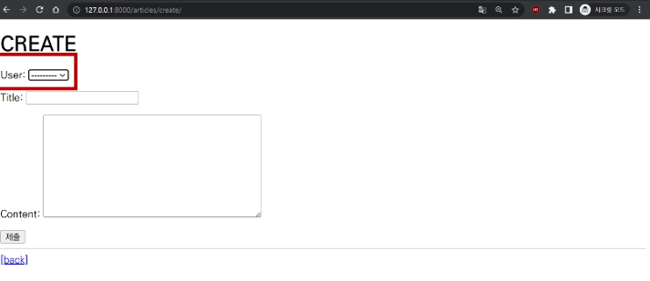

# Many to one relationships 2

1. 개요

2. Article & User
   
   - User 모델을 참조하는 2가지 방법
   
   - 게시글 Create, Read, Update

3. Comment & User

## 1. 개요

- Article(N) - User(1)
  
  - 0개 이상의 게시글은 1명의 회원에 의해 작성 될 수 있다.

- Comment(N) - User(1)
  
  - 0개 이상의 댓글은 1명의 회원에 의해 작성될 수 있다.

## 2. Article &  User

### 2-1 모델 관계 설정

- User 외래 키 정의

```python
# articles/models.py

from django.db import models
from django.conf import settings

# Create your models here.
class Article(models.Model):
    title = models.CharField(max_length=10)
    user = models.ForeignKey(settings.AUTH_USER_MODEL, on_delete=models.CASCADE)
    content = models.TextField()
    created_at = models.DateTimeField(auto_now_add=True)
    updated_at = models.DateTimeField(auto_now=True)
```

### User 모델을 참조하는 2가지 방법


- django 프로젝트의 '내부적인 구동 순서'와 반환 값' 에 따른 이유

- User 모델은 직접 참조하지 않는다!
  
  > 왜 models.py에서만 두번째 방법을 사용하느냐?
  > 
  > - runserver할 때 중간에 많은 과정 중에서 models.py 구동순서에 문제가 됨
  > 
  > - models.py가 구동될 때 User 객체가 장고에 없는상황이 있을 수도 잇음
  > 
  > - models.py 구동순서가 좀 빠르기 때문에 그래서 임의로 문자열을 참조하도록 함

- Migration
  
  - 기본적으로 모든 컬럼은 NOT NULL 제약 조건이 있기 때문에 데이터가 없이는 새로운 필드가 추가되지 못함
    
    - 기본값 설정 필요
  
  - 1을 입력하고 Enter
  
  - 추가되는 외래 키 user_id에 어떤 데이터를 넣을 것인지 직접 입력 후 Enter
  
  - 그러면 기존에 작성된 게시글이 있다면 모두 1번 회원이 작성한 것으로 처리됨
  
  - migrations 파일 생성 후 migrate 진행
  
  - article 테이블의 user_id 필드 생성 확인

### 2-2 게시글 Create

- 기존 ArticleForm 출력 변화 확인
  
  - User 모델에 대한 외래 키 데이터 입력을 위해 불필요한 input이 출력
  
  

- ArticleForm 출력 필드 수정

```python
# articles/forms.py

from .models import Article

class ArticleForm(forms.ModelForm):
    class Meta:
        model = Article
        fields = ('title', 'content',)
        # exclude = ('user', )
```

- 게시글 작성 시 에러 발생! 
  
  - user_id 필드가 누락되었기 때문
  
  

- 게시글 작성 시 작성자 정보가 함께 저장될 수 있도록 save의 commit 옵션 활용

```python
# articles/views.py

@login_required
def create(request):
    if request.method == 'POST':
        form = ArticleForm(request.POST)
        if form.is_valid():
            article = form.save(commit=False)
            article.user = request.user
            form.save()
            return redirect('articles:detail', article.pk)
    else:
        form = ArticleForm()
    context = {
        'form': form,
    }
    return render(request, 'articles/create.html', context)
```

### 2-3 게시글 Read

- 각 게시글의 작성자 이름 출력

```django
<!-- articles/index.html -->


    <p>작성자 : {{ article.user }}</p>
    <p>글 번호 : {{ article.pk }}</p>
    <a href="">
      <p>글 제목 : {{ article.title }}</p>
    </a>
    <p>글 내용 : {{ article.content }}</p>
    <hr>
  
```

### 2-4 게시글 Update

- 게시글 수정 요청 사용자와 게시글 작성 사용자를 비교하여 본인의 게시글만 수정할 수 있도록 하기

```python
# articles/views.py

@login_required
def update(request, pk):
    article = Article.objects.get(pk=pk)
    if request.user == article.user:
        if request.method == 'POST':
            form = ArticleForm(request.POST, instance=article)
            if form.is_valid:
                form.save()
                return redirect('articles:detail', article.pk)
        else:
            form = ArticleForm(instance=article)
    else:
        return redirect('articles:index')
    context = {
        'article': article,
        'form': form,
    }
    return render(request, 'articles/update.html', context)
```

- 해당 게시글의 작성자가 아니라면, 수정/삭제 버튼을 출력하지 않도록 하기

```django
<!-- articles/detail.html -->

  
    <a href="">UPDATE</a>
    <form action="" method="POST">
      
      <input type="submit" value="삭제">
    </form>
  
```

### 2-5 게시글 Delete

- 삭제를 요청하려는 사람과 게시글을 작성한 사람을 비교하여 본인의 게시글만 삭제할 수 있도록 하기

```python
# articles/views.py

@login_required
def delete(request, pk):
    article = Article.objects.get(pk=pk)
    if request.user == article.user:
        article.delete()
    return redirect('articles:index')
```

## 3. Comment & User

### 3-1 comment-user 모델 관계 설정

- User 외래 키 정의

```python
# articles/models.py

from django.db import models
from django.conf import settings

class Comment(models.Model):
    article = models.ForeignKey(Article, on_delete=models.CASCADE)
    user = models.ForeignKey(settings.AUTH_USER_MODEL, on_delete=models.CASCADE)
    content = models.CharField(max_length=200)
    created_at = models.DateTimeField(auto_now_add=True)
    updated_at = models.DateTimeField(auto_now=True)
```

- Migration
  
  - 이전에 Article와 User 모델 관계 설정 때와 동일한 상황
  
  - 기존 Comment 테이블에 새로운 컬럼이 빈 값으로 추가될 수 없기 때문에 기본 값 설정 과정 필요
  
  - 

### 3-2 댓글 create

- 댓글 작성 시 이전 게시글 작성할 때와 동일한 에러 발생
  
  - 댓글의 user_id 필드 데이터가 누락되었기 때문


- 댓글 작성 시 작성자 정보가 함께 저장할 수 있도록 작성

```python
# articles/views.py

from .forms import ArticleForm, CommentForm

def comments_create(request, pk):
    article = Article.objects.get(pk=pk)
    comment_form = CommentForm(request.POST)
    if comment_form.is_valid():
        comment = comment_form.save(commit=False)
        comment.article = article
        comment.user = request.user
        comment_form.save()
        return redirect('articles:detail', article.pk)
```

### 3-3 댓글 read

- 댓글 출력 시 댓글 작성자와 함꼐 작성

```django
<!-- articles/detail.html -->

  
    <li>
      {{ comment.user }} - {{ comment.content }}
    </li>
  
```

### 3-4 댓글 delete

- 댓글 삭제 요청 사용자와 댓글 작성 사용자를 비교하여 본인의 댓글만 삭제할 수 있도록 하기

```python
# articles/views.py

from .models import Article, Comment

def comments_delete(request, article_pk, comment_pk):
    comment = Comment.objects.get(pk=comment_pk)
    if request.user == comment.user:
        comment.delete()
    return redirect('articles:detail', article_pk)
```

- 해당 댓글의 작성자가 아니라면, 댓글 삭제 버튼을 출력하지 않도록 함

```django
<!-- articles/detail.html -->

  
    <li>
      {{ comment.user }} - {{ comment.content }}
      
        <form action="" method="POST">
          
          <input type="submit" value='DELETE'>
        </form>
      
    </li>
  
```

s

s

s

s

s

s

s
