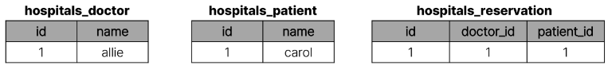

# Many to many relationships 1

- [Many to many relationships 1](#many-to-many-relationships-1)
  - [1. Many to many relationship](#1-many-to-many-relationship)
    - [1-1 N : 1 의 한계](#1-1-n--1-의-한계)
    - [1-2 중개 모델](#1-2-중개-모델)
  - [2. Django ManyToManyField](#2-django-manytomanyfield)
    - [2-1 'through' argument](#2-1-through-argument)
    - [2-2 M:N 관계 주의 사항](#2-2-mn-관계-주의-사항)
  - [2-3 Django ManyToManyField](#2-3-django-manytomanyfield)
  - [3. 좋아요](#3-좋아요)
    - [3-1 모델 관계 설정](#3-1-모델-관계-설정)
      - [3-1-1 user.article\_set 역참조 매니저 충돌](#3-1-1-userarticle_set-역참조-매니저-충돌)
      - [3-1-2 User-Article 간 사용 가능한 전체 related manager](#3-1-2-user-article-간-사용-가능한-전체-related-manager)
    - [3-2 좋아요 기능 구현](#3-2-좋아요-기능-구현)

## 1. Many to many relationship

- N : M or M : N
  
  - 한 테이블의 0개 이상의 레코드가 다른 테이블의 0개 이상의 레코드와 관련된 경우 
  
  - **양쪽 모두에서 N : 1 관계를 가짐**

- M : N 관계의 역할과 필요성 이해하기
  
  - '병원 진료 시스템 모델 관계' 를 만들며 M:N 관계의 역할과 필요성 이해하기
  
  - 환자와 의사 2개의 모델을 사용하여 모델 구조 구상하기
  
  ### 1-1 N : 1 의 한계
  
  - 의사와 환자 간 모델 관계 설정 
    
    - 한 명의 의사에게 여러 환자가 예약할 수 있다고 설계
    
    - 2명의 의사와 환자를 생성하고 환자는 서로 다른 의사에게 예약
    
    ```python
    from django.db import models
    
    
    class Doctor(models.Model):
        name = models.TextField()
    
        def __str__(self):
            return f'{self.pk}번 의사 {self.name}'
    
    
    class Patient(models.Model):
        doctor = models.ForeignKey(Doctor, on_delete=models.CASCADE)
        name = models.TextField()
    
        def __str__(self):
            return f'{self.pk}번 환자 {self.name}'
    
    
    # 코드 예시
    doctor1 = Doctor.objects.create(name='allie')
    doctor2 = Doctor.objects.create(name='barbie')
    patient1 = Patient.objects.create(name='carol', doctor=doctor1)
    patient2 = Patient.objects.create(name='duke', doctor=doctor2)
    patient3 = Patient.objects.create(name='carol', doctor=doctor2)
    
    
    ```


- 1번 환자(carol)가 두 의사 모두에게 진료를 받고자 한다면 환자 테이블에 1번 환자 데이터가 중복으로 입력될 수 밖에 없음
  
  

- 동시에 예약을 남길 수는 없을까?
  
  

- 동일한 환자지만 다른 의사에게도 진료를 받기 위해 예약하기 위해서는 객체를 하나 더 만들어 진행해야 함

- 외래 키 칼럼에 '1, 2' 형태로 저장 및 참조하는 것은 DB 타입 문제로 불가능
  
  - 예약 테이블을 따로 만들자

### 1-2 중개 모델

- 예약 모델 생성
  
  - 환자 모델의 외래 키를 삭제하고 별도의 예약 모델을 새로 생성
  
  - 예약 모델은 의사와 환자에 각각 N:1 관계를 가짐

```python
from django.db import models


class Doctor(models.Model):
    name = models.TextField()

    def __str__(self):
        return f'{self.pk}번 의사 {self.name}'


# 외래키 삭제
class Patient(models.Model):
    name = models.TextField()

    def __str__(self):
        return f'{self.pk}번 환자 {self.name}'


# 중개모델 작성
class Reservation(models.Model):
    doctor = models.ForeignKey(Doctor, on_delete=models.CASCADE)
    patient = models.ForeignKey(Patient, on_delete=models.CASCADE)

    def __str__(self):
        return f'{self.doctor_id}번 의사의 {self.patient_id}번 환자'
```

- 의사와 환자 생성 후 예약 만들기

```python
doctor1 = Doctor.objects.create(name='allie')
patient1 = Patient.objects.create(name='carol')

Reservation.objects.create(doctor=doctor1, patient=patient1)

# 의사 -> 예약 정보 찾기
doctor1.reservation_set.all() # 반환값 : QuerySet

# 환자 -> 예약 정보 찾기
patient1.reservation_set.all() # 반환값 : QuerySet
```



- 1번 의사에게 새로운 환자 예약 생성

```python
patient2 = Patient.objects.create(name='duke')
Reservation.objects.create(doctor=doctor1, patient=patient2)
```


- Django에서는 'ManyToManyField'로 중개 모델을 자동으로 생성

## 2. Django ManyToManyField

- 환자 모델에 ManyToManyField 작성

```python
from django.db import models


class Doctor(models.Model):
    name = models.TextField()

    def __str__(self):
        return f'{self.pk}번 의사 {self.name}'


class Patient(models.Model):
    # ManyToManyField 작성
    doctors = models.ManyToManyField(Doctor)
    name = models.TextField()

    def __str__(self):
        return f'{self.pk}번 환자 {self.name}'
```

- 데이터베이스 초기화 후 Migration 진행 및 shell_plus 실행

- 생성된 중개 테이블 hospitals_patient_doctors 확인


- 의사 1명과 환자 2명 생성

```python
doctor1 = Doctor.objects.create(name='allie')
patient1 = Patient.objects.create(name='carol')
patient2 = Patient.objects.create(name='duke')
```

- 예약 생성 ( 환자가 예약 )

```python
# patient1이 doctor1에게 예약
patient1.doctors.add(doctor1)

# patient1 - 자신이 예약한 의사목록 확인
patient1.doctors.all() # QuerySet

# doctor1 - 자신의 예약된 환자목록 확인
doctor1.patient_set.all()  # QuerySet
```

- 예약 생성 ( 의사가 예약 )

```python
# doctor1이 patient2을 예약
doctor1.patient_set.add(patient2)

# doctor1 - 자신의 예약된 환자목록 확인
doctor1.patient_set.all() # 환자 2명 QuerySet

# patient1, 2 - 자신이 예약한 의사목록 확인
patient2.doctors.all()
patient1.doctors.all()
```

- 중개 테이블에서 예약 현황 확인


- 예약 취소하기 ( 삭제 )
  
  - 이전에는 Reservation 을 찾아서 지워야 했다면, 이제는 `.remove()`로 삭제 가능

```python
# doctor1이 patient1 진료 예약 취소
doctor1.patient_set.remove(patient1)
doctor1.patient_set.all()
patient1.doctors.all()

# patient2가 doctor1 진료 예약 취소
patient2.patient_set.remove(doctor1)
patient2.doctors.all()
doctor1.patient_set.all()
```

### 2-1 'through' argument

- 중개 테이블에 '**<mark>추가 데이터</mark>**'를 사용해 M:N 관계를 형성하려는 경우에 사용

- through 설정 및 Reservation 수정
  
  - 이제는 예약 정보에 '증상'과 '예약일'이라는 추가 데이터가 생김

```python
from django.db import models


class Doctor(models.Model):
    name = models.TextField()

    def __str__(self):
        return f'{self.pk}번 의사 {self.name}'


class Patient(models.Model):
    doctors = models.ManyToManyField(Doctor, through='Reservation')
    name = models.TextField()

    def __str__(self):
        return f'{self.pk}번 환자 {self.name}'


class Reservation(models.Model):
    doctor = models.ForeignKey(Doctor, on_delete=models.CASCADE)
    patient = models.ForeignKey(Patient, on_delete=models.CASCADE)
    symptom = models.TextField()
    reserved_at = models.DateTimeField(auto_now_add=True)

    def __str__(self):
        return f'{self.doctor.pk}번 의사의 {self.patient.pk}번 환자'
```

- Migration, shell_plus 

- 의사 1명과 환자 2명 생성

```python
doctor1 = Doctor.objects.create(name='allie')
patient1 = Patient.objects.create(name='carol')
patient2 = Patient.objects.create(name='duke')
```

- 예약 생성 방법1 : Reservation class를 통한 예약 생성

```python
# 1. Reservation class를 통한 예약 생성
reservation1 = Reservation(doctor=doctor1, patient=patient1, symptom='headache')
reservation1.save()

doctor1.patient_set.all() 
patient1.doctors.all()
```

- 예약 생성 방법2 : Patient 객체를 통한 예약 생성(<mark>through_defaults</mark>)

```python
# 2. Patient 객체를 통한 예약 생성
patient2.doctors.add(doctor1, through_defaults={'symptom': 'flu'})

doctor1.patient_set.all()
patient2.doctors.all()
```

- 생성된 예약 확인


- 의사와 환자가 각각 예약 삭제

```python
doctor1.patient_set.remove(patient1)
patient2.doctors.remove(doctor1)
```

### 2-2 M:N 관계 주의 사항

- M : N 관계로 맺어진 두 테이블에는 물리적인 변화가 없음

- ManyToManyField는 중개 테이블을 자동으로 생성

- ManyToManyField는 M:N 관계를 맺는 두 모델 어디에 위치해도 상관없음
  
  - 대신 필드 작성 위치에 따라 참조와 역참조 방향을 주의할 것

- N:1 은 완전한 종속의 관계였지만 M:N.은 종속적인 관계가 아니며 '의사에게 진찰받는 환자 & 환자를 진찰하는 의사' 이렇게 2가지 형태 모두 표현 가능

## 2-3 Django ManyToManyField

- `ManyToManyField(to, **options )`
  
  - Many to many 관계 설정시 사용하는 모델 필드

- ManyToManyField's Arguments
  
  1. `related_name`
     
     - 역참조시 사용하는 manager name을 변경
       
       ```python
       class Patient(models.Model):
           # ManyToManyField - related_name 작성
           doctors = models.ManyToManyField(Doctor, related_name='patients')
           name = models.TextField()
       
       # 변경 전
       doctor.patient_set.all()
       
       # 변경 후
       doctor.patients.all()
       ```
  
  2. `symmetrical`
     
     - ManyToManyField가 동일한 모델을 가리키는 정의에서만 사용
     
     - 기본값 : True
       
       - True일 경우
         
         - source 모델의 인스턴스가 target 모델의 인스턴스를 참조하면 자동으로 target 모델의 인스턴스도 source 모델 인스턴스를 자동으로 참조하도록 함(대칭)
         
         - 즉 , 자동으로 내가 당신의 친구라면 당신도 내 친구가 됨
     
     ```python
     class Person(models.Models):
         friends = models.ManyToManyField('self')
         # friends = models.ManyToManyField('self', symmetrical=False)
     ```
  
  3. `through`

- M : N에서의 Methods
  
  - `add()`
    
    - 지정된 객체를 관련 객체 집합에 추가
    
    - 이미 존재하는 관계에 사용하면 관계가 복제되지 않음
  
  - `remove()`
    
    - 관련 객체 집합에서 지정된 모델 객체를 제거

   

## 3. 좋아요

Many to many relationships

한 테이블의 0개 이상의 레코드가 다른 테이블의 0개 이상의 레코드와 관련된 경우

- 양쪽 모두에서 N:1 관계를 가짐

- Article(M) - User(N) : 0개 이상의 게시글은 0명 이상의 회원과 관련
  
  - 게시글은 회원으로부터 0개 이상의 좋아요를 받을 수 있고,
  
  - 회원은 0개 이상의 게시글에 좋아요를 누를 수 있음

### 3-1 모델 관계 설정

- ManyToManyField 작성

```python
from django.db import models
from django.conf import settings


# Create your models here.
class Article(models.Model):
    user = models.ForeignKey(
        settings.AUTH_USER_MODEL, on_delete=models.CASCADE
    )
    like_users = models.ManyToManyField(settings.AUTH_USER_MODEL)
    title = models.CharField(max_length=10)
    content = models.TextField()
    created_at = models.DateTimeField(auto_now_add=True)
    updated_at = models.DateTimeField(auto_now=True)
```

- Migration 진행 후 에러 발생 !!

---

#### 3-1-1 user.article_set 역참조 매니저 충돌

> - N:1 : 유저가 작성한 게시글
> 
> - M:N : 유저가 좋아요 한 게시글

- like_users 필드 생성 시 자동으로 역참조 .article_set 매니저가 생성됨

- 그러나 이전 N:1 (Article-User) 관계에서 이미 같은 이름의 매니저를 사용중
  
  - user.article_set.all() -> 해당 유저가 작성한 모든 게시글 조회

- 'user가 작성한 글(user.article_set)' 과 'user가 좋아요를 누른 글(user.article_set)'을 구분할 수 없게 됨
  
  - user 와 관계된 `ForeignKey` 혹은 `ManyToManyField` 둘 중 하나에 `related_name`작성 필요!

---

- related_name 작성 후 Migration 재진행

```python
from django.db import models
from django.conf import settings


# Create your models here.
class Article(models.Model):
    user = models.ForeignKey(
        settings.AUTH_USER_MODEL, on_delete=models.CASCADE
    )
    like_users = models.ManyToManyField(settings.AUTH_USER_MODEL, related_name='like_articles')
    title = models.CharField(max_length=10)
    content = models.TextField()
    created_at = models.DateTimeField(auto_now_add=True)
    updated_at = models.DateTimeField(auto_now=True)
```

- 생성된 중개 테이블 확인


#### 3-1-2 User-Article 간 사용 가능한 전체 related manager

- article.user : 게시글을 작성한 유저 - N:1

- user.article.set : 유저가 작성한 게시글(역참조) - N:1

- article.like_users : 게시글을 좋아요 한 유저 - M:N

- user.like_articles : 유저가 좋아요 한 게시글(역참조) - M:N

### 3-2 좋아요 기능 구현

- url 작성

```python
# articles/urls.py

from django.urls import path
from . import views

app_name = 'articles'
urlpatterns = [
    # ...,
    path('<int:article_pk>/likes/', views.likes, name='likes'),
]
```

- view 함수 작성

```python
# articles/views.py

@login_required
def likes(request, article_pk):
    # 별도의 페이지 필요? NO (게시글이 출력되는 페이지에 같이 좋아요 버튼이 출력됨)
    # 어떤 게시글에 좋아요를 누른건지
    article = Article.objects.get(pk=article_pk)
    # 좋아요를 추가 or 취소 할지에 대한 기준??
    # 현재 좋아요 버튼을 누른 유저가 어디(현재 게시글의 좋아요를 누른 유저 목록 전체)에 있는지 없는지를 확인
    if request.user in article.like_users.all():
        # 취소
        article.like_users.remove(request.user)
        # request.user.like_articles.remove(article)
    else:
        # 추가
        article.like_users.add(request.user)
        # request.user.like_articles.add(article)
    return redirect('articles:index')
```

- create에 like_user 나오는 문제 해결

```python
from django import forms
from .models import Article, Comment


class ArticleForm(forms.ModelForm):
    class Meta:
        model = Article
        exclude = ('user', 'like_users',)


class CommentForm(forms.ModelForm):
    class Meta:
        model = Comment
        fields = ('content',)

```

- Index 템플릿에서 각 게시글에 좋아요 버튼 출력

```django
<!-- articles/index.html -->
  
    ...
    <form action="" method="POST">
      
      
        <input type="submit" value="좋아요 취소">
      
        <input type="submit" value="좋아요">
      
    </form>
    <hr>
  
```

- 좋아요 버튼 클릭 후 테이블 확인


