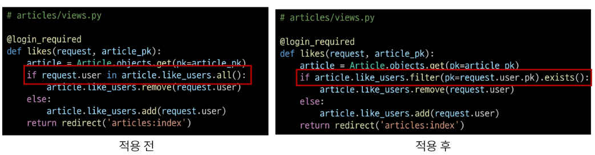
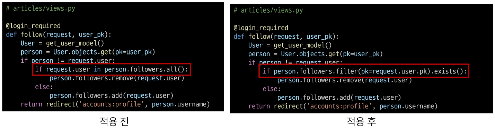

# Many to many relationships 2

[1. Follow](#1-팔로우)
   
   - [1-1 프로필](#1-1-프로필)
   
   - [1-2 팔로우 기능 구현](#1-2-팔로우-기능-구현)
   
   - 1-3 참고
     
     - [.exists()](#exists)

[2. Django Fixtures](#2-fixtures)
   
   - [2-1 Fixtures](#2-fixtures)
   
   - 2-2 참고
     
     - [모든 모델을 한번에 dump 하기](#모든-모델을-한번에-dump-하기)
     
     - [loaddata 시 encoding codec 관련 에러 발생 경우](#loaddata-시-encoding-codec-관련-에러가-발생하는-경우)

[3. Improve query](#3-improve-query)
   
   - [3-1 annotate](#3-1-annotate)
   - [3-2 select_related](#3-2-select_related)
   - [3-3 prefetch_related](#3-3-prefetch_related)
   - [3-4 select_related & prefetch_related](#3-4-select_related--prefetch_related)

---

# 1. 팔로우

## 1-1 프로필

- 각 회원의 개인 프로필 페이지에 팔로우 기능을 구현하기 위해 프로필 페이지를 먼저 구현

- url 작성

```python
# accounts/urls.py

from django.urls import path
from . import views

app_name = 'accounts'
urlpatterns = [
    # ...
    path('profile/<str:username>/', views.profile, name='profile'),
]
```

- view 함수 작성

```python
# accounts/views.py

from django.contrib.auth import get_user_model

def profile(request, username):
    # User의 Detail 페이지
    # User를 조회
    User = get_user_model()
    person = User.objects.get(username=username)
    context = {
        'person': person,
    }
    return render(request, 'accounts/profile.html', context)
```

- profile 템플릿 작성
  
  > request.user
  > 
  > user.username
  > 
  > request.user.username
  > 
  > 다 됨
  > 
  > \_\_str_\_ 이게 username으로 되어 있기 때문

```django
<!-- accounts/profile.html -->

<h1>{{ person.username }}님의 프로필</h1>

<h2>작성한 게시글</h2>
  
    <p>{{ article.title }}</p>
  

  <hr>

  <h2>작성한 댓글</h2>
  
    <p>{{ comment.content }}</p>
  

  <hr>

  <h2>좋아요를 누른 게시글</h2>
  
    <p>{{ article.title }}</p>
  
```

- 프로필 링크로 이동할 수 있는 링크 작성

```django
<!-- accounts/index.html -->

<a href="">내 프로필</a>

<p>
  작성자 : 
  <a href="">{{ article.user }}</a>
</p>
```

- 프로필 페이지 결과 확인  

## 1-2 팔로우 기능 구현

- User(M) - User(N)
  
  - 0명 이상의 회원은 0명 이상의 회원과 관련
  
  - 회원은 0명 이상의 팔로워를 가질 수 있고,
  
  - 0명 이상의 다른 회원들을 팔로잉 할 수 있음

- ManyToManyField 작성

> - 참조
>   
>   - 내가 팔로우 하는 사람들(팔로잉, followings)
> 
> - 역참조
>   
>   - 상대방 입장애서 나는 팔로워 중 한 명(팔로워, followers)
> 
> **<mark>바뀌어도 상관 없으나 관계 조회 시 생각하기 편한 방향으로 정하기</mark>**

```python
# accounts/models.py

from django.db import models
from django.contrib.auth.models import AbstractUser

# Create your models here.
class User(AbstractUser):
    followings = models.ManyToManyField('self', symmetrical=False, related_name='followers')
```

- Migration 진행 후 중개 테이블 확인


- url 작성

```python
# accounts/urls.py

from django.urls import path
from . import views


app_name = 'accounts'
urlpatterns = [
    # ...
    path('profile/<str:username>/', views.profile, name='profile'),
    path('<int:user_pk>/follow/', views.follow, name='follow'),
]
```

- view 함수 작성

```python
# accounts/views.py

def follow(request, user_pk):
    User = get_user_model()
    you = User.objects.get(pk=user_pk)
    me = request.user

    if me != you:
        # 내가 상대방의 팔로워 목록에 있다면
        if me in you.followers.all():
            # 팔로우 취소
            you.followers.remove(me)
            # me.followings.remove(you)
        else:
            you.followers.add(me)
            # me.followings.add(you)
    return redirect('accounts:profile', you.username)
```

- 프로필 유저의 팔로잉, 팔로워 수 & 팔로우 언팔로우 버튼 작성

```django
<!-- accounts/profile.html -->
  <div>
    <div>
      팔로잉 : {{ person.followings.all|length }} / 팔로워 : {{ person.followers.all|length }}
    </div>
    
      <div>
        <form action="" method="POST">
          
          
            <input type="submit" value="Unfollow">
          
            <input type="submit" value="Follow">
          
        </form>
      </div>
    
  </div>
```

- 팔로우 버튼 클릭 후 팔로우 버튼 병화 및 중개 테이블 데이터 확인


## 참고

### .exists()

- QuerySet에 결과가 포함되어 있으면 True를 반환하고, 결과가 포함되어 있지 않으면 False를 반환

- 큰 QuerySet에 있는 특정 객체 검색에 유용





# 2. Fixtures

- Django가 데이터베이스로 가져오는 방법을 알고 있는 데이터 모음
  
  - 데이터베이스 구조에 맞추어 작성되어 있음

- Fixture 사용목적 : 초기 데이터 제공
  
  - 필요성
  
  > - 협업하는 유저 A, B가 있다고 생각해보기
  > 1. A가 먼저 프로젝트 작업 후 github에 push
  >    
  >    - gitignore로 인해 DB는 업로드하지 않기 때문에 A가 생성한 데이터도 업로드 X
  > 
  > 2. B가 github에서 A가 push한 프로젝트를 pull (혹은 clone)
  >    
  >    - 결과적으로 B는 DB가 없는 프로젝트를 받게 됨
  > - 이처럼 Django 프로젝트의 앱을 처음 설정할 때 동일하게 준비된 데이터로 데이터베이스를 미리 채우는 것이 필요한 순간이 있음
  > 
  > - fixtures를 사용해 초기 데이터(initial data)를 제공

- Fixtures 활용
  
  - 명렁어
    
    - `dumpdata` : 생성(데이터 추출)
    
    - `loaddata`  : 로드(데이터 입력)
  
  - `dumpdata`
    
    - 데이터의 모든 데이터를 추출
    
    - 추출한 데이터는 json 형식으로 저장
    
    ```bash
    $ python manage.py dumpdata [app_name[.ModelName] [app_name[.ModelName] ...]] > filename.json
    ```
    
    - 예시1
    
    ```bash
    $ python manage.py dumpdata --indent 4 articles.article > articles.json
    ```
    
    - 예시2
    
    ```bash
    $ python manage.py dumpdata --indent 4 accounts.user > user.json
    $ python manage.py dumpdata --indent 4 articles.conment > comments.json
    ```
  
  - `loaddata`
    
    - Fixtures 데이터를 데이터베이스로 불러오기
    
    - Fixtures 파일 기본 경로
      
      `app_name/fixtures/`
    
    - Django는 설치된 모든 app의 디렉토리에서 fixtures 폴더 이후의 경로로 fixtures 파일을 찾아 load
    
    - 예시1
      
      - db.sqlite3 파일 삭제 후 migrate 진행
      
      ```python
      # 해당 위치로 fixtues 파일 이동
      articles/
        fixtures/
           articles.json
           users.json
           comments.json
      ```
      
      - load 후 데이터가 잘 입력되었는지 확인
      
      ```bash
      $ python manage.py loaddata articles.json users.json comments.json
      ```
    
    - loaddata 순서 주의사항
      
      - 만약 loaddata를 한번에 실행하지 않고 하나씩 실행한다면 모델 관계에 따라 load 하는 순서가 중요할 수 있음
        
        - comment는 article에 대한 key 및 user에 대한 key가 필요
        
        - article은 user에 대한 key가 필요
      
      - 즉, 현재 모델 관계에서는 user -> article ->comment 순으로 data를 넣어야 오류가 발생하지 않음
  
  ## ! Fixtures 파일을 직접 만들지 말 것
  
  - 반드시 `dumpdata`명령어를 사용하여 생성

## 참고

#### 모든 모델을 한번에 dump 하기

```bash
# 3개의 모델을 하나의 json 파일로
$ python manage.py dumpdata --indent 4 articles.article articles.comment accounts.user > data.json

# 모든 모델을 하나의 json 파일로
$ python manage.py dumpdata --indent 4 > data.json
```

#### loaddata 시 encoding codec 관련 에러가 발생하는 경우

- 2가지 방법 중 택 1
1. dumpdata 시 추가 옵션 작성
   
   ```bash
   $ python -Xutf8 manage.py dumpdata [생략]
   ```

2. 메모장 활용
   
   1. 메모장으로 json 파일 열기
   
   2. "다른 이름으로 저장" 클릭
   
   3. 인코딩을 UTF8로 선택 후 저장

# 3. Improve query

- 쿼리 개선 

- 같은 결과를 얻기 위해 DB 측에 보내는 쿼리 개수를 점차 줄여 조회하기

- 사전 준비
  
  > 데이터
  > 
  > - 게시글 10개/댓글 100개/유저 5개
  > 
  > 모델 관계
  > 
  > - N : 1 - Article:User / Comment:Article / Comment:Article
  > 
  > - N:M - Article:User
  > 
  > requirements.txt
  > 
  > - django-debug-toolbar

```bash
$ python manage.py migrate
$ python manage.py loaddata users.json articles.json comments.json
```

### 3-1 annotate

- SQL의 `GROUP BY`쿼리를 이용


- 문제 상황

http://127.0.0.1:8000/articles/index-1

- 11 queries including 10 similar

- 원인 : 각 게시글마다 댓글 개수를 반복 평가

```django
<!-- index_1.html -->

<p> 댓글개수 : {{ article.comment_set.count }}</p> 
```

- 해결 : 게시글을 조회하면서 **댓글 개수까지 한번에 조회**해서 가져오기

- 1 query

```python
# views.py

def index_1(request):
    # articles = Article.objects.order_by('-pk')
    articles = Article.objects.annotate(Count('comment')).order_by('-pk')
    context = {
        'articles': articles,
    }
    return render(request, 'articles/index_1.html', context)

```

```django
<!-- index_1.html -->

<p>댓글개수 : {{ article.comment__count }}</p>
```

### 3-2 select_related

- SQL의 `INNER JOIN` 쿼리를 활용

- 1:1 또는 N:1 참조 관계에서 사용


- 문제 상황

http://127.0.0.1:8000/articles/index-2

- 11 queries including 10 similar and 8 duplicates

- 원인 : 각 게시글마다 작성한 유저명까지 반복 평가

```django
<!-- index_2.html -->

  <h1>Articles</h1>
  
    <h3>작성자 : {{ article.user.username }}</h3>
    <p>제목 : {{ article.title }}</p>
    <hr>
  
```

- 해결 : 게시글을 조회하면서 **유저 정보까지 한번에 조회**해서 가져오기

- 1 query

```python
# views.py

def index_2(request):
    # articles = Article.objects.order_by('-pk')
    articles = Article.objects.select_related('user').order_by('-pk')
    context = {
        'articles': articles,
    }
    return render(request, 'articles/index_2.html', context)
```

### 3-3 prefetch_related

- M:N 또는 N:1 역참조 관계에서 사용

- SQL이 아닌 python을 사용한 JOIN 진행


- 문제상황

http://127.0.0.1:8000/articles/index-3

- 11 queries including 10 similar

- 원인 : 각 게시글 출력 후 각 게시글의 댓글 목록까지 개별적으로 모두 평가

```django
<!-- index_3.html -->

  <h1>Articles</h1>
  
    <p>제목 : {{ article.title }}</p>
    <p>댓글 목록</p>
    
      <p>{{ comment.content }}</p>
    
    <hr>
  
```

- 해결 : 게시글을 조회하면서 **참조된 댓글까지 한번에 조회**해서 가져오기

- 2 queries

```python
# views.py

def index_3(request):
    # articles = Article.objects.order_by('-pk')
    articles = Article.objects.prefetch_related('comment_set').order_by('-pk')
    context = {
        'articles': articles,
    }
    return render(request, 'articles/index_3.html', context)

```

### 3-4 select_related & prefetch_related

- 문제 상황

http://127.0.0.1:8000/articles/index-4

- 111 queries including 110 siilar and 100 duplicates

- 원인 : 게시글 + 각 게시글의 댓글 목록 + 댓글의 작성자를 단계적으로 평가

- 해결 1단걔 : 게시글을 조회하면서 참조된 댓글까지 한번에 조회
  
  - 아직 각 댓글을 조회하면서 각 댓글의 작성자를 중복 조회 중

```python
# views.py

def index_4(request):
    articles = Article.objects.prefetch_related('comment_set').order_by('-pk')
    order_by('-pk')

    context = {
        'articles': articles,
    }
    return render(request, 'articles/index_4.html', context)
```

- 해결 2단계 : 게시글 + 각 게시글의 댓글 목록 + 댓글의 작성자를 한번에 조회
  
  - 2 queries

```python
def index_4(request):
    articles = Article.objects.prefetch_related(
        Prefetch('comment_set', queryset=Comment.objects.select_related('user'))
    ).order_by('-pk')

    context = {
        'articles': articles,
    }
    return render(request, 'articles/index_4.html', context)
```
