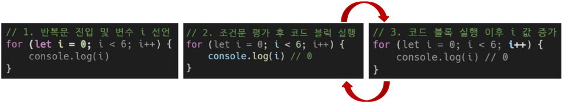
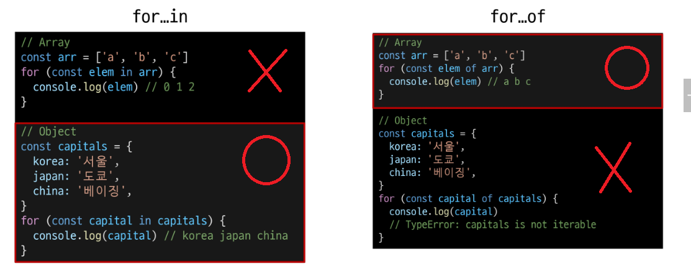

# 2. Basic Syntax

- [1. 변수](#1-변수)
  - [let](#let)
  - [const](#const)
  - [block scope 블록 스코프](#block-scope-블록-스코프)
    - [변수 선언 키워드 정리](#변수-선언-키워드-정리)
- [2. 데이터 타입](#2-데이터-타입)
- [3. 연산자](#3-연산자)
- [4. 조건문](#4-조건문)
- [5. 반복문](#5-반복문)
- [참고](#참고)
  - [세미콜론 (semicolon)](#세미콜론-semicolon)
  - [변수 선언 키워드 - 'var'](#변수-선언-키워드---var)
  - [함수 스코프 (function scope)](#함수-스코프-function-scope)
  - [호이스팅 (hoisting)](#호이스팅-hoisting)
  - [NaN을 반환하는 경우 예시](#nan을-반환하는-경우-예시)

---

- ECMAScript 2015 (ES6) 이후의 명제를 따름

- 권장 스타일 가이드
  
  - https://standardjs.com/rules-kokr.html

# 1. 변수

- 식별자(변수명) 작성 규칙
  
  - 반드시 문자, 달러(\$) 또는 밑줄(\_)로 시작
  
  - 대소문자를 구분
  
  - 예약어 사용 불가
    
    - for, if, function
  
  - 카멜 케이스(camelCase)
    
    - 변수, 객체, 함수에 사용
  
  - 파스칼 케이스(PascalCase)
    
    - 클래스, 생성자에 사용
  
  - 대문자 스네이크 케이스(SNAKE_CASE)
    
    - 상수(constants)에 사용

- 변수 선언 키워드
  
  1. let
  
  2. const
  
  3. var

## let

- 블록 스코프(block scope)를 갖는 지역 변수를 선언

- 재할당 가능

- 재선언 불가능

- ES6에서 추가

```javascript
let number = 10 // 1. 선언 및 초기값 할당
number = 20 // 2. 재할당

let number1 = 10 // 1. 선언 및 초기값 할당
let number1 = 20 // 2. 재선언 불가능
console.log(number1) // Uncaught SyntaxError: Identifier 'number1' has already been declared
```

## const

- 블록 스코프를 갖는 지역 변수를 선언

- **재할당 불가능**

- 재선언 불가능

- ES6에서 추가

```javascript
const number = 10 // 1.  선언 및 초기값 할당
number = 20 // 2. 재할당 불가능 Uncaught TypeError: Assignment to constant variable.

const number = 10 // 1. 선언 및 초기값 할당
const number = 20 // 2. 재선언 불가능

const number // Missing initializer in const declaration
```

## block scope 블록 스코프

- if, for 함수 등의 중괄호 { } 내부를 가리킴

- 블록 스코프를 가지는 변수는 블록 바깥에서 접근 불가능

```javascript
let x = 1

if (x == 1) {
    let x = 2

    console.log(x) // 2
}

console.log(x) // 1
```

### 변수 선언 키워드 정리

- 기본적으로 const 사용을 권장

- 재할당이 필요한 변수는 let으로 변경해서 사용

# 2. 데이터 타입

| 원시 자료형 (Primitive type)                  | 참조 자료형 (Reference type)               |
| ---------------------------------------- | ------------------------------------- |
| Number, String, Boolean, undefined, null | **Objects** (Object, Array, Function) |
| 변수에 값이 직접 저장되는 자료형                       | 객체의 주소가 저장되는 자료형                      |
| ( 불변, 값이 복사)                             | (가변, 주소가 복사)                          |

! 여기서 Objects는 데이터 타입 이름일 뿐

- 참조 자료형 예시
  
  - 객체를 생성하면 객체의 메모리 주소를 변수에 할당
    
    - 변수 간에 서로 영향을 미침

```javascript
console.log(x) // 1

const obj1 = { name: 'Alice', age : 30 }
const obj2 = obj1
obj2.age = 40

console.log(obj1.age) // 40
console.log(obj2.age) // 40
```

- Number
  
  - 정수 또는 실수형 숫자를 표현하는 자료형

```javascript
const a = 13
const b = -5
const c = 3.14 // float - 숫자표현
const d = 2.998e8 // 2.998 * 10^8 = 299,800,000
const e = Infinity
const f = -Infinity
const g = NaN // Not a Number를 나타내는 값
```

- String
  
  - 텍스트 데이트를 표현하는 자료형
  
  - '+' 연산자를 사용해 문자열끼리 결합
  
  - 곱셈, 나눗셈, 뺄셈 불가능

```javascript
const firstName = 'Tony'
const lastName = 'Stark'
const fuillName = firstName + lastName

console.log(fuillName) // TonyStark
```

- Template literfals (템플릿 리터럴)
  
  - 내장된 표현식을 허용하는 문자열 작성 방식
  
  - Backtick(``)을 이용하며, 여러 줄에 걸쳐 문자열을 정의할 수도 있고 JavaScript의 변수를 문자열 안에 바로 연결할 수 있음
  
  - 표현식은 '\$'와 중괄호(**\${expression}**)로 표기
  
  - ES6+ 부터 지원

```javascript
const age = 100
const message = `홍길동은 ${age}세입니다`
console.log(message) // 홍길동은 100세입니다.
```

- null과 undefined

| null                                       | undefined                                       |
| ------------------------------------------ | ----------------------------------------------- |
| 변수의 값이 없음을 의도적으로 표현할 때 사용                  | 변수 선언 이후 직접 값을 할당하지 않으면 자동으로 할당 됨               |
|  |  |

- '값이 없음'에 대한 표현이 null과 undefined 2가지인 이유
  
  - JavaScript의 설계실수
  
  - null이 원시 자료형임에도 불구하고 object로 출력되는 이유는 JavaScript설계 당시의 버그를 해결하지 않은 것
  
  - 해결하지 못하는 이유는 이미 null 타입에 의존성을 띄고 있는 수 많은 프로그램들이 망가질 수 있기 대문 (하위 호환 방지)
    
    -  null - object - 참조자료형
    
    - undefined - undefined - 원시자료형
    
    - ```javascript
      typeof null // "object"
      typeof undefined // "undefined"
      ```
      
      > ​자바스크립트를 처음 구현할 때, 자바스크립트 값은 타입 태그와 값으로 표시되었습니다.객체의 타입 태그는 0이었습니다. null은 Null pointer(대부분의 플랫폼에서 0x00)로 표시되었습니다.그 결과 null은 타입 태그로 0을 가지며, 따라서 typeof는 object를 반환합니다.
  
  - [JavaScript | MDN](https://developer.mozilla.org/ko/docs/Web/JavaScript)

- Boolean
  
  - 조건문 또는 반복문에서 Boolean이 아닌 데이터 타입은 "자동 형변환 규칙"에 따라 true 또는 false로 변환됨
  
  - 자동 형변환
  
  | 데이터 타입    | false      | true      |
  |:---------:|:----------:|:---------:|
  | undefined | 항상 false   | X         |
  | null      | 항상 false   | X         |
  | Number    | 0, -0, NaN | 나머지 모든 경우 |
  | String    | 빈 문자열      | 나머지 모든 경우 |

# 3. 연산자

- 할당 연산자
  
  - 오른쪽에 있는 피연산의 평가 결과를 왼쪽 피연산자에 할당하는 연산자
  
  - 단축 연산자 지원

```javascript
let a = 0

a += 10
console.log(a) // 10

a -= 3
console.log(a) // 7

a *= 10
console.log(a) // 70

a %= 7
console.log(a) // 0
```

- 증가 & 감소 연산자
  
  - 증가 연산자 (++)
    
    - 피연산자를 증가(1을 더함)시키고 연산자의 위치에 따라 증가하기 전이나 후의 값을 반환
  
  - 감소 연산자 (--)
    
    - 피연산자를 감소(1을 뺌)시키고 연산자의 위칭에 따라 감소하기 전이나 후의 값을 반환
  
  - += 또는 -=와 같이 더 명시적인 표현으로 작성하는 것을 권장
  
  ```javascript
  let x = 3
  const y = x++
  console.log(x, y) // 4 3
  
  let a = 3
  const b = ++a
  console.log(a, b) // 4 4
  ```

- 비교 연산자
  
  - 피연산자들(숫자, 문자, Boolean 등)을 비교하고 결과 값을 boolean으로 반환하는 연산자

```javascript
3 > 2 // true
3 < 2 // false

'A' < 'B' // true
'Z' < 'a' // true
'가' < '나' // true
```

- 동등 연산자 (`==`)
  
  - 두 피연산자가 같은 값으로 평가되는지 비교 후 boolean 값을 반환
  
  - '**암묵적 타입 변환**'통해 타입을 일치시킨 후 같은 값인지 비교
  
  - 두 피연산자가 모두 객체일 경우 메모리의 같은 객체를 바라보는지 판별

```javascript
console.log(1 == 1) // true
console.log('hello' == 'hello') // true
console.log('1' == 1) // true
console.log(0 == false) // true
```

- 일치 연산자 ( `===`)
  
  - 두 피연산자의 값과 타입이 모두 같은 경우 true 반환
  
  - 같은 객체를 가리키거나, 같은 값인지를 비교
  
  - 엄격한 비교가 이뤄지며 암묵적 타입 변환이 발생하지 않음
  
  - 특수한 경우를 제외하고는 동등 연산자가 아닌 **일치 연산자 사용 권장**

```javascript
console.log(1 === 1) // true
console.log('hello' === 'hello') // true
console.log('1' === 1) // false
console.log(0 === false) // false
```

- 논리 연산자
  
  - and 연산 - `&&`
  
  - or 연산 - `||`
  
  - not 연산 - `!`
  
  - 단축 평가 지원

# 4. 조건문

- if : 조건 표현식의 결과값을 boolean 타입으로 변환 후 참/거짓을 판단

```javascript
const name = 'customer'

if (name === 'admin') {
    console.log('관리자님 환영해요')
} else if (name === 'customer') {
    console.log('고객님 환영해요')
} else {
    console.log(`반갑습니다. ${name}님`)
}
```

- 조건 (삼항) 연산자
  
  - 세 개의 피연산자를 받는 유일한 연산자
  
  - 앞에서부터 조건문, 물음표(?), 조건문이 참일 경우 실행할 표현식, 콜론(:), 조건문이 거짓을 경우 실행할 표현식이 배치

```javascript
const func1 = function (person) {
    if (person > 17){
        return 'Yes'
    } else {
        return 'No'
    }
}

const func2 = function (person) {
    return person > 17 ? 'YES' : 'NO'
}
```

# 

# 5. 반복문

- 반복문 종류
  
  1. while
  
  2. for
  
  3. for ... in
  
  4. for ... of

- `while` : 조건 문이 참이면 문장을 계속해서 수행

```javascript
while (조건문) {
    // do something
}
```

```javascript
let i = 0

    while (i < 6) {
      console.log(i)
      i += 1
    }
    // 0 1 2 3 4 5
```

- `for` : 특정한 조건이 거짓으로 판별될 때까지 반복

```javascript
for ([초기문]; [조건문]; [증감문]) {
    // do something
}
```

```javascript
for (let i = 0; i < 6; i++) {
    console.log(i)
}
```



- for ... in
  
  - <mark>객체</mark>의 <mark>열거 가능한 속성</mark>(property)
    
    - 여기서 속성은 key를 말함!!
  
  - 절대 순서가 아님!! = 순서 보장 안됨
  
  - **!! object에서만 쓴다**

```javascript
const fruits = {
    a : 'apple',
    b : 'banana'
}

for (const property in fruits) {
    console.log(property)
    console.log(fruits[property])
}   
// a
// apple
// b
// banana
```

- for ...of 
  
  - <mark>반복 가능한 객체</mark>(배열, 문자열 등)에 대해 반복
    
    - 반복가능한, 근대 대상이 순서가 있는!
  
  - **!! object가 아닌 다른 객체**에서는 이거쓴다

```javascript
const numbers = [0, 1, 2, 3]

for (const number of numbers) {
    console.log(number) // 0 1 2 3
}

const alphabets = ['a', 'b', 'c', 'd']

for (const alphabet of alphabets) {
    console.log(alphabet) // a b c d
}
```

- 배열 반복과 for...in
  
  - 배열의 인덱스는 정수 이름을 가진 열거 가능한 속성
  
  - for ... in 은 정수가 아닌 이름과 속성을 포함하여 열거 가능한 모든 속성을 반환
  
  - 내부적으로 for ... in 은 배열의 반복자 대신 속성 열거를 사용하기 때문에 특정 순서에 따라 인덱스를 반환하는 것을 보장할 수 없음
    
    - 인덱스가 순서가 중요한 배열에서는 사용하지 않음
    
    - **배열에서는 for, for...of 반복을 사용**
  
  ```javascript
  const arr = ['a', 'b', 'c']
  
  for (const i in arr) {
      console.log(i) // 0, 1, 2
  }
  
  for (const i of arr) {
      console.log(i) // a, b, c
  }
  ```



| 키워드        | 연관 키워드      | 스코프    |
| ---------- | ----------- |:------:|
| for ... in | object 순회   | 블록 스코프 |
| for ... of | iterable 순회 | 블록 스코프 |

연관 키워드

- 반복문 사용 시 const 사용 여부
  
  - for문
    
    - for (let i = 0; i < arr.length; i++) {...} 의 경우에는 최초 정의한 i를 '**재할당**'하면서 사용하기 때문에 **const를 사용하면 에러** 발생
  
  - for ... in, for ... of
    
    - 재할당이 아니라, 매 반복마다 다른 속성 이름이 변수에 지정되는 것이므로 **const를 사용해도 에러가 발생하지 않음**
    
    - 단, const 특징에 따라 블록 내부에서 변수를 수정할 수 없음

- 반복문 4개 키워드 다 break, continue 쓸 수 잇음!

# 참고

## 세미콜론 (semicolon)

- 자바스크립트는 세미콜론을 선택적으로 사용 가능

- 세미콜론이 없으면 ASI에 의해 자동으로 세미콜론이 삽입된
  
  - ASI(Automatic Semicolon Insertion) 자동 세미콜론 삽입 규칙

- JavaScript 만든 Brendan Eich 또한 세미콜론 작성을 반대

## 변수 선언 키워드 - 'var'

- ES6 이전에 변수 선언에 사용했던 키워드

- 재할당 가능 & 재선언 가능

- "호이스팅" 되는 특성으로 인해 예기치 못한 문제 발생 가능
  
  - 따라서 ES6 이후부터는 var 대신 const와 let을 사용하는 것을 권장

- **함수 스코프(function scope)**를 가짐

- 변수 선언 시 var, const, let 키워드 중 하나를 사용하지 않으면 자동으로 var로 선언됨

https://jsisweird.com/

## 함수 스코프 (function scope)

- 함수의 중괄호 내부를 가리킴

- 함수 스코프를 가지는 변수는 함수 바깥에서 접근 불가능

```javascript
function foo() {
    var x = 1
    console.log(x) // 1
}

console.log(x) // ReferenceError: x is not defined
```

## 호이스팅 (hoisting)

- 변수를 선언 이전에 참조할 수 있는 현상

- 변수 선언 이전의 위치에서 접근 시 undefined를 반환

```javascript
console.log(name) // undefined => 선언 이전에 참조

var name = '홍길동' // 선언

// 위 코드를 아래와 같이 이해함
var name // undefined로 초기화
console.log(name)

var name = '홍길동'
```

- JavaScript에서 변수들은 실제 실행시에 코드의 최상단으로 끌어올려지게 되며(hoisted)이러한 이유 때문에 var로 선언된 변수는 선언 시에 undefined로 값이 초기화 되는 과정이 동시에 발생

## NaN을 반환하는 경우 예시

1. 숫자로서 읽을 수 없음 ex) Number(undefined)

2. 결과가 허수인 수학 계산식 ex) Math.sqrt(-1)

3. 피연산자가  NaN ex) 7 \*\* NaN

4. 정의할 수 없는 계산식 ex) 0 \* Infinity

5. 문자열을 포함하면서 덧셈이 아닌 계산식 ex) '가' / 3
