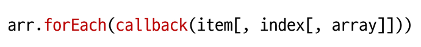
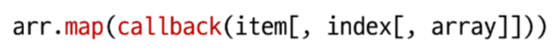
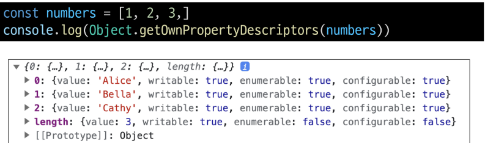

# 3. 참조 자료형

[1. 함수](#1-함수)
   
   [1-1 개요](#1-1-개요)
   
   [1-2 함수 정의](#1-2-함수-정의)
   
   [1-3 매개 변수](#1-3-매개-변수)
   
   [1-4 Spread Syntax](#1-4-spread-syntax)
   
   [1-5 화살표 함수](#1-5-화살표-함수)
   
   [1-6 참고](#1-6-참고)

[2. 객체](#2-객체)
   
   [2-1 개요](#1-1-개요)
   
   [2-2 구조 및 속성](#2-2-구조-및-속성)
   
   [2-3 객체와 함수](#2-3-객체와-함수)
   
   [2-4 this ★](#2-4-this-★)
   
   [2-5 추가 객체 문법 ★](#2-5-추가-객체-문법)
   
   [2-6 JSON](#2-6-json)
   
   참고
   
   - [new 연산자](#new-연산자)
   
   - [JavaScript 'this' 장단점](#javascript-this-장단점)
   
   - [함수 스코프와 블록 스코프의 차이](#함수-스코프와-블록-스코프의-차이)

[3. 배열](#3-배열)
   
   [3-1 개요](#3-1-개요)
   
   [3-2 배열과 메서드](#3-2-배열과-메서드)
   
   [3-3 Array helper method](#3-3-array-helper-method)
   
   [3-4 추가 배열 문법 ★](#3-4-추가-배열-문법-★★★)

4. 참고
   
   - [콜백함수 구조를 사용하는 이유](#콜백함수-구조를-사용하는-이유)
   
   - [배열은 객체다](#배열은-객체다)

----

# 1. 함수

## 1-1 개요

- Function : 참조 자료형에 속하며 모든 함수는 Function **object**

- 참조자료형(Reference type) : Objects - Object, Array, Function
  
  - 객체의 주소가 저장되는 자료 ( 가변, 주소가 복사)


## 1-2 함수 정의

- 함수 구조
  
  - 함수의 이름
  
  - 함수의 매개 변수
  
  - 함수의 body를 구성하는 statement
  
  - **return 값이 없다면 undefined를 반환**
  
  ```javascript
  function name ([param[, param,[..., param]]]) {
      statements
      return value
  }
  ```

- 함수 정의 2가지 방법
  
  - 선언식 (function declaration)
  
  - 표현식 (function expression)

```javascript
 // 함수 선언식
function add(num1, num2) {
    return num1 + num2
}

console.log(add(3, 9))

// 함수 표현식
const sub = function (num1, num2) {
    return num1 - num2
}

console.log(sub(3, 9))
```

- 함수 표현식 특징
  
  - 함수 이름이 없는 '익명 함수'를 사용할 수 있음
    
    - 재귀 호출 때는 이름 필요!
  
  - 선언식과 달리 표현식으로 정의한 함수는 호이스팅 되지 않으므로 함수를 정의하기 전에 먼저 사용할 수 없음

```javascript
// 함수 선언식
console.log(add(3, 9)) // 3

function add(num1, num2) {
    return num1 + num2
}

// 함수 표현식
console.log(add(3, 9)) // ReferenceError

const sub = function (num1, num2) {
    return num1 - num2
}
```

| 선언식         | 표현식         |
|:-----------:|:-----------:|
| 익명함수 사용 불가능 | 익명 함수 사용 가능 |
| 호이스팅 있음     | 호이스팅 없음     |


## 1-3 매개 변수

- 매개 변수 정의 방법
  
  1. 기본 함수 매개변수
  
  2. 나머지 매개변수

- 기본 함수 매개 변수 (Default function parameter)
  
  - 값이 없거나 undefined가 전달될 경우 이름 붙은 매개변수를 기본값으로 초기화
  
  ```javascript
  // 기본 함수 매개변수
  const greeting = function (name = 'Anonymous') {
      return `Hi ${name}`
  }
  
  console.log(greeting()) // Hi Anonymousymous
  ```

- 나머지 매개변수 (Rest parameters)
  
  - 임의의 수를 인자의 '배열'로 허용하여 가변 인자를 나타내는 방법
  
  - 작성규칙
    
    - 함수 정의시 나머지 매개변수 하나만 작성할 수 있음
    
    - 나머지 매개변수는 함수 정의에서 매개변수 마지막에 위치해야 함
  
  ```javascript
  // 나머지 매개변수 (가변 인자)
  const myFunc = function (num1, num2, ...restArgs) {
      return [num1, num2, restArgs]
  }
  
  console.log(myFunc(1, 2, 3, 4, 5)) // [1, 2, [3, 4, 5]]
  console.log(myFunc(1, 2)) //[1, 2, []]2, []]
  ```

- 매개변수와 인자의 개수 불일치
  
  - 매개변수 개수 > 인자 개수
    
    - 누락된 인자는 undefined로 할당
    
    ```javascript
    // 매개변수와 인자의 개수 불일치 허용
    // 매개변수 개수 > 인자 개수
    const threeArgs = function (num1, num2, num3) {
        return [num1, num2, num3]
    }
    
    console.log(threeArgs()) //[undefined, undefined, undefined]
    console.log(threeArgs(1)) // [1, undefined, undefined]
    console.log(threeArgs(2, 3)) // [2, 3, undefined]defined]
    ```
  
  - 매개변수 개수 < 인자 개수
    
    - 초과 입력한 인자는 사용하지 않음
    
    ```javascript
    // 매개변수 개수 < 인자 개수
    const noArgs = function () {
        return 0
    }
    
    console.log(noArgs(1, 2, 3)) // 0
    
    const twoArgs = function (num1, num2) {
        return [num1, num2]
    }
    
    console.log(twoArgs(1, 2, 3)) // [1, 2]
    ```


## 1-4 Spread Syntax

- `...` 전개 구문
  
  - 배열이나 문자열과 같이 반복 가능한 항목을 펼치는 것 (확장, 전개)
  
  - 전개 대상에 따라 역할이 다름
    
    - 배열이나 객체의 요소를 개별적인 값으로 분리하거나
    
    - 다른 배열이나 객체의 요소를 현재 배열이나 객체에 추가하는 등
  1. 함수와의 사용
     
     1. 함수 호출 시 인자 확장
     
     2. 나머지 매개변수(압축)
  
  2. 객체와의 사용 
  
  3. 배열과의 사용 

- 함수와의 사용
  
  1. 함수 호출 시 인자 확장
     
     ```javascript
     // 1. 함수 호출 시 인자 확장
     function myFunc(x, y, z) {
         return x + y + z
     }
     
     let numbers = [1, 2, 3]
     console.log(myFunc(...numbers)) // 6
     
     let numbers1 = [1, 2]
     console.log(myFunc(...numbers1)) // NaN
     ```
  
  2. 나머지 매개변수 (압축)
     
     ```javascript
     // 2. 나머지 매개변수
     function myFunc2(x, y, ...restArgs) {
         
         // arguments : 파라미터 전체를 가지는 내장 객체
         // 잘 못쓰는 이유
         // 1. 화살표 함수에서는 못 씀
         // 2. 가독성 안 좋음
         // 3. Array Helper Methods 못 씀
         console.log(arguments)
         return [x, y, restArgs]
     }
     
     console.log(myFunc2(1, 2, 3, 4, 5)) // [1, 2, [3, 4, 5]]
     console.log(myFunc2(1, 2)) // [1, 2, []]2, []]
     ```

- 많이 쓰는 방법
  
  ```javascript
  const myfunc3 = function (...params) {
      console.log(params)
      // 인덱스 접근 가능
      console.log(params[0])
  }
  
  myfunc3(1, 2, 3, 4) 
  // [1, 2, 3, 4]
  // 1
  ```

## 1-5 화살표 함수

- Arrow function expressions
  
  - 함수 표현식의 간결한 표현법
  
  ```javascript
  const arrow1 = function (name) {
      return `hello, ${name}`
  }
  
  // 1. function 키워드 삭제 후 화살표 작성
  const arrow2 = (name) => { return `hello, ${name}` }
  
  // 2. 인자가 1개일 경우에만 () 생략 가능
  const arrow3 = name => { return `hello, ${name}` }
  
  // 3. 함수 본문이 return을 포함한 표현식 1개일 경우에 {} & return 삭제 가능
  const arrow4 = name => `hello, ${name}`
  ```


## 1-6 참고

### 화살표 함수 심화

```javascript
// 1. 인자가 없다면 () or _ 로 표시 가능
const noArgs1 = () => 'No args'
const noArgs2 = _ => 'No args'

// 2-1. object를 return 한다면 return 을 명시적으로 작성해야 함
const returnObject1 = () => { return { key : 'value' }}

// 2-2. return을 작성하지 않으려면 객체를 소괄호로 감싸야 함
const returnObject2 = () => ({ key : 'value' })
```


# 2. 객체

## 2-1 개요

- Object : 키로 구분된 데이터 집합(data collection)을 저장하는 **자료형**


## 2-2 구조 및 속성

- 객체 구조
  
  - 중괄호를 이용해 작성
  
  - 중괄호 안에는 key : value 쌍으로 구성된 속성(property)를 여러 개 작성 가능
  
  - key는 문자형만 허용
  
  - value는 모든 자료형 허용
  
  ```javascript
  const user = {
    name: 'Alice',
    'key with space': true,
    greeting: function () {
      return 'hello'
    }
  }
  ```

- 속성 참조
  
  - 점('.', chaining operator) 또는 대괄호([ ])로 객체 요소 접근
  
  - key 이름에 띄어쓰기 같은 구분자가 있으면 대괄호 접근만 가능
  
  ```javascript
  // 1
  const obj = {
    name : '김승희',
    job : '학생',
    condition : 'bad',
  }
  
  const myfunc = function (obj) {
    console.log(obj)
    // 객체 속성 접근은 . 이나 [] 활용
    console.log(obj.name)
    console.log(obj['name'])
    // 이렇게는 안됨
    console.log(obj[name]) // undefined
  }
  
  // 2
  const user = {
    name: 'Alice',
    'key with space': true,
    greeting: function () {
      return 'hello'
    }
  }
  
  // 조회
  console.log(user.name) // Alice
  console.log(user['key with space']) // true
  
  // 추가
  user.address = 'korea'
  console.log(user) // {name: 'Alice', key with space: true, address: 'korea', greeting: ƒ}
  
  // 수정
  user.name = 'Bella'
  console.log(user.name) // Bella
  
  // 삭제
  delete user.name
  console.log(user) // {key with space: true, address: 'korea', greeting: ƒ}
  ```

- 'in' 연산자
  
  - 속성이 객체에 존재하는지 여부를 확인
  
  ```javascript
  // in 연산자
  console.log('greeting' in user) // true
  console.log('country' in user) // false
  ```


## 2-3 객체와 함수

- Method : 객체 속성에 정의된 함수

- Method 사용 예시
  
  - object.method() 방식으로 호출
  
  - 메서드는 객체를 '행동'할 수 있게 함
    
    ```javascript
    // 메서드 호출
    console.log(user.greeting()) // hello
    ```


## 2-4 this ★

-  Method : 객체 속성에 정의된 함수
  
  - '<mark>**this**</mark>' 키워드를 사용해 객체에 대한 특정한 작업을 수행할 수 있음

- 'this' keyword
  
  - 함수나 메서드를 **호출한 객체**를 가리키는 키워드
  
  - 함수 내에서 객체의 속성 및 메서드에 접근하기 위해 사용
  
  ```javascript
  const person = {
    name: 'Alice',
    greeting: function() {
      return `Hello my name is ${this.name}`
    },
  }
  
  console.log(person.greeting()) // Hello my name is Alice
  ```

- JavaScript에서 this는 함수를 **호출하는 방법**에 따라 가리키는 대상이 다름
  
  | 호출 방법  | 대상          |
  |:------:|:-----------:|
  | 단순 호출  | 전역 객체       |
  | 메서드 호출 | 메서드를 호출한 객체 |
  
  1. 단순 호출 시 this : 가리키는 대상 => 전역 객체
     
     - 브라우저 : window
     
     - Node.js : global
     
     ```javascript
     // 1.1 단순 호출
     const myFunc = function () {
       return this
     }
     console.log(myFunc()) // window
     ```
  
  2. 메서드 호출 시 this : 가리키는 대상 => 메서드를 호출한 객체
     
     ```javascript
     // 1.2 메서드 호출
     const myObj = {
       data: 1,
       myFunc: function () {
         return this
       }
     }
     console.log(myObj.myFunc()) // myObj
     ```
  
  3- 중첩된 함수에서의 this 문제점과 해결책
     
     - forEach의 인자로 작성된 콜백 함수는 일반적인 함수 호출이기 때문에 this가 전역 객체를 가리킴
       
       ```javascript
       // 2. Nested
       // 2.1 일반 함수
       const myObj2 = {
         numbers: [1, 2, 3],
         myFunc: function () {
           this.numbers.forEach(function (number) {
             console.log(this) // window
           })
         }
       }
       console.log(myObj2.myFunc())
       ```
     
     - **화살표 함수는 자신만의 this를 가지지 않기 때문에** 외부 함수에서의 this값을 가져옴
       
       - 화살표 함수에서 this는 **정의한 곳 기준**으로 한 단계 상위 스코프의 this를 참조
       
       - 이러한 것을 렉시컬 스코프(Lexical Scope)라고 함
       
       ```javascript
       // 2.2 화살표 함수
       const myObj3 = {
         numbers: [1, 2, 3],
         myFunc: function () {
           this.numbers.forEach((number) => {
             console.log(this) // myObj3
           })
         }
       }
       console.log(myObj3.myFunc())
       ```

- JavaScript 'this' 정리
  
  - JavaScript에서 this는 함수가 '**호출되는 방식**'에 따라 결정되는 현재 객체를 나타냄
  
  - JavaScript의 함수는 호출될 때 this를 암묵적으로 전달 받음
  
  - Python의 self와  Java의 this가 선언 시 값이 이미 정해지는 것에 비해 JavaScript의 this는 **함수가 호출되기 전까지 값이 할당되지 않고 호출 시에 결정**됨 (동적 할당)


## 2-5 추가 객체 문법

1. 단축 속성
   
   - 키 이름과 값으로 쓰이는 변수의 이름이 같은 경우 단축 구분을 사용할 수 있음
   
   ```javascript
   // 단축 속성
   const name = 'Alice'
   const age = 30
   
   const user1 = {
     name: name,
     age: age,
   }
   
   const user2 = {
     name,
     age,
   }
   ```

2. 단축 메서드
   
   - 메서드 선언 시 function 키워드 생략 가능
   
   ```javascript
   // 단축 메서드
   const myObj1 = {
     myFunc: function () {
       return 'Hello'
     }
   }
   
   const myObj2 = {
     myFunc() {
       return 'Hello'
     }
   }
   ```

3. 계산된 속성 (computed property name)
   
   - 키가 대괄호([ ])로 둘러싸여 있는 속성
   
   - 고정된 값이 아닌 변수 값을 사용할 수 있음
   
   ```javascript
   // 계산된 프로퍼티
   const product = prompt('물건 이름을 입력해주세요')
   const prefix = 'my'
   const suffix = 'property'
   
   const bag = {
     [product]: 5,
     [prefix + suffix]: 'value',
   }
   
   console.log(bag) // {연필: 5, myproperty: 'value'}
   ```

4. 구조 분해 할당(destructing assignment) ★★★
   
   - 배열 또는 객체를 분해하여 속성을 변수에 쉽게 할당할 수 있는 문법
   
   ```javascript
   // 구조 분해 할당
   const userInfo = {
     firstName: 'Alice',
     userId: 'alice123',
     email: 'alice123@gmail.com'
   }
   
   // const firstName = userInfo.name
   // const userId = userInfo.userId
   // const email = userInfo.email
   
   // const { firstName } = userInfo
   // const { firstName, userId } = userInfo
   const { firstName, userId, email } = userInfo
   
   // Alice alice123 alice123@gmail.com
   console.log(firstName, userId, email)
   ```
   
   - '함수의 매개변수'로 객체 구조 분해 할당 활용 가능
   
   ```javascript
   // 구조 분해 할당 활용 - 함수 매개변수
   function printInfo({ name, age, city }) {
     console.log(`이름: ${name}, 나이: ${age}, 도시: ${city}`)
   }
   
   const person = {
     name: 'Bob',
     age: 35,
     city: 'London',
   }
   
   // 함수 호출 시 객체를 구조 분해하여 함수의 매개변수로 전달
   printInfo(person) // '이름: Bob, 나이: 35, 도시: London'
   ```

5. Object with '전개 구문'
   
   - 객체 복사 - 객체 내부에서 객체 전개
   
   - 얕은 복사에 활용 가능
   
   ```javascript
   // with 전개 구문
   const obj = { b: 2, c: 3, d: 4 }
   const newObj = { a: 1, ...obj, e: 5 }
   console.log(newObj) // {a: 1, b: 2, c: 3, d: 4, e: 5}
   
   ```

6. 유용한 객체 메서드
   
   - `Object.keys()`
   
   - `Object.values()`
   
   ```javascript
   // 유용한 객체 메서드
   const profile = {
     name: 'Alice',
     age: 30,
   }
   
   console.log(Object.keys(profile)) // ['name', 'age']
   console.log(Object.values(profile)) // ['Alice', 30]
   ```

7. Optional chaining (`?.`)
   
   - 속성이 없는 중첩 객체를 에러 없이 접근할 수 있음
   
   - 만약 참조 대상이 null 또는 undefined라면 에러가 발생하는 것 대신 평가를 멈추고 undefined를 반환
   
   - 참조가 누락될 가능성이 있는 경우 연결된 속성으로 접근할 때 더 짧고 간단한 표현식을 작성할 수 있음
   
   - 어떤 속성이 필요한지에 대한 보증이 확실하지 않는 경우에 객체의 내용을 보다 편리하게 탐색할 수 있음
   
   - 주의사항
     
     - Optional chaining은 존재하지 않아도 괜찮은 대상에만 사용해야 함(남용X)
       
       - 왼쪽 평가대상이 없어도 괜찮은 경우에만 선택적으로 사용
       
       - Optional chaining 앞의 변수는 반드시 선언되어 있어야 함
   
   ```javascript
   const user = {
     name: 'Alice',
     greeting: function () {
       return 'hello'
     }
   }
   
   // console.log(user.address.street) // Uncaught TypeError: Cannot read properties of undefined (reading 'street')
   console.log(user.address?.street) // undefined
   
   // console.log(user.nonMethod()) // Uncaught TypeError: user.nonMethod is not a function
   console.log(user.nonMethod?.()) // undefined
   
   // optional chaining 없다면? 
   console.log(user.address && user.address.street) // undefined
   
   console.log(myObj?.address) // Uncaught ReferenceError: myObj is not defined
   
   // 위 예시 코드 논리상 user는 반드시 있어야 하지만 address는 필수 값이 아님
   // user에 값을 할당하지 않은 문제가 있을 때 바로 알아낼 수 있어야 하기 때문
   
   // Bad
   user?.address?.street
   
   // Good
   user.address?.street
   ```
- Optional cahining 요약
  
  1. `obj?.prop` 
     
     - obj가 존재하면 obj.prop을 반환하고, 그렇지 않으면 undefined를 반환
  
  2. `obj?.[prop]`
     
     - obj가 존재하면 obj[prop]을 반환하고, 그렇지 않으면 undefined를 반환
  
  3. `obj?.method()`
     
     - obj가 존재하면 obj.method()를 호출하고, 그렇지 않으면  undefined를 반환


## 2-6 JSON

- JSON
  
  - 'JavaScript Object Notation'
  
  - key-value 형태로 이루어진 자료 표기법
  
  - JavaScript의 Object와 유사한 구조를 가지고 있지만 JSON은 형식이 있는 **문자열**
  
  - JavaScript에서 JSON을 사용하기 위해서는 Object 자료형으로 변경해야 함

- Object <-> JSON 변환하기

```javascript
const jsObject = {
  coffee: 'Americano',
  iceCream: 'Cookie and cream',
}

// Object -> JSON
const objToJson = JSON.stringify(jsObject)
console.log(objToJson)  // {"coffee":"Americano","iceCream":"Cookie and cream"}
console.log(typeof objToJson)  // string

// JSON -> Object
const jsonToObj = JSON.parse(objToJson)
console.log(jsonToObj)  // { coffee: 'Americano', iceCream: 'Cookie and cream' }
console.log(typeof jsonToObj)  // object
```


# 참고

## new 연산자

- JS에서 객체를 하나 생성한다고 한다면?
  
  - 하나의 객체를 선언하여 생성

- 동일한 형태의 객체를 또 만든다면?
  
  - 또 다른 객체를 선언하여 생성해야 함

- 사용자 정의 객체 타입을 생성

- 매개변수
  
  1. constructor : 객체 인스턴스의 타입을 기술(명세)하는 함수
  
  2. arguments : constructor와 함께 호출될 값 목록
  
  

```javascript
function Member(name, age, sId) {
  this.name = name
  this.age = age
  this.sId = sId
}

const member3 = new Member('Bella', 21, 20226543)

console.log(member3) // Member { name: 'Bella', age: 21, sId: 20226543 }
console.log(member3.name) // Bella
```


## JavaScript 'this' 장단점

- this가 미리 정해지지 않고 호출 방식에 의해 결정되는 것은

- 장점
  
  - 함수(메서드)를 하나만 만들어 여러 객체에서 재사용할 수 있다는 것

- 단점
  
  - 이런 유연함이 실수로 이어질 수 있다는 것

ㅇ 개발자는 this의 동작 방식을 충분히 이해하고 장점을 취하면서 실수를 피하는데에 집중


## 함수 스코프와 블록 스코프의 차이

```javascript
// 함수 스코프 테스트
// 함수 내부에서 사용하는 영역
// var, let, const 모두 외부에서는 사용 불가능
function abc() {
  var varTmp = 12
  let letTmp = 13
  const constTmp = 14
}

// 함수 스코프 내부의 변수를 참조할 수 없어서 에러남
// console.log(varTmp) // ReferenceError: varTmp is not defined
// console.log(letTmp) //ReferenceError: letTmp is not defined

// 블록 스코프 테스트
if (true) {
    var varTmp = 22
    let letTmp = 23
    const constTmp = 24
}

// var는 된다! 
console.log(varTmp) // 22
// 즉, var는 함수스코프 내에서만 지역변수로 인식
// var는 블록스코프에서는 전역변수처럼 인식

// console.log(letTmp) // ReferenceError: letTmp is not defined
```


# 3. 배열

## 3-1 개요

- Object : 키로 구분된 데이터 집합(data collection)을 저장하는 자료형
  
  - 이제는 **순서가 있는 collection**이 필요

- Array : 순서가 있는 데이터 집합을 저장하는 자료구조

- 배열 구조
  
  - 대괄호([ ])를 이용해 작성
  
  - 배열 요소 자료형 : 제약 없음
  
  - length 속성을 사용해 배열에 담긴 요소가 몇 개인지 알 수 있음

```javascript
const names = ['Alice', 'Bella', 'Cathy',]

console.log(names[0]) // Alice
console.log(names[1]) // Bella
console.log(names[2]) // Cathy

console.log(names.length) // 3

// 수정
names[1] = 'Dan'
console.log(names)
```


## 3-2 배열과 메서드

- 주요 메서드
  
  | 메서드             | 역할               |
  |:---------------:|:----------------:|
  | push / pop      | 배열 끝 요소를 추가 / 제거 |
  | unshift / shift | 배열 앞 요소를 추가 / 제거 |

- `pop()` : 배열 끝 요소를 제거하고, 제거한 요소를 반환

- `push()` : 배열 끝에 요소를 추가

- `shift()` : 배열 앞 요소를 제거하고, 제거한 요소를 반환

- `unshift()` : 배열 앞에 요소를 추가

```javascript
const names = ['Alice', 'Bella', 'Cathy',]

// pop
console.log(names.pop()) // Cathy
console.log(names) // ['Alice', 'Bella']

// push
names.push('Dan')
console.log(names) // ['Alice', 'Bella', 'Dan']

// shift
console.log(names.shift()) // Alice
console.log(names) // ['Bella', 'Dan']

// unshift
names.unshift('Eric')
console.log(names) // ['Eric', 'Bella', 'Dan']

```


## 3-3 Array helper method

- 배열을 **순회**하며 **특정 로직을 수행**하는 메서드
  
  - 메서드 호출시 인자로 함수(콜백함수)를 받는 것이 특징

- 주요 Array helper methods
  
  | 메서드     | 역할                                                         |
  |:-------:|:----------------------------------------------------------:|
  | forEach | 인자로 주어진 함수(콜백함수)를 배열 요소 각각에 대해 실행                          |
  | map     | 배열 내의 모든 요소 각각에 대해 함수(콜백함수)를 호출하고, 함수 호출 결과를 모아 새로운 배열을 반환 |

- `forEach` 구조



- 콜백 함수는 3가지 매개 변수로 구성
  
  1. item : 처리할 배열의 요소
  
  2. index : 처리할 배열 요소의 인덱스 (선택 인자)
  
  3. array : forEach를 호출한 배열 (선택 인자)
  -  반환값 : **undefined**

```java
array.forEach(function (item, index, array) {
    // do something
})
```

```javascript
const names = ['Alice', 'Bella', 'Cathy',]

// 일반 함수
names.forEach(function (item, index, array) {
  console.log(`${item} / ${index} / ${array}`)
})

// 화살표 함수
names.forEach((item, index, array) => {
  console.log(`${item} / ${index} / ${array}`)
})
```

- 콜백 함수(Callback function)
  
  - 다른 함수에 인자로 전달되는 함수
  
  - 외부 함수내에서 호출되어 일종의 루틴이나 특정 작업을 진행

```javascript
// 1
const numbers1 = [1, 2, 3,]
numbers.forEach(function (num) {
  console.log(num ** 2)
})
// 1
// 4
// 9

// 2
const numbers2 = [1, 2, 3,]
const callBackFunction = function (num) {
  console.log(num ** 2)
}

numbers.forEach(callBackFunction)
// 1
// 4
// 9
```

- `map()`
  
  - 배열 내의 모든 요소 각각에 대해 함수(콜백함수)를 호출하고, 함수 호출 결과를 모아 **새로운 배열을 반환**



- `map` 구조
  
  1. item : 처리할 배열의 요소
  
  2. index : 처리할 배열 요소의 인덱스 ( 선택인자 )
  
  3. array : map을 호출할 배열 (선택 인자)
  - 반환 값 : 배열 각 요소에 대해 실행한 'callback의 결과를 모은 새로운 배열'
    
    - 기본적으로 forEach 동작 원리와 같지만 forEach와 달리 새로운 배열을 반환함

```javascript
// 1
const names = ['Alice', 'Bella', 'Cathy',]

const result1 = names.map(function (name) {
    return name.length
})

const result2 = names.map((name) => {
    return name.length
})

console.log(result1) // [5, 5, 5]
console.log(result2) // [5, 5, 5]


// 2
const numbers = [1, 2, 3,]

const doubleNumber = numbers.map((number) => {
    return number * 2
})

console.log(doubleNumber) // [2, 4, 6]
```

- python 에서의 map 함수와 비교
  
  - python의 map에 square 함수를 인자로 넘겨 numbers 배열의 각 요소를 square 함수의 인자로 사용하였음
  
  ```python
  numbers = [1, 2, 3]
  
  
  def square(num):
      return num**2
  
  
  new_numbers = list(map(square, numbers))
  print(new_numbers)  # [1, 4, 9]
  ```
  
  - map 메서드에 callBackFunc 함수를 인자로 넘겨 numbers 배열의 각 요소를 callBackFunc 함수의 인자로 사용하였음
  
  ```javascript
  const numbers = [1, 2, 3]
  
  const callBackFunction = function (number) {
      return number ** 2
  }
  
  const newNumbers = numbers.map(callBackFunction)
  console.log(newNumbers) // [1, 4, 9]
  
  ```

- 배열 순회 종합

| 방식         | 특징                                                                     | 비고    |
|:----------:|:---------------------------------------------------------------------- |:----- |
| for loop   | 배열의 인덱스를 이용하여 각 요소에 접근, (break, continue 사용 가능)                        |       |
| for ... of | 배열 요소에 바로 접근 가능 (break, continue 사용 가능)                                |       |
| forEach    | 간결하고 가독성 높음, callback 함수를 이용하여 각 요소를 조작하기 용이, (break, continue 사용 불가능) | 사용 권장 |


## 3-4 추가 배열 문법 ★★★

1. Array with '전개 구문'
   
   - 배열 복사
   
   ```javascript
   let parts = ['어깨', '무릎']
   let lyrics = ['머리', ...parts, '발']
   
   console.log(lyrics) // ['머리', '어깨', '무릎', '발']
   ```

2. 기타 Array Helper Methods
   
   - MDN 문서를 참고해 사용해보기
   
   | 메서드    | 역할                                  |
   |:------:| ----------------------------------- |
   | filter | 콜백 함수의 반환 값이 참인 요소들만 모아서 새로운 배열을 반환 |
   | find   | 콜백 함수의 반환값이 참이면 해당 요소를 반환           |
   | some   | 배열의 요소 중 하나라도 판별 함수를 통과하면 참을 반환     |
   | every  | 배열의 모든 요소가 판별 함수를 통과하면 참을 반환        |

```javascript
// filter
// 원본 배열에서 필요한 데이터만 골라서 새로운 배열로 생성
// 예시 ) 배열 중 짝수만 사용하고 싶다
const numbers = [1, 2, 3, 4, 5]

const filterNumbers = numbers.filter((element) => {
    return element % 2 === 0
})

console.log(filterNumbers)


// reduce
// 원본 배열 데이터를 활용해서 특정 하나의 값을 얻고 싶을 때
// 예시 ) 합계
// total : 누적값
// element : 배열의 각 요소
// index : 배열 요소의 인덱스
// array : 원본 배열
let initialValue = 10
const sumNumbers = numbers.reduce((total, element, index, array) => {
    return total + element
}, initialValue)

const sumNumbers1 = numbers.reduce((total, element, index, array) => {
    return total + element
}, 0)

console.log(sumNumbers) // 25
console.log(sumNumbers1) //15

// 퀴즈
// 10부터 시작해서 짝수만 더해랑
const sumNumbers2 = numbers.reduce((total, element, index, array) => {
        if (element % 2 === 0) {
            return total + element
        }
        return total
    }, 10)

console.log(sumNumbers2)

// 삼항 연산자 활용하기
const result = numbers.reduce((total, element) =>{
    return element % 2 === 0 ? total + element : total
}, 10)


// find
// const numbers = [1, 2, 3, 4, 5]
let target = 3
const findNumber = numbers.find((element) => {
    // 조건이 true인 순간 검색 끝!
    return element === target
})
console.log(findNumber) // 3

target = 10
const findNumber1 = numbers.find((element) => {
    // 조건이 true인 순간 검색 끝!
    return element === target
})
console.log(findNumber1) // undefined


// some
// 특정 조건이 하나라도 맞으면 true, 모두 틀리면 false (one of)
const someNumber = numbers.some((element) => {
    return element < 2
})
console.log(someNumber) // true


// every
// 특정 조건이 모두 만족하면 true, 하나라도 틀리면 false (all of)
const everyNumber = numbers.every((element) => {
    return element < 5
})
console.log(everyNumber) // False
```

# 참고

## 콜백함수 구조를 사용하는 이유

1. 함수의 재사용성 측면
   
   - 함수를 호출하는 코드에서 콜백 함수의 동작을 자유롭게 변경할 수 있음
   
   - 예를 들어, map 함수는 콜백 함수를 인자로 받아 배열의 각 요소를 순회하며 콜백 함수를 실행
   
   - 이 때 콜백 함수는 각 요소를 변환하는 로직을 담당하므로, map 함수를 호출하는 코드는 간결하고 가독성이 높아짐

2. 비동기적 처리 측면
   
   - setTimeout 함수는 콜백 함수를 인자로 받아 일정 시간이 지난 후에 실행됨
   
   - 이때, setTimeout 함수는 비동기적으로 콜백함수를 실행하므로, 다른 코드의 실행을 방해하지 않음
   
   ```javascript
   console.log('a')
   
   setTimeout(() => {
       console.log('b')
   }, 3000)
   
   console.log('c')
   
   // a
   // b
   // c
   ```
   
   

## 배열은 객체다

- 배열은 키와 속성들을 담고 있는 참조 타입의 객체

- 배열은 인덱스를 키로 가지며 length 프로퍼티를 갖는 특수한 객체

- 배열의 요소를 대괄호 접근법을 사용해 접근하는 건 객체 문법과 같음

- 다만 배열의 키는 숫자라는 점

- 숫자형 키를 사용하므로써 배열은 객체 기본 기능 이외에도 순서가 있는 컬렉션을 제어하게 해주는 특별한 메서드를 제공




