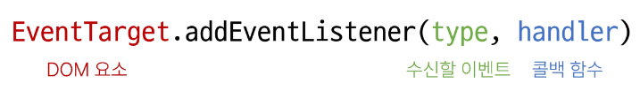
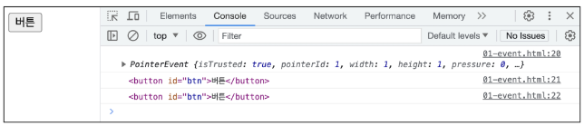
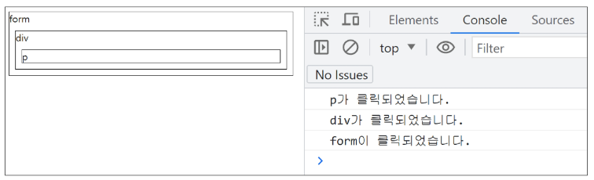

# Event

1. 이벤트
   
   - 1-1 개요
   
   - event
   
   - 버블링

2. Event Handler 활용
   
   - 이벤트 기본 동작 취소

---

# 1. 이벤트

## 1-1 개요

- 웹에서의 이벤트
  
  - 버튼을 클릭했을 때 팝업 창이 출력되는 것
  
  - 마우스 커서의 위치에 따라 드래그 앤 드롭하는 것
  
  - 사용자의 키보드 입력 값에 따라 새로운 요소를 생성하는 것
  
  - => 일상에서도 이벤트처럼 웹에서도 이벤트를 통해 특정 동작을 수행한다.

## 1-2 event

무언가 일어났다는 신호, 사건

=> 모든 DOM 요소는 이러한 event를 만들어 냄

- event object
  
  - DOM에서 이벤트가 발생했을 때 생성되는 **<mark>객체</mark>**
  
  - 이벤트 종류
    
    - mouse, input, keyboard, touch
    
    - https://developer.mozilla.org/en-US/docs/Web/API/Event

- DOM 요소는 event를 받고 받은 event를 **처리**(event handler : 이벤트 처리기)할 수 있음

### Event handler

이벤트가 발생했을 때 실행되는 함수

 => 사용자의 행동에 어떻게 반응할지를 JavaScript 코드로 표현한 것

- `.addEventListenr()` 
  
  - 특정 이벤트를 DOM 요소가 수신할 때마다 콜백 함수를 호출
  
  - **대상**에 **특정 이벤트**가 발생하면  지정한 이벤트를 받아 할 일을 등록한다
  
  
  
  - type
    
    - 수신할 이벤트 이름
    
    - 문자열로 작성 ex. 'Click'
  
  - handler
    
    - 발생한 이벤트 객체를 수신하는 콜백 함수
    
    - 콜백 함수는 발생한 Event object를 유일한 매개변수로 받음

- addEventListener 활용
  
  - 버튼을 클릭하면 버튼 요소 출력하기
  
  - 버튼에 이벤트 처리기를 부착하여 클릭 이벤트가 발생하면 이벤트가 발생한 버튼 정보를 출력
  
  - 요소에 addEventListner를 부착하게 되면 내부의 this 값은 대상 요소를 가리키게 됨(event 객체의 currentTarget 속성 값과 동일)
    
    - PointerEvent : mouse event의 하위 객체
    
    - addEventListner : 본인 앞 dom 요소를 this가 지정하도록 강제함 (화살표 함수는 자신만의 this를 가져서 eventListener가 강제하려고 해도 안되기 때문)
  
  
  
  ```javascript
  // 1. 버튼 선택
  const btn = document.querySelector('#btn')
  
  // 2. 콜백 함수
  const detectClick = function (event) {
      console.log(event)
      console.log(event.currentTarget)
      console.log(this)
  }
  
  // 3. 버튼에 이벤트 핸들러를 부착
  btn.addEventListener('click', detectClick)
  ```

- addEventListner 콜백 함수 특징
  
  - 발생한 이벤트를 나타내는 Event 객체를 유일한 매개변수로 받음
  
  - 아무것도 반환하지 않음


## 1-3 버블링

- 개요
  
  - 핸들러는 form 요소에 할당되어 있지만 div, p 요소 같은 중첩된 요소를 클릭해도 동작함
  
  -  => 왜 div나 p를 클릭했는데 form에 할당된 핸들러가 동작할까?
  
  - 가장 안쪽의 \<p> 요소를 클릭하면 p->div->form 순서로 3개의 이벤트 핸들러가 동작
  
  ```html
  <form id="form">
      form
      <div id="div">
        div
        <p id="p">p</p>
      </div>
  </form>Hand
  ```
  
  ```javascript
  const formElement = document.querySelector('#form')
  const divElement = document.querySelector('#div')
  const pElement = document.querySelector('#p')
  
  const clickHandler1 = function (event) {
    console.log('form이 클릭되었습니다.')
  }
  const clickHandler2 = function (event) {
    console.log('div가 클릭되었습니다.')
  }
  const clickHandler3 = function (event) {
    console.log('p가 클릭되었습니다.')
  }
  
  formElement.addEventListener('click', clickHandler1)
  divElement.addEventListener('click', clickHandler2)
  pElement.addEventListener('click', clickHandler3)
  ```
  
  

- 버블링
  
  - 한 요소에 이벤트가 발생하면, 이 요소에 할당된 핸들러가 동작하고, 이어서 부모 요소의 핸들러가 동작하는 현상
  
  - 가장 최상단의 조상 요소(document)를 만날 때까지 이 과정이 반복되면서 요소 각각에 할당된 핸들러가 동작
  
  - => 이벤트가 제일 깊은 곳에 있는 요소에서 시작해 부모 요소를 거슬러 올라가며 발생하는 것이 마치 물속 거품과 닮았기 때문

- 이벤트가 정확히 어디서 발생했는지 접근할 수 있는 방법
  
  | `event.target`                      | `event.currentTarget`        |
  | ----------------------------------- | ---------------------------- |
  | 실제 이벤트가 시작된 target 요소               | '현재' 요소                      |
  | 이벤트가 발생한 가장 안쪽의 요소(target)을 참조하는 속성 | 항상 이벤트 핸들러가 연결된 요소만을 참조하는 속성 |
  | 버블링이 진행되어도 변하지 않음                   | `this`와 같음                   |
  
  - 예시
    
    - 세 요소 중 가장 최상위 요소인 outerouter 요소에만 이벤트 핸들러가 부착
    
    - 각 요소를 클릭했을 때 event의 target과 currentTarget의 차이 비교
    
    
    
    ```html
      <style>
        #outerouter {
          width: 300px;
          height: 300px;
          background-color: yellowgreen;
        }
    
        #outer {
          width: 200px;
          height: 200px;
          background-color: crimson;
        }
    
        #inner {
          width: 100px;
          height: 100px;
          background-color: skyblue;
        }
      </style>
    </head>
    
    <body>
      <div id="outerouter">
        outerouter
        <div id="outer">
          outer
          <div id="inner">inner</div>
        </div>
      </div>
    
      <script>
        const outerOuterElement = document.querySelector('#outerouter')
    
        const clickHandler = function (event) {
          console.log('currentTarget:', event.currentTarget.id)
          console.log('target:', event.target.id)
        }
    
        outerOuterElement.addEventListener('click', clickHandler)
      </script>
    </body>
    ```
    
    - target : 실제 이벤트가 발생하는 요소
    
    - currentTarget : 핸들러가 연결된 outerouter 요소만을 가리킴
    
    - 핸들러는 outerouter에 하나 밖에 없지만 이 핸들러에서 outerouter의 내부 모든 하위 요소에서 발생하는 클릭 이벤트를 잡아내고 있음
    
    - 클릭 이벤트가 어디서 발생했든 상관없이 outerouter까지 이벤트가 버블링되어 핸들러를 실행시키기 때문
    
    

# 2. Event Handler 활용

1. click 이벤트 실습
   
   - 버튼을 클릭하면 숫자를 1씩 증가
   
   ```html
   <button id="btn">버튼</button>
   <p>클릭횟수 : <span id="counter">0</span></p>
   ```
   
   ```javascript
   // 1. 초기값 할당
   let counterNumber = 0
   
   // 2. 버튼 요소 선택
   const btn = document.querySelector('#btn')
   
   // 3. 콜백 함수 (버튼에 클릭 이벤트가 발생할때마다 실행할 코드)
   const clickHandler = function () {
     // 3.1 초기값 += 1
     counterNumber += 1
   
     // 3.2 p 요소를 선택
     const spanTag = document.querySelector('#counter')
   
     // 3.3 p 요소의 컨텐츠를 1 증가한 초기값으로 설정
     spanTag.textContent = counterNumber
   }
   
   // 4. 버튼에 이벤트 핸들러 부착 (클릭 이벤트)
   btn.addEventListener('click', clickHandler)
   ```

2. input 이벤트 실습
   
   - 사용자의 입력 값을 실시간으로 출력하기
   
   ```html
   <input type="text" id="text-input">
   <p></p>
   ```
   
   ```javascript
   // 1. input 요소 선택
   const inputTag = document.querySelector('#text-input')
   
   // 2. p 요소 선택
   const pTag = document.querySelector('p')
   
   // 3. 콜백 함수 (input 요소에 input 이벤트가 발생할때마다 실행할 코드)
   const inputHandler = function (event) {
   // 3.1 작성하는 데이터가 어디에 누적되고 있는지 찾기
     console.log(event.currentTarget.value)
   
     // 3.2 p요소의 컨텐츠에 작성하는 데이터를 추가
     pTag.textContent = event.currentTarget.value
   }
   // 4. input 요소에 이벤트 핸들러 부착 (input 이벤트)
   inputTag.addEventListener('input', inputHandler)
   ```


- currentTarget 주의사항
  
  - console.log()로 event 객체를 출력할 경우 currentTarget 키의 값은 null을 가짐
  
  - currentTarget 은 이벤트가 처리되는 동안에만 사용할 수 있기 때문
  
  - 대신 console.log(event.currentTarget)을 사용하여 콘솔에서 확인 가능
  
  - currentTarget 이후의 속성값들은 **'target'을 참고해서 사용하기**


3. click & input 이벤트 실습
   
   - 사용자의 입력값을 실시간으로 출력 + 버튼을 클릭하면 출력한 값의 CSS 스타일 변경하기
   
   ```html
     <style>
       .blue {
         color: blue;
       }
     </style>
   </head>
   
   <body>
     <h1></h1>
     <button id="btn">클릭</button>
     <input type="text" id="text-input">
   ```
   
   ```javascript
   // input 구현
   const inputTag = document.querySelector('#text-input')
   const h1Tag = document.querySelector('h1')
   
   const inputHandler = function (event) {
     h1Tag.textContent = event.currentTarget.value
   }
   
   inputTag.addEventListener('input', inputHandler)
   
   // click 구현
   const btn = document.querySelector('#btn')
   
   const clickHandler = function () {
     // 1. add 방법
     // h1Tag.classList.add('blue')
   
     // 2. toggle 방법
     h1Tag.classList.toggle('blue')
   
     // 3. if 방법
     // if (h1.classList.value) {
     //   h1Tag.classList.remove('blue')
     // } else {
     //   h1Tag.classList.add('blue')
     // }
   }
   
   btn.addEventListener('click', clickHandler)
   ```

4. todo 실습
   
   ```html
   <input type="text" class="input-text">
   <button id="btn">+</button>
   <ul></ul>
   ```
   
   ```javascript
   // 1. 필요한 요소 선택
   const inputTag = document.querySelector('.input-text')
   const btn = document.querySelector('#btn')
   const ulTag = document.querySelector('ul')
   
   const addTodo = function (event) {
     // 2.1 사용자 입력 데이터 저장
     const inputData = inputTag.value
   
     // 추가 : 빈문자열 입력 방지, 입력 없을 경우 경고 대화상자
     if (inputData.trim()) {
       // 2.2 데이터를 저장할 li 요소를 생성
       const liTag = document.createElement('li')
     
       // 2.3 li 요소 컨텐츠에 데이터 입력
       liTag.textContent = inputData
       
       // 2.4 li 요소를 부모 ul 요소의 자식 요소로 추가
       ulTag.appendChild(liTag)
     
       // 2.5 todo 추가 후 input의 입력 데이터는 초기화
       inputTag.value = ''
     } else {
       alert('할 일을 입력하세요')
     }
   }
   
   // 2. 버튼에 이벤트 핸들러를 부착
   btn.addEventListener('click', addTodo)
   ```

5. 로또 번호 생성기 실습
   
   ```html
   <h1>로또 추천 번호</h1>
   <button id="btn">행운 번호 받기</button>
   <div></div>
   ```
   
   ```javascript
   <script src="https://cdn.jsdelivr.net/npm/lodash@4.17.21/lodash.min.js"></script>
   <script>
   // 1. 필요한 요소 선택
   const h1Tag = document.querySelector('h1')
   const btn = document.querySelector('#btn')
   const divTag = document.querySelector('div')
   
   // 2. 로또 번호를 생성하는 함수
   const getLottery = function (event) {
     // 2.1 1부터 45까지의 값이 필요
     const numbers = _.range(1, 46)
   
     // 2.2 45개의 요소가 있는 배열에서 6개 번호 추출
     const sixNumbers = _.sampleSize(numbers, 6)
   
     // 2.5 6개의 li 요소를 담을 ul 요소 생성
     const ulTag = document.createElement('ul')
   
     // 2.3 추출한 번호 배열을 "반복"하면서 li 요소를 생성
     sixNumbers.forEach((number) => {
       // 2.4 번호를 담을 li 요소 생성 후 입력
       const liTag = document.createElement('li')
   
       // 2.6 만들어진 li를 ul 요소에 추가
       ulTag.appendChild(liTag)  
     })
     // 2.7 완성한 ul 요소를 div 요소에 추가
     divTag.appendChild(ulTag)
   }
   
   // 3. 버튼 요소에 이벤트 핸들러를 부착
   btn.addEventListener('click', getLottery)
   </script>
   ```
- lodash
  
  - 모듈성, 성능 및 추가 기능을 제공하는 JavaScript 유틸리티 라이브러리
  
  - array, object 등 자료구조를 다룰 때 사용하는 유용하고 간편한 함수들을 제공
  
  - https://lodash.com/


- 이벤트 동작 취소 `.preventDefault()`
  
  - 해당 이벤트에 대한 기본 동작을 실행하지 않도록 지정
  
  - copy 이벤트 동작 취소
  
  - form 제출시 새로고침 동작 취소
  
  ```html
  <body>
    <h1>중요한 내용</h1>
  
    <form id="my-form">
      <input type="text" name="username">
      <button type="submit">Submit</button>
    </form>
  
    <script>
      // 1
      const h1Tag = document.querySelector('h1')
  
      h1Tag.addEventListener('copy', function (event) {
        console.log(event)
        event.preventDefault()
        alert('복사 할 수 없습니다.')
      })
  
      // 2
      const formTag = document.querySelector('#my-form')
  
      const handleSubmit = function (event) {
        event.preventDefault()
      }
  
      formTag.addEventListener('submit', handleSubmit)
  
    </script>
  </body>
  ```
  
  

# 참고

## addEventListner에서의 화살표 함수 주의사항

- 화살표 함수는 자신만의  this를 가지지 않기 대문에 자신을 포함하고 있는 함수의 this를 상속받음

```html
<head>
  <meta charset="UTF-8">
  <meta name="viewport" content="width=device-width, initial-scale=1.0">
  <title>Document</title>
</head>

<body>
  <button id="function">function</button>
  <button id="arrow">arrow function</button>

  <script>
    const functionButton = document.querySelector('#function')
    const arrowButton = document.querySelector('#arrow')

    functionButton.addEventListener('click', function () {
      console.log(this) // <button id="function">function</button>
    })

    arrowButton.addEventListener('click', () => {
      console.log(this) // window
    })
  </script>
</body>
```
