# 5. Asynchronous JavaScript

[1. 비동기](#1-비동기)
   
   - [1-1 JavaScript와 비동기](#1-1-javascript와-비동기)

[2. AJAX](#2-ajax)
   
   - [2-1 개요](#2-1-개요)
   
   - [2-2 Axios](#2-2-axios)

[3. Callback과 Promise](#3-callback과-promise)
   
   - [3-1 비동기 콜백](#3-1-비동기-콜백)
   
   - [3-2 프로미스](#3-2-프로미스)

4. 참고
   
   - [비동기를 사용하는 이유 - '사용자 경험'](#비동기를-사용하는-이유---사용자-경험)

---

# 1. 비동기

- Synchronous(동기)
  
  - 프로그램의 실행 흐름이 순차적으로 진행
    
    - 하나의 작업이 완료된 후에 다음 작업이 실행되는 방식
  
  - 예시
    
    1. 메인 작업이 모두 수행되어야 마지막 작업이 수행됨
       
       ```python
       print('첫번째 작업')
       for i in range(10):
           print('메인작업')
       print('마지막 작업')
       ```
    
    2. 함수의 작업이 완료될 때까지 기다렸다가 값을 반환해야 계속 진행할 수 있음(동기함수)
    
    ```javascript
    const makeGreedting = function (name) {
        return `Hello, my name is ${name}!`
    }
    
    const name = 'Alice'
    const greeting = makeGreedting(name)
    console.log(greeting) // Hello, my name is Alice!
    ```

- Asynchronous (비동기)
  
  - 프로그램의 실행 흐름이 순차적이지 않으며, 작업이 완료되기를 기다리지 않고 다음 작업이 실행되는 방식
    
    - 작업 완료 여부를 신경쓰지 않고 동시에 다른 작업들을 수행할 수 있음
  
  - 특징
    
    - 병렬적 수행
    
    - 당장 처리를 완료할 수 없고 시간이 필요한 작업들은 별도로 요청을 보낸 뒤 응답이 빨리 오는 작업부터 처리
    
    ```javascript
    const slowRequest = function (callBack) {
        console.log('1. 오래 걸리는 작업 시작...')
        setTimeout(function() {
            callBack()
        }, 3000)
    }
    
    const myCallBack = function () {
        console.log('2. 콜백함수 실행됨')
    }
    
    slowRequest(myCallBack)
    
    console.log('3. 다른 작업 실행')
    
    // 1. 오래 걸리는 작업 시작...
    // 3. 다른 작업 실행
    // 2. 콜백함수 실행됨
    ```

## 1-1 JavaScript와 비동기

- Single Thread 언어, JavaScript
  
  - Thread?
    
    - 작업을 처리할 때 실제로 작업을 수행하는 주체로, multi-thread라면 업무를 수행할 수 있는 주체가 여러 개라는 의미
    
    

- JavaScript는 한 번에 여러 일을 수행할 수 없다.
  
  - JavaScript는 한 번에 하나의 일만 수행할 수 있는 Single Thread 언어로 동시에 여러 작업을 처리할 수 없ㅎ음
  
  - 즉, JavaScript는 하나의 작업을 요청한 순서대로 처리할 수 밖에 없음
    
    - 그러면 어떻게 Single Thread인 JavaScript가 비동기 처리를 할 수 있을까?
    
    

- JavaScript Runtime
  
  - JavaScript가 동작할 수 있는 환경(Runtime)
  
  - JavaScript 자체는 Single Thread이므로 비동기 처리를 할 수 있도록 도와주는 환경이 필요
  
  - JavaScript에서 비동기와 관련한 작업은 '브라우저' 또는 'Node'와 같은 환경에서 처리
  
  

- 브라우저 환경에서 JavaScript 비동기 처리 관련 요소
  
  1. JavaScript Engine의 **Call Stack**
  
  2. **Web API**
  
  3. **Task Queue**
  
  4. **Event Loop**


- 브라우저 환경에서의 JavaScript 비동기 처리 동작 방식
1. 모든 작업은 <mark>Call Stack(LIFO)</mark>으로 들어간 후 처리된다

2. 오래 걸리는 작업이 Call Stack으로 들어오면<mark> **Web AP**I</mark>로 보내 별도로 처리하도록 한다

3. Web API에서 처리가 끝난 작업들은 곧바로 Call Stack으로 들어가지 못하고 <mark>Task Queue(FIFO)</mark>에 순서대로 들어간다.

4. <mark>Event Loop</mark>가 Call Stack이 비어있는 것을 계속 체크하고 Call Stack이 빈다면 Task Queue에서 가장 오래된(가장 먼저 처리되어 들어온) 작업을 Call Stack으로 보낸다.


- 비동기 처리 동작 요소
  
  1. Call Stack
     
     - 요청이 들어올 때마다 순차적으로 처리하는 Stack(LIFO)
     
     - 기본적인 JavaScript의 Single Thread 작업 처리
  
  2. Web API
     
     - JavaScript엔진이 아닌 브라우저에서 제공하는 runtime 환경
     
     - 시간이 소요되는 작업을 처리 (setTimeout, DOM Event, AJAX 요청 등)
  
  3. Task Queue(Callback Queue)
     
     - 비동기 처리된 Callback 함수가 대기하는 Queue(FIFO)
  
  4. Event Loop
     
     - 테스크(작업)가 들어오길 기다렸다가 태스크가 들어오면 이를 처리하고, 처리할 태스크가 없는 경우엔 잠드는, 끊임없이 돌아가는 자바스크립트 내 루프
     
     - Call Stack 과 Task Queue를 지속적으로 모니터링
     
     - Call Stack이 비어있는지 확인 후 비어있다면 Task Queue에서 대기 중인 오래된 작업을 Call Stack으로 Push 
       
       
  
  [참고] 자바스크립트 런타임 눈으로 보기
  
  - http://latentflip.com/loupe/
    
    - call stack, web api 등의 동작 과정을 눈으로 확인할 수 있는 사이트

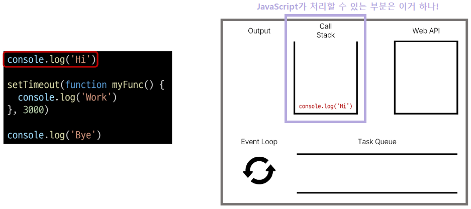

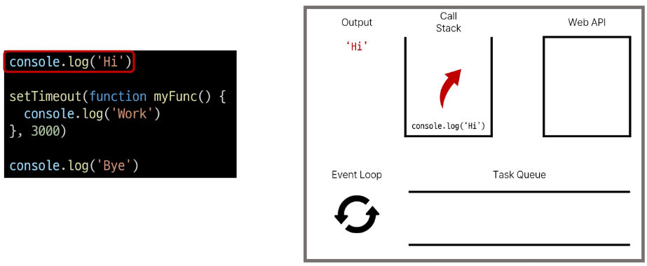

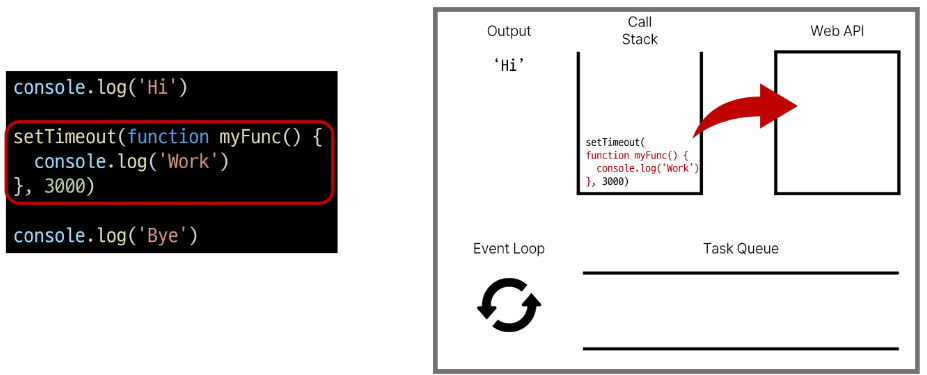

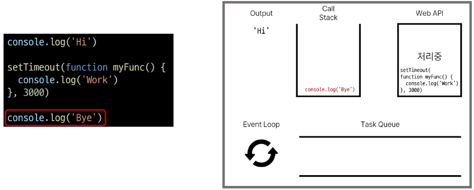

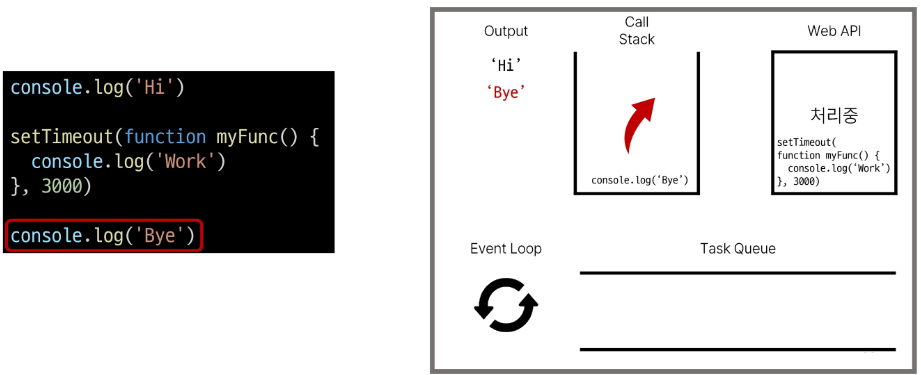

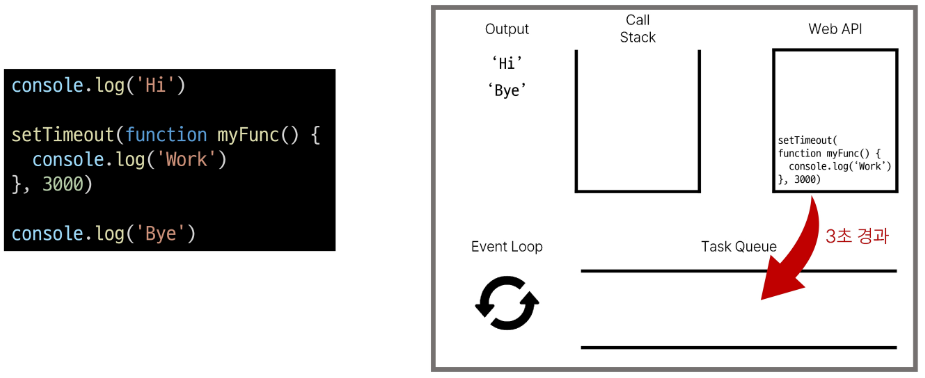

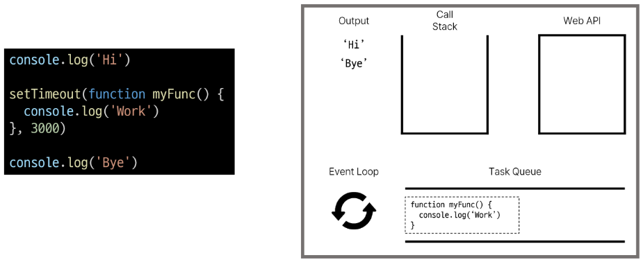


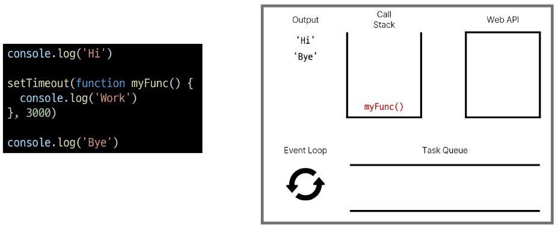

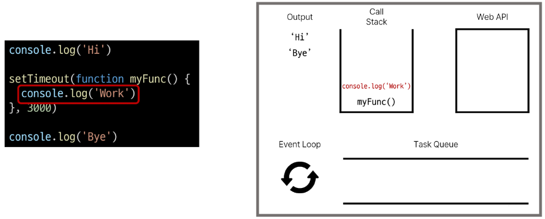

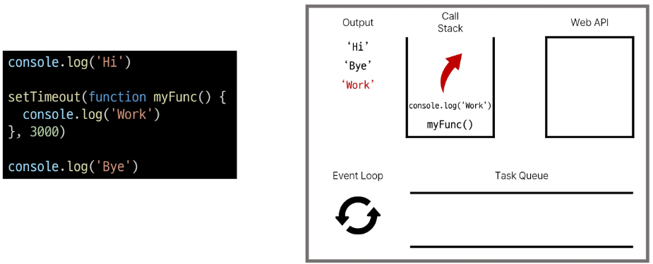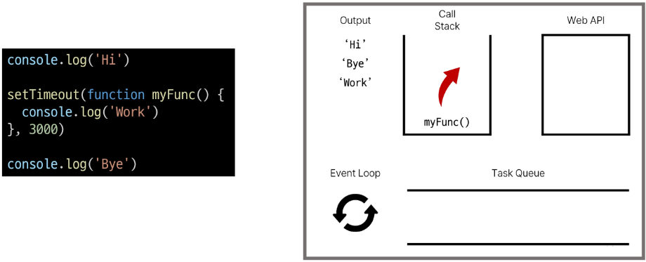

- 정리
  
  - JavaScript는 한번에 하나의 작업을 수행하는 Single Thread 언어로 동기적 처리를 진행
  
  - 하지만 브라우저 환경에서는 Web API에서 처리된 작업이 지속적으로 Task Queue를 거쳐 Event Loop에 의해 Call Stack에 들어와 순차적으로 실행됨으로써 비동기 작업이 가능한 환경이 됨
  
  

# 2. AJAX

## 2-1 개요

- AJAX (Asynchronous JavaScript + XML)
  
  - JavaScript의 비동기 구조와 XML 객체를 활용해 비동기적으로 서버와 통신하여 웹 페이지의 일부분만을 업데이트 하는 웹 개발 기술
    
    > X가 XML을 의미하긴 하지만, 요즘은 더 가벼운 용량과 JavaScript의 일부라는 장점 때문에 'JSON'을 더 많이 사용

- XMLHttpRequest 객체
  
  - 서버와 상호작용할 때 사용하며 페이지의 **새로고침 없이도 URL에서 데이터**를 가져올 수 있음
    
    - 사용자의 작업을 방해하지 않고 페이지의 일부를 업데이트
      
      > - 주로 AJAX 프로그래밍에 많이 사용됨
      > 
      > - 페이지가 아니라 데이터만 가져온다!
      > 
      > - XHR 객체라고도 한다

- 이벤트 핸들러는 비동기 프로그래밍의 한 형태
  
  - 이벤트가 발생할 때마다 호출되는 함수(콜백 함수)를 제공하는 것
  
  - XMLHttpRequest(XHR)는 JavaScript를 사용하여 서버에 HTTP요청을 할 수 있는 객체
  
  - HTTP 요청은 응답이 올 때까지의 시간이 걸릴 수 있는 작업이라 비동기 API이며, 이벤트 핸들러를 XHR객체에 연결해 요청의 진행 상태 및 최종 완료에 대한 응답을 받음


## 2-2 Axios

- JavaScript에서 사용되는 > **Promise 기반** < HTTP 클라이언트 라이브러리
  
  - 서버와의 HTTP 요청과 응답을 간편하게 처리할 수 있도록 도와주는 도구

> 파이썬에서 사용되는 HTTP 클라이언트 라이브러리 => requests

- 설치
  
  - CDN 사용 
  
  - https://axios-http.com/

- 구조
  
  - get, post등 여러 http request method 사용 가능
  
  - then 메서드를 사용해서 "성공하면 수행할 로직"을 작성
  
  - catch 메서드를 사용해서 "실패하면 수행할 로직"을 작성
  
  ```javascript
  axios({
    method: 'post',
    url: '/user/12345'
    data: {
        firstName: 'Fred',
        lastName: 'Flintstone'
    }
  })
  
    .then(요청에 성공하면 수행할 콜백함수)
    .catch(요청에 실패하면 수행할 콜백함수)
  ```

- 고양이 사진 실습
  
  1.  버튼을 누르면
  
  2. 고양이 이미지를 요청하고
  
  3. 요청이 처리되어 응답이 오면
  
  4. 응답 데이터에 있는 이미지 주소값을 img태그에 넣어 이미지 출력하기

```html
<body>
  <button>냥냥펀치</button>

  <script src="https://cdn.jsdelivr.net/npm/axios/dist/axios.min.js"></script>
  <script>
    const URL = 'https://api.thecatapi.com/v1/images/search'
    const btn = document.querySelector('button')
    
    const getCats = function () {
      axios({
        method: 'get',
        url: URL
      })
        .then((response) => {
          // console.log(response)
          // console.log(response.data)
          // console.log(response.data[0].url)
          // 응답으로부터 필요한 img url만 구하기
          const imgUrl = response.data[0].url
          return imgUrl
        })
        .then((imgUrl) => {
          const imgTag = document.createElement('img')
          imgTag.setAttribute('src', imgUrl)
          document.body.appendChild(imgTag)
        })
        .catch((error) => {
          console.log(error)
        })
    }

    btn.addEventListener('click', getCats)
  </script>
```

- 정리
  
  - axios는 브라우저에서 비동기로 데이터 통신을 가능하게 하는 라이브러리
    
    - 브라우저를 위해 XMLHttpRequest 생성
  
  - 같은 방식으로 DRF로 만든 API 서버로 요청을 보내서 데이터를 받아온 후 처리할 수 있도록 함

> - console.log(response)를 하면 배열이 하나 들어옴, 배열에는 하나만 들어있는데 그 하나는 객체(response 객체) 하나가 담겨 있고 그 객체의 url에 접근하면 caturl이 있다
> 
> - request 보면 XMLhttprequest라고 나옴. 원래 우리가 배운건 httprequest를 통째로 한건데 이건 걍 데이터만 받은 것임
> 
> - 그 뒤에 console.log('양옹')을 하면 야옹이 먼저 나옴. 왜냐면 axio는 요청-응답이라 시간 오래 걸리니까 요청 보내놓고 야옹 찍고 wepAPI 에서 다 처리되고 task queue 에 들어갔다가 callstack다 사라졌으므로 그 부분에 들어가고 결과(console.log) callstack에서 빠지는거임


# 3. Callback과 Promise

## 3-1 비동기 콜백

- 비동기 처리의 단점
  
  - 비동기 처리의 핵심은 Web API로 들어오는 순서가 아니라 <mark>작업이 완료되는 순서에 따라 처리</mark>한다는 것
  
  - 그런데 이는 개발자 입장에서 **코드의 실행 순서가 불명확**하다는 단점 존재
  
  - 이와 같은 단점은 실행 결과를 예상하면서 코드를 작성할 수 없게 함1
  
  - => 콜백 함수를 사용하자!


- 비동기 콜백
  
  - 비동기적으로 처리되는 작업이 완료되었을 때 실해오디는 함수
  
  - 연쇄적으로 발생하는 비동기 작업을 **순자척으로 동작**할 수 있게 함
  
  - => 작업의 순서와 동작을 제어하거나 결과를 처리하는데 사용

```javascript
const asyncTask = function (callback) {
  setTimeout(function() {
    console.log('비동기 작업 완료')
    callback() // 작업 완료 후 콜백 호출
  }, 2000) // 1초 후에 작업 완료
}

// 비동기 작업 수행 후 콜백 실행
asyncTask(function() {
  console.log('작업 완료 후 콜백 실행')
})

// 비동기 작업 완료
// 작업 완료 후 콜백 실행
```


- 비동기 콜백의 한계
  
  - 비동기 콜백 함수는 보통 어떤 기능의 실행 결과를 받아서 다른 기능을 수행하기 위해 많이 사용됨
  
  - 이 과정을 반복하다 보면 비슷한 패턴이 계속 발생
    
    > A를 처리해서 결과가 나오면, 첫번째 callback 함수를 실행하고
    > 
    > 첫번재 callback 함수가 종료되면, 두 번째 callback함수를 실행하고
    > 
    > 두번째 callback 함수가 종료되면, 세 번째 callback 함수를 실행하고...
  
  - 콜백 지옥 발생!


- 콜백 지옥(Callback Hell)
  
  - 비동기 처리를 위한 콜백을 작성할 때 마주하는 문제
  
  - 코드 작성 형태가 마치 "피라미드와 같다"고 해서 "Pyramid of doom(파멸의 피라미드)"라고도 부름
  
  ```javascript
  function hell (win) {
    return function () {
      loadLink(win, REMOTE_SRC, function () {
        loadLink(win, REMOTE_SRC, function () {
          loadLink(win, REMOTE_SRC, function () {
            loadLink(win, REMOTE_SRC, function () {
              loadLink(win, REMOTE_SRC, function () {
                loadLink(win, REMOTE_SRC, function () {
                })
              })
            })
          })
        })
      })
    }
  }
  ```


- 콜백 함수 정리
  
  - 콜백 함수는 비동기 작업을 순차적으로 실행할 수 있게 하는 반드시 필요한 로직
  
  - 비동기 코드를 작성하다 보면 콜백 함수로 인한 콜백 지옥은 빈번히 나타나는 문제이며 이는 코드의 가독성을 해치고 유지 보수가 어려워 짐
  
  - => 지옥에 빠지지 않는 다른 표기 형태가 필요하다 !
  
  

## 3-2 프로미스

- Promise
  
  - JavaScript에서 비동기 작업의 결과를 나타내는 객체
  
  - => 비동기 작업이 완료되었을 때 결과 값을 반환하거나, 실패시 에러를 처리할 수 있는 기능을 제공


- Promise
  
  - 콜백 지옥 문제를 해결하기 위해 등장한 비동기 처리를 위한 객체
  
  - "작업이 끝나면 실행시켜 줄게" 라는 약속(promise)
  
  - 비동기 작업의 완료 또는 실패를 나타내는 객체
  
  - Promise 기반의 클라이언트가 바로 이전에 사용한 Axios 라이브러리
    
    - 성공에 대한 약속 `then()`
    
    - 실패에 대한 약속 `catch()`


- 비동기 콜백 vs Promise
  
  1. 비동기 콜백
     
     ```js
     work1(function () {
       // 첫번째 작업...
       work2(result1, function (result2) {
         // 두번째 작업
         work3(result2, function (result3) {
           console.log('최종결과 : ' + result3)
         })
       })
     })
     ```
  
  2. Promise
     
     ```js
     work1()
       .then((result1) => {
         // work2
         return result2
       })
       .then((result2) => {
         // work3
         return result3
       })
       .catch((error) => {
         // error handling
       })
     ```

- Axios
  
  - JavaScript에서 사용되는 > **Promise 기반** < HTTP 클라이언트 라이브러리


- then(callback)
  
  - 요청한 작업이 성공하면 callback 실행
  
  - callback은 이전 작업의 성공 결과를 인자로 전달 받음

- catch(callback)
  
  - then()이 하나라도 실패하면 callback 실행
  
  - callback은 이전 작업의 실패 객체를 인자로 전달 받음


- then & catch
  
  - then과 catch는 모두 항상 promise 객체를 반환
  
  - 즉, 계속해서 **chaining**을 할 수 있음
  
  - axios로 처리한 비동기 로직이 항상 promise객체를 반환
  
  - then을 계속 이어 나가면서 작성할 수 있게 됨
  
  ```js
  axios({}).then(...).then(...).catch(...)
  
  axios({}) // Promise 객체 return
    .then(성공하면 수행할 1번 콜백 함수)
    .then(1번 콜백 함수가 성공하면 수행할 2번 콜백 함수)
    .then(2번 콜백 함수가 성공하면 수행할 3번 콜백 함수)
    ...
    .catch(실패하면 수행할 콜백함수)
  ```
  
  - 비동기 작업의 '**순차적인**' 처리 가능
  
  - 코드를 보다 직관적이고 가독성 좋게 작성할 수 있도록 도움


- then 메서드 chaining의 장점
  
  1. 가독성
     
     - 비동기 작업의 순서와 의존 관계를 명확히 표현할 수 있어 코드의 가독성이 향상
  
  2. 에러처리
     
     - 각각의 비동기 작업 단계에서 발생하는 에러를 분할해서 처리 가능
  
  3. 유연성
     
     - 각 단계마다 필요한 데이터를 가공하거나 다른 비동기 작업을 수행할 수 있어서 더 복잡한 비동기 흐름을 구성할 수 있음
  
  4. 코드 관리
     
     - 비동기 작업을 분리하여 구성하면 코드를 관리하기 용이
     
     

- then 메서드 chaining 예시 - cat api실습
  
  1. 기존
     
     ```js
     .then((response) => {
       imgUrl = response.data[0].url
       imgElem = document.createElement('img')
       imgElem.setAttribute('src', imgUrl)
       document.body.appendChild(imgElem)
     })
     
     ```
  
  2. then 메서드 사용
     
     - 첫번째 then 콜백함수의 반환값이 이어지는 then 콜백함수의 인자로 전달됨
     
     ```js
     .then((response) => {
       imgUrl = response.data[0].url
       return imgUrl
     })
     .then((imgData) => {
       imgElem = document.createElement('img')
       imgElem.setAttribute('src', imgUrl)
       document.body.appendChild(imgElem)
     })
     ```


- Promise가 보장하는 것(vs 비동기 콜백)
  
  1. 콜백 함수는 JavaScript의 Event Loop가 현재 실행 중인 Call Stack을 완료하기 이전에는 절대 호출되지 않음
     
     - 반면 Promise callback 함수는 Event Queue에 배치되는 엄격한 순서로 호출됨
  
  2. 비동기 작업이 성공하거나 실패한 뒤에 .then()메서드를 이용하여 추가한 뒤에도 호출 순서를 보장하며 동작
  
  3. .then()을 여러번 사용하여 여러 개의  callback 함수를 추가할 수 있음
     
     - 각각의 callback은 주어진 순서대로 하나하나 실행하게 됨
     
     - Chaining은 Promise의 가장 뛰어난 장점


# 참고

## 비동기를 사용하는 이유 - '사용자 경험'

- 예를 들어 아주 큰 데이터를 불러온 뒤 실행되는 앱이 있을 때, 동기식으로 처리한다면 데이터를 모두 불러온 뒤에서야 앱의 실행 로직이 수행되므로 사용자들은 마치 앱이 멈춘 것과 같은 경험을 겪게 됨

- 즉, 동기식 처리는 특정 로직이 실행되는 동안 다른 로직 실행을 차단하기 때문에 프로그램이 응답하지 않는 듯한 사용자 경험을 만듦

- 비동기로 처리한다면 먼저 처리되는 부분부터 보여줄 수 있으므로, 사용자 경험에 긍정적인 효과를 볼 수 있음

- 이와 같은 이유로 많은 웹 기능은 비동기 로직을 사용해서 구현됨
