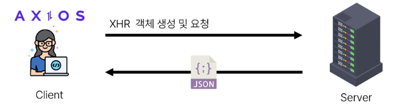

# 6. Ajax with Django

1. Ajax와 서버
   
   - 1-1 개요

2. Ajax with follow

3. Ajax with likes

---

# 1. Ajax와 서버

- Ajax (Asynchronous JavaScript + XML)
  
  - JavaScript의 비동기 구조와 XML 객체를 활용해 비동기적으로 서버와 통신하여 웹 페이지의 일부분만을 업데이트 하는 웹 개발 기술



> 이벤트 발생 -> XHR 객체 생성 및 요청 -> Ajax 요청 처리 -> 응답 데이터 생성 -> JSON 데이터 응답 -> 응답 데이터를 활용해 DOM 조작(웹 페이지의 일부분 만을 다시 로딩)

python manage.py loaddata users.json articles.json


# 2. Ajax with follow

- `data-*`속성
  
  - 사용자 지정 데이터 특성을 만들어 임의의 데이터를 HTML과 DOM 사이에서 교환할 수 있는 방법
  
  - 모든 사용자 지정 데이터는 JavaScript에서 <mark>dataset</mark> 속성을 통해 사용
  
  - 주의사항
    
    1. 대소문자 여부에 상관없이  'xml' 문자로 시작 불가
    
    2. 세미콜론 포함 불가
    
    3. 대문자 포함 불가
  
  - [data-* - HTML: Hypertext Markup Language | MDN](https://developer.mozilla.org/ko/docs/Web/HTML/Global_attributes/data-*)

```html
<div data-my-id="my-data"></div>

<script>
    const myId = event.target.dataset.myId
</script>
```

-  문서에 hidden 타입으로 존재하는 csrf 데이터를 axios로 전송해아 함
  
  - [How to use Django’s CSRF protection | Django documentation | Django](https://docs.djangoproject.com/en/4.2/howto/csrf/)

```html
  <div>
    <div>
      팔로잉 : <span id="followings-count">{{ person.followings.all|length }}</span> / 
      팔로워 : <span id="followers-count">{{ person.followers.all|length }}</span>
    </div>
    
      <div>
        <form id="follow-form" data-user-id="{{ person.pk }}">
          
          
            <input type="submit" value="Unfollow">
          
            <input type="submit" value="Follow">
          
        </form>
      </div>
    
  </div>
```

```html
  <script src="https://cdn.jsdelivr.net/npm/axios/dist/axios.min.js"></script>
  <script>
    // 1. form 요소 선택
    const formTag = document.querySelector('#follow-form')
    // 6. csrftoken value 값 선택
    const csrftoken = document.querySelector('[name=csrfmiddlewaretoken]').value
    
    
    // 2. form 요소에 이벤트 리스터 부착
    formTag.addEventListener('submit', function (event) {
      // 3. submit 이벤트 기본 동작 취소
      event.preventDefault()
      // 5. form 요소에 지정한 data 속성 접근하기
      const userId = formTag.dataset.userId

      // 4. axios로 비동기적으로 팔로우/언팔로우를 요청
      axios({
        url: `/accounts/${userId}/follow/`,
        method: 'post',
        headers: {'X-CSRFToken': csrftoken},
      })
        .then((response) => {
          console.log(response.data)
          // 7. Django에서 보낸 follow 여부를 알 수 있는 변수를 저장
          const isFollowed = response.data.is_followed
          // 8. 팔로우 버튼 선택
          const followBtn = document.querySelector('#follow-form > input[type=submit]:nth-child(2)')
          // 9. 팔로우 버튼 토글
          if (isFollowed === true) {
            followBtn.value = 'Unfollow'
          } else {
            followBtn.value = 'Follow'
          }

          // 10. 팔로워 / 팔로잉 수 조작
          const followingsCountTag = document.querySelector('#followings-count')
          const followersCountTag = document.querySelector('#followers-count')
          
          followingsCountTag.textContent = response.data.followings_count
          followersCountTag.textContent = response.data.followers_count
        })
        .catch((error) => {
          console.log(error)
        })
    })
  </script>
```

```python
@login_required
def follow(request, user_pk):
    User = get_user_model()
    you = User.objects.get(pk=user_pk)
    me = request.user

    if me != you:
        if me in you.followers.all():
            you.followers.remove(me)
            is_followed = False
        else:
            you.followers.add(me)
            is_followed = True
        context = {
            'is_followed': is_followed,
            'followings_count': you.followings.count(),
            'followers_count': you.followers.count(),
        }
        return JsonResponse(context)
    return redirect('accounts:profile', you.username)

```


# 3. Ajax with likes

- 유의사항
  
  - Ajax 적용은 팔로우와 모두 동일
  
  - 단, 팔로우와 달리 좋아요 버튼은 한 페이지에 여러 개가 존재
    
    1. forEach()
    
    2. querySelectorAll()

```html

    <p>
      작성자 : 
      <a href="">{{ article.user }}</a>
    </p>
    <p>글 번호 : {{ article.pk }}</p>
    <a href="">
      <p>글 제목 : {{ article.title }}</p>
    </a>
    <p>글 내용 : {{ article.content }}</p>
    <form class="likes-forms" data-article-id="{{ article.pk }}">
      
      
        <input type="submit" value="좋아요 취소" id="like-{{ article.pk }}">
      
        <input type="submit" value="좋아요" id="like-{{ article.pk }}">
      
    </form>
    <hr>
  
```

```html
  <script src="https://cdn.jsdelivr.net/npm/axios/dist/axios.min.js"></script>
  <script>
    const formTags = document.querySelectorAll('.likes-forms')
    const csrftoken = document.querySelector('[name=csrfmiddlewaretoken]').value

    formTags.forEach((formTag) => {
      formTag.addEventListener('submit', function (event) {
        event.preventDefault()

        const articleId = formTag.dataset.articleId

        axios({
          url: `/articles/${articleId}/likes/`,
          method: 'post',
          headers: {'X-CSRFToken': csrftoken},
        })
          .then((response) => {
            // console.log(response.data.is_liked)
            const isLiked = response.data.is_liked
            const likeBtn = document.querySelector(`#like-${articleId}`)

            if (isLiked === true) {
              likeBtn.value = '좋아요 취소'
            } else {
              likeBtn.value = '좋아요'
            }
          })
          .catch((error) => {
            console.log(error)
          })
      })
    })
  </script>
```

```python
@login_required
def likes(request, article_pk):
    article = Article.objects.get(pk=article_pk)
    if request.user in article.like_users.all():
        article.like_users.remove(request.user)
        is_liked = False
    else:
        article.like_users.add(request.user)
        is_liked = True
    context = {
        'is_liked': is_liked,
    }
    return JsonResponse(context)
```


# 참고

## Ajax의 필요성

- "human-centered design with UX" (이간 중심으로 설계된 사용자 경험)
