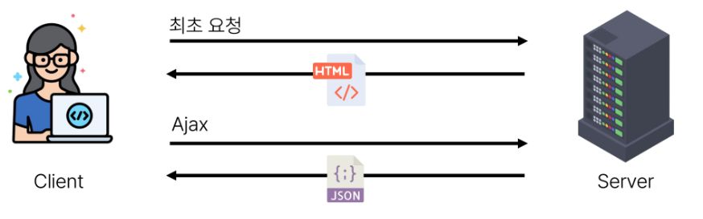
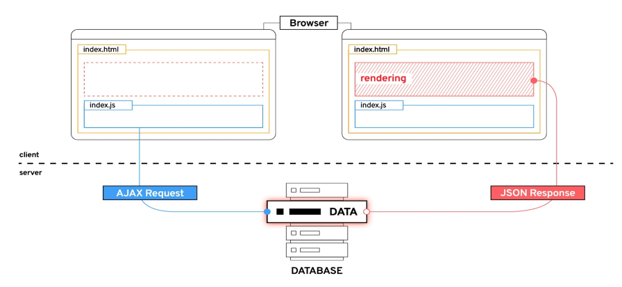
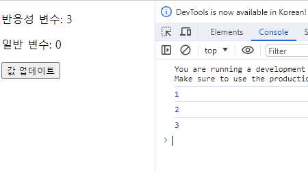

# 1. Introduction of Vue

- [1. Front-end Development](#1-front-end-development)
  - [1-1 Client-side-framework](#1-1-client-side-framework)
  - [1-2 SPA](#1-2-spa)
- [2. Vue](#2-vue)
  - [2-2 Vue Tutorial](#2-2-vue-tutorial)
- [참고](#참고)
  - [Ref  Unwrap 주의사항](#ref--unwrap-주의사항)
  - [why Ref?](#why-ref)
  - [SEO(Search Engine Optimization)](#seosearch-engine-optimization)
  - [CSR \& SSR](#csr--ssr)

---

# 1. Front-end Development

## 1-1 Client-side-framework

- Front-end Development
  
  - 웹사이트와 웹 어플리케이션의 사용자 인터페이스(UI)와 사용자 경험(UX)을 만들고 디자인 하는 것
  
  - => HTML, CSS, JavaScript 등을 활용하여 사용자가 직접 상호작용하는 부분을 개발

- Client-side frameworks
  
  - 클라이언트 측에서 UI와 상호작용을 개발하기 위해 사용되는 JavaScript 기반 프레임워크

- Client-side frameworks가 필요한 이유
  
  1. 웹에서 하는 일이 많아졌다.
     
     - 단순히 무언가를 읽는 곳 -> 무언가를 하는 곳
     
     - 웹 어플리케이션
  
  2. 웹에서 하는 일이 많아졌다.
     
     - 다루는 데이터가 많아졌다
     
     - 애플리케이션의 상태를 변경할 때마다 일치하도록 UI를 업데이트해야 한다는 것

## 1-2 SPA

- Single Page Application (SPA)
  
  - 페이지 한 개로 구성된 웹 애플리케이션
  
  
1. 서버로부터 필요한 모든 정적 HTML을 처음에 한 번 가져옴

2. 브라우저가 페이지를 로드하면 Vue 프레임워크는 각 HTML 요소에 적절한 JavaScript코드를 실행(이벤트에 응답, 데이터 요청 후 UI 업데이트 등)
   
   - ex) 페이지 간 이동 시, 페이지 갱신에 필요한 데이터만을 JSON으로 전달받아 페이지 일부 갱신
   
   - Google Maps, 인스타그램 등의 서비스에서 갱신 시 새로고침이 없는 이유
- SPA : 웹 어플리케이션의 초기 로딩 후 새로운 페이지 요청 없이 동적으로 화면을 갱신하며 사용자와 상호작용하는 웹 애플리케이션
  
  - CSR 방식

- Client-side Rendering(CSR) <-> SSR
  
  - 클라이언트에서 화면을 렌더링 하는 방식



1. 브라우저는 페이지에 필요한 최소한의 HTML 페이지와 JavaScript를 다운로드

2. 그런 다음 JavaScript를 사용하여 DOM을 업데이트하고 페이지를 렌더링
- CSR 장점
  
  1. 빠른 속도
     
     - 페이지의 일부를 다시 렌더링할 수 있으므로 동일한 웹사이트의 다른 페이지로 이동하는 것이 일반적으로 더 빠름
     
     - 서버로 전송되는 데이터의 양을 최소화
  
  2. 사용자 경험
     
     - 새로고침이 발생하지 않아 네이티브 앱과 유사한 사용자 경험을 제공
  
  3. Front-end와 Back-end의 명확한 분리
     
     - Front-end는 UI렌더링 및 사용자 상호 작용 처리를 담당 & Back-end는 데이터 및 API 제공을 담당
     
     - 대규모 애플리케이션을 더 쉽게 개발하고 유지 관리 가능

- CSR 단점
  
  1. 초기 구동속도가 느림
     
     - 전체 페이지를 보기 전에 약간의 지연을 느낄 수 있음
     
     - JavaScript가 다운로드, 구문 분석 및 실행될 때까지 페이지가 완전히 렌더링 되지 않기 때문
  
  2. SEO(검색 엔진 최적화) 문제
     
     - 페이지를 나중에 그려 나가는 것이기 때문에 검색에 잘 노출되지 않을 수 있음

# 2. Vue

- What is Vue?
  
  - 사용자 인터페이스를 구축하기 위한 JavaScript 프레임워크
  
  - 2014년 발표 - Evan You
  
  - 2023년 기준 최신 버전 vue3

- 학습 이유
  
  1. 쉬운 학습 곡선 및 간편한 문법
     
     - 새로운 개발자들도 빠르게 학습할 수 있음
  
  2. 반응성 시스템
     
     - 데이터 변경에 따라 자동으로 화면에 업데이트 되는 기능을 제공
  
  3. 모듈화 및 유연한 구조
     
     - 애플리케이션을 컴포넌트 조각으로 나눌 수 있음
     
     - 코드의 재사용성을 높이고 유지보수를 용이하게 함
  
  4- Vue는 React나 Angular 대비 간결하고 직관적인 문법을 가지고 있어 초기 학습이 상대적으로 원활
  
  - 짧은 시간 내에 효율적으로 결과물을 만들어낼 수 있음
  
  5- 거대하고 활발한 커뮤니티를 가지고 있어 풍부한 문서, 튜토리얼, 예제 및 다양한 리소스 공유받을 수 있음

```html
<body>
  <div id="app">
    <h1>{{ greeting }}</h1>
    <button @click="count++">{{ count }}</button>
    <p>{{ count }}</p>
    <h3>{{ count }}</h3>
  </div>


  <script src="https://unpkg.com/vue@3/dist/vue.global.js"></script>
  <script>
    const { createApp, ref } = Vue // 구조분해할당

    const app = createApp({ // vue 인스턴스
      setup() {
        const count = ref(0)
        const greeting = ref('hello')
        return {
          count, // 단축구문
          greeting
        }
      }
    }) 

    app.mount('#app')
  </script>
</body>
```

- Vue의 2가지 핵심 기능
  
  1. 선언적 렌더링(Declarative Rendering)
     
     - HTML을 확장하는 템플릿 구문(`{{ }}`)을 사용하여 HTML이 JavaScript 데이터를 기반으로 어떻게 보이는지 설명할 수 있음
  
  2. 반응형(Reactivity)
     
     - JavaScript 상태 변경사항을 자동으로 추적하고 변경사항이 발생할 때 DOM을 효율적으로 업데이트

## 2-2 Vue Tutorial

> 1. CDN
> 
> 2. 'NPM' 설치

- CDN 및 Application instance 작성

- Application instance
  
  - 모든 vue 애플리케이션은 createApp 함수로 새 Application instace를 생성하는 것으로 시작

```html
<script src="https://unpkg.com/vue@3/dist/vue.global.js"></script>
  <script>
    const { createApp } = Vue // 구조분해할당

    const app = createApp({})
  </script>
```

- `app.mount`
  
  - 컨테이너 요소에 애플리케이션 인스턴스를 탑재(연결)
  
  - 각 앱 인스턴스에 대해 `mount()`는 한 번만 호출할 수 있음

```html
  <div id="app"></div>

  <script src="https://unpkg.com/vue@3/dist/vue.global.js"></script>
  <script>
    const { createApp } = Vue // 구조분해할당

    const app = createApp({})

    app.mount('#app')
  </script>
```

- ref 함수
  
  - 인자를 받아 `.value` 속성이 있는 `ref` 객체로 래핑(wrapping)하여 반환
  
  - ref로 선언된 변수의 값이 변경되면, 해당 값을 사용하는 템플릿에서 자동으로 업데이트
  
  - 인자는 어떠한 타입도 가능
  
  - 템플릿의 참조에 접근하려면 setup 함수에서 선언 및 반환 필요
  
  - 템플릿에서 `ref`를 사용할 때는 `.value`를 작성할 필요 없음(automatically unwrapped)

```html
  <div id="app">
    <h1>{{ message }}</h1>
  </div>

  <script src="https://unpkg.com/vue@3/dist/vue.global.js"></script>
  <script>
    const { createApp, ref } = Vue // 구조분해할당

    const app = createApp({
      setup() {
        const message = ref('hello vue!')
        console.log(message) // 객체
        console.log(message.value) // unwrapping
        return {
          message,
        }
      }
    })

    app.mount('#app')
  </script>
```


- `ref()`
  
  - 반응형 상태(데이터)를 선언하는 함수 (Declaring Reactive State)
  
  - => 반응형을 가지는 참조 변수를 반드는 것
  
  - ref === reactive reference

- Vue 기본 구조
  
  - `CreateApp()`에 전달되는 객체는 Vue 컴포넌트(component)
  
  - 컴포넌트의 상태는 `setup()` 함수 내에서 선언되어야 하며 <mark>객체를 반환해야함</mark>

- 템플릿 렌더링
  
  - 반환된 객체의 속성은 템플릿에서 사용할 수 있음
  
  - Mustache syntax(콧수염 구문)를 사용하여 메시지 값을 기반으로 동적 텍스트를 렌더링
  
  - 콘텐츠는 식별자나 경로에만 국한되지 않으며 유효한 JavaScript 표현식을 사용할 수 있음

```html
    <h1>{{ message.split('').reverse().join('') }}</h1>
```

- Event Listeners in Vue
  
  - `v-on` directive를 사용하여 DOM 이벤트를 수신할 수 있음
  
  - 함수 내에서 refs를 변경하여 구성 요소 상태를 업데이트

```html
  <div id="app">
    <button v-on:click="increment">{{ count }}</button>
    <button @click="increment">{{ count }}</button>
  </div>

  <script src="https://unpkg.com/vue@3/dist/vue.global.js"></script>
  <script>
    const { createApp, ref } = Vue

    const app = createApp({
      setup() {
        const count = ref(0)
        const increment = function () {
          count.value++
        }
        return {
          count,
          increment,
        }
      }
    })

    app.mount('#app')
  </script>
```

# 참고

## Ref  Unwrap 주의사항

- 템플릿에서 unwrap은 ref가 최상위 속성인 경우에만 적용 가능

- 다음 표현식은 어떻게 출력될까?

```javascript
const object = { id: ref(0)}
    // 템플릿에서 
    {{ object.id + 1}}
```

=> [object Object] 1

== ref 객체 + 1

- object는 최상위 속성이지만, object.id는 그렇지 않음

- 표현식을 평가할 때 object.id가 unwrap되지 않고 ref객체로 남아있기 때문

- 이 문제를 해결하기 위해선 'id'를 최상위 속성으로 분해해야 함

```js
const { id } = object
    {{ id + 1 }}
```

- 단, ref `{{ }}`의 최종 평가 값인 경우는 unwrap 가능

```html
{{ object.id }}
{{ object.id.value }
```

## why Ref?

- 일반 변수 대신 굳이 .value가 포함된 ref가 필요한 이유는?

- Vue는 템플릿에서 ref를 사용하고 나중에 ref의 값을 변경하면 자동으로 변경 사항을 감지하고 그에 따라 DOM을 업데이트 함

- 의존성 추적 기반의 반응형 시스템

- Vue는 렌더링 중에 사용된 모든 ref를 추적하며, 나중에 ref가 변경되면 이를 추적하는 구성 요소에 대해 다시 렌더링

- => JavaScript에서는 일반 변수의 접근 또는 변형을 감지할 방법이 없기 때문

- [Reactivity Fundamentals | Vue.js](https://vuejs.org/guide/essentials/reactivity-fundamentals.html#why-refs)

```html
  <div id="app">
    <p>반응성 변수: {{ reactiveValue }}</p>
    <p>일반 변수: {{ normalValue }}</p>
    <button @click="increment">값 업데이트</button>
  </div>

  <script src="https://unpkg.com/vue@3/dist/vue.global.js"></script>
  <script>
        const { createApp, ref } = Vue

  const app = createApp({
    setup() {
      const reactiveValue = ref(0)
      let normalValue = 0
      const increment = function () {
        reactiveValue.value++
        normalValue++
        console.log(normalValue)
      }
      return {
        reactiveValue,
        normalValue,
        increment
      }
    }
  })

  app.mount('#app')
  </script>
```



## SEO(Search Engine Optimization)

- google, bing과 같은 검색 엔진 등에 내 서비스나 제품 등이 효율적으로 검색 엔진에 노출되도록 개선하는 과정을 일컫는 작업

- 정보의 대상은 주로 HTML에 작성된 내용

- 검색
  
  - 각 사이트가 운용하는 검색 엔진에 의해 이루어지는 작업

- 검색 엔진
  
  - 웹 상에 존재하는 가능한 모든 정보들을 긁어 모으는 방식으로 동작

- 최근에는 SPA, 즉 CSR로 구성된 서비스의 비중이 증가

- SPA 서비스도 검색 대상으로 넓히기 위해 JS를 지원하는 방식으로 발전하는 중

## CSR & SSR

- CSR과 SSR은 흑과 백이 아님
  
  - 내 서비스에 적합한 렌더링 방식을 적절하게 활용할 수 있어야 함

- SPA 서비스에서도 SSR을 지원하는 Framework가 발전하고 있음
  
  > - Vue : Nuxt.js
  > 
  > - React : Next.js
  > 
  > - Angular Universal
