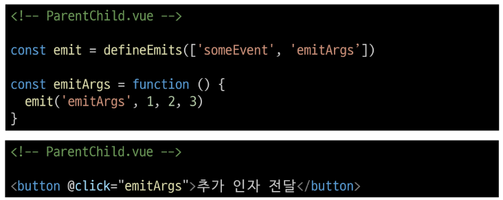
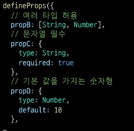

# 5. Component State Flow

- [1. Passing Props](#1-passing-props)
  - [1-1 개요](#1-1-개요)
    - [props](#props)
  - [1-2 사전 준비](#1-2-사전-준비)
  - [1-3 Props 선언](#1-3-props-선언)
  - [1-4 Props 세부사항](#1-4-props-세부사항)
    - [Static Props \& Dynamic Props](#static-props--dynamic-props)
- [2. Component Events](#2-component-events)
  - [2-1 개요](#2-1-개요)
  - [2-2 Event 발신 및 수신](#2-2-event-발신-및-수신)
  - [2-3 emit Event 선언](#2-3-emit-event-선언)
  - [2-4 Event 인자(Event Arguments)](#2-4-event-인자event-arguments)
  - [2-5 Event 세부사항](#2-5-event-세부사항)
  - [2-6 emit Event 실습](#2-6-emit-event-실습)
- [\[참고\]](#참고)
  - [정적 \& 동적 props 주의사항](#정적--동적-props-주의사항)
  - [Prop 선언을 객체 선언 문법으로](#prop-선언을-객체-선언-문법으로)
  - [emit 이벤트도 객체 선언 문법으로 작성 가능](#emit-이벤트도-객체-선언-문법으로-작성-가능)

---

# 1. Passing Props

## 1-1 개요

- 부모는 자식에서 데이터를 전달(Pass Props)하며,

- 자식은 자신에게 일어난 일을 부모에게 알림(Emit event)


### props

부모 컴포넌트로부터 자식 컴포넌트로 데이터를 전달하는데 사용되는 속성

- One-Way Data Flow
  
  - 모든 props는 자식 속성과 부모 속성 사이에 하향식 단방향 바인딩을 형성
  
  - one-way-down binding

- 특징
  
  - 부모 속성이 업데이트되면 자식으로 흐르지만 그 반대는 안됨
  
  - 즉, 자식 컴포넌트 내부에서 props를 변경하려고 시도해서는 안되며 불가능
  
  - 또한 부모 컴포넌트가 업데이트 될 때마다 자식 컴포넌트의 모든 props가 최신 값으로 업데이트 됨
  
  ➤ 부모 컴포넌트에서만 변경하고 이를 내려 받는 자식 컴포넌트는 자연스럽게 갱신

- 단방향인 이유
  
  - 하위 컴포넌트가 실수로 상위 컴포넌트의 상태를 변경하여 앱에서의 데이터 흐름을 이해하기 어렵게 만드는 것을 방지하기 위함

## 1-2 사전 준비

> 1. vue 프로젝트 생성
> 
> 2. 초기 생성된 컴포넌트 모두 삭제 (App.vue 제외)
> 
> 3. src/assets 내부 파일 모두 삭제
> 
> 4. main.js 해당 코드 삭제

- App > Parent > ParentChild 컴포넌트 관계 작성


## 1-3 Props 선언

부모 컴포넌트에서 보낸 props를 사용하기 위해서는 자식 컴포넌트에서 명시적인 props 선언이 필요

- 부모 컴포넌트 Parent에서 자식 컴포넌트 ParentChild에 보낼 props 작성
  
  

- Props 선언 2가지 방식
  
  1. 문자열 배열을 사용한 선언
  
  2. 객체를 사용한 선언
     
     - 객체 선언 문법의 각 객체 속성의 키는 props의 이름이 되며, 객체 속성의 값은 값이 될 데이터의 타입에 해당하는 생성자 함수(Number, String...)이어야 함
     
     - **객체 선언 문법 사용 권장**

```js
// ParentChild.vue

// 1. props - 문자열 배열 선언 방식
defineProps(['myMsg'])

// 2. props - 객체 선언 방식
defineProps({
  myMsg: String,
  dynamicProps: String,
})
```

- prop 데이터 사용
  
  1. 템플릿에서 반응형 변수와 같은 방식으로 활용
  
  ```html
  <p>{{ myMsg }}</p>
  ```
  
  2. props를 객체로 반환하므로 필요한 경우 JavaScript에서 접근 가능
  
  ```js
  // ParentChild.vue
  
  // props 데이터를 script에서 사용하려면
  const props = defineProps({
                  myMsg: String,
                  dynamicProps: String,
                })
  
  console.log(props)
  console.log(props.myMsg)
  ```

```
- prop 출력 결과 확인


- 한 단계 더 prop 내려 보내기

- ParentChild컴포넌트를 부모로 갖는 ParentGrandChild 컴포넌트 생성 및 등록

  - ⭐ v-bind를 사용한 동적 props

  ```html
  <!-- ParentChild.vue -->

  <template>
    <div>
      <p>{{ myMsg }}</p>
      <ParentGrandChild :my-msg="myMsg"/>
    </div>
  </template>
```

- ParentChild 컴포넌트에서 Parent로부터 받은 prop인 myMsg를 ParentGrandChild에게 전달
  
  ```html
  <!-- ParentGrandChild.vue -->
  
  <template>
    <div>
      <p>{{ myMsg }}</p>
    </div>
  </template>
  
  <script setup>
  defindProps({
    myMsg: String,
  })
  </script> 
  ```

- 출력 결과 확인

- ParentGrandChild가 받아서 출력하는 prop은 Parent에 정의 되어있는 prop이며 Parent가 prop을 변경할 경우 이를 전달받고 있는 ParentChild, PrantGrnadChild에서도 모두 업데이트 됨

## 1-4 Props 세부사항

1. Props Name Casing (Props 이름 컨벤션)
   
   - 선언 및 템플릿 참조 시 : camelCase
   
   - 자식 컴포넌트로 전달 시 : kebab-case

2. Static Props & Dynamic Props
   
   - 지금까지 작성한 것은 Static(정적) props
   
   - v-bind를 사용하여 **동적으로 할당된 props**를 사용할 수 있음

### Static Props & Dynamic Props

1. Dynamic props 정의


2. Dynamic props 선언 및 출력


3. Dynamic props 출력 확인


# 2. Component Events

## 2-1 개요

부모는 자식에게 데이터를 전달(Pass Props)하며,

자식은 자신에게 일어난 일을 부모에게 알림(Emit event)

부모가 prop 데이터를 변경하도록 소리쳐야 한다.

- `$emit()`  : 자식 컴포넌트가 이벤트를 발생시켜 부모 컴포넌트로 데이터를 전달하는 역할의 메서드
  
  ✦  `$` 표기는 Vue 인스턴스나 컴포넌트 내에서 제공되는 전역 속성이나 메서드를 식별하기 위한 접두어

- emit 메서드 구조

- `$emit(event, ...args)`
  
  - event : 커스텀 이벤트 이름
  
  - args : 추가 인자

## 2-2 Event 발신 및 수신

Emitting and Listening to Events

- `$emit`을 사용하여 템플릿 표현식에서 직접 사용자 정의 이벤트를 발신

```html
<button @click="$emit('someEvent')">클릭</button>
```

- 그러면 부모는 v-on을 사용하여 수신할 수 있음

```html
<ParentChild @some-event="someCallback"/>
```

- ParentChild에서 someEvent라는 이름의 사용자 정의 이벤트를 발신

```html
<!-- ParentChild.vue -->

<button @click="$emit('someEvent')">클릭</button>
```

- ParentChild의 부모 Parent는 v-on을 사용하여 발신된 이벤트를 수신

- 수신 후 처리할 로직 및 콜백함수 호출

```html
<!-- Parent.vue -->
<ParentChild @some-event="someCallback"/>
```

```js
// Parent.vue

const someCallback = function () {
  console.log('ParentChild가 발신한 emit 이벤트를 수신했습니다.')
}
```

## 2-3 emit Event 선언

- `defineEmits()` 를 사용하여 명시적으로 발신할 이벤트를 선언할 수 있음

- script에서 `$emit` 메서드를 접근할 수 없기 때문에 `defindEmits()`는 `$emit` 대신 사용할 수 있는 동등한 함수를 반환

```js
const emit = defineEmits(['someEvent'])

const buttonClick = function () {
  emit('someEvent')
}
```

- 이벤트 선언 방식으로 추가 버튼 작성 및 결과 확인


## 2-4 Event 인자(Event Arguments)

- 이벤트 발신 시 추가 인자를 전달하여 값을 제공할 수 있음

- ParentChild에서 이벤트를 발신하여 Parent로 추가 인자 전달하기



- ParentChild에서 발신한 이벤트를 Parent에서 수신


## 2-5 Event 세부사항

- Event Name Casing
  
  - 선언 및 살신시 : camelCase
  
  - 부모 컴포넌트에서 수신 시 : kebab-case

## 2-6 emit Event 실습

- 최하단 컴포넌트 ParentGrandChild에서 Parent 컴포넌트의 name 변수 변경 요청하기


- ParentGrandChild에서 이름 변경을 요청하는 이벤트 발신


- ParentChild는 ParentGrandChild에서 받은 emit을 받고 Parent에게 emit을 보냄

```html
<template>
    <!-- ... -->
    <ParentGrandChild 
      :my-msg="myMsg" 
      @update-name="updateName"
    />
    <button @click="buttonClick">클릭</button>
    <!-- ... -->
   
  </div>
</template>


```

```js
const emit = defineEmits(['someEvent',])

const buttonClick = function () {
  emit('someEvent')
}
```

- 이벤트 수신 후 이름 변수 변경 메서드 호출

- 해당 변수를 prop으로 받는 모든 곳에서 자동 업데이트


# [참고]

## 정적 & 동적 props 주의사항

- 첫번째는 정적 props로 문자열 '1' 을 전달

- 두 번째는 동적 props로 숫자 1 을 전달


## Prop 선언을 객체 선언 문법으로

- prop에 타입을 지정하는 것은 컴포넌트를 가독성이 좋게 문서화하는데 도움이 되며, 다른 개발자가 실수로 잘못된 유형을 전달할 때에 브라우저 콘솔에 경고를 출력하도록 함

- 추가로 prop에 대한 **유효성 검사**로써 활용 가능

- [Props | Vue.js](https://vuejs.org/guide/components/props.html#prop-validation)



## emit 이벤트도 객체 선언 문법으로 작성 가능

- props 타입 유효성 검사와 유사하게 emit이벤트 또한 객체 구문으로 선언된 경우 유효성을 검사할 수 있음

- [Component Events | Vue.js](https://vuejs.org/guide/components/events.html#events-validation)


