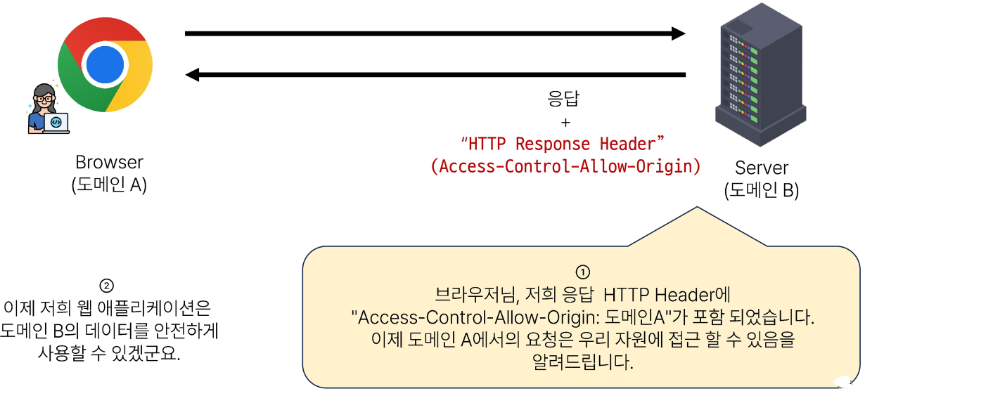

# 8. Vue with DRF 1

## store with DRF

개요 : DRF 서버에 직접 요청하여 데이터를 응답 받아 store에 저장 후 출력하기

- DRF 서버로의 AJAX 요청을 위한 axios 설치 및 관련 코드 작성

- DRF 서버로 요청을 보내고 응답 데이터를 처리하는 getArticles 함수 작성

- ArticleView  컴포넌트가 마운트 될 때 getArticles  함수가 실행되도록 함
  
  - 해당 컴포넌트가 렌더링 될 때 항상 최신 게시글 목록을 불러오기 위함

- Vue와 DRF 서버를 모두 실행한 후 응답데이터 확인
  
  - 에러발생!

- 그런데 DRF 서버 측에서는 문제없이 응답했음(200 ok)
  
  - 서버는 응답했으나 브라우저 측에서 거절한 것

- 브라우저가 거절한 이유
  
  - 'http://localhost:5173' 에 'http://127.0,0,1:8000/api/v1/articles' 의 XMLHttpRequest에 대한 접근에 **CORS policy**에 의해 차단되었기 때문

## SOP (Same-origin policy)

동일 출처 정책

- 어떤 출처(Origin)에서 불러온 문서나 스크립트가 다른 출처에서 가져온 리소스와 상호작용하는 것을 제한하는 보안 방식

- https://developer.mozilla.org/en-US/docs/Web/Security/Same-origin_policy

- 웹 애플리케이션의 도메인이 다른 도메인의 리소스에 접근하는 것을 제어하여 사용자의 개인 정보와 데이터의 보안을 보호하고, 잠재적인 보안 위협을 방지

- 잠재적으로 해로울 수 있는 문서를 분리함으로써 공격받을 수 있는 경로를 줄임

### Origin (출처)

- URL의 Protocol, Host, Port 를 모두 포함하여 '출처'라고 부름

- 아래 세 영역이 일치하는 경우에만 동일 출처(Same-origin)로 인정

## CORS policy 등장

- 기본적으로 웹 브라우저는 같은 출처에서만 요청하는 것을 허용하며, 다른 출처로의 요청은 보안상의 이유로 차단됨
  
  - SOP에 의해 다른 출처의 리소스와 상호작용 하는 것이 기본적으로 제한되기 때문

- 하지만 현대 웹 애플리케이션은 다양한 출처로부터 리소스를 요청하는 경우가 많기 대문에 COR 정책이 필요하게 되었음

➤ COR는 웹 서버가 리소스에 대한 서로 다른 출처 간 접근을 허용하도록 선택할 수 있는 기능을 제공

## CORS (Cross-Origin Resource Sharing)

교차 출처 리소스 공유

- 특정 출처(Origin)에서 실행 중인 웹 애플리케이션이 다른 출처의 자원에 접근할 수 있는 권한을 부여하도록 브라우저에 알려주는 체제
  
  ➤ 만약 다른 출처의 리소스를 가져오기 위해서는 이를 제공하는 서버가 브라우저에게 다른 출처지만 접근해도 된다는 사실을 알려야 함
  
  ➤ CORS policy 교차 출처 리소스 공유 정책

### CORS policy

- 다른 출처에서 온 리소스를 공유하는 것에 대한 정책

- 서버에서 결정되며, 브라우저가 해당 정책을 확인하여 요청이 허용되는지 여부를 결정

- 다른 출처의 리소스를 불러오려면 그 출처에서 올바른 CORS header를 포함한 응답을 반환해야 함

- https://developer.mozilla.org/ko/docs/Web/HTTP/CORS

## CORS Header 설정하기

- Django에서는 django-cors-headers 라이브러리를 활용
  
  ➤ 손쉽게 응답 객체에 CORS header를 추가해주는 라이브러리

- https://github.com/adamchainz/django-cors-headers

