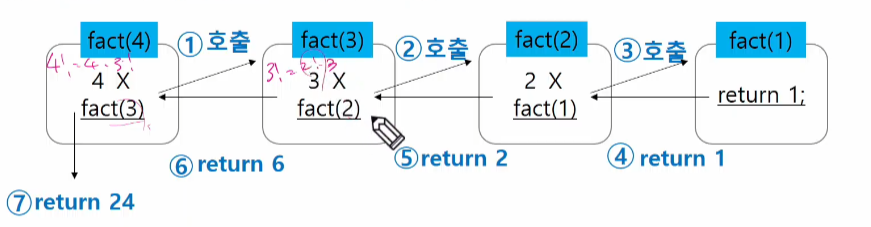

# STACK

## stack

1. Stack의 특성
   
   - 선형 구조
     
     - 선형 구조 : 자료 간 관계가 1대1 관계
     
     - 비선형 구조 : 자료 간 관계까 1 : N
   
   - 후입선출 LIFO (Last in First out)

2. 자료구조와 연산
   
   * 자료구조 : 자료를 선형으로 저장할 저장소
     
     * 배열 사용 가능
     
     * 저장소 자체를 스택으로 부르기도 함
     
     * 스택에서 마지막에 삽입된 원소에 위치를 top이라 부른다.
   
   * 연산
     
     * 삽입 : push
     
     * 삭제 : 삽입한 자료의 역순으로 꺼낸다 pop
     
     * 스택이 공백인지 아닌지 확인 isEmpty
     
     * 스택의 top에 있는 item을 반환 peek

3. 스택의 push 알고리즘
   
   * (주의) append 메소드는 내부적으로 리스트 한자리 더 큰거 만들고 복사한 다음에 요소 추가하기 때문에 내부연산 느림
   
   ```python
   def push(item) : 
      s.append(item)
   ```

```python
def push(item, size):
    global top
    top += 1
    if top == size:
        print('overflow!')
    else:
        stack[top] = item

size = 10
stack = [0] * size
top = -1


push(10, size)
top += 1        # push(20)
stack[top] = 20 #
```

4. 스택의  pop 알고리즘

```python
def pop():
    if len(s) == 0:
        # underflow
        return
    else:
        return s.pop()
```

```python
def pop():
    global top
    if top == -1:
        print('underflow!')
        return 0
    else:
        top -= 1
        return stack[top+1]

print(pop())

if top > -1:  # pop()
    top -= 1
    print(stack[top+1])
```

```python
stack = [0] * 10
top = -1

top += 1        # push(1)
stack[top] = 1 
top += 1        # push(2)
stack[top] = 2

print(stack[top]) # pop()
top -= 1

top -= 1        # pop()
print(stack[top+1])
```

5. 스택 구현 고려 사항
   
   * 1차원 배열을 사용하여 구현할 경우 구현이 용이 but 스택의 크기 변경 어려움
   
   * 저장소를 동적으로 할당하여 스택 구현 가능
     
     * 동적 연결리스트를 이용하여 구현
     
     * 구현 복잡 but 메모리 효율적으로 사용

6. 스택의 응용1 : 괄호검사
   
   * 왼쪽 괄호를 만나면 스택에 삽입, 오른쪽 괄호 만나면 스택에서 top괄호 삭제한 후 오른쪽 짝과 비교    
     
     * 조건 1 : 왼쪽, 오른쪽 괄호 숫자 같다
     
     * 조건 2 :  같은 괄호에서 왼쪽 괄호가 오른쪽 괄호보다 먼저 나와야 한다
     
     * 조건 3 : 괄호 사이에는 포함관계만 존재
   
   * 스택이 비어있으면 조건 1, 조건 2에 위배, 괄호의 짝이 맞지 않으면 조건 3에 위배
   
   * 마지막 괄호까지 조사한 후에도 스택에 괄호 남아 있으면 조건 1에 위배

7. 스택의 응용2 : function call
   
   - 함수 호출과 복귀에 따른 전체 프로그램의 수행 순서
     
     - 가장 마지막에 호출된 함수가 가장 먼저 실행을 완료하고 복귀하는 후입선출 구조이므로, 스택을 이용하여 수행순서 관리
     
     - 함수 호출이 발생하면 호출한 함수 수행에 필요한 지역변수, 매개변수 및 수행 후 복귀할 주소 등의 정보를 스택프레임(stack frame)에 저장하여 시스템 스택에 삽입
     
     - 함수의 실행이 끝나면 시스템 스택의 top원소를 삭제하면서 프레임의 저장되어 있던 복귀주소를 확인하고 복귀
     
     - 전체 프로그램 수행이 종료되면 시스템 스택은 공백 스택이 된다. 

stack_Frame(f_2)                     <---------  top(현재 실행 중인 함수)

  - f_2() 함수 실행 관련 정보

stack_Frame(f_1)

 - f_1() 함수 실행 관련 정보

stack_Frame(main)

 -main() 함수 실행 관련 정보


## 재귀 호출

1. 자기 자신을 호출하여 순환 수행되는 것
   
   * fatorial 함수에서 n = 4인 경우의 실행



```python
def fibo(n):
    if n < 2:
        return n
    else:
        return fibo(n-1) + fibo(n-2)
```

## Memoization

- 재귀함수로 구현한 알고리즘은 중복 호출이 존재

- 이전에 계산한 값을 저장해서 매번 다시 계산하지 않도록 하여 전체적인 실행속도 개선, 동적 계획법의 핵심

- 실행시간을 O(n^2)에서 O(n)으로 줄일 수 있음

```python
# memo를 위한 배열을 할당하고, 모두 0으로 초기화한다.
# memo[0]을 0으로 memo[1]은 1로 초기화 한다.

def fibo(n):
    global memo
    if n >= 2 and memo[n] == 0:
        memo[n] = (fino1(n-1) + fibo(n-2))
    return memo[n]


memo = [0] * (n+1)
memo[0] = 0
memo[1] = 1
```


