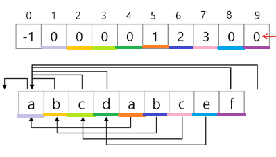

# String

1. ASCII (American Standard Code for Information Interchange)
   
   - 7bit  인코딩으로 128문자 표현, 33개 출력 불가능한 제어문자 + 공백포함 95개 출력 가능 문자
   
   - 확장아스키 : 표준 문자 이외 악센트, 도형,  특수 기호 등 128개 추가
     
     - 8bit모두 사용
     
     - 표준 아스키와 같이 다른 프로그램이나 컴퓨터 사이 교환 안됨

2.  유니코드
   
   - 다국어 처리 표준
     
     - character Set에 따른 분류
       
       - UCS-2, UCS-4 : 유니코드 저장하는 변수 크기 정의 but 바이트 순서 표준화 못함  => 외부 인코딩 필요
       
       -  big-endian, little-endian
     
     - 유니코드 인코딩 (UTF : Unicode Trnasformation Format)
       
       - UTF-8 : web, min 8bit, Max:32bit
       
       - UTF-16 : windows, java, min 16bit, Max:32bit
       
       - UTF-32 : unix, min 32bit, Max:32bit
     
     - python 인코딩
       
       - 2.X 
         
         ```python
         #-*-coding: utf-8-*-
         ```
       
       - 3.X  유니코드 UTF-8 생략 가능

3.  문자열 처리 차이
   
   - C : 아스키 코드로 저장
   
   - java : 유니코드(UTF-16, 2byte)로 저장
   
   - python : 유니코드(UTF8)로 저장

4.  문자열 비교
   
   -  C : strcmp() 함수 제공
   
   - java : equals() 메소드 제공, ==은 메모리 참조 같은지 묻기
   
   - python :
     
     - == : 내부적으로 특수 메서드 \_\_eq\_\_호출, 형태만 같으면 됨
     
     - is : 메모리 참조도 같아야됨

5. 문자열 숫자를 정수로 변환
   
   - c : atoi() 함수 제공
   
   - java : parse 메소드 제공, Integer.parseInt(String)
   
   - python : 숫자와 문자변환 함수 제공
* int() 와 같은 atoi() 만들기

```python
def atoi(s):
    i = 0
    for x in s:
        i = i * 10 + ord(x) - ord('0')
    return i
```

- str() 쓰지 않고 itoa() 만들기

## 패턴 매칭

1. Brute Force

```python
p = 'is'
t = 'This is a book'
M = len(p)
N = len(t)

def BruteForce(p, t):
    i = 0 # t의 인덱스
    j = 0 # p의 인덱스
    while j < M and i < N:
        if t[i] != p[j]:
            i = i - j
            j = -1
        i = i + 1
        j = j + 1
    
    if j == M:
        return i - M # 검색 성공
    else:
        return -1 # 검색 실

print(BruteForce(p, t))


```

2. KMP 알고리즘
   
   - 불일치가 발생한 텍스트 앞부분에 어떤 문자가 있는지 미리 알고 있으므로, 불일치가 발생한 앞 부분에 대하여 다시 비교하지 않고 매칭을 수행
   
   - 배열 next[M] : 불일치가 발생했을 경우 이동할 다음 위치
   
   - 시간 복잡도 : O(M+N)

```python
p = 'abcdabcef'
t = 'abcdabcdabcdabcef'

def kmp(t, p):
    N = len(t)
    M = len(p)
    lps = [0] * (M + 1)

    # preprocessing
    j = 0 # 일치한 개수 ==  비교할 패턴 위치
    lps[0] = -1
    for i in range(1, M):
        lps[i] = j  # p[i] 이전에 일치한 개수
        if p[i] == p[j]:
            j += 1
        else:
            j = 0
    lps[M] = j
    print(lps)

    #search
    i = 0 # 비교할 텍스트 위치
    j = 0 # 비교할 패턴 위치
    while i < N and j <= M:
        if j == -1 or t[i] == p[j]:
            i += 1
            j += 1
        else:
            j = lps[j]
        if j == M:
            print(i - M, end = ' ')
            j = lps[j]

        print()
        return

kmp(t, p)
```



3. 보이어 - 무어 알고리즘
   
   - 오른쪽에서 왼쪽으로 비교 
   
   - 대부분 상용 소프트웨어에서 채택하고 있는 알고리즘
   
   - 패턴 오른쪽 끝에 있는 문자가 불일치하고 이 문자가 패턴 내에 존재하지 않는 경우, 이동거리는 패턴의 길이만큼
   
   - 위의 두 경우는 텍스트 문자열을 적어도 한번씩 훑으므로 최선의 경우에도 Ω(N)
   
   - 최악의 경우 Θ(MN)
   
   - 입력에 따라 다르지만 일반적으로 Θ(N) 보다 시간 덜 든다.


4. 문자열 압축
- Run - lenth encoding 알고리즘 : 같은 값이 몇 번 반복되는가

- 허프만 코딩 알고리즘
