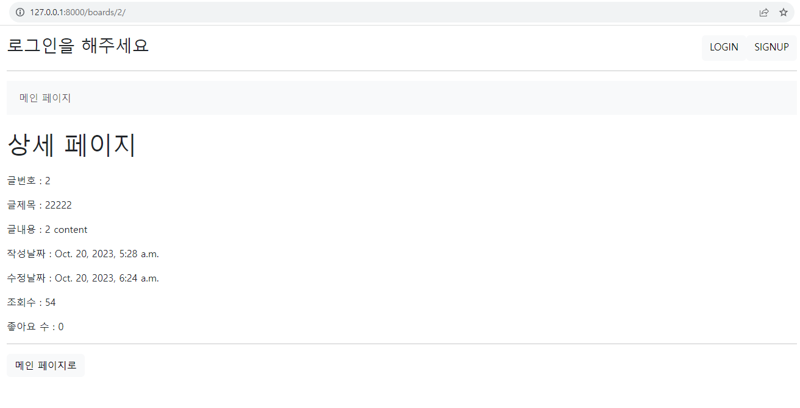

# pjt06_231020

- 로그인 상태일 경우 nav-bar에 '프로필 페이지 추가'
  
  - 기존 navbar.html에 if문을 추가하여 구현하였다.

```django
<li>
   
     <a class="nav-link" aria-current="page" href="">프로필 페이지</a>
   
</li>
```

- pdf 예시 문제에서는 로그인 상태일 경우 맨 위에 form 두개가 병렬로 나오는데 아무 스타일을 적용하지 않았을 때 form 다음으로 자동으로 줄바꿈이 되어 form이 세로로 나오는 것을 확인하였다.
  
  - head부분에 style 태그를 만들고 그 안에 다음과 같은 css를 적용시켜서 문제를 해결하였다.
  
  - 배치의 경우 flex를 이용하여 예제와 최대한 비슷한 모습이 나오도록 만들었다.

```css
form {
      display: inline;
      margin-left: 6px;
    }
```

- 처음에 profile.html에서 팔로우 버튼을 만들 때 `` 로 본인이 아닐 경우에만 팔로우 버튼을 누를 수 있도록 만들었다. 테스트를 하다보니 로그인을 하지 않았을 경우에도 팔로우 버튼이 나타나는 것을 확인하였다. 따라서 ``를 상위에 추가하여 1. 로그인 상태인지 2. 본인이 아닌지 검사하는 두 개의 if문을 사용하여 문제를 해결하였다.

```django
<div class='row'>
  <h1 class='col-8'>{{ person.username }}님의 프로필 페이지</h1>
  <div class='col-4 d-flex justify-content-end'>
    <p>팔로잉 : {{ person.followings.all|length }} / 팔로워 : {{ person.followers.all|length }}</p>
    
      
          <form action="" method="POST">
            
            
              <input class="btn btn-light"type="submit" value="Unfollow">
            
              <input class="btn btn-light" type="submit" value="Follow">
            
          </form>
      
    
  </div>
</div>
```

- 또한 프로필 페이지에서도 유저가 쓴 글의 제목을 클릭하면 그 글의 상세페이지로 이동할 수 있도록 링크를 만들어주었고, index 페이지와 동일하게 스타일을 적용해주었다. 또한 예제와 동일하게 배경색을 바꿔주었다.

- if-else문과 filter 기능을 사용하여 댓글이 없거나 팔로워가 없을 경우 지정된 메시지를 출력하도록 하였다.

```django
<div>
  <h2>유저가 쓴 글</h2>
  
    <div class="bg-light">
      <p>글번호 : {{ board.id }}</p>
      <p>글제목 : <a href="" style="text-decoration: none;">{{ board.title }}</a></p>
    </div>
  
</div>

<hr>

<div>
  <h2>유저가 쓴 댓글</h2>
   아직 작성한 댓글이 없습니다.
  
    
        {{ comment.content }}
    
  
</div>

<hr>

<div>
  <h2>팔로워</h2>
   팔로워한 사람이 없습니다.
  
    
      <p>{{ person.username }}</p>
    
  
</div>
```

- board/models.py 
  
  - 기존의 Board 모델에서 새로운 필드를 추가하였다. views, author, like_users를 설정하였다.
  
  - 기존의 Comment 모델에서 author 필드를 새롭게 추가하였다.

```python
# board/models.py

from django.db import models
from django.conf import settings


# Create your models here.
class Board(models.Model):
    title = models.CharField(max_length=20)
    content = models.TextField()
    created_at = models.DateTimeField(auto_now_add=True)
    updated_at = models.DateTimeField(auto_now=True)
    # 조회수는 상세 페이지에서만 조회 가능하다고 가정
    views = models.IntegerField(default=0)
    # author 추가
    author = models.ForeignKey(settings.AUTH_USER_MODEL, on_delete=models.CASCADE, default=0)
    # like_users 추가
    like_users = models.ManyToManyField(
        settings.AUTH_USER_MODEL, related_name='like_board'
    )

class Comment(models.Model):
    board = models.ForeignKey(Board, on_delete=models.CASCADE, related_name='comments')
    content = models.CharField(max_length=200)
    created_at = models.DateTimeField(auto_now_add=True)
    updated_at = models.DateTimeField(auto_now=True)
    # author 추가
    author = models.ForeignKey(settings.AUTH_USER_MODEL, on_delete=models.CASCADE, default=0)
```

- 조회수를 증가시키기 위한 로직 추가   
  
  - 처음에는 잘 동작하는 것처럼 보였는데 나중에 좋아요 기능을 추가했을 때 좋아요를 누를 때마다 detail 페이지가  redirect 되면서 조회수가 하나씩 증가하는 오류가 생겼다.
  
  - 강사님께 조언을 구한 결과 여태까지 배운 것만으로는 해결할 수 없고 자바스크립트를 알아야 한다고 하셨다. 대신 좋아요 버튼을 통해 detail 페이지가 redirecct되면  board.views에서 값에서 하나를 빼줌으로써 겉으로 보았을 때 멀쩡해보이도록 감추는 방법을 알려주셨다.

```python
# board/views.py

@require_http_methods(["GET", "POST"])
def detail(request, pk):
    board = get_object_or_404(Board, pk=pk)
    if request.method == 'POST':
        board.delete()
        return redirect('boards:index')

    elif request.method == 'GET': # 이 부분 추가
        board.views += 1
        board.save()

    comments = board.comments.all()
    comment_form = CommentForm()

    context = {
        'board': board,
        'comments': comments,
        'comment_form': comment_form,
    }
    return render(request, 'boards/detail.html', context)
```

- views.py의 likes 함수

```python
# boards/views.py

def likes(request, board_pk):
    board = Board.objects.get(pk=board_pk)
    # 다음 두 줄이 새로 추가된 부분이다.  
    board.views -= 1
    board.save()
    if request.user in board.like_users.all():
        board.like_users.remove(request.user)
    else:
        board.like_users.add(request.user)

    return redirect('boards:detail', board_pk)
```

- 기존 signup 폼에 auth_login을 추가하여 회원가입이 되면 자동으로 로그인 상태가 되도록 수정하였다.

```python
# accounts/views.py

def signup(request):
    if request.user.is_authenticated:
        return redirect('boards:index')

    if request.method == 'POST':
        form = CustomUserCreationForm(request.POST)
        if form.is_valid():
            user = form.save()
            auth_login(request, user)
            return redirect('boards:index')
    else:
        form = CustomUserCreationForm()
    context = {
        'form': form,
    }
    return render(request, 'accounts/signup.html', context)
```

## 느낀 점

- 꼼꼼함이 무엇보다도 중요하다. 급하다고 빨리하다 보면 그만큼 더 오류가 많이 생겨서 오히려 더 늦어지는 것 같다. 머리 속으로 순서를 정리하면서 차근차근 하는 것이 제일 빠른 방법 같다.

- 저번 수업 시간에 query 최적화에 대해서 배웠는데 그 부분을 적용시키지 못한 것이 아쉽다. 지금은 데이터 수가 너무 적어서 문제가 생기지 않지만 db의 크기가 커지면 성능이 많이 떨어질 수 밖에 없는 코드인 것 같다.

- html 파일에 if문이 많아지다 보니 가독성이 너무 떨어지는 것 같다. 이 부분을 어떻게 해결하면 좋을지에 대해 더 고민해 보아야겠다.

---

- 로그인 하지 않았을 경우





- 로그인 했을 때


