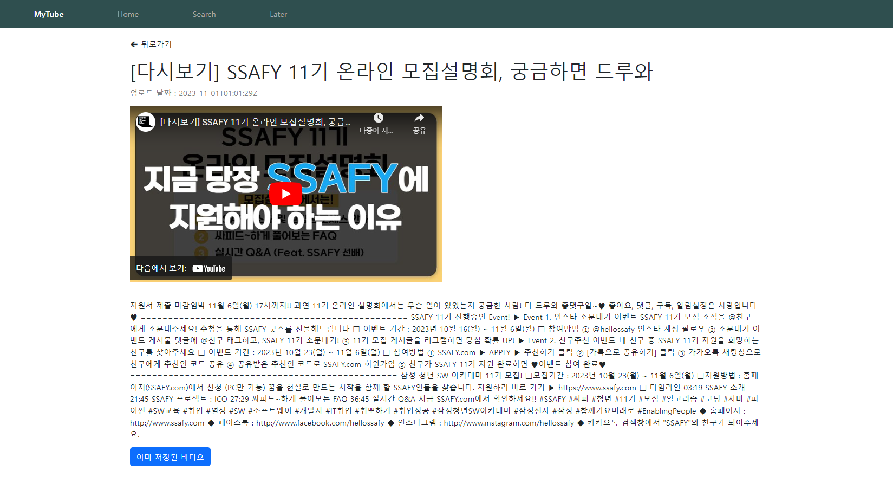

# Pjt_09

# 팀원 : 김현지, 윤동휘, 김승희

# localStorage

- 임시로 데이터를 저장할 공간

- 브라우저의 스토리지

- 반영구적으로 브라우저에 저장할 수 있는 공간
  => 브라우저를 껐다 켜도 데이터 유지됨

- 5mb 정도의 데이터를 저장할 수 있음
  => 쿠키보다 많은 데이터를 저장할 수 있다

- 보인이 조금 위험하다
  => 최대한 위험 수준이 낮은 데이터만 저장해야 한다

- value에는 무조건 문자열만 저장 가능 !!! 객체 안된다

> 브라우저 쪽에 임시로 저장하고 싶은 데이터가 있다?
> 그런데 보안 수준이 낮다?
> => 로컬 스토리지 사용
